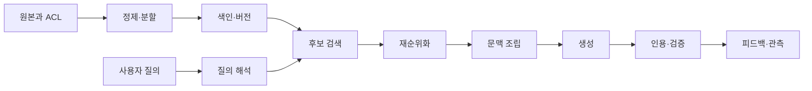



RAG는 모델에 문서를 붙여 주는 기능이 아니라, 질문에 필요한 근거를 제한된 시간과 비용 안에서 찾아 답변과 연결하는 **정보 검색 시스템**이다.

좋은 생성 모델도 잘못 검색된 문맥을 받으면 그럴듯한 오답을 만든다.
반대로 검색 결과가 좋아도 문맥 조립, 인용 연결, 거절 정책이 약하면 운영 신뢰성은 낮다.

## 1. 문제: RAG 실패를 한 숫자로 숨기지 않는다

RAG 요청 하나에는 최소한 다음 단계가 있다.

1. 원본 수집과 접근 통제
2. 정제와 단위 분할
3. 색인 및 갱신
4. 질의 해석
5. 후보 검색
6. 필터링과 재순위화
7. 문맥 조립
8. 답변 생성과 인용
9. 검증과 관측

최종 정답률만 보면 어느 단계가 병목인지 알 수 없다.

- 문서가 색인되지 않았는가?
- 정답 단위가 지나치게 잘렸는가?
- 질의와 문서 표현이 달랐는가?
- 후보에는 있었지만 재순위화에서 탈락했는가?
- 근거는 있었지만 모델이 사용하지 않았는가?
- 답이 문맥을 넘어 추론되었는가?

따라서 검색과 생성을 분리해 측정하고, 다시 종단 간 지표로 연결해야 한다.

## 2. Mental model: 증거 공급망



각 답변은 원본까지 역추적되는 증거 공급망의 산물이어야 한다.

핵심 객체에는 다음 식별자를 둔다.

- `source_id`: 원본 문서의 안정적 ID
- `source_version`: 내용 또는 권한 버전
- `chunk_id`: 분할 단위 ID
- `index_version`: 임베딩·분석기·색인 설정 버전
- `retrieval_run_id`: 질의별 검색 실행 ID
- `answer_id`: 답변과 사용 근거를 묶는 ID

문서가 바뀌었는데 예전 답변이 계속 노출되면 출처 버전으로 무효화할 수 있어야 한다.

## 3. 실전 workflow 1: 데이터 계약과 분할 전략

먼저 RAG가 다룰 문서의 계약을 정의한다.

```yaml
document:
  required: [source_id, version, title, body, updated_at, acl]
  optional: [section_path, language, valid_from, valid_until]
chunk:
  required: [chunk_id, source_id, source_version, text, offsets]
index:
  required: [embedding_model, tokenizer, dimensions, created_at]
```

분할은 고정 글자 수만의 문제가 아니다.

- 제목과 소제목 경계를 보존한다.
- 표의 열 이름과 행을 분리하지 않는다.
- 코드의 선언과 설명을 가능한 한 함께 둔다.
- 문장 중간 절단을 피한다.
- 원문 offset을 보존한다.
- 인접 문맥을 확장할 수 있게 순서를 기록한다.

작은 chunk는 정밀하지만 맥락을 잃기 쉽다.
큰 chunk는 맥락이 풍부하지만 검색 표현이 희석되고 토큰 비용이 커진다.

단일 크기를 가정하기보다 문서 유형별 정책을 만들고 평가로 결정한다.

## 4. 검색: recall을 먼저 확보하고 precision을 회복한다

후보 검색은 보통 sparse와 dense 신호를 결합한다.

- sparse: 정확한 용어, 코드, 식별자, 희귀 단어에 강하다.
- dense: 표현이 달라도 의미가 가까운 문서를 찾는 데 유리하다.
- metadata filter: 권한, 시점, 제품, 언어 등 명시 조건을 강제한다.

결합 점수의 단순한 형태는 다음과 같다.

$$
s(d,q)=\alpha s_{\text{sparse}}(d,q)+(1-\alpha)s_{\text{dense}}(d,q)
$$

서로 다른 점수 척도를 바로 더하면 한 신호가 지배할 수 있다.
정규화, rank fusion 또는 학습된 결합기를 검증 세트에서 비교한다.

후보 단계의 목표는 관련 문서를 놓치지 않는 것이다.
재순위화 단계는 더 비싼 모델로 후보 순서를 정교하게 만든다.

실전 순서는 다음과 같다.

1. 권한 필터를 검색 전에 적용한다.
2. sparse와 dense에서 각각 후보를 얻는다.
3. 중복 source와 near-duplicate를 정리한다.
4. rank fusion으로 넓은 후보 풀을 만든다.
5. cross-encoder 또는 규칙 기반 reranker를 적용한다.
6. 다양성과 최신성 제약을 반영한다.

질의 재작성은 원문 질의를 대체하지 말고 후보 신호를 추가하는 방식이 안전하다.

## 5. 문맥 조립과 답변 계약

상위 문서를 그대로 이어 붙이지 않는다.

- 질문의 하위 쟁점별로 근거를 배분한다.
- 같은 내용을 반복하는 chunk를 제거한다.
- 상충하는 버전은 시점과 권위를 표시한다.
- 인용 가능한 최소 단위를 보존한다.
- 문맥 길이 예산을 근거 가치에 따라 할당한다.

답변 출력 계약의 예:

```json
{
  "answer": "근거에 기반한 요약",
  "claims": [
    {"text": "검증할 주장", "citations": ["chunk-id"]}
  ],
  "insufficient_evidence": false,
  "follow_up": []
}
```

모델이 만든 인용 번호를 믿지 않는다.
허용된 `chunk_id` 목록에 있는지 코드로 검사한다.

근거가 부족한 경우에는 답변 생성을 억지로 계속하지 않는다.
거절, 추가 질문, 검색 범위 확장 중 하나를 정책으로 선택한다.

## 6. 실전 예제: 질문 하나를 단계별로 진단한다

예시 질문은 특정 도메인과 무관한 운영 절차 질문이라고 가정한다.

```python
def answer(query, user_context):
    scope = authorize(user_context)
    variants = rewrite_as_additional_queries(query)
    candidates = hybrid_retrieve([query, *variants], scope=scope)
    ranked = rerank(query, deduplicate(candidates))
    context = assemble_context(query, ranked, token_budget=6000)
    draft = generate_structured(query, context)
    return verify_claim_citations(draft, allowed=context.chunk_ids)
```

이 코드의 중요한 점은 라이브러리 이름이 아니라 경계다.

- 인가는 검색 전에 끝난다.
- 재작성 질의는 원문과 함께 사용된다.
- 문맥은 명시적 예산 안에서 구성된다.
- 출력은 구조화된다.
- 인용은 생성 후 검증된다.

오답이 나오면 저장된 `retrieval_run_id`로 후보와 순위를 재현한다.

## 7. 평가 설계

평가 세트는 실제 질문 분포를 대표해야 한다.

- 단순 사실 질문
- 여러 문서를 조합해야 하는 질문
- 표·코드·절차 질문
- 시점 또는 버전이 중요한 질문
- 모호해서 확인 질문이 필요한 요청
- 답이 corpus에 없는 질문
- 접근 권한 밖의 정보를 요구하는 질문

검색 지표:

- Recall@k: 정답 근거가 상위 k개에 포함되는 비율
- MRR: 첫 관련 문서 순위의 역수 평균
- nDCG: 관련도 등급과 순서를 함께 반영
- filter accuracy: 허용·차단 조건의 정확성

생성 지표:

- correctness: 질문에 맞는가
- groundedness: 각 주장이 제공 근거로 지지되는가
- citation precision: 인용이 실제 주장을 뒷받침하는가
- citation recall: 검증 가능한 주장에 인용이 빠지지 않았는가
- refusal quality: 근거 부족을 적절히 처리하는가

자동 평가자는 빠르지만 편향과 자기 일관성 문제가 있다.
사람 검토 표본, 규칙 기반 검사, 모델 평가를 삼각 검증한다.

## 8. 온라인 관측과 변경 관리

운영 대시보드에는 평균만 두지 않는다.

- p50, p95, p99 전체 지연
- 검색·재순위화·생성 단계별 지연
- 후보 수와 문맥 토큰 수
- cache hit ratio
- 빈 검색과 거절 비율
- 인용 검증 실패율
- 질의 유형별 품질
- index version별 회귀

색인 변경은 모델 배포처럼 관리한다.

1. 고정 평가 세트로 offline 비교
2. shadow traffic으로 결과 차이 관찰
3. 제한된 canary 적용
4. 품질·지연·비용 gate 확인
5. 문제 발생 시 이전 index alias로 rollback

문서 삭제와 권한 변경은 일반 갱신보다 우선 처리한다.

## 9. 평가 checklist

- [ ] 원본, chunk, index, 답변의 버전이 연결되는가?
- [ ] 접근 통제가 생성 이후가 아니라 검색 이전에 적용되는가?
- [ ] 문서 유형별 분할 정책을 실제 평가했는가?
- [ ] sparse와 dense의 실패 유형을 따로 측정하는가?
- [ ] Recall@k와 최종 정답률을 분리해 보는가?
- [ ] 답이 없는 질문이 평가 세트에 포함되는가?
- [ ] 인용 ID를 코드로 검증하는가?
- [ ] 상충하는 근거와 시점을 표현할 수 있는가?
- [ ] index version별 품질·지연·비용을 비교하는가?
- [ ] 로그에 원문 민감정보가 과도하게 남지 않는가?
- [ ] 삭제 요청이 색인과 cache까지 전파되는가?
- [ ] rollback 가능한 이전 색인을 보존하는가?

## 10. 흔한 실패와 한계

### 임베딩 모델만 바꾸면 해결된다고 믿는다

누락 원인은 분할, metadata, 권한 필터, 질의 분포일 수 있다.
단계별 지표 없이 모델만 바꾸면 비용은 늘고 원인은 남는다.

### 긴 문맥이 항상 낫다고 믿는다

불필요한 문맥은 비용, 지연, 주의 분산을 키운다.
토큰 수가 아니라 유효 근거 밀도를 최적화한다.

### 합성 질문만으로 평가한다

합성 데이터는 coverage를 넓히지만 실제 사용자의 어휘와 모호성을 대체하지 못한다.
운영 로그에서 비식별 표본을 추가하고 시간에 따라 평가 세트를 갱신한다.

### RAG가 최신성을 자동 보장한다고 믿는다

수집 지연, 색인 실패, cache, 문서 버전 충돌이 있으면 오래된 답을 낸다.
신선도 SLO와 삭제 전파 시간을 별도로 측정한다.

RAG는 닫힌 corpus에 대한 확률적 검색·생성 시스템이다.
원본이 틀렸거나 필요한 지식이 없으면 올바른 답을 보장할 수 없다.

## 11. 공식 참고자료

- [Retrieval-Augmented Generation 원 논문](https://arxiv.org/abs/2005.11401)
- [Dense Passage Retrieval 원 논문](https://arxiv.org/abs/2004.04906)
- [BEIR benchmark 원 논문](https://arxiv.org/abs/2104.08663)
- [Elasticsearch hybrid search 공식 문서](https://www.elastic.co/docs/solutions/search/hybrid-search)
- [NIST AI Risk Management Framework](https://www.nist.gov/itl/ai-risk-management-framework)

## 12. 마무리

운영 가능한 RAG의 핵심은 더 큰 모델이 아니라 **추적 가능한 근거 공급망과 단계별 평가**다.

검색 recall, 재순위 precision, 문맥 유효성, 생성 근거성, 접근 통제를 각각 측정하면 실패가 디버깅 가능한 엔지니어링 문제가 된다.
