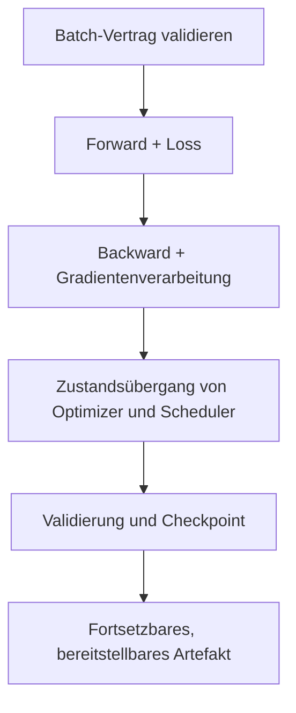



PyTorch-Trainingscode lässt sich leicht kurz halten. Weitaus schwieriger ist eine **Schleife, die nach einer Unterbrechung exakt fortsetzt, während der Validierung nicht unbemerkt ihren Zustand ändert und von einer bis zu mehreren GPUs dieselbe Semantik bewahrt**. Kleine Fehler in der Trainingsschleife können Versuchsergebnisse bisweilen stärker verzerren als die Modellarchitektur.

Dieser Artikel ordnet Verträge und Prüfpunkte, die für den Großteil überwachten Lerncodes gelten, statt für ein bestimmtes Modell. API-Details sind in der offiziellen Dokumentation des installierten PyTorch-Releases nachzuschlagen; die Entwurfsprinzipien bleiben versionsunabhängig.

## 1. Das Problem: Ausführbarer Code ist nicht dasselbe wie korrekt trainierender Code

Der folgende Code wirkt syntaktisch natürlich.

```python
for x, y in loader:
    prediction = model(x)
    loss = criterion(prediction, y)
    loss.backward()
    optimizer.step()
```

Er verbirgt jedoch mindestens diese Probleme.

- `x`, `y` und das Modell können sich auf verschiedenen Devices befinden.
- Shape und Dtype des Targets können den Vertrag der Loss-Funktion verletzen.
- Gradienten voriger Schritte werden weiter akkumuliert.
- Dropout und Batch Normalization bleiben während der Validierung im Trainingsmodus.
- Ein Validierungsgraph wird aufgebaut und verschwendet Speicher.
- Der letzte Batch besitzt eine andere Größe, dennoch werden die Batch-Mittel erneut gleich gewichtet gemittelt.
- Underflow und Overflow werden bei Mixed Precision nicht behandelt.
- Der Checkpoint enthält nur Modellgewichte, wodurch sich nach dem Fortsetzen die Optimizer-Dynamik ändert.
- Im `DataLoader`-Split oder in Transformationen entsteht Validierungs-Leakage.
- Es wird nicht gemessen, ob Modell oder Eingabe-Pipeline den Engpass bilden.

### Stille Fehler sind gefährlicher als Exceptions

Ein Device-Mismatch löst gewöhnlich sofort eine Exception aus; Shape-Broadcasting und ein falscher Target-Dtype können dagegen ausgeführt werden und dabei eine andere Zielfunktion optimieren. Wird beispielsweise ein Target mit `[B]` von einer Vorhersage mit `[B, 1]` abgezogen, kann unbeabsichtigt eine Operation mit `[B, B]` entstehen.

Entscheidend ist daher nicht, dass „der erste Batch durchlief“, sondern dass der **Batch-Vertrag ausdrücklich festgelegt wird und Fehler früh auftreten**.

### Der Validierungs-Loss hängt ebenfalls von der Aggregation ab

Wenn jeder Batch-Loss ein Batch-Mittel ist und der letzte Batch kleiner ausfällt:

\[
\frac{1}{K}\sum_{k=1}^{K}\ell_k
\neq
\frac{\sum_k n_k\ell_k}{\sum_k n_k}
\]

Für ein Stichprobenmittel wird nach Batch-Größe gewichtet. Bei einem Loss über Token, Pixel oder gültige maskierte Elemente entspricht der Nenner der Anzahl dieser gültigen Elemente.

## 2. Denkmodell: Eine Trainingsschleife ist ein Zustandsübergangssystem

Der Trainingszustand wird als folgendes Tupel dargestellt:

\[
S_t=(\theta_t,\;o_t,\;q_t,\;g_t,\;e_t,\;b_t,\;r_t,\;c)
\]

- \(\theta_t\): Modellparameter und Buffer
- \(o_t\): Optimizer-Zustand
- \(q_t\): Scheduler-Zustand
- \(g_t\): Zustand des AMP Gradient Scalers
- \(e_t,b_t\): Epoche und Batch/globaler Schritt
- \(r_t\): Zustand des Zufallszahlengenerators
- \(c\): Daten-, Modell- und Trainingskonfiguration

Ein Checkpoint muss diesen Zustand wiederherstellen können. Nur Modellgewichte zu speichern, kann genügen, um „Fine-Tuning mit einem neuen Optimizer zu beginnen“, nicht aber, um „dasselbe Training ab dem Unterbrechungspunkt fortzusetzen“.



### Drei Zustandsarten unterscheiden

1. **Modellzustand**: Parameter und persistente Buffer
2. **Trainingszustand**: Optimizer-Momentum, Scheduler, Scaler und Schritt
3. **Versuchszustand**: Konfiguration, Split, Seed, Code-/Datenversion und beste Metrik

Alle drei Ebenen werden benötigt, um ein Ergebnis zu erklären und fortzusetzen.

### `train()/eval()` und Gradientenmodus sind getrennt

- `model.train()`: versetzt Module wie Dropout und Batch Normalization in Trainingsverhalten
- `model.eval()`: versetzt diese Module in Evaluationsverhalten
- `torch.no_grad()`: deaktiviert die Autograd-Aufzeichnung
- `torch.inference_mode()`: ermöglicht für reine Inferenz eine stärkere Deaktivierung und Optimierung

Nur `eval()` aufzurufen kann weiterhin einen Gradientengraphen erzeugen; nur `no_grad()` zu verwenden kann das Modell im Trainingsmodus belassen. Die Validierung kombiniert normalerweise `eval()` mit deaktivierter Gradientenaufzeichnung.

## 3. Praktischer Workflow

### Schritt 1. Datensplit vor dem Erstellen eines `DataLoader` fixieren

Trainings-, Validierungs- und Test-Splits werden als Indizes oder Manifeste versioniert. Die Daten dürfen nicht bei jeder Ausführung des Modellierungscodes erneut zufällig geteilt werden.

Grundsätze:

- Abgeleitete Stichproben derselben Entität, Zeitreihe oder desselben Ereignisses überschreiten keine Split-Grenzen.
- Normalisierung, Wörterbücher und Feature-Auswahl werden ausschließlich auf Trainingsdaten angepasst.
- Stochastische Augmentation wird nur auf Trainingsdaten angewandt.
- Validierungs-/Testtransformationen sind deterministisch und semantisch identisch.
- `shuffle=True` ändert nur die Reihenfolge der Trainingsstichproben; es erzeugt nicht den Split selbst.
- Validierung und Test verwenden im Allgemeinen `shuffle=False` und `drop_last=False`.

```python
train_set = Dataset(records, indices=split.train, transform=train_transform)
valid_set = Dataset(records, indices=split.valid, transform=eval_transform)

train_loader = DataLoader(
    train_set,
    batch_size=config.batch_size,
    shuffle=True,
    drop_last=config.drop_last_train,
    num_workers=config.num_workers,
    pin_memory=config.pin_memory,
    generator=train_generator,
    worker_init_fn=seed_worker,
)

valid_loader = DataLoader(
    valid_set,
    batch_size=config.eval_batch_size,
    shuffle=False,
    drop_last=False,
    num_workers=config.num_workers,
    pin_memory=config.pin_memory,
)
```

`drop_last=True` kann wegen Batch Normalization oder fester Shapes nötig sein; es ist jedoch zu dokumentieren, dass dadurch in jeder Epoche einige Trainingsstichproben entfallen. Bei der Validierung würden dadurch Evaluationsstichproben fehlen.

### Schritt 2. Verträge für Shape, Dtype und Device im Code abbilden

Ein einzelner Batch-Adapter übernimmt Device-Verschiebung und Formatnormalisierung.

```python
from dataclasses import dataclass

@dataclass
class Batch:
    inputs: torch.Tensor
    targets: torch.Tensor
    sample_ids: list[str]

def prepare_batch(raw, device) -> Batch:
    x, y, sample_ids = raw

    x = x.to(device=device, dtype=torch.float32, non_blocking=True)
    y = y.to(device=device, dtype=torch.long, non_blocking=True)

    if x.ndim != 4:
        raise ValueError(f"expected inputs [B,C,H,W], got {tuple(x.shape)}")
    if y.ndim != 1 or y.shape[0] != x.shape[0]:
        raise ValueError(f"expected targets [B], got {tuple(y.shape)}")
    if not torch.isfinite(x).all():
        raise ValueError("non-finite input")

    return Batch(x, y, sample_ids)
```

`[B,C,H,W]` und `long` sind hier Beispiele für eine Mehrklassen-Bildklassifikation. Der Vertrag ist für jedes Problem anzupassen.

| Problem | Typische Ausgabe | Typisches Target |
|---|---|---|
| Mehrklassenklassifikation | `[B, C]`, float | `[B]`, ganzzahliger Klassenindex |
| Binäres Logit | `[B]` oder `[B,1]`, float | float mit demselben Shape wie die Ausgabe |
| Regression | definierter stetiger Shape, float | exakt kompatibler float |
| Sequenz | `[B,T,...]` oder Modellvertrag | einschließlich Masken- und Padding-Regeln |

Außerdem ist zu prüfen, ob die Loss-Funktion Logits oder Wahrscheinlichkeiten erwartet. Bei einem numerisch stabilen kombinierten Loss darf die Wahrscheinlichkeitstransformation nicht doppelt angewandt werden.

In der frühen Entwicklung wird für den ersten Batch Folgendes ausgegeben und validiert:

- Shape, Dtype und Device
- Min/Max/Mittelwert und Anteil endlicher Werte
- Target-Bereich und Klassenanzahl
- Anzahl gültiger Maskenelemente
- Shape der Modellausgabe
- ob der Loss endlich ist

Große Synchronisationsprüfungen in jedem Schritt können langsam sein; nach der Stabilisierung werden sie zu periodischen Prüfungen und Fehler-Hooks angepasst.

### Schritt 3. Forward- und Loss-Berechnung auf eine Funktion begrenzen

Training und Validierung teilen sich die Funktion, damit sie nicht unbemerkt verschiedene Vorverarbeitungen oder Losses nutzen.

```python
def forward_loss(model, batch, criterion):
    output = model(batch.inputs)

    if output.ndim != 2 or output.shape[0] != batch.targets.shape[0]:
        raise ValueError("model output violates [B,C] contract")

    loss = criterion(output, batch.targets)
    if loss.ndim != 0:
        raise ValueError("criterion must return a scalar loss")

    return output, loss
```

Bei der Berechnung von Trainingsmetriken wird `loss.detach()` oder `loss.item()` verwendet, damit der Graph nicht angeheftet bleibt. `.item()` auf einem GPU-Tensor kann eine Synchronisation auslösen; es sollte deshalb nicht übermäßig bei jedem Micro-Batch aufgerufen, sondern in geeignetem Takt aggregiert werden.

### Schritt 4. Lebenszyklen von Autograd und Gradienten ausdrücklich machen

Die Grundreihenfolge lautet:

1. vorige Gradienten löschen
2. Forward
3. skalaren Loss berechnen
4. Backward
5. Gradienten optional prüfen und clippen
6. Optimizer-Schritt

```python
optimizer.zero_grad(set_to_none=True)
output, loss = forward_loss(model, batch, criterion)
loss.backward()
gradient_norm = torch.nn.utils.clip_grad_norm_(model.parameters(), max_norm)
optimizer.step()
```

`set_to_none=True` kann Speicherarbeit verringern und hilft, Parameter ohne erhaltenen Gradienten zu unterscheiden. Benutzerdefinierter Code, der `.grad` stets als Tensor voraussetzt, muss entsprechend angepasst werden.

Standardmäßig **akkumuliert** `backward()` Gradienten. Ist keine Gradientenakkumulation beabsichtigt, werden sie vor jedem Optimizer-Schritt gelöscht.

#### Gradientenakkumulation

```python
optimizer.zero_grad(set_to_none=True)

for micro_step, raw in enumerate(train_loader):
    batch = prepare_batch(raw, device)
    output, loss = forward_loss(model, batch, criterion)
    (loss / accumulation_steps).backward()

    if (micro_step + 1) % accumulation_steps == 0:
        torch.nn.utils.clip_grad_norm_(model.parameters(), max_norm)
        optimizer.step()
        optimizer.zero_grad(set_to_none=True)
```

Auch wenn die letzte Gruppe weniger als `accumulation_steps` Micro-Batches enthält, muss ein Schritt ausgeführt werden. Das Teilen des Losses durch einen festen Wert kann die effektive Skalierung der letzten Gruppe verändern; deshalb ist die tatsächliche Zahl der Micro-Batches oder gültigen Elemente einzubeziehen.

Batch Normalization, Anzahl der Scheduler-Schritte und Regularisierungsimplementierungen besitzen bei einem großen Batch und bei Gradientenakkumulation möglicherweise nicht dieselbe Semantik.

### Schritt 5. Operations- und Zustandsreihenfolge mit AMP bewahren

Eine typische CUDA-Struktur für Mixed Precision ist:

```python
use_amp = device.type == "cuda" and config.use_amp
scaler = torch.amp.GradScaler("cuda", enabled=use_amp)

optimizer.zero_grad(set_to_none=True)

with torch.amp.autocast("cuda", enabled=use_amp):
    output, loss = forward_loss(model, batch, criterion)

scaler.scale(loss).backward()
scaler.unscale_(optimizer)

grad_norm = torch.nn.utils.clip_grad_norm_(model.parameters(), config.max_grad_norm)
scaler.step(optimizer)
scaler.update()
```

Kernprinzipien:

- Autocast für Forward- und Loss-Berechnung verwenden.
- Backward muss nicht innerhalb des Autocast-Kontexts ausgeführt werden.
- Vor Gradient Clipping `unscale_` aufrufen.
- `scaler.step()` kann bei Overflow den Optimizer-Schritt überspringen.
- Den Scaler-Zustand ebenfalls im Checkpoint speichern.
- Nicht jede Operation ist bei geringerer Genauigkeit sicher; nichtendliche Werte und Genauigkeit müssen validiert werden.

Autocast-Nutzung und unterstützte Dtypes für CPUs oder andere Beschleuniger variieren je nach Umgebung und Version. Ein Beispiel mit hart codiertem Device-Typ darf nicht blind kopiert, sondern muss in der installierten Umgebung geprüft werden.

### Schritt 6. Summen und Nenner in einer Trainingsepoche getrennt halten

```python
def train_one_epoch(model, loader, optimizer, criterion, device, scaler, config):
    model.train()
    loss_sum = 0.0
    sample_count = 0

    optimizer.zero_grad(set_to_none=True)

    for step, raw in enumerate(loader):
        batch = prepare_batch(raw, device)
        batch_size = batch.targets.shape[0]

        with torch.amp.autocast(device.type, enabled=scaler.is_enabled()):
            output, loss = forward_loss(model, batch, criterion)
            scaled_for_accumulation = loss / config.accumulation_steps

        scaler.scale(scaled_for_accumulation).backward()

        should_step = (
            (step + 1) % config.accumulation_steps == 0
            or (step + 1) == len(loader)
        )

        if should_step:
            scaler.unscale_(optimizer)
            torch.nn.utils.clip_grad_norm_(model.parameters(), config.max_grad_norm)
            scaler.step(optimizer)
            scaler.update()
            optimizer.zero_grad(set_to_none=True)

        loss_sum += loss.detach().double().item() * batch_size
        sample_count += batch_size

    return {"loss": loss_sum / sample_count}
```

Dieses Beispiel ist ein Gerüst zum Verständnis. Bei Sequenzen variabler Länge, deren Batch-Loss den Token-Zähler als Nenner verwendet, wird statt `batch_size` die Anzahl gültiger Token eingesetzt. Auch die genaue Loss-Skalierung der letzten Akkumulationsgruppe ist an ihre tatsächliche Micro-Batch-Anzahl anzupassen.

### Schritt 7. Zustand bewahren und in der Validierung deterministisch aggregieren

```python
@torch.inference_mode()
def evaluate(model, loader, criterion, device, use_amp):
    was_training = model.training
    model.eval()

    loss_sum = 0.0
    sample_count = 0
    predictions = []
    targets = []

    for raw in loader:
        batch = prepare_batch(raw, device)

        with torch.amp.autocast(device.type, enabled=use_amp):
            output, loss = forward_loss(model, batch, criterion)

        n = batch.targets.shape[0]
        loss_sum += loss.double().item() * n
        sample_count += n
        predictions.append(output.float().cpu())
        targets.append(batch.targets.cpu())

    if was_training:
        model.train()

    return {
        "loss": loss_sum / sample_count,
        "output": torch.cat(predictions),
        "target": torch.cat(targets),
    }
```

Vorbehalte:

- Beim Ende der Evaluationsfunktion den Trainingsmodus ausdrücklich wiederherstellen.
- Passen nicht alle Vorhersagen in den Speicher, nur ausreichende Statistiken für die Metrik akkumulieren.
- Bei verteilter Evaluation Summen und Nenner über alle Ranks reduzieren, bevor die Metrik berechnet wird.
- Für Ranking-Metriken, die jede Vorhersage benötigen, eine Gather-Strategie ohne Duplikate entwerfen.
- Stochastische Augmentation oder den Trainings-Sampler nicht für die Validierung wiederverwenden.

### Schritt 8. Zeiteinheit des Schedulers ausdrücklich festlegen

Wann ein Scheduler weiterschaltet, ist Teil der Semantik des Algorithmus.

- nach jedem Optimizer-Update
- nach jeder Epoche
- nach der Berechnung einer Validierungsmetrik

Bei Gradientenakkumulation unterscheiden sich Batch-Anzahl und Anzahl der Optimizer-Updates. Ein updatebasierter Scheduler wird am tatsächlichen `global_step` ausgerichtet. Wenn AMP-Overflow einen Optimizer-Schritt überspringt, ist festzulegen, ob der Scheduler ebenfalls fortschreitet.

```python
if optimizer_was_updated:
    update_scheduler.step()

# 또는 epoch 평가 후
metric_scheduler.step(validation_metric)
```

Aufrufreihenfolge und Argumente unterscheiden sich nach Scheduler-Typ; eine einzige Konvention darf nicht allen Schedulern aufgezwungen werden.

### Schritt 9. „Fortsetzungszustand“ und „bestes Modell“ in Checkpoints trennen

Empfohlener Checkpoint-Inhalt:

```python
def checkpoint_payload(
    model, optimizer, scheduler, scaler,
    epoch, global_step, best_metric, config, split_id
):
    base_model = model.module if hasattr(model, "module") else model

    return {
        "format_version": 2,
        "model": base_model.state_dict(),
        "optimizer": optimizer.state_dict(),
        "scheduler": None if scheduler is None else scheduler.state_dict(),
        "scaler": None if scaler is None else scaler.state_dict(),
        "epoch": epoch,
        "global_step": global_step,
        "best_metric": best_metric,
        "config": config.to_dict(),
        "split_id": split_id,
        "rng": {
            "python": random.getstate(),
            "numpy": np.random.get_state(),
            "torch_cpu": torch.get_rng_state(),
            "torch_cuda": (
                torch.cuda.get_rng_state_all() if torch.cuda.is_available() else None
            ),
        },
    }
```

Zusätzliche Metadaten:

- Code-Commit und Dirty-Status
- Daten-, Label- und Feature-Versionen
- Informationen zu PyTorch, CUDA, Abhängigkeiten und Hardware
- Metrikdefinition und Evaluationsergebnis
- Ein-/Ausgabesignatur des Modells
- Speicherzeitpunkt und Checkpoint-Prüfsumme

Dateien mit zwei verschiedenen Zwecken werden unterschieden.

- `last`: nach einem Fehler vom neuesten Zustand fortsetzen
- `best`: stärkster Deployment-Kandidat unter einem definierten Validierungskriterium

Für die Auswahl von `best` sind Richtung der Metrik, Umgang mit Gleichständen und Mindestverbesserung festzulegen. Den besten Checkpoint anhand der Testmetrik zu wählen, lässt Informationen aus dem Testset einfließen.

#### Atomares Speichern

Der Checkpoint wird vollständig in eine temporäre Datei geschrieben und anschließend atomar umbenannt. So ersetzt ein beim Speichern abgestürzter Prozess nicht den neuesten Checkpoint durch eine Teildatei. Mehrere Ranks dürfen nicht gleichzeitig in dieselbe Datei schreiben; üblicherweise speichert nur Rank 0.

#### Nach dem Laden validieren

```python
state = torch.load(path, map_location=device, weights_only=False)
model.load_state_dict(state["model"], strict=True)
optimizer.load_state_dict(state["optimizer"])

if scheduler is not None:
    scheduler.load_state_dict(state["scheduler"])
if scaler is not None and state["scaler"] is not None:
    scaler.load_state_dict(state["scaler"])

assert state["config"] == expected_config
assert state["split_id"] == expected_split_id
```

Ein nicht vertrauenswürdiger Checkpoint darf nicht als allgemeines serialisiertes Objekt geladen werden. Sicheres Laden ausschließlich der Gewichte, Artefaktsignaturen und Prüfsummen sowie Zugriffskontrolle sind einzusetzen.

Die Verschiebung von Optimizer-Zustandstensoren auf das Device, Konstruktions-/Ladereihenfolge des Schedulers und ähnliche Details sind für den verwendeten Optimizer und die Version zu prüfen. Ein Fortsetzungstest sollte automatisch mehrere Trainingsschritte, Speichern, Laden in einem neuen Prozess und Fortsetzen vergleichen.

### Schritt 10. Reproduzierbarkeit als statistischen Vertrag verwalten

Ein Seed einmalig festzulegen genügt nicht.

```python
def seed_everything(seed):
    random.seed(seed)
    np.random.seed(seed)
    torch.manual_seed(seed)
    if torch.cuda.is_available():
        torch.cuda.manual_seed_all(seed)
```

Weitere Aspekte:

- Seeds der `DataLoader`-Worker
- Sampler-Seed für jede Epoche
- zufällige Augmentation
- Seed-Richtlinie pro Rank bei verteilter Ausführung
- nichtdeterministische Accelerator-Kernels
- Unterschiede bei Bibliothek, Treiber und Hardware
- Reduktionsreihenfolge bei Multithreading

Deterministische Algorithmen zu erzwingen kann nicht unterstützte Operationen Exceptions auslösen oder langsamer ausführen lassen. Ein strenger Modus eignet sich für Entwicklung und Regressionstests; groß angelegtes Training kann dagegen einen Modus verwenden, der Metrikbereiche über mehrere Seeds reproduziert.

Stets aufzeichnen:

\[
\text{Ergebnis} = \text{Mittelwert} \pm \text{Variation über Seeds, Splits und Läufe}
\]

Ein Modell darf nicht aufgrund einer kleinen Verbesserung mit nur einem Seed ausgewählt werden.

### Schritt 11. Mit Profiling messen statt raten

Ein Durchsatzabfall wird aufgeschlüsselt in:

- Lesen, Decodieren und Augmentieren von Daten
- Host-to-Device-Kopie
- Forward
- Loss
- Backward
- Optimizer
- Kommunikation und Synchronisation
- Logging und Checkpointing

Zuerst kostengünstige Indikatoren betrachten:

- Stichproben oder Token pro Sekunde
- GPU-Auslastung und -Speicher
- Wartezeit des DataLoader
- Mittelwert und obere Quantile der Schrittzeit
- Kommunikationszeit
- Checkpoint-Pausen

Ein detaillierter Profiler wird nach dem Warm-up über ein kurzes repräsentatives Intervall eingesetzt. Detaillierte Traces in jedem Schritt können durch Overhead und große Logs selbst zum Engpass werden.

Häufige Engpässe:

- wiederholte kleine Operationen auf Python-Ebene
- Synchronisation durch `.item()` und CPU-Ausgabe in jedem Schritt
- kleine Batches und geringe arithmetische Intensität
- langsamer Speicher und übermäßige Augmentation
- ungeeignete Kombination von `num_workers`, Prefetching und Pinning
- unnötige Tensorkopien und Dtype-Konvertierungen
- Lastungleichgewicht in verteilten Umgebungen

Vor und nach der Optimierung werden Genauigkeits- und Reproduzierbarkeits-Regressionstests erneut ausgeführt.

### Schritt 12. Daten- und Zustandssymmetrie in DDP bewahren

Das grundlegende Denkmodell von Distributed Data Parallel lautet: **eine Modellreplik und ein Device pro Prozess**, mit Gradientensynchronisation während Backward.

Kernprinzipien:

- Jedem Prozess das korrekte lokale Device zuweisen.
- Das Modell vor Anwendung des DDP-Wrappers auf das Device verschieben.
- Einen Distributed Sampler für das Training verwenden.
- In jeder Epoche `sampler.set_epoch(epoch)` aufrufen, um die Shuffle-Reihenfolge zu ändern.
- Die Gesamt-Batch-Größe wird von `per_rank_batch × world_size × accumulation` beeinflusst.
- Nur Rank 0 schreibt Logs und Checkpoints, Metriken werden jedoch über alle Ranks aggregiert.
- Jeder Rank nimmt in derselben Reihenfolge an Collectives teil.
- Ein bedingter Zweig auf nur einem Rank, der den Backward-Graphen verändert, kann einen Hänger oder Fehler auslösen.

```python
sampler = DistributedSampler(train_set, shuffle=True, drop_last=False)
loader = DataLoader(train_set, sampler=sampler, shuffle=False, ...)

for epoch in range(start_epoch, max_epochs):
    sampler.set_epoch(epoch)
    train_one_epoch(...)
```

Ein Validierungs-Sampler kann den Datensatz durch doppelte Stichproben auf die World Size auffüllen. Für eine exakte Evaluation werden doppelte Stichproben-IDs entfernt oder ein partitionierender Sampler ohne Duplikate verwendet.

Ein größerer Batch verändert die Optimierungsdynamik. Dass DDP schneller als Single-GPU-Code läuft, bedeutet nicht, dass es mit denselben Hyperparametern dasselbe Modell erzeugt. Lernrate, Warm-up, Batch Normalization und Scheduler sind erneut zu validieren.

### Schritt 13. Eine minimale automatisierte Testsuite pflegen

#### Batch-Vertragstest

- Ein gültiger Batch besteht.
- Falscher Shape, Dtype und NaN schlagen sofort fehl.
- Der letzte kleine Batch besteht.

#### Overfit-Small-Batch-Test

Einen sehr kleinen festen Batch wiederholen und bestätigen, dass der Loss ausreichend sinkt. Schlägt dies fehl, wird vor der Modellkapazität die Verbindung zwischen Daten, Loss und Gradienten untersucht.

#### Gradiententest

- Gradienten sind für wichtige Parameter vorhanden.
- Gradienten sind endlich.
- Absichtlich eingefrorene Schichten besitzen keinen Gradienten.
- Normen vor und nach dem Clipping untersuchen.

#### Reinheitstest der Evaluation

- Modellparameter und Buffer ändern sich vor und nach der Validierung nicht unbeabsichtigt.
- Derselbe Checkpoint und dieselbe Eingabe erzeugen innerhalb der Toleranz dieselbe Ausgabe.
- Trainings- und Validierungstransformationen sind getrennt.

#### Fortsetzungsäquivalenztest

Unter festen Bedingungen:

1. kontinuierlich für \(N\) Schritte trainieren
2. für \(K\) Schritte trainieren, speichern, in einem neuen Prozess laden und weitere \(N-K\) Schritte trainieren
3. Parameter, Optimizer-Zustand und Metriken innerhalb der Toleranz vergleichen

#### AMP-/DDP-Paritätstest

- Metriktoleranz gegenüber voller Genauigkeit
- Single-Process-Ergebnisse mit 1-Rank-DDP vergleichen
- bei mehreren Ranks Auslassung und Duplizierung von Stichproben sowie Metrikaggregation prüfen

## 4. Prüfliste für Evaluation und Verifikation

### Daten und Verträge

- [ ] Das Split-Manifest ist fixiert und enthält kein Entitäts- oder Zeit-Leakage.
- [ ] Auf Validierungs-/Testdaten wird nur eine auf Trainingsdaten angepasste Vorverarbeitung angewandt.
- [ ] Trainings- und Evaluationstransformationen sind getrennt.
- [ ] Für Eingaben, Targets, Masken und Ausgaben bestehen Shape- und Dtype-Verträge.
- [ ] Sämtliche Tensor- und Modellverschiebungen zwischen Devices werden an einer Stelle verwaltet.
- [ ] NaN/Inf, Target-Bereiche und Anzahlen gültiger Elemente werden geprüft.
- [ ] Der letzte kleine Batch und Batch-Größe 1 wurden getestet.

### Trainingsschleife und Autograd

- [ ] Übergänge zwischen `model.train()` und `model.eval()` sind ausdrücklich.
- [ ] Die Gradientenaufzeichnung ist während der Validierung deaktiviert.
- [ ] Platzierung von `zero_grad` und Zweck der Gradientenakkumulation sind eindeutig.
- [ ] Loss-Reduktion und Metriknenner stimmen überein.
- [ ] Logging-Tensoren halten den Graphen nicht zu lange fest.
- [ ] Gradienten wichtiger Parameter sind vorhanden und endlich.
- [ ] Gradient Clipping zeichnet Norm und Schwellenwert auf.

### AMP und Scheduler

- [ ] AMP-Genauigkeit, -Durchsatz und -Speicher wurden mit voller Genauigkeit verglichen.
- [ ] Skalierte Gradienten werden vor dem Clipping zurückskaliert.
- [ ] Scaler-Zustand wird in Checkpoints gespeichert und daraus wiederhergestellt.
- [ ] Overflow und übersprungene Optimizer-Schritte werden überwacht.
- [ ] Die Scheduler-Einheit ist ausdrücklich Batch, Update, Epoche oder Metrik.
- [ ] Akkumulation und übersprungene Schritte brechen die Scheduler-Semantik nicht.

### Checkpoints und Fortsetzung

- [ ] Zustände von Modell, Optimizer, Scheduler und Scaler werden gespeichert.
- [ ] Epoche, globaler Schritt, beste Metrik, Konfiguration und Split-ID werden gespeichert.
- [ ] RNG-Zustände von Python, NumPy, PyTorch und Accelerator werden berücksichtigt.
- [ ] Code-, Daten- und Umgebungsversionen sowie Prüfsummen sind verfügbar.
- [ ] Die Zwecke von `last`- und `best`-Checkpoints sind getrennt.
- [ ] Atomares Speichern und Korruptionsprüfungen werden eingesetzt.
- [ ] Ein Fortsetzungsäquivalenztest besteht in einem neuen Prozess.
- [ ] Das Laden nicht vertrauenswürdiger Checkpoints ist eingeschränkt.

### Reproduzierbarkeit, Leistung und Verteilung

- [ ] Neben dem Seed wird Nichtdeterminismus von Workern, Samplern und Kernels aufgezeichnet.
- [ ] Ergebnisvarianz wurde über mehrere Seeds geprüft.
- [ ] Stichproben/Token pro Sekunde und Schrittzeit werden gemessen.
- [ ] Ein kurzes repräsentatives Intervall wurde mit einem Profiler analysiert.
- [ ] Devices, Sampler und Batch-Anzahlen pro Rank sind korrekt.
- [ ] `set_epoch` wird in jeder Epoche am DDP-Trainings-Sampler aufgerufen.
- [ ] Metriken über alle Ranks werden mit dem korrekten Nenner aggregiert.
- [ ] Doppelte Padding-Stichproben in der Validierung werden behandelt.
- [ ] Ausschließliche Schreibvorgänge von Rank 0 und die Collective-Reihenfolge sind sicher.

### Minimales Qualitäts-Gate

- [ ] Es übertrifft eine einfache Basislinie.
- [ ] Es besteht den Small-Batch-Overfit-Test.
- [ ] Die Richtungen von Trainings-Loss und Validierungsmetriken sind plausibel.
- [ ] Während Training oder Evaluation treten keine nichtendlichen Werte auf.
- [ ] Das Testset wird nicht zur Wahl des besten Modells verwendet.
- [ ] Erneutes Laden des Modellartefakts reproduziert dieselbe Evaluation.
- [ ] Inferenzsignatur und Vorverarbeitung stimmen mit dem Trainingsvertrag überein.

## 5. Einschränkungen und Vorbehalte

Erstens ist vollständige bitweise Reproduzierbarkeit schwer zu garantieren, wenn sich PyTorch-Version, Plattform, Treiber oder Hardware ändern. Die Umgebung wird aufgezeichnet und die Reproduzierbarkeitsstufe durch Toleranzen für Vorhersagen und Metriken festgelegt.

Zweitens können AMP und DDP das Training beschleunigen, machen es aber nicht automatisch korrekt. Änderungen an Genauigkeit und globaler Batch-Größe verändern den Optimierungspfad und verlangen eigene Validierung.

Drittens kann selbst ein Checkpoint mit dem gesamten Zustand möglicherweise nicht exakt die Zwischenposition eines externen Dateniterators sowie den Zustand asynchroner Augmentation und verteilter Worker fortsetzen. Es ist festzulegen, ob strikte schrittgenaue Fortsetzung erforderlich ist oder eine Fortsetzung an Epochengrenzen genügt.

Viertens verbessern zahlreiche Assertions und Profiling die Zuverlässigkeit, verringern aber den Durchsatz. Ein strenger Entwicklungs- und Regressionsvalidierungsmodus wird von leichtgewichtiger Überwachung des Produktionstrainings unterschieden, während Kernverträge aktiv bleiben.

Schließlich ersetzt eine robuste Trainingsschleife weder gute Daten noch einen korrekten Evaluationsentwurf. Einen schlechten Split und falsche Labels perfekt zu reproduzieren wiederholt lediglich die falsche Schlussfolgerung zuverlässiger.
