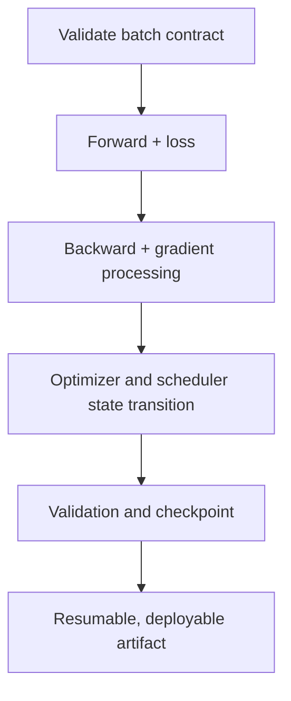



PyTorch training code is easy to make short, but it is difficult to build a **loop that resumes exactly after interruption, does not silently change state during validation, and preserves the same semantics from one GPU to many**. Small mistakes in the training loop can sometimes distort experimental results more than the model architecture does.

This article organizes contracts and verification points applicable to most supervised-learning code, rather than to one particular model. Consult the official documentation for the installed PyTorch release for API details; the design principles remain independent of version.

## 1. The Problem: Code That Runs Is Not the Same as Code That Trains Correctly

The following code is syntactically natural.

```python
for x, y in loader:
    prediction = model(x)
    loss = criterion(prediction, y)
    loss.backward()
    optimizer.step()
```

But it hides at least these problems.

- `x`, `y`, and the model may be on different devices.
- The target shape and dtype may violate the loss function's contract.
- Gradients from previous steps continue to accumulate.
- Dropout and batch normalization remain in training mode during validation.
- A validation graph is built, wasting memory.
- The last batch has a different size, yet batch means are averaged equally again.
- Underflow and overflow are not handled in mixed precision.
- The checkpoint contains only model weights, changing optimizer dynamics after resumption.
- Validation leakage occurs in the `DataLoader` split or transforms.
- Nothing measures whether the bottleneck is the model or the input pipeline.

### Silent Errors Are More Dangerous Than Exceptions

A device mismatch usually raises an exception immediately, but shape broadcasting and an incorrect target dtype can run while optimizing a different objective. For example, subtracting a `[B]` target from a `[B, 1]` prediction can create an unintended `[B, B]` operation.

Therefore, what matters is not that “the first batch passed,” but that you **make the batch contract explicit and fail fast**.

### Validation Loss Also Depends on Aggregation

When each batch loss is a batch mean and the last batch is smaller:

\[
\frac{1}{K}\sum_{k=1}^{K}\ell_k
\neq
\frac{\sum_k n_k\ell_k}{\sum_k n_k}
\]

To obtain a sample mean, weight by batch size. For a loss defined over tokens, pixels, or valid masked elements, make the denominator the number of those valid elements.

## 2. Mental Model: A Training Loop Is a State-Transition System

Represent the training state as the tuple:

\[
S_t=(\theta_t,\;o_t,\;q_t,\;g_t,\;e_t,\;b_t,\;r_t,\;c)
\]

- \(\theta_t\): model parameters and buffers
- \(o_t\): optimizer state
- \(q_t\): scheduler state
- \(g_t\): AMP gradient-scaler state
- \(e_t,b_t\): epoch and batch/global step
- \(r_t\): random-number-generator state
- \(c\): data, model, and training configuration

A checkpoint must be able to restore this state. Saving only model weights may be sufficient to “start fine-tuning with a new optimizer,” but not to “resume the same training from the interruption point.”



### Distinguish Three Kinds of State

1. **Model state**: parameters and persistent buffers
2. **Training state**: optimizer momentum, scheduler, scaler, and step
3. **Experiment state**: configuration, split, seed, code/data version, and best metric

All three layers are required to explain and resume a result.

### `train()/eval()` and Gradient Mode Are Separate

- `model.train()`: sets modules such as dropout and batch normalization to training behavior
- `model.eval()`: sets those modules to evaluation behavior
- `torch.no_grad()`: disables autograd recording
- `torch.inference_mode()`: permits stronger disabling and optimization for pure inference

Calling only `eval()` may still build a gradient graph, and using only `no_grad()` may leave the model in training mode. Validation normally uses `eval()` together with disabled gradient recording.

## 3. Practical Workflow

### Step 1. Fix the Data Split Before Creating a `DataLoader`

Version-control train/validation/test splits as indexes or manifests. Do not divide the data randomly again every time the modeling code runs.

Principles:

- Derived samples from the same entity, time series, or event do not cross split boundaries.
- Normalization, dictionaries, and feature selection are fitted only on training data.
- Stochastic augmentation is applied only to training data.
- Validation/test transformations are deterministic and semantically identical.
- `shuffle=True` changes only training-sample order; it does not create the split itself.
- Validation and test generally use `shuffle=False` and `drop_last=False`.

```python
train_set = Dataset(records, indices=split.train, transform=train_transform)
valid_set = Dataset(records, indices=split.valid, transform=eval_transform)

train_loader = DataLoader(
    train_set,
    batch_size=config.batch_size,
    shuffle=True,
    drop_last=config.drop_last_train,
    num_workers=config.num_workers,
    pin_memory=config.pin_memory,
    generator=train_generator,
    worker_init_fn=seed_worker,
)

valid_loader = DataLoader(
    valid_set,
    batch_size=config.eval_batch_size,
    shuffle=False,
    drop_last=False,
    num_workers=config.num_workers,
    pin_memory=config.pin_memory,
)
```

`drop_last=True` may be needed for batch normalization or fixed shapes, but record that it discards some training samples on every epoch. Using it for validation omits evaluation samples.

### Step 2. Encode Shape, Dtype, and Device Contracts

Make one batch adapter responsible for device movement and format normalization.

```python
from dataclasses import dataclass

@dataclass
class Batch:
    inputs: torch.Tensor
    targets: torch.Tensor
    sample_ids: list[str]

def prepare_batch(raw, device) -> Batch:
    x, y, sample_ids = raw

    x = x.to(device=device, dtype=torch.float32, non_blocking=True)
    y = y.to(device=device, dtype=torch.long, non_blocking=True)

    if x.ndim != 4:
        raise ValueError(f"expected inputs [B,C,H,W], got {tuple(x.shape)}")
    if y.ndim != 1 or y.shape[0] != x.shape[0]:
        raise ValueError(f"expected targets [B], got {tuple(y.shape)}")
    if not torch.isfinite(x).all():
        raise ValueError("non-finite input")

    return Batch(x, y, sample_ids)
```

Here, `[B,C,H,W]` and `long` are examples for multiclass image classification. Change the contract for each problem.

| Problem | Typical output | Typical target |
|---|---|---|
| Multiclass | `[B, C]`, float | `[B]`, integer class index |
| Binary logit | `[B]` or `[B,1]`, float | float with the same shape as the output |
| Regression | defined continuous shape, float | exactly compatible float |
| Sequence | `[B,T,...]` or model contract | includes mask and padding rules |

Also check whether the loss function expects logits or probabilities. Do not apply a probability transformation twice when using a numerically stable combined loss.

During early development, print and validate the following on the first batch.

- shape, dtype, and device
- min/max/mean and finite ratio
- target range and class count
- number of valid mask elements
- model-output shape
- whether the loss is finite

Large synchronization checks at every step can be slow; after stabilization, adjust them to periodic checks and error hooks.

### Step 3. Restrict Forward and Loss Computation to One Function

Share the function so training and validation do not silently use different preprocessing or losses.

```python
def forward_loss(model, batch, criterion):
    output = model(batch.inputs)

    if output.ndim != 2 or output.shape[0] != batch.targets.shape[0]:
        raise ValueError("model output violates [B,C] contract")

    loss = criterion(output, batch.targets)
    if loss.ndim != 0:
        raise ValueError("criterion must return a scalar loss")

    return output, loss
```

Use `loss.detach()` or `loss.item()` when computing training metrics so the graph does not remain attached. Calling `.item()` on a GPU tensor can cause synchronization, so do not invoke it excessively on every micro-batch; aggregate at a suitable cadence.

### Step 4. Make the Autograd and Gradient Lifecycles Explicit

The basic order is:

1. clear previous gradients
2. forward
3. compute a scalar loss
4. backward
5. optionally inspect and clip gradients
6. optimizer step

```python
optimizer.zero_grad(set_to_none=True)
output, loss = forward_loss(model, batch, criterion)
loss.backward()
gradient_norm = torch.nn.utils.clip_grad_norm_(model.parameters(), max_norm)
optimizer.step()
```

`set_to_none=True` can reduce memory work and is useful for distinguishing parameters that did not receive a gradient. Custom code that assumes `.grad` is always a tensor must be updated accordingly.

By default, `backward()` **accumulates** gradients. Unless gradient accumulation is intentional, always clear them before each optimizer step.

#### Gradient Accumulation

```python
optimizer.zero_grad(set_to_none=True)

for micro_step, raw in enumerate(train_loader):
    batch = prepare_batch(raw, device)
    output, loss = forward_loss(model, batch, criterion)
    (loss / accumulation_steps).backward()

    if (micro_step + 1) % accumulation_steps == 0:
        torch.nn.utils.clip_grad_norm_(model.parameters(), max_norm)
        optimizer.step()
        optimizer.zero_grad(set_to_none=True)
```

Also perform a step when the final group contains fewer than `accumulation_steps` micro-batches. Dividing the loss by a fixed value can change the effective scale of the final group, so account for the actual number of micro-batches or valid elements.

Batch normalization, scheduler step counts, and regularization implementations may not have the same semantics for a large batch and for gradient accumulation.

### Step 5. Preserve Operation and State Order with AMP

A typical CUDA mixed-precision structure is:

```python
use_amp = device.type == "cuda" and config.use_amp
scaler = torch.amp.GradScaler("cuda", enabled=use_amp)

optimizer.zero_grad(set_to_none=True)

with torch.amp.autocast("cuda", enabled=use_amp):
    output, loss = forward_loss(model, batch, criterion)

scaler.scale(loss).backward()
scaler.unscale_(optimizer)

grad_norm = torch.nn.utils.clip_grad_norm_(model.parameters(), config.max_grad_norm)
scaler.step(optimizer)
scaler.update()
```

Core principles:

- Use autocast for forward and loss computation.
- Backward does not need to execute inside the autocast context.
- Call `unscale_` before gradient clipping.
- `scaler.step()` may skip the optimizer step when overflow occurs.
- Save scaler state in the checkpoint too.
- Not every operation is safe at lower precision, so validate non-finite values and accuracy.

Autocast usage and supported dtypes for CPUs or other accelerators vary by environment and version. Do not blindly copy an example with a hard-coded device type; verify it in the installed environment.

### Step 6. Keep Totals and Denominators Separate in a Training Epoch

```python
def train_one_epoch(model, loader, optimizer, criterion, device, scaler, config):
    model.train()
    loss_sum = 0.0
    sample_count = 0

    optimizer.zero_grad(set_to_none=True)

    for step, raw in enumerate(loader):
        batch = prepare_batch(raw, device)
        batch_size = batch.targets.shape[0]

        with torch.amp.autocast(device.type, enabled=scaler.is_enabled()):
            output, loss = forward_loss(model, batch, criterion)
            scaled_for_accumulation = loss / config.accumulation_steps

        scaler.scale(scaled_for_accumulation).backward()

        should_step = (
            (step + 1) % config.accumulation_steps == 0
            or (step + 1) == len(loader)
        )

        if should_step:
            scaler.unscale_(optimizer)
            torch.nn.utils.clip_grad_norm_(model.parameters(), config.max_grad_norm)
            scaler.step(optimizer)
            scaler.update()
            optimizer.zero_grad(set_to_none=True)

        loss_sum += loss.detach().double().item() * batch_size
        sample_count += batch_size

    return {"loss": loss_sum / sample_count}
```

This example is a skeleton for understanding. For variable-length sequences where the batch-loss denominator is the token count, use the number of valid tokens instead of `batch_size`. Also adjust the precise loss scaling of the final accumulation group to its actual micro-batch count.

### Step 7. Preserve State and Aggregate Deterministically in Validation

```python
@torch.inference_mode()
def evaluate(model, loader, criterion, device, use_amp):
    was_training = model.training
    model.eval()

    loss_sum = 0.0
    sample_count = 0
    predictions = []
    targets = []

    for raw in loader:
        batch = prepare_batch(raw, device)

        with torch.amp.autocast(device.type, enabled=use_amp):
            output, loss = forward_loss(model, batch, criterion)

        n = batch.targets.shape[0]
        loss_sum += loss.double().item() * n
        sample_count += n
        predictions.append(output.float().cpu())
        targets.append(batch.targets.cpu())

    if was_training:
        model.train()

    return {
        "loss": loss_sum / sample_count,
        "output": torch.cat(predictions),
        "target": torch.cat(targets),
    }
```

Caveats:

- Explicitly restore training mode when the evaluation function ends.
- If all predictions cannot fit in memory, accumulate only sufficient statistics for the metric.
- In distributed evaluation, reduce totals and denominators across all ranks before computing the metric.
- For ranking metrics that require every prediction, design a gather strategy without duplicates.
- Do not reuse stochastic augmentation or the training sampler for validation.

### Step 8. Make the Scheduler's Unit of Time Explicit

When a scheduler steps is part of the algorithm's semantics.

- after every optimizer update
- after every epoch
- after a validation metric is computed

With gradient accumulation, the batch count and optimizer-update count differ. Align an update-based scheduler with the actual `global_step`. If AMP overflow causes an optimizer step to be skipped, define whether the scheduler advances with it.

```python
if optimizer_was_updated:
    update_scheduler.step()

# 또는 epoch 평가 후
metric_scheduler.step(validation_metric)
```

Call order and arguments vary by scheduler type, so do not impose one convention on every scheduler.

### Step 9. Separate the “Resume State” from the “Best Model” in Checkpoints

Recommended checkpoint contents:

```python
def checkpoint_payload(
    model, optimizer, scheduler, scaler,
    epoch, global_step, best_metric, config, split_id
):
    base_model = model.module if hasattr(model, "module") else model

    return {
        "format_version": 2,
        "model": base_model.state_dict(),
        "optimizer": optimizer.state_dict(),
        "scheduler": None if scheduler is None else scheduler.state_dict(),
        "scaler": None if scaler is None else scaler.state_dict(),
        "epoch": epoch,
        "global_step": global_step,
        "best_metric": best_metric,
        "config": config.to_dict(),
        "split_id": split_id,
        "rng": {
            "python": random.getstate(),
            "numpy": np.random.get_state(),
            "torch_cpu": torch.get_rng_state(),
            "torch_cuda": (
                torch.cuda.get_rng_state_all() if torch.cuda.is_available() else None
            ),
        },
    }
```

Additional metadata:

- code commit and dirty status
- data, label, and feature versions
- PyTorch, CUDA, dependency, and hardware information
- metric definition and evaluation result
- model input/output signature
- save time and checkpoint checksum

Distinguish files with two purposes.

- `last`: resume from the latest state after a failure
- `best`: the strongest deployment candidate under a defined validation criterion

Specify the direction of the metric used to select `best`, tie handling, and minimum improvement. Selecting the best checkpoint using the test metric leaks the test set.

#### Atomic Saving

Write the checkpoint completely to a temporary file, then rename it atomically. This prevents a process that dies during saving from replacing the latest checkpoint with a partial file. Do not let multiple ranks write to the same file concurrently; normally only rank 0 saves.

#### Validate After Loading

```python
state = torch.load(path, map_location=device, weights_only=False)
model.load_state_dict(state["model"], strict=True)
optimizer.load_state_dict(state["optimizer"])

if scheduler is not None:
    scheduler.load_state_dict(state["scheduler"])
if scaler is not None and state["scaler"] is not None:
    scaler.load_state_dict(state["scaler"])

assert state["config"] == expected_config
assert state["split_id"] == expected_split_id
```

Do not load an untrusted checkpoint as a general serialized object. Use safe weights-only loading, artifact signatures and checksums, and access control.

Verify optimizer-state tensor device movement, scheduler construction/load order, and similar details for the optimizer and version in use. A resume test should automatically compare training for several steps, saving, loading in a new process, and continuing.

### Step 10. Manage Reproducibility as a Statistical Contract

Setting a seed once is not sufficient.

```python
def seed_everything(seed):
    random.seed(seed)
    np.random.seed(seed)
    torch.manual_seed(seed)
    if torch.cuda.is_available():
        torch.cuda.manual_seed_all(seed)
```

Additional considerations:

- `DataLoader` worker seeds
- sampler seed for each epoch
- random augmentation
- per-rank seed policy in distributed execution
- nondeterministic accelerator kernels
- library, driver, and hardware differences
- multithreaded reduction order

Enforcing deterministic algorithms can make unsupported operations raise exceptions or run more slowly. Strict mode can be used for development and regression testing, while large-scale training can use a mode that reproduces metric ranges across multiple seeds.

Always record:

\[
\text{Result} = \text{Mean} \pm \text{Variation across seeds, splits, and runs}
\]

Do not select a model based on a small improvement from a single seed.

### Step 11. Measure Before Guessing with Profiling

Break down throughput degradation into:

- data reading, decoding, and augmentation
- host-to-device copy
- forward
- loss
- backward
- optimizer
- communication and synchronization
- logging and checkpointing

Inspect low-cost indicators first.

- samples or tokens per second
- GPU utilization and memory
- DataLoader wait time
- mean and upper quantiles of step time
- communication time
- checkpoint pauses

Use a detailed profiler over a short representative interval after warm-up. Detailed traces on every step can themselves become a bottleneck through overhead and large logs.

Common bottlenecks:

- repeated small Python-level operations
- synchronization from `.item()` and CPU output on every step
- small batches and low arithmetic intensity
- slow storage and excessive augmentation
- an inappropriate combination of `num_workers`, prefetching, and pinning
- unnecessary tensor copies and dtype conversions
- load imbalance in distributed environments

Rerun accuracy and reproducibility regression tests before and after optimization.

### Step 12. Preserve Data and State Symmetry in DDP

The basic mental model of distributed data parallelism is **one model replica and one device per process**, with gradient synchronization during backward.

Core principles:

- Assign the correct local device to each process.
- Move the model to the device before applying the DDP wrapper.
- Use a distributed sampler for training.
- Call `sampler.set_epoch(epoch)` every epoch to change the shuffle order.
- Total batch size is affected by `per_rank_batch × world_size × accumulation`.
- Let only rank 0 write logs and checkpoints, but aggregate metrics across all ranks.
- Every rank participates in collectives in the same order.
- A conditional branch on one rank that changes the backward graph can cause a hang or error.

```python
sampler = DistributedSampler(train_set, shuffle=True, drop_last=False)
loader = DataLoader(train_set, sampler=sampler, shuffle=False, ...)

for epoch in range(start_epoch, max_epochs):
    sampler.set_epoch(epoch)
    train_one_epoch(...)
```

A validation sampler may pad the dataset to the world size by duplicating some samples. For exact evaluation, remove duplicate sample IDs or use a partitioning sampler without duplicates.

A larger batch changes optimization dynamics. Faster DDP execution than single-GPU code does not mean it produces the same model under the same hyperparameters. Revalidate the learning rate, warmup, batch normalization, and scheduler.

### Step 13. Maintain a Minimum Automated Test Set

#### Batch Contract Test

- a valid batch passes
- incorrect shape, dtype, and NaN fail immediately
- the final small batch passes

#### Overfit-Small-Batch Test

Repeat a very small fixed batch and verify that the loss decreases sufficiently. If it fails, investigate the data–loss–gradient connection before model capacity.

#### Gradient Test

- gradients exist for key parameters
- gradients are finite
- intentionally frozen layers have no gradient
- inspect norms before and after clipping

#### Evaluation Purity Test

- model parameters and buffers do not change unintentionally before and after validation
- the same checkpoint and input produce the same output within tolerance
- training and validation transforms are separate

#### Resume Equivalence Test

Under fixed conditions:

1. train continuously for \(N\) steps
2. train for \(K\) steps, save, load in a new process, and train for \(N-K\) more steps
3. compare parameters, optimizer state, and metrics within tolerance

#### AMP/DDP Parity Test

- metric tolerance relative to full precision
- compare single-process results with 1-rank DDP
- check sample omissions and duplication, plus metric aggregation, across multiple ranks

## 4. Evaluation and Verification Checklist

### Data and Contracts

- [ ] The split manifest is fixed and has no entity or temporal leakage.
- [ ] Only preprocessing fitted on training data is applied to validation/test data.
- [ ] Training and evaluation transforms are separate.
- [ ] Shape and dtype contracts exist for inputs, targets, masks, and outputs.
- [ ] All tensor and model device movement is managed in one place.
- [ ] NaN/Inf, target ranges, and valid-element counts are checked.
- [ ] The final small batch and batch size 1 were tested.

### Training Loop and Autograd

- [ ] Transitions between `model.train()` and `model.eval()` are explicit.
- [ ] Gradient recording is disabled during validation.
- [ ] The placement of `zero_grad` and the intent of gradient accumulation are clear.
- [ ] Loss reduction and the metric denominator agree.
- [ ] Logging tensors do not retain the graph for too long.
- [ ] Key parameter gradients exist and are finite.
- [ ] Gradient clipping records the norm and threshold.

### AMP and Scheduler

- [ ] AMP accuracy, throughput, and memory were compared with full precision.
- [ ] Scaled gradients are unscaled before clipping.
- [ ] Scaler state is saved to and restored from checkpoints.
- [ ] Overflow and skipped optimizer steps are monitored.
- [ ] The scheduler's unit is explicitly batch, update, epoch, or metric.
- [ ] Accumulation and skipped steps do not break scheduler semantics.

### Checkpoints and Resumption

- [ ] Model, optimizer, scheduler, and scaler state are saved.
- [ ] Epoch, global step, best metric, configuration, and split ID are saved.
- [ ] Python, NumPy, PyTorch, and accelerator RNG state are considered.
- [ ] Code, data, and environment versions plus checksums are available.
- [ ] The purposes of `last` and `best` checkpoints are distinct.
- [ ] Atomic saving and corruption checks are used.
- [ ] A resume equivalence test passes in a new process.
- [ ] Loading of untrusted checkpoints is restricted.

### Reproducibility, Performance, and Distribution

- [ ] Worker, sampler, and kernel nondeterminism are recorded in addition to the seed.
- [ ] Result variance was checked across multiple seeds.
- [ ] Samples/tokens per second and step time are measured.
- [ ] A short representative interval was analyzed with a profiler.
- [ ] Per-rank devices, samplers, and batch counts are correct.
- [ ] `set_epoch` is called on the DDP training sampler every epoch.
- [ ] Metrics across all ranks are aggregated with the correct denominator.
- [ ] Duplicate padding samples in validation are handled.
- [ ] Rank-0-only writes and collective ordering are safe.

### Minimum Quality Gate

- [ ] It outperforms a simple baseline.
- [ ] It passes the small-batch overfit test.
- [ ] The directions of training loss and validation metrics are reasonable.
- [ ] No non-finite values occur during training or evaluation.
- [ ] The test set is not used to select the best model.
- [ ] Reloading the model artifact reproduces the same evaluation.
- [ ] The inference signature and preprocessing match the training contract.

## 5. Limitations and Caveats

First, complete bitwise reproducibility is difficult to guarantee when the PyTorch version, platform, driver, or hardware changes. Record the environment and specify the reproducibility level through tolerances for predictions and metrics.

Second, AMP and DDP can accelerate training, but they do not automatically make it correct. Changes in precision and global batch size alter the optimization path and require separate validation.

Third, even a checkpoint containing all state may not perfectly resume the exact intermediate position of an external data iterator, asynchronous augmentation, and distributed worker state. Define whether strict step-level resumption is required or an epoch-boundary resume is sufficient.

Fourth, numerous assertions and profiling improve reliability but reduce throughput. Distinguish a strict development and regression-validation mode from lightweight production-training monitoring, while keeping core contracts enabled.

Finally, a robust training loop does not replace good data and correct evaluation design. Perfectly reproducing a bad split and bad labels only repeats the wrong conclusion more reliably.
