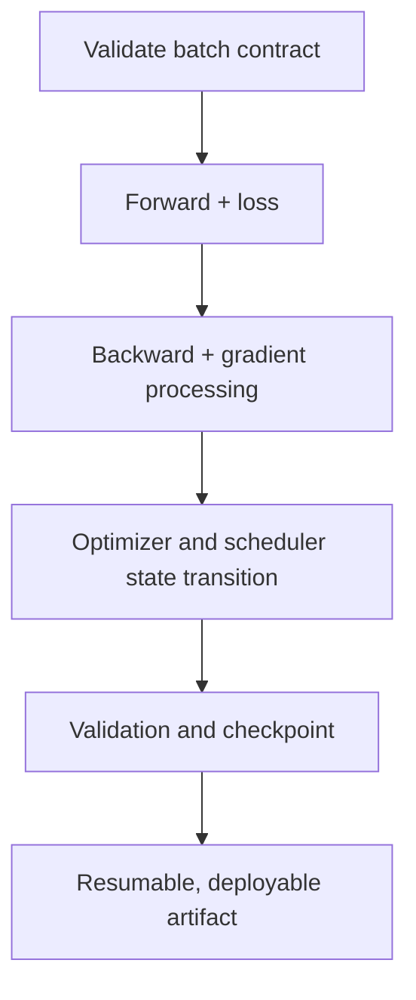



El código de entrenamiento PyTorch es fácil de acortar, pero es difícil crear un **bucle que se reanude exactamente después de la interrupción, que no cambie de estado silenciosamente durante la validación y conserve la misma semántica de un GPU a muchos**. A veces, pequeños errores en el ciclo de entrenamiento pueden distorsionar los resultados experimentales más que la arquitectura del modelo.

Este artículo organiza contratos y puntos de verificación aplicables a la mayoría de los códigos de aprendizaje supervisado, en lugar de a un modelo en particular. Consulte la documentación oficial de la versión PyTorch instalada para obtener detalles API; Los principios de diseño siguen siendo independientes de la versión.

## 1. El problema: el código que se ejecuta no es el mismo que el código que se entrena correctamente

El siguiente código es sintácticamente natural.

```python
for x, y in loader:
    prediction = model(x)
    loss = criterion(prediction, y)
    loss.backward()
    optimizer.step()
```

Pero oculta al menos estos problemas.

- `x`, `y`, y el modelo puede estar en diferentes dispositivos.
- La forma y el tipo del objetivo pueden violar el contrato de la función de pérdida.
- Los gradientes de pasos anteriores continúan acumulándose.
- El abandono y la normalización por lotes permanecen en modo de entrenamiento durante la validación.
- Se construye un gráfico de validación, desperdiciando memoria.
- El último lote tiene un tamaño diferente, pero las medias de los lotes se promedian nuevamente de manera igual.
- El desbordamiento y el desbordamiento no se manejan con precisión mixta.
- El punto de control contiene solo pesos del modelo, lo que cambia la dinámica del optimizador después de la reanudación.
- Se produce una fuga de validación en la división o transformación `DataLoader`.
- Nada mide si el cuello de botella es el modelo o el canal de entrada.

### Los errores silenciosos son más peligrosos que las excepciones

Una falta de coincidencia de dispositivos generalmente genera una excepción de inmediato, pero se pueden ejecutar transmisiones de forma y un tipo de objetivo incorrecto mientras se optimiza un objetivo diferente. Por ejemplo, restar un objetivo `[B]` de una predicción `[B, 1]` puede crear una operación `[B, B]` no deseada.

Por lo tanto, lo que importa no es que “el primer lote haya pasado”, sino que usted **haga explícito el contrato por lotes y falle rápidamente**.

### La pérdida de validación también depende de la agregación

Cuando la pérdida de cada lote es una media de lote y el último lote es más pequeño:

\[
\frac{1}{K}\sum_{k=1}^{K}\ell_k
\neq
\frac{\sum_k n_k\ell_k}{\sum_k n_k}
\]

Para obtener una media de la muestra, peso por tamaño de lote. Para una pérdida definida sobre tokens, píxeles o elementos enmascarados válidos, haga que el denominador sea el número de esos elementos válidos.

## 2. Modelo mental: un circuito de entrenamiento es un sistema de transición de estado

Representa el estado de entrenamiento como la tupla:

\[
S_t=(\theta_t,\;o_t,\;q_t,\;g_t,\;e_t,\;b_t,\;r_t,\;c)
\]

- \(\theta_t\): parámetros del modelo y buffers
- \(o_t\): estado del optimizador
- \(q_t\): estado del programador
- \(g_t\): AMP estado del escalador de gradiente
- \(e_t,b_t\): época y paso por lotes/global
- \(r_t\): estado del generador de números aleatorios
- \(c\): datos, modelo y configuración de entrenamiento

Un punto de control debe poder restaurar este estado. Guardar solo los pesos del modelo puede ser suficiente para "comenzar a realizar ajustes con un nuevo optimizador", pero no para "reanudar el mismo entrenamiento desde el punto de interrupción".



### Distinguir tres tipos de Estado

1. **Estado del modelo**: parámetros y buffers persistentes
2. **Estado de entrenamiento**: impulso del optimizador, programador, escalador y paso
3. **Estado del experimento**: configuración, división, semilla, versión de código/datos y mejor métrica

Se requieren las tres capas para explicar y resumir un resultado.

### `train()/eval()` y el modo degradado están separados

- `model.train()`: establece módulos como el abandono y la normalización por lotes para el comportamiento de entrenamiento
- `model.eval()`: establece esos módulos en comportamiento de evaluación
- `torch.no_grad()`: desactiva la grabación de autograduación
- `torch.inference_mode()`: permite una mayor desactivación y optimización para inferencia pura

Llamar solo a `eval()` aún puede generar un gráfico de gradiente, y usar solo `no_grad()` puede dejar el modelo en modo de entrenamiento. La validación normalmente usa `eval()` junto con la grabación de gradiente deshabilitada.

## 3. Flujo de trabajo práctico

### Paso 1. Arreglar la división de datos antes de crear un `DataLoader`

El tren/validación/prueba de control de versiones se divide como índices o manifiestos. No vuelva a dividir los datos aleatoriamente cada vez que se ejecute el código de modelado.

Principios:

- Las muestras derivadas de la misma entidad, serie temporal o evento no cruzan límites divididos.
- La normalización, los diccionarios y la selección de funciones se incluyen únicamente en los datos de entrenamiento.
- El aumento estocástico se aplica únicamente a los datos de entrenamiento.
- Las transformaciones de validación/prueba son deterministas y semánticamente idénticas.
- `shuffle=True` cambia solo el orden de las muestras de entrenamiento; no crea la división en sí.
- La validación y la prueba generalmente utilizan `shuffle=False` y `drop_last=False`.

```python
train_set = Dataset(records, indices=split.train, transform=train_transform)
valid_set = Dataset(records, indices=split.valid, transform=eval_transform)

train_loader = DataLoader(
    train_set,
    batch_size=config.batch_size,
    shuffle=True,
    drop_last=config.drop_last_train,
    num_workers=config.num_workers,
    pin_memory=config.pin_memory,
    generator=train_generator,
    worker_init_fn=seed_worker,
)

valid_loader = DataLoader(
    valid_set,
    batch_size=config.eval_batch_size,
    shuffle=False,
    drop_last=False,
    num_workers=config.num_workers,
    pin_memory=config.pin_memory,
)
```

Es posible que se necesite `drop_last=True` para la normalización de lotes o formas fijas, pero registre que descarta algunas muestras de entrenamiento en cada época. Usarlo para la validación omite las muestras de evaluación.

### Paso 2. Codificar forma, tipo D y contratos de dispositivo

Haga que un adaptador por lotes sea responsable del movimiento del dispositivo y la normalización del formato.

```python
from dataclasses import dataclass

@dataclass
class Batch:
    inputs: torch.Tensor
    targets: torch.Tensor
    sample_ids: list[str]

def prepare_batch(raw, device) -> Batch:
    x, y, sample_ids = raw

    x = x.to(device=device, dtype=torch.float32, non_blocking=True)
    y = y.to(device=device, dtype=torch.long, non_blocking=True)

    if x.ndim != 4:
        raise ValueError(f"expected inputs [B,C,H,W], got {tuple(x.shape)}")
    if y.ndim != 1 or y.shape[0] != x.shape[0]:
        raise ValueError(f"expected targets [B], got {tuple(y.shape)}")
    if not torch.isfinite(x).all():
        raise ValueError("non-finite input")

    return Batch(x, y, sample_ids)
```

Aquí, `[B,C,H,W]` y `long` son ejemplos de clasificación de imágenes multiclase. Cambie el contrato para cada problema.

| Problema | Salida típica | Objetivo típico |
|---|---|---|
| Multiclase | `[B, C]`, flotante | `[B]`, índice de clase entera |
| logit binario | `[B]` o `[B,1]`, flotante | flotar con la misma forma que la salida |
| Regresión | forma continua definida, flotador | flotador exactamente compatible |
| Secuencia | `[B,T,...]` o contrato modelo | incluye máscara y reglas de acolchado |

Compruebe también si la función de pérdida espera logits o probabilidades. No aplique una transformación de probabilidad dos veces cuando utilice una pérdida combinada numéricamente estable.

Durante el desarrollo inicial, imprima y valide lo siguiente en el primer lote.

- forma, tipo y dispositivo
- relación mínima/máxima/media y finita
- rango objetivo y recuento de clases
- número de elementos de máscara válidos
- forma de salida del modelo
- si la pérdida es finita

Las grandes comprobaciones de sincronización en cada paso pueden resultar lentas; después de la estabilización, ajústelos a controles periódicos y ganchos de error.

### Paso 3. Restringir el cálculo de pérdidas y avance a una función

Comparta la función para que la capacitación y la validación no utilicen silenciosamente diferentes preprocesamientos o pérdidas.

```python
def forward_loss(model, batch, criterion):
    output = model(batch.inputs)

    if output.ndim != 2 or output.shape[0] != batch.targets.shape[0]:
        raise ValueError("model output violates [B,C] contract")

    loss = criterion(output, batch.targets)
    if loss.ndim != 0:
        raise ValueError("criterion must return a scalar loss")

    return output, loss
```

Utilice `loss.detach()` o `loss.item()` cuando calcule métricas de entrenamiento para que el gráfico no permanezca adjunto. Llamar a `.item()` en un tensor GPU puede provocar sincronización, así que no lo invoques excesivamente en cada microlote; agregar a una cadencia adecuada.

### Paso 4. Hacer explícitos los ciclos de vida de Autograd y Gradient

El orden básico es:

1. borrar gradientes anteriores
2. adelante
3. calcular una pérdida escalar
4. hacia atrás
5. opcionalmente inspeccionar y recortar degradados
6. paso del optimizador

```python
optimizer.zero_grad(set_to_none=True)
output, loss = forward_loss(model, batch, criterion)
loss.backward()
gradient_norm = torch.nn.utils.clip_grad_norm_(model.parameters(), max_norm)
optimizer.step()
```

`set_to_none=True` puede reducir el trabajo de memoria y es útil para distinguir parámetros que no recibieron un gradiente. El código personalizado que supone que `.grad` es siempre un tensor debe actualizarse en consecuencia.

De forma predeterminada, `backward()` **acumula** gradientes. A menos que la acumulación de gradientes sea intencional, bórrelos siempre antes de cada paso del optimizador.

#### Acumulación de gradiente

```python
optimizer.zero_grad(set_to_none=True)

for micro_step, raw in enumerate(train_loader):
    batch = prepare_batch(raw, device)
    output, loss = forward_loss(model, batch, criterion)
    (loss / accumulation_steps).backward()

    if (micro_step + 1) % accumulation_steps == 0:
        torch.nn.utils.clip_grad_norm_(model.parameters(), max_norm)
        optimizer.step()
        optimizer.zero_grad(set_to_none=True)
```

Realice también un paso cuando el grupo final contenga menos de `accumulation_steps` microlotes. Dividir la pérdida por un valor fijo puede cambiar la escala efectiva del grupo final, por lo que se debe tener en cuenta el número real de microlotes o elementos válidos.

Es posible que la normalización de lotes, el recuento de pasos del programador y las implementaciones de regularización no tengan la misma semántica para un lote grande y para la acumulación de gradiente.

### Paso 5. Preservar la operación y el orden estatal con AMP

Una estructura típica de precisión mixta CUDA es:

```python
use_amp = device.type == "cuda" and config.use_amp
scaler = torch.amp.GradScaler("cuda", enabled=use_amp)

optimizer.zero_grad(set_to_none=True)

with torch.amp.autocast("cuda", enabled=use_amp):
    output, loss = forward_loss(model, batch, criterion)

scaler.scale(loss).backward()
scaler.unscale_(optimizer)

grad_norm = torch.nn.utils.clip_grad_norm_(model.parameters(), config.max_grad_norm)
scaler.step(optimizer)
scaler.update()
```

Principios básicos:

- Utilice la transmisión automática para el cálculo de pérdidas y avance.
- No es necesario ejecutar Backward dentro del contexto de transmisión automática.
- Llame a `unscale_` antes del recorte de degradado.
- `scaler.step()` puede omitir el paso del optimizador cuando se produce un desbordamiento.
- Guarde también el estado del escalador en el punto de control.
- No todas las operaciones son seguras con una precisión más baja, por lo tanto, valide los valores y la precisión no finitos.

El uso de Autocast y los tipos de d admitidos para CPU u otros aceleradores varían según el entorno y la versión. No copie ciegamente un ejemplo con un tipo de dispositivo codificado; verifíquelo en el entorno instalado.

### Paso 6. Mantenga los totales y los denominadores separados en una época de capacitación

```python
def train_one_epoch(model, loader, optimizer, criterion, device, scaler, config):
    model.train()
    loss_sum = 0.0
    sample_count = 0

    optimizer.zero_grad(set_to_none=True)

    for step, raw in enumerate(loader):
        batch = prepare_batch(raw, device)
        batch_size = batch.targets.shape[0]

        with torch.amp.autocast(device.type, enabled=scaler.is_enabled()):
            output, loss = forward_loss(model, batch, criterion)
            scaled_for_accumulation = loss / config.accumulation_steps

        scaler.scale(scaled_for_accumulation).backward()

        should_step = (
            (step + 1) % config.accumulation_steps == 0
            or (step + 1) == len(loader)
        )

        if should_step:
            scaler.unscale_(optimizer)
            torch.nn.utils.clip_grad_norm_(model.parameters(), config.max_grad_norm)
            scaler.step(optimizer)
            scaler.update()
            optimizer.zero_grad(set_to_none=True)

        loss_sum += loss.detach().double().item() * batch_size
        sample_count += batch_size

    return {"loss": loss_sum / sample_count}
```

Este ejemplo es un esqueleto para la comprensión. Para secuencias de longitud variable donde el denominador de pérdida de lote es el recuento de tokens, utilice el número de tokens válidos en lugar de `batch_size`. También ajuste la escala de pérdida precisa del grupo de acumulación final a su recuento real de microlotes.

### Paso 7. Preservar el estado y agregar de manera determinista en la validación

```python
@torch.inference_mode()
def evaluate(model, loader, criterion, device, use_amp):
    was_training = model.training
    model.eval()

    loss_sum = 0.0
    sample_count = 0
    predictions = []
    targets = []

    for raw in loader:
        batch = prepare_batch(raw, device)

        with torch.amp.autocast(device.type, enabled=use_amp):
            output, loss = forward_loss(model, batch, criterion)

        n = batch.targets.shape[0]
        loss_sum += loss.double().item() * n
        sample_count += n
        predictions.append(output.float().cpu())
        targets.append(batch.targets.cpu())

    if was_training:
        model.train()

    return {
        "loss": loss_sum / sample_count,
        "output": torch.cat(predictions),
        "target": torch.cat(targets),
    }
```

Advertencias:

- Restaurar explícitamente el modo de entrenamiento cuando finalice la función de evaluación.
- Si todas las predicciones no caben en la memoria, acumule solo las estadísticas suficientes para la métrica.
- En la evaluación distribuida, reduzca los totales y los denominadores en todos los rangos antes de calcular la métrica.
- Para métricas de clasificación que requieren cada predicción, diseñe una estrategia de recopilación sin duplicados.
- No reutilice el aumento estocástico ni el muestreador de entrenamiento para la validación.

### Paso 8. Hacer explícita la unidad de tiempo del programador

Cuando un programador da pasos es parte de la semántica del algoritmo.

- después de cada actualización del optimizador
- después de cada época
- después de calcular una métrica de validación

Con la acumulación de gradiente, el recuento de lotes y el recuento de actualizaciones del optimizador difieren. Alinee un programador basado en actualizaciones con el `global_step` real. Si el desbordamiento de AMP hace que se omita un paso del optimizador, defina si el programador avanza con él.

```python
if optimizer_was_updated:
    update_scheduler.step()

# 또는 epoch 평가 후
metric_scheduler.step(validation_metric)
```

El orden de las llamadas y los argumentos varían según el tipo de programador, por lo que no imponga una convención a cada programador.

### Paso 9. Separe el "Estado del currículum" del "Mejor modelo" en los puntos de control

Contenidos recomendados para los puntos de control:

```python
def checkpoint_payload(
    model, optimizer, scheduler, scaler,
    epoch, global_step, best_metric, config, split_id
):
    base_model = model.module if hasattr(model, "module") else model

    return {
        "format_version": 2,
        "model": base_model.state_dict(),
        "optimizer": optimizer.state_dict(),
        "scheduler": None if scheduler is None else scheduler.state_dict(),
        "scaler": None if scaler is None else scaler.state_dict(),
        "epoch": epoch,
        "global_step": global_step,
        "best_metric": best_metric,
        "config": config.to_dict(),
        "split_id": split_id,
        "rng": {
            "python": random.getstate(),
            "numpy": np.random.get_state(),
            "torch_cpu": torch.get_rng_state(),
            "torch_cuda": (
                torch.cuda.get_rng_state_all() if torch.cuda.is_available() else None
            ),
        },
    }
```

Metadatos adicionales:

- confirmación de código y estado sucio
- versiones de datos, etiquetas y características
- PyTorch, CUDA, información de dependencia y hardware
- definición de métrica y resultado de evaluación
- firma de entrada/salida del modelo
- Ahorre tiempo y control de suma de control.

Distinguir archivos con dos propósitos.

- `last`: reanudar desde el último estado después de un error
- `best`: el candidato de implementación más sólido según un criterio de validación definido

Especifique la dirección de la métrica utilizada para seleccionar `best`, manejo de empates y mejora mínima. Al seleccionar el mejor punto de control utilizando la métrica de prueba, se pierde el conjunto de prueba.

#### Ahorro atómico

Escriba el punto de control completamente en un archivo temporal y luego cámbiele el nombre de forma atómica. Esto evita que un proceso que muere durante el guardado reemplace el último punto de control con un archivo parcial. No permita que varios rangos escriban en el mismo archivo al mismo tiempo; normalmente solo salvaciones de rango 0.

#### Validar después de cargar

```python
state = torch.load(path, map_location=device, weights_only=False)
model.load_state_dict(state["model"], strict=True)
optimizer.load_state_dict(state["optimizer"])

if scheduler is not None:
    scheduler.load_state_dict(state["scheduler"])
if scaler is not None and state["scaler"] is not None:
    scaler.load_state_dict(state["scaler"])

assert state["config"] == expected_config
assert state["split_id"] == expected_split_id
```

No cargue un punto de control que no sea de confianza como un objeto serializado general. Utilice carga segura de solo pesos, firmas de artefactos y sumas de verificación, y control de acceso.

Verifique el movimiento del dispositivo tensor en estado del optimizador, el orden de carga/construcción del programador y detalles similares para el optimizador y la versión en uso. Una prueba de currículum debe comparar automáticamente la capacitación de varios pasos, guardarla, cargarla en un nuevo proceso y continuar.

### Paso 10. Gestionar la reproducibilidad como un contrato estadístico

Poner una semilla una vez no es suficiente.

```python
def seed_everything(seed):
    random.seed(seed)
    np.random.seed(seed)
    torch.manual_seed(seed)
    if torch.cuda.is_available():
        torch.cuda.manual_seed_all(seed)
```

Consideraciones adicionales:

- `DataLoader` semillas obreras
- semilla de muestra para cada época
- aumento aleatorio
- política de semillas por rango en ejecución distribuida
- núcleos aceleradores no deterministas
- diferencias de biblioteca, controlador y hardware
- orden de reducción multiproceso

La aplicación de algoritmos deterministas puede hacer que las operaciones no admitidas generen excepciones o se ejecuten más lentamente. El modo estricto se puede utilizar para pruebas de desarrollo y regresión, mientras que el entrenamiento a gran escala puede utilizar un modo que reproduzca rangos métricos en múltiples semillas.

Registre siempre:

\[
\text{Result} = \text{Mean} \pm \text{Variation across seeds, splits, and runs}
\]

No seleccione un modelo basándose en una pequeña mejora de una sola semilla.

### Paso 11. Mide antes de adivinar con el perfilado

Divida la degradación del rendimiento en:

- lectura, decodificación y aumento de datos
- copia de host a dispositivo
- adelante
- pérdida
- hacia atrás
- optimizador
- comunicación y sincronización
- registro y puntos de control

Inspeccione primero los indicadores de bajo costo.

- muestras o tokens por segundo
- GPU utilización y memoria
- Tiempo de espera del cargador de datos
- cuantiles medios y superiores del tiempo de paso
- tiempo de comunicación
- pausas en el punto de control

Utilice un perfilador detallado durante un breve intervalo representativo después del calentamiento. Los seguimientos detallados en cada paso pueden convertirse en un cuello de botella debido a los registros elevados y de gran tamaño.

Cuellos de botella comunes:

- pequeñas operaciones repetidas a nivel de Python
- sincronización de la salida `.item()` y CPU en cada paso
- lotes pequeños y baja intensidad aritmética
- almacenamiento lento y aumento excesivo
- una combinación inapropiada de `num_workers`, captación previa y fijación
- copias de tensor innecesarias y conversiones de tipo d
- desequilibrio de carga en entornos distribuidos

Vuelva a ejecutar pruebas de regresión de precisión y reproducibilidad antes y después de la optimización.

### Paso 12. Preservar datos y simetría de estado en DDP

El modelo mental básico de paralelismo de datos distribuidos es **una réplica del modelo y un dispositivo por proceso**, con sincronización de gradiente hacia atrás.

Principios básicos:

- Asignar el dispositivo local correcto a cada proceso.
- Mueva el modelo al dispositivo antes de aplicar el envoltorio DDP.
- Utilice un sampler distribuido para el entrenamiento.
- Llame a `sampler.set_epoch(epoch)` cada época para cambiar el orden aleatorio.
- El tamaño total del lote se ve afectado por `per_rank_batch × world_size × accumulation`.
- Permita que solo el rango 0 escriba registros y puntos de control, pero agregue métricas en todos los rangos.
- Cada rango participa en colectivos en el mismo orden.
- Una rama condicional en un rango que cambia el gráfico hacia atrás puede causar un bloqueo o error.

```python
sampler = DistributedSampler(train_set, shuffle=True, drop_last=False)
loader = DataLoader(train_set, sampler=sampler, shuffle=False, ...)

for epoch in range(start_epoch, max_epochs):
    sampler.set_epoch(epoch)
    train_one_epoch(...)
```

Un muestreador de validación puede rellenar el conjunto de datos al tamaño mundial duplicando algunas muestras. Para una evaluación exacta, elimine los ID de muestra duplicados o utilice un muestreador de partición sin duplicados.

Un lote más grande cambia la dinámica de optimización. Una ejecución DDP más rápida que el código único GPU no significa que produzca el mismo modelo con los mismos hiperparámetros. Revalide la tasa de aprendizaje, el calentamiento, la normalización por lotes y el programador.

### Paso 13. Mantener un conjunto mínimo de pruebas automatizadas

#### Prueba de contrato por lotes

- un lote de pases válidos
- la forma, el tipo d y el NaN incorrectos fallan inmediatamente
- el último lote pequeño pasa

#### Prueba de sobreajuste de lotes pequeños

Repita un lote fijo muy pequeño y verifique que la pérdida disminuya lo suficiente. Si falla, investigue la conexión de gradiente de pérdida de datos antes de la capacidad del modelo.

#### Prueba de gradiente

- existen gradientes para parámetros clave
- los gradientes son finitos
- las capas congeladas intencionalmente no tienen gradiente
- inspeccionar las normas antes y después del recorte

#### Prueba de pureza de evaluación

- los parámetros y buffers del modelo no cambian involuntariamente antes y después de la validación
- el mismo punto de control y entrada producen la misma salida dentro de la tolerancia
- las transformaciones de entrenamiento y validación están separadas

#### Reanudar prueba de equivalencia

En condiciones fijas:

1. entrenar continuamente para \(N\) pasos
2. entrenar para \(K\) pasos, guardar, cargar un nuevo proceso y entrenar para \(N-K\) pasos más
Tercero, comparar parámetros, estado del optimizador y métricas dentro de la tolerancia.

#### AMP/DDP Prueba de paridad

- tolerancia métrica relativa a la precisión total
- comparar resultados de proceso único con 1 rango DDP
- comprobar las omisiones y duplicaciones de muestras, además de la agregación de métricas, en múltiples rangos

## 4. Lista de verificación de evaluación y verificación

### Datos y Contratos

- [ ] El manifiesto dividido es fijo y no tiene entidad ni fuga temporal.
- [] Solo el preprocesamiento instalado en los datos de entrenamiento se aplica a los datos de validación/prueba.
- [ ] Las transformaciones de capacitación y evaluación están separadas.
- [] Existen contratos de forma y tipo para entradas, objetivos, máscaras y salidas.
- [] Todo el movimiento del dispositivo tensor y modelo se gestiona en un solo lugar.
- Se verifican [] NaN/Inf, rangos objetivo y recuentos de elementos válidos.
- [ ] Se probaron el lote pequeño final y el tamaño de lote 1.

### Circuito de entrenamiento y Autograd

- [ ] Las transiciones entre `model.train()` y `model.eval()` son explícitas.
- [] La grabación de gradiente se desactiva durante la validación.
- [] La ubicación de `zero_grad` y la intención de la acumulación de gradiente son claras.
- [ ] La reducción de pérdidas y el denominador métrico coinciden.
- [] Los tensores de registro no retienen el gráfico por mucho tiempo.
- [] Los gradientes de parámetros clave existen y son finitos.
- [] El recorte de gradiente registra la norma y el umbral.

### AMP y Programador

- [ ] AMP la precisión, el rendimiento y la memoria se compararon con total precisión.
- [] Los degradados escalados se quitan de escala antes del recorte.
- [] El estado del escalador se guarda y se restaura desde los puntos de control.
- [] Se monitorean los pasos desbordados y omitidos del optimizador.
- [] La unidad del programador es explícitamente lote, actualización, época o métrica.
- [] La acumulación y los pasos omitidos no rompen la semántica del programador.

### Puntos de control y reanudación

- [] Se guardan el estado del modelo, optimizador, programador y escalador.
- [ ] Se guardan la época, el paso global, la mejor métrica, la configuración y la división ID.
- Se consideran los estados [ ] Python, NumPy, PyTorch y acelerador RNG.
- [] Se encuentran disponibles versiones de código, datos y entorno, además de sumas de verificación.
- [ ] Los propósitos de los puntos de control `last` y `best` son distintos.
- [] Se utilizan controles de corrupción y ahorro atómico.
- [ ] Pasa una prueba de equivalencia de currículum en un nuevo proceso.
- [] La carga de puntos de control que no son de confianza está restringida.

### Reproducibilidad, rendimiento y distribución

- [ ] El no determinismo del trabajador, del muestreador y del núcleo se registra además de la semilla.
- [] La variación del resultado se verificó en varias semillas.
- [ ] Se miden muestras/tokens por segundo y tiempo de paso.
- [ ] Se analizó un breve intervalo representativo con un perfilador.
- [ ] Los dispositivos por rango, los muestreadores y los recuentos de lotes son correctos.
- [ ] `set_epoch` se llama en el muestreador de entrenamiento DDP cada época.
- [] Las métricas de todos los rangos se agregan con el denominador correcto.
- [] Se manejan muestras de relleno duplicadas en la validación.
- [] Las escrituras de rango 0 y los pedidos colectivos son seguros.

### Puerta de calidad mínima

- [] Supera a una línea de base simple.
- [] Pasa la prueba de sobreajuste de lotes pequeños.
- [] Las direcciones de las métricas de validación y pérdida de entrenamiento son razonables.
- [ ] No se producen valores no finitos durante el entrenamiento o la evaluación.
- [ ] El conjunto de prueba no se utiliza para seleccionar el mejor modelo.
- [] Al recargar el artefacto modelo se reproduce la misma evaluación.
- [ ] La firma de inferencia y el preprocesamiento coinciden con el contrato de formación.

## 5. Limitaciones y advertencias

En primer lugar, es difícil garantizar una reproducibilidad bit a bit completa cuando cambia la versión PyTorch, la plataforma, el controlador o el hardware. Registre el entorno y especifique el nivel de reproducibilidad mediante tolerancias para predicciones y métricas.

En segundo lugar, AMP y DDP pueden acelerar el entrenamiento, pero no lo hacen correcto automáticamente. Los cambios en la precisión y el tamaño del lote global alteran la ruta de optimización y requieren una validación por separado.

En tercer lugar, es posible que incluso un punto de control que contenga todos los estados no recupere perfectamente la posición intermedia exacta de un iterador de datos externo, un aumento asincrónico y un estado de trabajador distribuido. Defina si se requiere una reanudación estricta a nivel de paso o si es suficiente una reanudación con límites de época.

Cuarto, numerosas afirmaciones y perfiles mejoran la confiabilidad pero reducen el rendimiento. Distinga un modo estricto de desarrollo y validación de regresión de un monitoreo liviano de capacitación en producción, manteniendo habilitados los contratos principales.

Finalmente, un circuito de capacitación sólido no reemplaza los buenos datos y el diseño de evaluación correcto. Reproducir perfectamente una mala división y malas etiquetas sólo repite la conclusión equivocada de manera más confiable.
