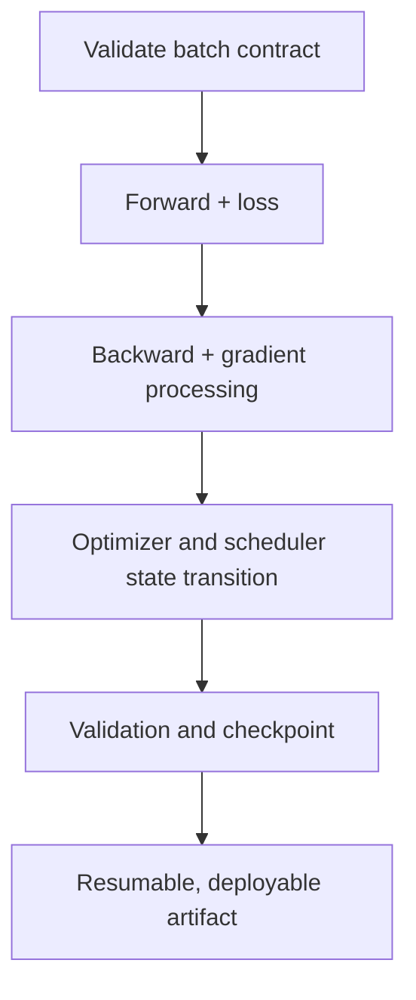



Il est facile d'écrire un code d'entraînement PyTorch court, mais difficile de construire une **boucle qui reprend exactement après une interruption, ne change pas silencieusement d'état pendant la validation et conserve la même sémantique d'un à plusieurs GPU**. De petites erreurs dans la boucle peuvent parfois fausser les résultats expérimentaux davantage que l'architecture du modèle.

Cet article organise les contrats et points de vérification applicables à la plupart des codes d'apprentissage supervisé, plutôt qu'à un modèle particulier. Consultez la documentation officielle de la version PyTorch installée pour les détails d'API ; les principes de conception restent indépendants de la version.

## 1. Le problème : un code qui s'exécute n'est pas forcément un code qui entraîne correctement

Le code suivant est syntaxiquement naturel.

```python
for x, y in loader:
    prediction = model(x)
    loss = criterion(prediction, y)
    loss.backward()
    optimizer.step()
```

Mais il masque au moins les problèmes suivants.

- `x`, `y` et le modèle peuvent se trouver sur des périphériques différents.
- La forme et le type de la cible peuvent violer le contrat de la fonction de perte.
- Les gradients des étapes précédentes continuent de s'accumuler.
- Le dropout et la normalisation par lot restent en mode entraînement pendant la validation.
- Un graphe de validation est construit, gaspillant de la mémoire.
- Le dernier lot a une taille différente, mais les moyennes des lots sont à nouveau moyennées à poids égal.
- Les dépassements inférieur et supérieur ne sont pas gérés en précision mixte.
- Le point de contrôle ne contient que les poids du modèle, ce qui change la dynamique de l'optimiseur après la reprise.
- Une fuite de validation se produit dans le découpage ou les transformations du `DataLoader`.
- Rien ne mesure si le goulot d'étranglement vient du modèle ou du pipeline d'entrée.

### Les erreurs silencieuses sont plus dangereuses que les exceptions

Une incompatibilité de périphérique lève généralement une exception immédiate, mais la diffusion des formes et un type de cible incorrect peuvent s'exécuter tout en optimisant un autre objectif. Par exemple, soustraire une cible `[B]` d'une prédiction `[B, 1]` peut créer une opération `[B, B]` involontaire.

L'important n'est donc pas que « le premier lot soit passé », mais de **rendre explicite le contrat du lot et d'échouer rapidement**.

### La perte de validation dépend aussi de l'agrégation

Lorsque la perte de chaque lot est sa moyenne et que le dernier lot est plus petit :

\[
\frac{1}{K}\sum_{k=1}^{K}\ell_k
\neq
\frac{\sum_k n_k\ell_k}{\sum_k n_k}
\]

Pour obtenir une moyenne par échantillon, pondérez par la taille du lot. Pour une perte définie sur des jetons, pixels ou éléments masqués valides, utilisez leur nombre comme dénominateur.

## 2. Modèle mental : une boucle d'entraînement est un système de transition d'état

Représentons l'état d'entraînement par le tuple :

\[
S_t=(\theta_t,\;o_t,\;q_t,\;g_t,\;e_t,\;b_t,\;r_t,\;c)
\]

- \(\theta_t\) : paramètres et tampons du modèle
- \(o_t\) : état de l'optimiseur
- \(q_t\) : état de l'ordonnanceur
- \(g_t\) : état du facteur d'échelle des gradients AMP
- \(e_t,b_t\) : époque et étape de lot/globale
- \(r_t\) : état du générateur de nombres aléatoires
- \(c\) : configuration des données, du modèle et de l'entraînement

Un point de contrôle doit pouvoir restaurer cet état. Enregistrer seulement les poids peut suffire pour « lancer un ajustement fin avec un nouvel optimiseur », mais pas pour « reprendre le même entraînement au point d'interruption ».



### Distinguer trois types d'état

1. **État du modèle** : paramètres et tampons persistants
2. **État d'entraînement** : moment de l'optimiseur, ordonnanceur, facteur d'échelle et étape
3. **État de l'expérience** : configuration, découpage, graine, version du code/des données et meilleure métrique

Ces trois niveaux sont nécessaires pour expliquer et reprendre un résultat.

### `train()/eval()` et le mode de gradient sont distincts

- `model.train()` : place les modules tels que dropout et normalisation par lot en comportement d'entraînement
- `model.eval()` : place ces modules en comportement d'évaluation
- `torch.no_grad()` : désactive l'enregistrement autograd
- `torch.inference_mode()` : permet une désactivation renforcée et une optimisation pour l'inférence pure

Appeler seulement `eval()` peut encore construire un graphe de gradients, et utiliser seulement `no_grad()` peut laisser le modèle en mode entraînement. La validation emploie normalement `eval()` avec l'enregistrement des gradients désactivé.

## 3. Processus pratique

### Étape 1. Figer le découpage des données avant de créer un `DataLoader`

Versionnez les découpages entraînement/validation/test sous forme d'indices ou de manifestes. Ne redécoupez pas aléatoirement les données à chaque exécution du code.

Principes :

- Les échantillons dérivés d'une même entité, série temporelle ou événement ne franchissent pas les limites du découpage.
- Normalisation, dictionnaires et sélection de variables sont ajustés uniquement sur les données d'entraînement.
- L'augmentation stochastique ne s'applique qu'aux données d'entraînement.
- Les transformations de validation/test sont déterministes et sémantiquement identiques.
- `shuffle=True` ne change que l'ordre des échantillons d'entraînement ; il ne crée pas le découpage.
- Validation et test utilisent généralement `shuffle=False` et `drop_last=False`.

```python
train_set = Dataset(records, indices=split.train, transform=train_transform)
valid_set = Dataset(records, indices=split.valid, transform=eval_transform)

train_loader = DataLoader(
    train_set,
    batch_size=config.batch_size,
    shuffle=True,
    drop_last=config.drop_last_train,
    num_workers=config.num_workers,
    pin_memory=config.pin_memory,
    generator=train_generator,
    worker_init_fn=seed_worker,
)

valid_loader = DataLoader(
    valid_set,
    batch_size=config.eval_batch_size,
    shuffle=False,
    drop_last=False,
    num_workers=config.num_workers,
    pin_memory=config.pin_memory,
)
```

`drop_last=True` peut être nécessaire pour la normalisation par lot ou les formes fixes, mais consignez qu'il élimine des échantillons à chaque époque. L'utiliser en validation omet des échantillons d'évaluation.

### Étape 2. Encoder les contrats de forme, de type et de périphérique

Confiez à un adaptateur de lot le déplacement vers le périphérique et la normalisation du format.

```python
from dataclasses import dataclass

@dataclass
class Batch:
    inputs: torch.Tensor
    targets: torch.Tensor
    sample_ids: list[str]

def prepare_batch(raw, device) -> Batch:
    x, y, sample_ids = raw

    x = x.to(device=device, dtype=torch.float32, non_blocking=True)
    y = y.to(device=device, dtype=torch.long, non_blocking=True)

    if x.ndim != 4:
        raise ValueError(f"expected inputs [B,C,H,W], got {tuple(x.shape)}")
    if y.ndim != 1 or y.shape[0] != x.shape[0]:
        raise ValueError(f"expected targets [B], got {tuple(y.shape)}")
    if not torch.isfinite(x).all():
        raise ValueError("non-finite input")

    return Batch(x, y, sample_ids)
```

Ici, `[B,C,H,W]` et `long` sont des exemples de classification d'images multiclasse. Adaptez le contrat à chaque problème.

| Problème | Sortie typique | Cible typique |
|---|---|---|
| Multiclasse | `[B, C]`, flottant | `[B]`, indice de classe entier |
| Logit binaire | `[B]` ou `[B,1]`, flottant | flottant de même forme que la sortie |
| Régression | forme continue définie, flottant | flottant exactement compatible |
| Séquence | `[B,T,...]` ou contrat du modèle | inclut les règles de masque et de remplissage |

Vérifiez aussi si la fonction de perte attend des logits ou des probabilités. N'appliquez pas deux fois une transformation probabiliste avec une perte combinée numériquement stable.

Au début du développement, affichez et validez les éléments suivants sur le premier lot.

- forme, type et périphérique
- minimum/maximum/moyenne et proportion de valeurs finies
- plage des cibles et nombre de classes
- nombre d'éléments de masque valides
- forme de la sortie du modèle
- caractère fini ou non de la perte

Des vérifications de synchronisation importantes à chaque étape peuvent être lentes ; après stabilisation, remplacez-les par des contrôles périodiques et des crochets d'erreur.

### Étape 3. Regrouper passage avant et calcul de perte dans une seule fonction

Partagez cette fonction afin que l'entraînement et la validation n'utilisent pas silencieusement des prétraitements ou pertes différents.

```python
def forward_loss(model, batch, criterion):
    output = model(batch.inputs)

    if output.ndim != 2 or output.shape[0] != batch.targets.shape[0]:
        raise ValueError("model output violates [B,C] contract")

    loss = criterion(output, batch.targets)
    if loss.ndim != 0:
        raise ValueError("criterion must return a scalar loss")

    return output, loss
```

Utilisez `loss.detach()` ou `loss.item()` pour calculer les métriques sans conserver le graphe attaché. `.item()` sur un tenseur GPU peut provoquer une synchronisation ; ne l'appelez donc pas excessivement à chaque micro-lot et agrégez à une cadence adaptée.

### Étape 4. Rendre explicites les cycles de vie d'autograd et des gradients

L'ordre élémentaire est :

1. effacer les gradients précédents
2. effectuer le passage avant
3. calculer une perte scalaire
4. effectuer la rétropropagation
5. éventuellement inspecter et écrêter les gradients
6. effectuer une étape de l'optimiseur

```python
optimizer.zero_grad(set_to_none=True)
output, loss = forward_loss(model, batch, criterion)
loss.backward()
gradient_norm = torch.nn.utils.clip_grad_norm_(model.parameters(), max_norm)
optimizer.step()
```

`set_to_none=True` peut réduire le travail mémoire et aide à distinguer les paramètres sans gradient. Le code personnalisé supposant que `.grad` est toujours un tenseur doit être adapté.

Par défaut, `backward()` **accumule** les gradients. Sauf accumulation intentionnelle, effacez-les toujours avant chaque étape de l'optimiseur.

#### Accumulation des gradients

```python
optimizer.zero_grad(set_to_none=True)

for micro_step, raw in enumerate(train_loader):
    batch = prepare_batch(raw, device)
    output, loss = forward_loss(model, batch, criterion)
    (loss / accumulation_steps).backward()

    if (micro_step + 1) % accumulation_steps == 0:
        torch.nn.utils.clip_grad_norm_(model.parameters(), max_norm)
        optimizer.step()
        optimizer.zero_grad(set_to_none=True)
```

Effectuez aussi une étape lorsque le dernier groupe contient moins de `accumulation_steps` micro-lots. Diviser la perte par une valeur fixe peut changer l'échelle effective du dernier groupe ; tenez donc compte du nombre réel de micro-lots ou d'éléments valides.

La normalisation par lot, le nombre d'étapes de l'ordonnanceur et les régularisations peuvent ne pas avoir la même sémantique pour un grand lot et pour l'accumulation de gradients.

### Étape 5. Préserver l'ordre des opérations et des états avec AMP

Une structure CUDA typique en précision mixte est :

```python
use_amp = device.type == "cuda" and config.use_amp
scaler = torch.amp.GradScaler("cuda", enabled=use_amp)

optimizer.zero_grad(set_to_none=True)

with torch.amp.autocast("cuda", enabled=use_amp):
    output, loss = forward_loss(model, batch, criterion)

scaler.scale(loss).backward()
scaler.unscale_(optimizer)

grad_norm = torch.nn.utils.clip_grad_norm_(model.parameters(), config.max_grad_norm)
scaler.step(optimizer)
scaler.update()
```

Principes essentiels :

- Utiliser autocast pour le passage avant et le calcul de la perte.
- La rétropropagation n'a pas besoin de s'exécuter dans le contexte autocast.
- Appeler `unscale_` avant l'écrêtage des gradients.
- `scaler.step()` peut ignorer l'étape de l'optimiseur en cas de dépassement.
- Enregistrer aussi l'état du facteur d'échelle dans le point de contrôle.
- Toutes les opérations ne sont pas sûres en précision réduite ; valider les valeurs non finies et l'exactitude.

L'usage d'autocast et les types pris en charge sur CPU ou autres accélérateurs varient selon l'environnement et la version. Ne copiez pas aveuglément un exemple au type de périphérique codé en dur ; vérifiez-le dans l'environnement installé.

### Step 6. Keep Totals and Denominators Separate in a Training Epoch

```python
def train_one_epoch(model, loader, optimizer, criterion, device, scaler, config):
    model.train()
    loss_sum = 0.0
    sample_count = 0

    optimizer.zero_grad(set_to_none=True)

    for step, raw in enumerate(loader):
        batch = prepare_batch(raw, device)
        batch_size = batch.targets.shape[0]

        with torch.amp.autocast(device.type, enabled=scaler.is_enabled()):
            output, loss = forward_loss(model, batch, criterion)
            scaled_for_accumulation = loss / config.accumulation_steps

        scaler.scale(scaled_for_accumulation).backward()

        should_step = (
            (step + 1) % config.accumulation_steps == 0
            or (step + 1) == len(loader)
        )

        if should_step:
            scaler.unscale_(optimizer)
            torch.nn.utils.clip_grad_norm_(model.parameters(), config.max_grad_norm)
            scaler.step(optimizer)
            scaler.update()
            optimizer.zero_grad(set_to_none=True)

        loss_sum += loss.detach().double().item() * batch_size
        sample_count += batch_size

    return {"loss": loss_sum / sample_count}
```

This example is a skeleton for understanding. For variable-length sequences where the batch-loss denominator is the token count, use the number of valid tokens instead of `batch_size`. Also adjust the precise loss scaling of the final accumulation group to its actual micro-batch count.

### Step 7. Preserve State and Aggregate Deterministically in Validation

```python
@torch.inference_mode()
def evaluate(model, loader, criterion, device, use_amp):
    was_training = model.training
    model.eval()

    loss_sum = 0.0
    sample_count = 0
    predictions = []
    targets = []

    for raw in loader:
        batch = prepare_batch(raw, device)

        with torch.amp.autocast(device.type, enabled=use_amp):
            output, loss = forward_loss(model, batch, criterion)

        n = batch.targets.shape[0]
        loss_sum += loss.double().item() * n
        sample_count += n
        predictions.append(output.float().cpu())
        targets.append(batch.targets.cpu())

    if was_training:
        model.train()

    return {
        "loss": loss_sum / sample_count,
        "output": torch.cat(predictions),
        "target": torch.cat(targets),
    }
```

Caveats:

- Explicitly restore training mode when the evaluation function ends.
- If all predictions cannot fit in memory, accumulate only sufficient statistics for the metric.
- In distributed evaluation, reduce totals and denominators across all ranks before computing the metric.
- For ranking metrics that require every prediction, design a gather strategy without duplicates.
- Do not reuse stochastic augmentation or the training sampler for validation.

### Step 8. Make the Scheduler's Unit of Time Explicit

When a scheduler steps is part of the algorithm's semantics.

- after every optimizer update
- after every epoch
- after a validation metric is computed

With gradient accumulation, the batch count and optimizer-update count differ. Align an update-based scheduler with the actual `global_step`. If AMP overflow causes an optimizer step to be skipped, define whether the scheduler advances with it.

```python
if optimizer_was_updated:
    update_scheduler.step()

# 또는 epoch 평가 후
metric_scheduler.step(validation_metric)
```

Call order and arguments vary by scheduler type, so do not impose one convention on every scheduler.

### Step 9. Separate the “Resume State” from the “Best Model” in Checkpoints

Recommended checkpoint contents:

```python
def checkpoint_payload(
    model, optimizer, scheduler, scaler,
    epoch, global_step, best_metric, config, split_id
):
    base_model = model.module if hasattr(model, "module") else model

    return {
        "format_version": 2,
        "model": base_model.state_dict(),
        "optimizer": optimizer.state_dict(),
        "scheduler": None if scheduler is None else scheduler.state_dict(),
        "scaler": None if scaler is None else scaler.state_dict(),
        "epoch": epoch,
        "global_step": global_step,
        "best_metric": best_metric,
        "config": config.to_dict(),
        "split_id": split_id,
        "rng": {
            "python": random.getstate(),
            "numpy": np.random.get_state(),
            "torch_cpu": torch.get_rng_state(),
            "torch_cuda": (
                torch.cuda.get_rng_state_all() if torch.cuda.is_available() else None
            ),
        },
    }
```

Additional metadata:

- code commit and dirty status
- data, label, and feature versions
- PyTorch, CUDA, dependency, and hardware information
- metric definition and evaluation result
- model input/output signature
- save time and checkpoint checksum

Distinguish files with two purposes.

- `last`: resume from the latest state after a failure
- `best`: the strongest deployment candidate under a defined validation criterion

Specify the direction of the metric used to select `best`, tie handling, and minimum improvement. Selecting the best checkpoint using the test metric leaks the test set.

#### Atomic Saving

Write the checkpoint completely to a temporary file, then rename it atomically. This prevents a process that dies during saving from replacing the latest checkpoint with a partial file. Do not let multiple ranks write to the same file concurrently; normally only rank 0 saves.

#### Validate After Loading

```python
state = torch.load(path, map_location=device, weights_only=False)
model.load_state_dict(state["model"], strict=True)
optimizer.load_state_dict(state["optimizer"])

if scheduler is not None:
    scheduler.load_state_dict(state["scheduler"])
if scaler is not None and state["scaler"] is not None:
    scaler.load_state_dict(state["scaler"])

assert state["config"] == expected_config
assert state["split_id"] == expected_split_id
```

Do not load an untrusted checkpoint as a general serialized object. Use safe weights-only loading, artifact signatures and checksums, and access control.

Verify optimizer-state tensor device movement, scheduler construction/load order, and similar details for the optimizer and version in use. A resume test should automatically compare training for several steps, saving, loading in a new process, and continuing.

### Step 10. Manage Reproducibility as a Statistical Contract

Setting a seed once is not sufficient.

```python
def seed_everything(seed):
    random.seed(seed)
    np.random.seed(seed)
    torch.manual_seed(seed)
    if torch.cuda.is_available():
        torch.cuda.manual_seed_all(seed)
```

Additional considerations:

- `DataLoader` worker seeds
- sampler seed for each epoch
- random augmentation
- per-rank seed policy in distributed execution
- nondeterministic accelerator kernels
- library, driver, and hardware differences
- multithreaded reduction order

Enforcing deterministic algorithms can make unsupported operations raise exceptions or run more slowly. Strict mode can be used for development and regression testing, while large-scale training can use a mode that reproduces metric ranges across multiple seeds.

Always record:

\[
\text{Result} = \text{Mean} \pm \text{Variation across seeds, splits, and runs}
\]

Do not select a model based on a small improvement from a single seed.

### Step 11. Measure Before Guessing with Profiling

Break down throughput degradation into:

- data reading, decoding, and augmentation
- host-to-device copy
- forward
- loss
- backward
- optimizer
- communication and synchronization
- logging and checkpointing

Inspect low-cost indicators first.

- samples or tokens per second
- GPU utilization and memory
- DataLoader wait time
- mean and upper quantiles of step time
- communication time
- checkpoint pauses

Use a detailed profiler over a short representative interval after warm-up. Detailed traces on every step can themselves become a bottleneck through overhead and large logs.

Common bottlenecks:

- repeated small Python-level operations
- synchronization from `.item()` and CPU output on every step
- small batches and low arithmetic intensity
- slow storage and excessive augmentation
- an inappropriate combination of `num_workers`, prefetching, and pinning
- unnecessary tensor copies and dtype conversions
- load imbalance in distributed environments

Rerun accuracy and reproducibility regression tests before and after optimization.

### Step 12. Preserve Data and State Symmetry in DDP

The basic mental model of distributed data parallelism is **one model replica and one device per process**, with gradient synchronization during backward.

Core principles:

- Assign the correct local device to each process.
- Move the model to the device before applying the DDP wrapper.
- Use a distributed sampler for training.
- Call `sampler.set_epoch(epoch)` every epoch to change the shuffle order.
- Total batch size is affected by `per_rank_batch × world_size × accumulation`.
- Let only rank 0 write logs and checkpoints, but aggregate metrics across all ranks.
- Every rank participates in collectives in the same order.
- A conditional branch on one rank that changes the backward graph can cause a hang or error.

```python
sampler = DistributedSampler(train_set, shuffle=True, drop_last=False)
loader = DataLoader(train_set, sampler=sampler, shuffle=False, ...)

for epoch in range(start_epoch, max_epochs):
    sampler.set_epoch(epoch)
    train_one_epoch(...)
```

A validation sampler may pad the dataset to the world size by duplicating some samples. For exact evaluation, remove duplicate sample IDs or use a partitioning sampler without duplicates.

A larger batch changes optimization dynamics. Faster DDP execution than single-GPU code does not mean it produces the same model under the same hyperparameters. Revalidate the learning rate, warmup, batch normalization, and scheduler.

### Step 13. Maintain a Minimum Automated Test Set

#### Batch Contract Test

- a valid batch passes
- incorrect shape, dtype, and NaN fail immediately
- the final small batch passes

#### Overfit-Small-Batch Test

Repeat a very small fixed batch and verify that the loss decreases sufficiently. If it fails, investigate the data–loss–gradient connection before model capacity.

#### Gradient Test

- gradients exist for key parameters
- gradients are finite
- intentionally frozen layers have no gradient
- inspect norms before and after clipping

#### Evaluation Purity Test

- model parameters and buffers do not change unintentionally before and after validation
- the same checkpoint and input produce the same output within tolerance
- training and validation transforms are separate

#### Resume Equivalence Test

Under fixed conditions:

1. train continuously for \(N\) steps
2. train for \(K\) steps, save, load in a new process, and train for \(N-K\) more steps
3. compare parameters, optimizer state, and metrics within tolerance

#### AMP/DDP Parity Test

- metric tolerance relative to full precision
- compare single-process results with 1-rank DDP
- check sample omissions and duplication, plus metric aggregation, across multiple ranks

## 4. Evaluation and Verification Checklist

### Data and Contracts

- [ ] The split manifest is fixed and has no entity or temporal leakage.
- [ ] Only preprocessing fitted on training data is applied to validation/test data.
- [ ] Training and evaluation transforms are separate.
- [ ] Shape and dtype contracts exist for inputs, targets, masks, and outputs.
- [ ] All tensor and model device movement is managed in one place.
- [ ] NaN/Inf, target ranges, and valid-element counts are checked.
- [ ] The final small batch and batch size 1 were tested.

### Training Loop and Autograd

- [ ] Transitions between `model.train()` and `model.eval()` are explicit.
- [ ] Gradient recording is disabled during validation.
- [ ] The placement of `zero_grad` and the intent of gradient accumulation are clear.
- [ ] Loss reduction and the metric denominator agree.
- [ ] Logging tensors do not retain the graph for too long.
- [ ] Key parameter gradients exist and are finite.
- [ ] Gradient clipping records the norm and threshold.

### AMP and Scheduler

- [ ] AMP accuracy, throughput, and memory were compared with full precision.
- [ ] Scaled gradients are unscaled before clipping.
- [ ] Scaler state is saved to and restored from checkpoints.
- [ ] Overflow and skipped optimizer steps are monitored.
- [ ] The scheduler's unit is explicitly batch, update, epoch, or metric.
- [ ] Accumulation and skipped steps do not break scheduler semantics.

### Checkpoints and Resumption

- [ ] Model, optimizer, scheduler, and scaler state are saved.
- [ ] Epoch, global step, best metric, configuration, and split ID are saved.
- [ ] Python, NumPy, PyTorch, and accelerator RNG state are considered.
- [ ] Code, data, and environment versions plus checksums are available.
- [ ] The purposes of `last` and `best` checkpoints are distinct.
- [ ] Atomic saving and corruption checks are used.
- [ ] A resume equivalence test passes in a new process.
- [ ] Loading of untrusted checkpoints is restricted.

### Reproducibility, Performance, and Distribution

- [ ] Worker, sampler, and kernel nondeterminism are recorded in addition to the seed.
- [ ] Result variance was checked across multiple seeds.
- [ ] Samples/tokens per second and step time are measured.
- [ ] A short representative interval was analyzed with a profiler.
- [ ] Per-rank devices, samplers, and batch counts are correct.
- [ ] `set_epoch` is called on the DDP training sampler every epoch.
- [ ] Metrics across all ranks are aggregated with the correct denominator.
- [ ] Duplicate padding samples in validation are handled.
- [ ] Rank-0-only writes and collective ordering are safe.

### Minimum Quality Gate

- [ ] It outperforms a simple baseline.
- [ ] It passes the small-batch overfit test.
- [ ] The directions of training loss and validation metrics are reasonable.
- [ ] No non-finite values occur during training or evaluation.
- [ ] The test set is not used to select the best model.
- [ ] Reloading the model artifact reproduces the same evaluation.
- [ ] The inference signature and preprocessing match the training contract.

## 5. Limitations and Caveats

First, complete bitwise reproducibility is difficult to guarantee when the PyTorch version, platform, driver, or hardware changes. Record the environment and specify the reproducibility level through tolerances for predictions and metrics.

Second, AMP and DDP can accelerate training, but they do not automatically make it correct. Changes in precision and global batch size alter the optimization path and require separate validation.

Third, even a checkpoint containing all state may not perfectly resume the exact intermediate position of an external data iterator, asynchronous augmentation, and distributed worker state. Define whether strict step-level resumption is required or an epoch-boundary resume is sufficient.

Fourth, numerous assertions and profiling improve reliability but reduce throughput. Distinguish a strict development and regression-validation mode from lightweight production-training monitoring, while keeping core contracts enabled.

Finally, a robust training loop does not replace good data and correct evaluation design. Perfectly reproducing a bad split and bad labels only repeats the wrong conclusion more reliably.
