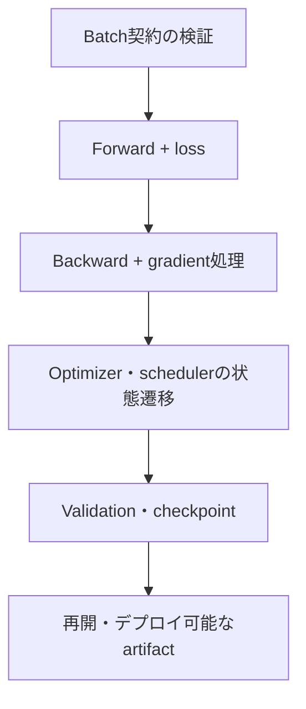



PyTorchの学習コードを短く書くのは簡単だが、**中断後に正確に再開でき、検証時に気付かないうちに状態が変わらず、単一GPUから複数GPUまで同じ意味を保つループ**を作るのは難しい。モデル構造よりも、学習ループの小さなミスの方が実験結果を大きく歪めることも多い。

本稿では、特定のモデルではなく、ほとんどの教師あり学習コードに適用できる契約と検証ポイントを整理する。APIの詳細についてはインストールしたPyTorchリリースの公式ドキュメントを確認しつつ、設計原則はバージョンにかかわらず維持する。

## 1. 問題：実行できるコードと正しく学習するコードは異なる

次のコードは、構文としては自然である。

```python
for x, y in loader:
    prediction = model(x)
    loss = criterion(prediction, y)
    loss.backward()
    optimizer.step()
```

しかし、少なくとも次の問題が潜んでいる。

- `x`、`y`、モデルがそれぞれ異なるdeviceにある可能性がある。
- targetのshape・dtypeがloss関数の契約と異なる可能性がある。
- 前のstepのgradientが蓄積し続ける。
- validationでもdropoutとbatch normalizationが学習状態のままである。
- validation graphを作成してメモリを浪費する。
- 最後のbatchだけサイズが異なるのに、batch平均を再び単純平均する。
- mixed precisionでunderflow・overflowを処理しない。
- checkpointにモデルの重みしか含まれず、再開時にoptimizerのダイナミクスが変わる。
- `DataLoader`のsplitまたはtransformで検証データの漏洩が起きる。
- 性能上のボトルネックがモデルなのか入力pipelineなのかを測定しない。

### 気付きにくい誤りは例外より危険である

Deviceの不一致は通常すぐ例外になるが、shape broadcastingや誤ったtarget dtypeは、実行されたまま別の目的関数を最適化してしまう可能性がある。たとえば、`[B, 1]`の予測から`[B]`のtargetを引くと、意図しない`[B, B]`の演算が生じる場合がある。

したがって、「最初のbatchが通った」ことではなく、**batchの契約を明示し、すぐ失敗させること**が重要である。

### Validation lossも集計方法によって変わる

各batch lossがbatch平均であり、最後のbatchサイズが小さい場合：

\[
\frac{1}{K}\sum_{k=1}^{K}\ell_k
\neq
\frac{\sum_k n_k\ell_k}{\sum_k n_k}
\]

サンプル平均が必要なら、batchサイズで重み付けしなければならない。token・pixel・有効マスク単位の損失なら、分母をその有効要素数に合わせる。

## 2. Mental model：学習ループは状態遷移システムである

学習状態を次のタプルとして捉える。

\[
S_t=(\theta_t,\;o_t,\;q_t,\;g_t,\;e_t,\;b_t,\;r_t,\;c)
\]

- \(\theta_t\)：モデルのパラメータとbuffer
- \(o_t\)：optimizerの状態
- \(q_t\)：schedulerの状態
- \(g_t\)：AMP gradient scalerの状態
- \(e_t,b_t\)：epochとbatch/global step
- \(r_t\)：乱数生成器の状態
- \(c\)：データ・モデル・学習の設定

Checkpointは、この状態を復元できなければならない。モデルの重みだけを保存することは、「新しいoptimizerでfine-tuningを開始する」には十分な場合があるが、「中断地点から同一の学習を再開する」には不十分である。



### 三種類の状態を区別する

1. **モデル状態**：parameterとpersistent buffer
2. **学習状態**：optimizer momentum、scheduler、scaler、step
3. **実験状態**：config、split、seed、code/data version、best metric

三つの層がすべて揃って初めて、結果を説明し、再開できる。

### `train()/eval()`とgradient modeは別物である

- `model.train()`：dropout、batch normalizationなど、モジュールの動作を学習モードに設定
- `model.eval()`：該当モジュールを評価モードに設定
- `torch.no_grad()`：autogradの記録を無効化
- `torch.inference_mode()`：純粋な推論で、より強力な無効化と最適化が可能

`eval()`を呼び出すだけでもgradient graphが作られることがあり、`no_grad()`だけを使ってもモデルがtrain modeのままである可能性がある。Validationでは通常、`eval()`とgradientの無効化を併用する。

## 3. 実践workflow

### Step 1. データsplitを`DataLoader`より先に固定する

Train/validation/test splitはindexまたはmanifestとしてバージョン管理する。モデリングコードを実行するたびにランダムに分割し直さない。

原則：

- 同じ個体・時系列・事象から派生したサンプルがsplitをまたがない。
- 正規化・語彙・特徴選択はtrainだけにfitする。
- stochastic augmentationはtrainだけに適用する。
- validation/testの変換は決定論的で、意味が同じである。
- `shuffle=True`はtrainサンプルの順序を混ぜるだけであり、split自体を作るものではない。
- validation/testでは通常、`shuffle=False`、`drop_last=False`とする。

```python
train_set = Dataset(records, indices=split.train, transform=train_transform)
valid_set = Dataset(records, indices=split.valid, transform=eval_transform)

train_loader = DataLoader(
    train_set,
    batch_size=config.batch_size,
    shuffle=True,
    drop_last=config.drop_last_train,
    num_workers=config.num_workers,
    pin_memory=config.pin_memory,
    generator=train_generator,
    worker_init_fn=seed_worker,
)

valid_loader = DataLoader(
    valid_set,
    batch_size=config.eval_batch_size,
    shuffle=False,
    drop_last=False,
    num_workers=config.num_workers,
    pin_memory=config.pin_memory,
)
```

`drop_last=True`はbatch normalizationや固定shapeのために必要となる場合があるが、epochごとに一部のtrainサンプルを捨てることを記録しておく。Validationで使用すると、評価サンプルが欠落する。

### Step 2. Shape・dtype・deviceの契約をコードにする

一つのBatch adapterにdeviceへの移動と形式の正規化を担当させる。

```python
from dataclasses import dataclass

@dataclass
class Batch:
    inputs: torch.Tensor
    targets: torch.Tensor
    sample_ids: list[str]

def prepare_batch(raw, device) -> Batch:
    x, y, sample_ids = raw

    x = x.to(device=device, dtype=torch.float32, non_blocking=True)
    y = y.to(device=device, dtype=torch.long, non_blocking=True)

    if x.ndim != 4:
        raise ValueError(f"expected inputs [B,C,H,W], got {tuple(x.shape)}")
    if y.ndim != 1 or y.shape[0] != x.shape[0]:
        raise ValueError(f"expected targets [B], got {tuple(y.shape)}")
    if not torch.isfinite(x).all():
        raise ValueError("non-finite input")

    return Batch(x, y, sample_ids)
```

ここで`[B,C,H,W]`と`long`は、多クラス画像分類の例である。問題ごとに契約を変える必要がある。

| 問題 | 一般的な出力 | 一般的なtarget |
|---|---|---|
| 多クラス | `[B, C]`, float | `[B]`, integer class index |
| 二値logit | `[B]`または`[B,1]`, float | 出力と同じshapeのfloat |
| 回帰 | 定義した連続shape, float | 厳密に互換性のあるfloat |
| シーケンス | `[B,T,...]`またはモデルの契約 | mask・paddingの規則を含む |

Loss関数がlogitsを想定しているのか、probabilityを想定しているのかも確認する。数値的に安定した結合lossに、probability変換を重複して適用してはならない。

開発初期には、最初のbatchで次の内容を出力・検証する。

- shape、dtype、device
- min/max/meanとfiniteの割合
- targetの範囲・class count
- maskの有効要素数
- モデル出力のshape
- lossがfiniteであるか

stepごとの大規模な同期検査は遅くなる可能性があるため、安定後は定期的な検査とエラーhookに調整する。

### Step 3. Forwardとloss計算を一つの関数に限定する

Trainとvalidationが、気付かないうちに異なる前処理・lossを使わないよう共通化する。

```python
def forward_loss(model, batch, criterion):
    output = model(batch.inputs)

    if output.ndim != 2 or output.shape[0] != batch.targets.shape[0]:
        raise ValueError("model output violates [B,C] contract")

    loss = criterion(output, batch.targets)
    if loss.ndim != 0:
        raise ValueError("criterion must return a scalar loss")

    return output, loss
```

学習指標を計算するとき、graphがつながり続けないように`loss.detach()`または`loss.item()`を使用する。GPU tensorの`.item()`は同期を発生させる可能性があるため、micro-batchごとに過剰に呼び出さず、適切に集計する。

### Step 4. Autogradとgradientのライフサイクルを明確にする

基本的な順序：

1. 前のgradientを初期化
2. forward
3. scalar lossを計算
4. backward
5. 任意のgradient検査・clipping
6. optimizer step

```python
optimizer.zero_grad(set_to_none=True)
output, loss = forward_loss(model, batch, criterion)
loss.backward()
gradient_norm = torch.nn.utils.clip_grad_norm_(model.parameters(), max_norm)
optimizer.step()
```

`set_to_none=True`はメモリ操作を減らせるほか、gradientがなかったparameterを区別するうえでも有用である。ただし、custom codeが`.grad`を常にtensorだと仮定している場合は修正する必要がある。

`backward()`はデフォルトでgradientを**蓄積**する。Gradient accumulationを意図していないなら、optimizer stepの前に必ず初期化する。

#### Gradient accumulation

```python
optimizer.zero_grad(set_to_none=True)

for micro_step, raw in enumerate(train_loader):
    batch = prepare_batch(raw, device)
    output, loss = forward_loss(model, batch, criterion)
    (loss / accumulation_steps).backward()

    if (micro_step + 1) % accumulation_steps == 0:
        torch.nn.utils.clip_grad_norm_(model.parameters(), max_norm)
        optimizer.step()
        optimizer.zero_grad(set_to_none=True)
```

最後のmicro-batchのまとまりが`accumulation_steps`に満たない場合もstepするよう処理する。単純にlossを固定値で割ると、最後のまとまりの有効scaleが変わる可能性があるため、実際のmicro-batch数または有効要素数を反映する。

Batch normalization、schedulerのstep数、regularizationの実装は、大きなbatchとgradient accumulationで意味が同じにならない場合がある。

### Step 5. AMPで演算と状態の順序を守る

CUDA mixed precisionの一般的な構造は次のとおり。

```python
use_amp = device.type == "cuda" and config.use_amp
scaler = torch.amp.GradScaler("cuda", enabled=use_amp)

optimizer.zero_grad(set_to_none=True)

with torch.amp.autocast("cuda", enabled=use_amp):
    output, loss = forward_loss(model, batch, criterion)

scaler.scale(loss).backward()
scaler.unscale_(optimizer)

grad_norm = torch.nn.utils.clip_grad_norm_(model.parameters(), config.max_grad_norm)
scaler.step(optimizer)
scaler.update()
```

重要な原則：

- autocastはforwardとlossの計算に使用する。
- backwardをautocast context内で実行する必要はない。
- gradient clippingの前に`unscale_`する。
- `scaler.step()`はoverflowがある場合、optimizer stepをスキップすることがある。
- scaler stateもcheckpointに保存する。
- すべての演算が低精度で安全とは限らないため、non-finiteと精度を検証する。

CPUまたは他のacceleratorにおけるautocastの使用方法と対応dtypeは、環境・バージョンによって異なる。device typeをハードコードした例をそのままコピーせず、インストール環境で確認する。

### Step 6. Train epochで合計と分母を分ける

```python
def train_one_epoch(model, loader, optimizer, criterion, device, scaler, config):
    model.train()
    loss_sum = 0.0
    sample_count = 0

    optimizer.zero_grad(set_to_none=True)

    for step, raw in enumerate(loader):
        batch = prepare_batch(raw, device)
        batch_size = batch.targets.shape[0]

        with torch.amp.autocast(device.type, enabled=scaler.is_enabled()):
            output, loss = forward_loss(model, batch, criterion)
            scaled_for_accumulation = loss / config.accumulation_steps

        scaler.scale(scaled_for_accumulation).backward()

        should_step = (
            (step + 1) % config.accumulation_steps == 0
            or (step + 1) == len(loader)
        )

        if should_step:
            scaler.unscale_(optimizer)
            torch.nn.utils.clip_grad_norm_(model.parameters(), config.max_grad_norm)
            scaler.step(optimizer)
            scaler.update()
            optimizer.zero_grad(set_to_none=True)

        loss_sum += loss.detach().double().item() * batch_size
        sample_count += batch_size

    return {"loss": loss_sum / sample_count}
```

この例は理解するための骨組みである。Variable-length sequenceのようにbatch lossの分母がtoken数なら、`batch_size`の代わりに有効token数を使用する。最後のaccumulationのまとまりについても、正確なloss scalingを実際のmicro-batch数に合わせて補正する。

### Step 7. Validationは状態を保全し、決定論的に集計する

```python
@torch.inference_mode()
def evaluate(model, loader, criterion, device, use_amp):
    was_training = model.training
    model.eval()

    loss_sum = 0.0
    sample_count = 0
    predictions = []
    targets = []

    for raw in loader:
        batch = prepare_batch(raw, device)

        with torch.amp.autocast(device.type, enabled=use_amp):
            output, loss = forward_loss(model, batch, criterion)

        n = batch.targets.shape[0]
        loss_sum += loss.double().item() * n
        sample_count += n
        predictions.append(output.float().cpu())
        targets.append(batch.targets.cpu())

    if was_training:
        model.train()

    return {
        "loss": loss_sum / sample_count,
        "output": torch.cat(predictions),
        "target": torch.cat(targets),
    }
```

注意点：

- 評価関数の終了後にtrain modeを復元することを明示する。
- 予測全体をメモリに集められない規模なら、metricの十分統計量だけを累積する。
- 分散評価では、すべてのrankの合計・分母をreduceした後でmetricを計算する。
- 順位ベースのmetricのように全予測が必要な場合、重複のないgather戦略を設計する。
- Validationでstochastic augmentationやtrain samplerを再利用しない。

### Step 8. Schedulerの時間単位を明示する

Schedulerをいつstepするかは、アルゴリズムの意味の一部である。

- optimizer updateごと
- epochごと
- validation metricの計算後

Gradient accumulationを使用すると、batch数とoptimizer update数は異なる。updateベースのschedulerは、実際の`global_step`に合わせる。AMP overflowによってoptimizer stepがスキップされた場合、schedulerも一緒に進めるかどうかの方針を定める。

```python
if optimizer_was_updated:
    update_scheduler.step()

# 또는 epoch 평가 후
metric_scheduler.step(validation_metric)
```

Schedulerの種類によって呼び出し順序と引数が異なるため、一つの慣習をすべてのschedulerに適用してはならない。

### Step 9. Checkpointで「再開状態」と「最高モデル」を分ける

推奨するcheckpointの内容：

```python
def checkpoint_payload(
    model, optimizer, scheduler, scaler,
    epoch, global_step, best_metric, config, split_id
):
    base_model = model.module if hasattr(model, "module") else model

    return {
        "format_version": 2,
        "model": base_model.state_dict(),
        "optimizer": optimizer.state_dict(),
        "scheduler": None if scheduler is None else scheduler.state_dict(),
        "scaler": None if scaler is None else scaler.state_dict(),
        "epoch": epoch,
        "global_step": global_step,
        "best_metric": best_metric,
        "config": config.to_dict(),
        "split_id": split_id,
        "rng": {
            "python": random.getstate(),
            "numpy": np.random.get_state(),
            "torch_cpu": torch.get_rng_state(),
            "torch_cuda": (
                torch.cuda.get_rng_state_all() if torch.cuda.is_available() else None
            ),
        },
    }
```

追加metadata：

- コードのcommitとdirty状態
- データ・ラベル・特徴量のバージョン
- PyTorch・CUDA・依存関係・ハードウェア情報
- metricの定義と評価結果
- モデルのinput/output signature
- 保存時刻とcheckpoint checksum

二つの目的に応じてファイルを分ける。

- `last`：障害後、最新状態から再開
- `best`：定められたvalidation基準で最良のデプロイ候補

`best`を選ぶmetricの方向、tieの処理、最小改善幅を明示する。Test metricでbest checkpointを選ぶとtestデータの漏洩になる。

#### アトミックな保存

Checkpointを一時ファイルに完全に書き込んでから、アトミックに名前を変更する。保存中にプロセスが終了し、不完全なファイルが最新checkpointを上書きするのを防ぐ。複数のrankが同じファイルへ同時に書き込まず、通常はrank 0だけが保存する。

#### ロード後の検証

```python
state = torch.load(path, map_location=device, weights_only=False)
model.load_state_dict(state["model"], strict=True)
optimizer.load_state_dict(state["optimizer"])

if scheduler is not None:
    scheduler.load_state_dict(state["scheduler"])
if scaler is not None and state["scaler"] is not None:
    scaler.load_state_dict(state["scaler"])

assert state["config"] == expected_config
assert state["split_id"] == expected_split_id
```

信頼できないcheckpointを通常のシリアライズオブジェクトとしてロードしてはならない。重み専用の安全なロード、artifactの署名・checksum、アクセス制御を使用する。

Optimizer state tensorのdevice移動、schedulerの作成・ロード順序などは、optimizerとバージョンに応じて確認する。Resume testでは、実際に数stepの学習–保存–新しいプロセスでのロード–学習継続を自動比較する必要がある。

### Step 10. 再現性を統計的な契約として管理する

Seedを一度設定するだけでは十分でない。

```python
def seed_everything(seed):
    random.seed(seed)
    np.random.seed(seed)
    torch.manual_seed(seed)
    if torch.cuda.is_available():
        torch.cuda.manual_seed_all(seed)
```

追加の考慮事項：

- `DataLoader` workerのseed
- samplerのepochごとのseed
- ランダムaugmentation
- 分散rankごとのseed方針
- 非決定的なaccelerator kernel
- ライブラリ・ドライバー・ハードウェアの差異
- マルチスレッドreductionの順序

Deterministic algorithmを強制すると、対応していない演算が例外を発生させたり、低速になったりする場合がある。開発・回帰テストでは厳格モード、大規模学習では複数のseedでmetricの範囲を再現するモードを使用できる。

必ず記録するもの：

\[
\text{結果} = \text{平均} \pm \text{シード・分割・実行の変動}
\]

一つのseedにおける小さな改善だけを根拠にモデルを選択しない。

### Step 11. Profilingは推測する前に測定する

スループット低下を次の区間に分解する。

- データの読み込み・decode・augmentation
- host-to-device copy
- forward
- loss
- backward
- optimizer
- 通信・同期
- logging・checkpoint

まず低コストの指標を見る。

- samplesまたはtokens per second
- GPU utilizationとmemory
- DataLoader wait time
- step timeの平均・上位分位点
- 通信時間
- checkpoint pause

詳細なprofilerはwarm-upを設け、短い代表的な区間で使用する。すべてのstepを詳細にtraceすると、それ自体のoverheadと大容量のログがボトルネックになる。

よくあるボトルネック：

- Python単位の小さな演算の反復
- stepごとの`.item()`・CPU出力による同期
- 小さなbatchと低い演算集約度
- 遅いstorage・過剰なaugmentation
- `num_workers`・prefetch・pinningの不適切な組み合わせ
- 不要なtensor copyとdtype変換
- 分散環境でのload imbalance

最適化の前後には、精度・再現性の回帰テストを再実行する。

### Step 12. DDPではデータと状態の対称性を保つ

分散データ並列化の基本的なmental modelは、**プロセスごとに一つのモデルreplicaとdeviceを持ち**、backward中にgradientを同期することである。

重要な原則：

- 各プロセスに正しいlocal deviceを指定する。
- モデルをdeviceへ移動してからDDP wrapperを適用する。
- trainにはdistributed samplerを使用する。
- epochごとに`sampler.set_epoch(epoch)`でshuffleの順序を変える。
- 全体のbatch sizeは`per_rank_batch × world_size × accumulation`の影響を受ける。
- rank 0だけがログ・checkpointを書き込むが、metricは全rankで集計する。
- すべてのrankが同じ順序でcollectiveに参加する。
- 一つのrankの条件分岐がbackward graphを変えると、hang・エラーが発生する可能性がある。

```python
sampler = DistributedSampler(train_set, shuffle=True, drop_last=False)
loader = DataLoader(train_set, sampler=sampler, shuffle=False, ...)

for epoch in range(start_epoch, max_epochs):
    sampler.set_epoch(epoch)
    train_one_epoch(...)
```

Validation samplerがdatasetをworld sizeに合わせる際、一部のサンプルを重複してpaddingする場合がある。正確な評価が必要なら、重複するsample IDを削除するか、重複のない分割samplerを使用する。

Batch sizeが大きくなると、最適化のダイナミクスが変わる。DDPが単一GPUコードより高速だからといって、同じhyperparameterで同じモデルを作るという意味ではない。Learning rate、warmup、batch normalization、schedulerを再検証する。

### Step 13. 最小限の自動テスト一式を用意する

#### Batch contract test

- 正常なbatchが通過する
- 誤ったshape・dtype・NaNが即座に失敗する
- 最後の小さなbatchが通過する

#### Overfit-small-batch test

非常に小さな固定batchを繰り返し、lossが十分に減少するかを確認する。失敗した場合は、モデル容量より先にデータ–loss–gradientの接続を疑う。

#### Gradient test

- 主要なparameterにgradientが存在する
- gradientがfiniteである
- 意図的にfrozenにしたlayerにはgradientがない
- clipping前後のnormを確認する

#### Evaluation purity test

- Validationの前後でmodel parameter・bufferが意図せず変わらない
- 同じcheckpoint・入力から許容誤差内で同一の出力が得られる
- train/validation transformが分離されている

#### Resume equivalence test

固定条件のもとで：

1. \(N\) stepを連続して学習
2. \(K\) stepを学習後に保存し、新しいプロセスでロードして、\(N-K\) stepを学習
3. parameter・optimizer・metricを許容誤差内で比較

#### AMP/DDP parity test

- full precisionに対するmetricの許容範囲
- 1-rank DDPと単一プロセスの結果を比較
- 複数rankでのサンプルの欠落・重複とmetric集計を確認

## 4. 評価・検証checklist

### データと契約

- [ ] split manifestが固定され、個体・時間の漏洩がない。
- [ ] trainにfitした前処理だけをvalidation/testに適用する。
- [ ] trainとeval transformが分離されている。
- [ ] input、target、mask、outputのshape・dtype契約がある。
- [ ] すべてのtensorとモデルのdevice移動が一か所で管理されている。
- [ ] NaN/Inf、targetの範囲、有効要素数を検査する。
- [ ] 最後の小さなbatchとbatch size 1をテストした。

### 学習loopとautograd

- [ ] `model.train()`と`model.eval()`の切り替えが明示的である。
- [ ] Validationでgradientの記録を無効化する。
- [ ] `zero_grad`の位置とgradient accumulationの意図が明確である。
- [ ] Lossのreductionとmetricの分母が一致する。
- [ ] logging tensorがgraphを長時間保持しない。
- [ ] 主要なparameterにgradientが存在し、finiteであることを確認する。
- [ ] Gradient clippingではnormと閾値を記録する。

### AMPとscheduler

- [ ] AMPの精度・スループット・メモリをfull precisionと比較した。
- [ ] clippingの前にscaled gradientをunscaleする。
- [ ] scaler stateをcheckpointに保存・復元する。
- [ ] overflowとskipped optimizer stepを監視する。
- [ ] schedulerがbatch・update・epoch・metricのどの単位かを明示した。
- [ ] accumulationとskipped stepがschedulerの意味を損なわない。

### Checkpointと再開

- [ ] model、optimizer、scheduler、scaler stateを保存する。
- [ ] epoch、global step、best metric、config、split IDを保存する。
- [ ] Python・NumPy・PyTorch・acceleratorのRNG stateを考慮した。
- [ ] コード・データ・環境のバージョンとchecksumがある。
- [ ] `last`と`best` checkpointの目的が区別されている。
- [ ] アトミックな保存と破損検査を使用する。
- [ ] 新しいプロセスでresume equivalence testに合格した。
- [ ] 信頼できないcheckpointのロードを制限する。

### 再現性・性能・分散

- [ ] seedだけでなくworker・sampler・kernelの非決定性も記録する。
- [ ] 複数のseedで結果の分散を確認した。
- [ ] samples/tokens per secondとstep timeを測定する。
- [ ] 短い代表区間をprofilerで分析した。
- [ ] rankごとのdevice・sampler・batch数が正しい。
- [ ] DDP train samplerでepochごとに`set_epoch`を呼び出す。
- [ ] 全rankのmetricを正確な分母で集計する。
- [ ] Validationで重複してpaddingされたサンプルを処理する。
- [ ] rank 0専用の書き込みとcollectiveの順序が安全である。

### 最小品質gate

- [ ] 単純なbaselineより優れている。
- [ ] 小さなbatchのoverfit testに合格する。
- [ ] train lossとvalidation metricの方向が妥当である。
- [ ] 学習・評価中にnon-finiteが発生しない。
- [ ] best modelの選択にtest setを使用しない。
- [ ] モデルartifactを再ロードして同一の評価を再現する。
- [ ] 推論signatureと前処理が学習契約と一致する。

## 5. 限界と注意点

第一に、完全なbitwise再現は、PyTorchのバージョン、プラットフォーム、ドライバー、ハードウェアが変わると保証が難しい。環境を記録し、予測・metricの許容誤差によって再現性の水準を明示する必要がある。

第二に、AMPとDDPは学習を高速化できるが、自動的に正しくするものではない。精度とglobal batchの変化が最適化経路を変えるため、個別の検証が必要である。

第三に、checkpointにすべての状態を含めても、外部data iteratorの正確な途中位置、非同期augmentation、分散workerの状態まで完全に再開するのは難しい。厳密なstep-levelでの再開が必要なのか、epoch境界での再開で十分なのか、契約を定める。

第四に、多数のassertionとprofilingは安定性を高める一方、スループットを低下させる。開発・回帰検証の厳格モードと運用学習の軽量監視モードを区別しつつ、中核となる契約は無効化しない。

最後に、堅牢な学習ループは、良質なデータと正しい評価設計の代わりにはならない。誤ったsplitとラベルを完璧に再現すれば、誤った結論をより安定して繰り返すだけである。
