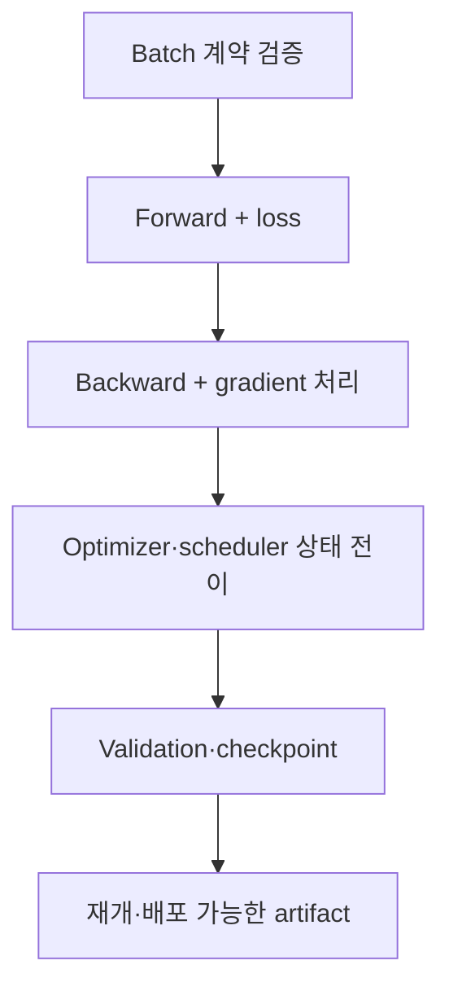

PyTorch 학습 코드는 짧게 만들기 쉽지만, **중단 후 정확히 재개되고 검증 시 조용히 상태가 바뀌지 않으며 단일 GPU에서 다중 GPU까지 같은 의미를 유지하는 루프**를 만들기는 어렵다. 모델 구조보다 학습 루프의 작은 실수가 실험 결과를 더 크게 왜곡할 때도 많다.

이 글은 특정 모델이 아니라 대부분의 지도학습 코드에 적용할 수 있는 계약과 검증 지점을 정리한다. API 세부는 설치한 PyTorch 릴리스의 공식 문서를 확인하되, 설계 원칙은 버전과 무관하게 유지한다.

## 1. 문제: 실행되는 코드와 올바르게 학습하는 코드는 다르다

다음 코드는 문법적으로는 자연스럽다.

```python
for x, y in loader:
    prediction = model(x)
    loss = criterion(prediction, y)
    loss.backward()
    optimizer.step()
```

하지만 최소한 다음 문제가 숨어 있다.

- `x`, `y`, 모델이 서로 다른 device에 있을 수 있다.
- target shape·dtype이 loss 함수의 계약과 다를 수 있다.
- 이전 step의 gradient가 계속 누적된다.
- validation에서도 dropout과 batch normalization이 훈련 상태다.
- validation graph를 만들어 메모리를 낭비한다.
- 마지막 batch의 크기가 다른데 batch 평균을 다시 단순 평균한다.
- mixed precision에서 underflow·overflow를 처리하지 않는다.
- checkpoint가 모델 가중치만 담아 재개 시 optimizer 동역학이 바뀐다.
- `DataLoader` split 또는 transform에서 검증 누수가 생긴다.
- 성능 병목이 모델인지 입력 pipeline인지 측정하지 않는다.

### 조용한 오류가 예외보다 위험하다

Device 불일치는 보통 즉시 예외가 나지만, shape broadcasting과 잘못된 target dtype은 실행되면서 다른 목적함수를 최적화할 수 있다. 예를 들어 `[B, 1]` 예측과 `[B]` target을 빼면 의도치 않은 `[B, B]` 연산이 생길 수 있다.

따라서 “첫 batch가 통과했다”가 아니라 **batch 계약을 명시하고 실패를 빠르게 만드는 것**이 중요하다.

### Validation loss도 집계 방식에 따라 달라진다

각 batch loss가 batch 평균이고 마지막 batch 크기가 작을 때:

\[
\frac{1}{K}\sum_{k=1}^{K}\ell_k
\neq
\frac{\sum_k n_k\ell_k}{\sum_k n_k}
\]

샘플 평균을 원하면 batch 크기로 가중해야 한다. token·pixel·유효 마스크 단위 손실이라면 분모를 그 유효 원소 수로 맞춘다.

## 2. Mental model: 학습 루프는 상태 전이 시스템이다

학습 상태를 다음 튜플로 본다.

\[
S_t=(\theta_t,\;o_t,\;q_t,\;g_t,\;e_t,\;b_t,\;r_t,\;c)
\]

- \(\theta_t\): 모델 파라미터와 buffer
- \(o_t\): optimizer 상태
- \(q_t\): scheduler 상태
- \(g_t\): AMP gradient scaler 상태
- \(e_t,b_t\): epoch와 batch/global step
- \(r_t\): 난수 생성기 상태
- \(c\): 데이터·모델·학습 설정

Checkpoint는 이 상태를 복원할 수 있어야 한다. 모델 가중치만 저장하는 것은 “새 optimizer로 fine-tuning 시작”에는 충분할 수 있지만 “중단 지점부터 동일 학습 재개”에는 부족하다.



### 세 종류의 상태를 구분한다

1. **모델 상태**: parameter와 persistent buffer
2. **학습 상태**: optimizer momentum, scheduler, scaler, step
3. **실험 상태**: config, split, seed, code/data version, best metric

세 층이 모두 있어야 결과를 설명하고 재개할 수 있다.

### `train()/eval()`과 gradient mode는 별개다

- `model.train()`: dropout, batch normalization 등 모듈 동작을 훈련 모드로 설정
- `model.eval()`: 해당 모듈을 평가 모드로 설정
- `torch.no_grad()`: autograd 기록을 비활성화
- `torch.inference_mode()`: 순수 추론에서 더 강한 비활성화와 최적화 가능

`eval()`만 호출해도 gradient graph는 만들어질 수 있고, `no_grad()`만 써도 모델은 train mode일 수 있다. Validation에서는 보통 `eval()`과 gradient 비활성화를 함께 사용한다.

## 3. 실전 workflow

### Step 1. 데이터 split을 `DataLoader`보다 먼저 고정한다

Train/validation/test split은 index 또는 manifest로 버전 관리한다. 모델링 코드를 재실행할 때마다 임의로 다시 나누지 않는다.

원칙:

- 같은 개체·시계열·사건의 파생 표본이 split을 넘지 않는다.
- 정규화·사전·특징 선택은 train에만 fit한다.
- stochastic augmentation은 train에만 적용한다.
- validation/test의 변환은 결정론적이고 의미가 동일하다.
- `shuffle=True`는 train 표본 순서만 섞지 split 자체를 만들지 않는다.
- validation/test는 일반적으로 `shuffle=False`, `drop_last=False`다.

```python
train_set = Dataset(records, indices=split.train, transform=train_transform)
valid_set = Dataset(records, indices=split.valid, transform=eval_transform)

train_loader = DataLoader(
    train_set,
    batch_size=config.batch_size,
    shuffle=True,
    drop_last=config.drop_last_train,
    num_workers=config.num_workers,
    pin_memory=config.pin_memory,
    generator=train_generator,
    worker_init_fn=seed_worker,
)

valid_loader = DataLoader(
    valid_set,
    batch_size=config.eval_batch_size,
    shuffle=False,
    drop_last=False,
    num_workers=config.num_workers,
    pin_memory=config.pin_memory,
)
```

`drop_last=True`는 batch normalization이나 고정 shape 때문에 필요할 수 있지만, 매 epoch 일부 train 표본을 버린다는 점을 기록한다. Validation에서 사용하면 평가 표본이 누락된다.

### Step 2. Shape·dtype·device 계약을 코드로 만든다

Batch adapter 하나가 device 이동과 형식 정규화를 담당하게 한다.

```python
from dataclasses import dataclass

@dataclass
class Batch:
    inputs: torch.Tensor
    targets: torch.Tensor
    sample_ids: list[str]

def prepare_batch(raw, device) -> Batch:
    x, y, sample_ids = raw

    x = x.to(device=device, dtype=torch.float32, non_blocking=True)
    y = y.to(device=device, dtype=torch.long, non_blocking=True)

    if x.ndim != 4:
        raise ValueError(f"expected inputs [B,C,H,W], got {tuple(x.shape)}")
    if y.ndim != 1 or y.shape[0] != x.shape[0]:
        raise ValueError(f"expected targets [B], got {tuple(y.shape)}")
    if not torch.isfinite(x).all():
        raise ValueError("non-finite input")

    return Batch(x, y, sample_ids)
```

여기서 `[B,C,H,W]`와 `long`은 다중 클래스 영상 분류의 예시다. 문제마다 계약을 바꿔야 한다.

| 문제 | 일반적인 출력 | 일반적인 target |
|---|---|---|
| 다중 클래스 | `[B, C]`, float | `[B]`, integer class index |
| 이진 logit | `[B]` 또는 `[B,1]`, float | 출력과 같은 shape의 float |
| 회귀 | 정의한 연속 shape, float | 정확히 호환되는 float |
| 시퀀스 | `[B,T,...]` 또는 모델 계약 | mask·padding 규칙 포함 |

Loss 함수가 logits를 기대하는지 probability를 기대하는지도 확인한다. 수치적으로 안정적인 결합 loss에 probability 변환을 중복 적용하면 안 된다.

개발 초기에는 첫 batch에서 다음을 출력·검증한다.

- shape, dtype, device
- min/max/mean과 finite 비율
- target 범위·class count
- mask의 유효 원소 수
- 모델 출력 shape
- loss가 finite인지

매 step의 대용량 동기화 검사는 느릴 수 있으므로, 안정화 후에는 주기적 검사와 오류 hook으로 조정한다.

### Step 3. Forward와 loss 계산을 한 함수로 제한한다

Train과 validation이 서로 다른 전처리·loss를 조용히 쓰지 않게 공유한다.

```python
def forward_loss(model, batch, criterion):
    output = model(batch.inputs)

    if output.ndim != 2 or output.shape[0] != batch.targets.shape[0]:
        raise ValueError("model output violates [B,C] contract")

    loss = criterion(output, batch.targets)
    if loss.ndim != 0:
        raise ValueError("criterion must return a scalar loss")

    return output, loss
```

학습 지표를 계산할 때 graph가 계속 붙지 않도록 `loss.detach()` 또는 `loss.item()`을 사용한다. GPU tensor의 `.item()`은 동기화를 일으킬 수 있으므로 매 micro-batch마다 과도하게 호출하지 않고 적절히 집계한다.

### Step 4. Autograd와 gradient 수명 주기를 명확히 한다

기본 순서:

1. 이전 gradient 초기화
2. forward
3. scalar loss 계산
4. backward
5. 선택적 gradient 검사·clipping
6. optimizer step

```python
optimizer.zero_grad(set_to_none=True)
output, loss = forward_loss(model, batch, criterion)
loss.backward()
gradient_norm = torch.nn.utils.clip_grad_norm_(model.parameters(), max_norm)
optimizer.step()
```

`set_to_none=True`는 메모리 작업을 줄일 수 있고, gradient가 없었던 parameter를 구분하는 데도 유용하다. 다만 custom code가 `.grad`를 항상 tensor라고 가정하면 수정해야 한다.

`backward()`는 기본적으로 gradient를 **누적**한다. Gradient accumulation을 의도하지 않았다면 매 optimizer step 전에 반드시 초기화한다.

#### Gradient accumulation

```python
optimizer.zero_grad(set_to_none=True)

for micro_step, raw in enumerate(train_loader):
    batch = prepare_batch(raw, device)
    output, loss = forward_loss(model, batch, criterion)
    (loss / accumulation_steps).backward()

    if (micro_step + 1) % accumulation_steps == 0:
        torch.nn.utils.clip_grad_norm_(model.parameters(), max_norm)
        optimizer.step()
        optimizer.zero_grad(set_to_none=True)
```

마지막 micro-batch 묶음이 `accumulation_steps`에 못 미치는 경우도 step하도록 처리한다. 단순히 loss를 고정 값으로 나누면 마지막 묶음의 유효 scale이 달라질 수 있으므로 실제 micro-batch 수 또는 유효 원소 수를 반영한다.

Batch normalization, scheduler step 수, regularization 구현은 큰 batch와 gradient accumulation에서 의미가 같지 않을 수 있다.

### Step 5. AMP에서 연산과 상태의 순서를 지킨다

CUDA mixed precision의 일반적인 구조는 다음과 같다.

```python
use_amp = device.type == "cuda" and config.use_amp
scaler = torch.amp.GradScaler("cuda", enabled=use_amp)

optimizer.zero_grad(set_to_none=True)

with torch.amp.autocast("cuda", enabled=use_amp):
    output, loss = forward_loss(model, batch, criterion)

scaler.scale(loss).backward()
scaler.unscale_(optimizer)

grad_norm = torch.nn.utils.clip_grad_norm_(model.parameters(), config.max_grad_norm)
scaler.step(optimizer)
scaler.update()
```

핵심 원칙:

- autocast는 forward와 loss 계산에 사용한다.
- backward를 autocast context 안에서 실행할 필요는 없다.
- gradient clipping 전에 `unscale_`한다.
- `scaler.step()`은 overflow가 있으면 optimizer step을 건너뛸 수 있다.
- scaler state도 checkpoint에 저장한다.
- 모든 연산이 낮은 정밀도에 안전한 것은 아니므로 non-finite와 정확도를 검증한다.

CPU 또는 다른 accelerator의 autocast 사용법과 지원 dtype은 환경·버전에 따라 다르다. device type을 하드코딩한 예제를 그대로 복사하지 말고 설치 환경에서 확인한다.

### Step 6. Train epoch에서 합계와 분모를 분리한다

```python
def train_one_epoch(model, loader, optimizer, criterion, device, scaler, config):
    model.train()
    loss_sum = 0.0
    sample_count = 0

    optimizer.zero_grad(set_to_none=True)

    for step, raw in enumerate(loader):
        batch = prepare_batch(raw, device)
        batch_size = batch.targets.shape[0]

        with torch.amp.autocast(device.type, enabled=scaler.is_enabled()):
            output, loss = forward_loss(model, batch, criterion)
            scaled_for_accumulation = loss / config.accumulation_steps

        scaler.scale(scaled_for_accumulation).backward()

        should_step = (
            (step + 1) % config.accumulation_steps == 0
            or (step + 1) == len(loader)
        )

        if should_step:
            scaler.unscale_(optimizer)
            torch.nn.utils.clip_grad_norm_(model.parameters(), config.max_grad_norm)
            scaler.step(optimizer)
            scaler.update()
            optimizer.zero_grad(set_to_none=True)

        loss_sum += loss.detach().double().item() * batch_size
        sample_count += batch_size

    return {"loss": loss_sum / sample_count}
```

이 예시는 이해를 위한 뼈대다. Variable-length sequence처럼 batch loss의 분모가 token 수라면 `batch_size` 대신 유효 token 수를 사용한다. 마지막 accumulation 묶음의 정확한 loss scaling도 실제 micro-batch 수에 맞게 보완한다.

### Step 7. Validation은 상태를 보존하고 결정론적으로 집계한다

```python
@torch.inference_mode()
def evaluate(model, loader, criterion, device, use_amp):
    was_training = model.training
    model.eval()

    loss_sum = 0.0
    sample_count = 0
    predictions = []
    targets = []

    for raw in loader:
        batch = prepare_batch(raw, device)

        with torch.amp.autocast(device.type, enabled=use_amp):
            output, loss = forward_loss(model, batch, criterion)

        n = batch.targets.shape[0]
        loss_sum += loss.double().item() * n
        sample_count += n
        predictions.append(output.float().cpu())
        targets.append(batch.targets.cpu())

    if was_training:
        model.train()

    return {
        "loss": loss_sum / sample_count,
        "output": torch.cat(predictions),
        "target": torch.cat(targets),
    }
```

주의점:

- 평가 함수가 끝난 뒤 train mode 복원을 명시한다.
- 전체 예측을 메모리에 모을 수 없는 규모면 metric의 충분통계만 누적한다.
- 분산 평가에서는 모든 rank의 합계·분모를 reduce한 뒤 metric을 계산한다.
- 순위 기반 metric처럼 전체 예측이 필요한 경우 중복 없는 gather 전략을 설계한다.
- Validation에서 stochastic augmentation이나 train sampler를 재사용하지 않는다.

### Step 8. Scheduler의 시간 단위를 명시한다

Scheduler가 언제 step하는지는 알고리즘 의미의 일부다.

- optimizer update마다
- epoch마다
- validation metric이 계산된 뒤

Gradient accumulation을 쓰면 batch 수와 optimizer update 수가 다르다. update 기반 scheduler는 실제 `global_step`에 맞춘다. AMP overflow로 optimizer step이 건너뛰어진 경우 scheduler도 함께 진행할지 정책을 정한다.

```python
if optimizer_was_updated:
    update_scheduler.step()

# 또는 epoch 평가 후
metric_scheduler.step(validation_metric)
```

Scheduler 종류에 따라 호출 순서와 인수가 다르므로 하나의 관습을 모든 scheduler에 적용하지 않는다.

### Step 9. Checkpoint에 “재개 상태”와 “최고 모델”을 분리한다

권장 checkpoint 내용:

```python
def checkpoint_payload(
    model, optimizer, scheduler, scaler,
    epoch, global_step, best_metric, config, split_id
):
    base_model = model.module if hasattr(model, "module") else model

    return {
        "format_version": 2,
        "model": base_model.state_dict(),
        "optimizer": optimizer.state_dict(),
        "scheduler": None if scheduler is None else scheduler.state_dict(),
        "scaler": None if scaler is None else scaler.state_dict(),
        "epoch": epoch,
        "global_step": global_step,
        "best_metric": best_metric,
        "config": config.to_dict(),
        "split_id": split_id,
        "rng": {
            "python": random.getstate(),
            "numpy": np.random.get_state(),
            "torch_cpu": torch.get_rng_state(),
            "torch_cuda": (
                torch.cuda.get_rng_state_all() if torch.cuda.is_available() else None
            ),
        },
    }
```

추가 metadata:

- 코드 commit과 dirty 상태
- 데이터·레이블·특징 버전
- PyTorch·CUDA·의존성·하드웨어 정보
- metric 정의와 평가 결과
- 모델 input/output signature
- 저장 시각과 checkpoint checksum

두 목적의 파일을 구분한다.

- `last`: 장애 후 최신 상태에서 재개
- `best`: 정해진 validation 기준에서 가장 좋은 배포 후보

`best`를 고르는 metric의 방향, tie 처리, 최소 개선폭을 명시한다. Test metric으로 best checkpoint를 선택하면 test 누수다.

#### 원자적 저장

Checkpoint를 임시 파일에 완전히 쓴 뒤 원자적으로 이름을 바꾼다. 저장 중 프로세스가 죽어 반쪽 파일이 최신 checkpoint를 덮지 않게 한다. 여러 rank가 같은 파일에 동시에 쓰지 않고 보통 rank 0만 저장한다.

#### 로드 후 검증

```python
state = torch.load(path, map_location=device, weights_only=False)
model.load_state_dict(state["model"], strict=True)
optimizer.load_state_dict(state["optimizer"])

if scheduler is not None:
    scheduler.load_state_dict(state["scheduler"])
if scaler is not None and state["scaler"] is not None:
    scaler.load_state_dict(state["scaler"])

assert state["config"] == expected_config
assert state["split_id"] == expected_split_id
```

신뢰할 수 없는 checkpoint는 일반 직렬화 객체로 로드하지 않는다. 가중치 전용 안전 로딩, artifact 서명·checksum, 접근 통제를 사용한다.

Optimizer state tensor의 device 이동, scheduler 생성·로드 순서 등은 optimizer와 버전에 따라 확인한다. Resume test는 실제로 몇 step 학습–저장–새 프로세스 로드–계속 학습을 자동 비교해야 한다.

### Step 10. 재현성을 통계적 계약으로 관리한다

Seed를 한 번 설정하는 것만으로 충분하지 않다.

```python
def seed_everything(seed):
    random.seed(seed)
    np.random.seed(seed)
    torch.manual_seed(seed)
    if torch.cuda.is_available():
        torch.cuda.manual_seed_all(seed)
```

추가 고려사항:

- `DataLoader` worker seed
- sampler의 epoch별 seed
- 랜덤 augmentation
- 분산 rank별 seed 정책
- 비결정적 accelerator kernel
- 라이브러리·드라이버·하드웨어 차이
- 멀티스레드 reduction 순서

Deterministic algorithm을 강제하면 지원되지 않는 연산이 예외를 내거나 느려질 수 있다. 개발·회귀 테스트에서는 엄격 모드, 대규모 훈련에서는 여러 seed에서 metric 범위를 재현하는 모드를 쓸 수 있다.

반드시 기록할 것:

\[
\text{결과} = \text{평균} \pm \text{시드·분할·실행 변동}
\]

한 seed에서 작은 향상을 근거로 모델을 선택하지 않는다.

### Step 11. Profiling은 추측 전에 측정한다

처리량 저하를 다음 구간으로 분해한다.

- 데이터 읽기·decode·augmentation
- host-to-device copy
- forward
- loss
- backward
- optimizer
- 통신·동기화
- logging·checkpoint

먼저 저비용 지표를 본다.

- samples 또는 tokens per second
- GPU utilization과 memory
- DataLoader wait time
- step time의 평균·상위 분위
- 통신 시간
- checkpoint pause

정밀 profiler는 warm-up을 두고 짧은 대표 구간에서 사용한다. 모든 step을 상세 trace하면 자체 overhead와 대용량 로그가 병목이 된다.

흔한 병목:

- Python 단위의 작은 연산 반복
- 매 step `.item()`·CPU 출력으로 동기화
- 작은 batch와 낮은 연산 집약도
- 느린 storage·과도한 augmentation
- `num_workers`·prefetch·pinning의 부적절한 조합
- 불필요한 tensor copy와 dtype 변환
- 분산 환경의 load imbalance

최적화 전후에는 정확도·재현성 회귀 테스트를 다시 실행한다.

### Step 12. DDP에서는 데이터와 상태의 대칭성을 지킨다

분산 데이터 병렬화의 기본 mental model은 **프로세스당 하나의 모델 replica와 device**, backward 중 gradient 동기화다.

핵심 원칙:

- 각 프로세스에 올바른 local device를 지정한다.
- 모델을 device로 옮긴 뒤 DDP wrapper를 적용한다.
- train에는 distributed sampler를 사용한다.
- 매 epoch `sampler.set_epoch(epoch)`로 shuffle 순서를 바꾼다.
- 전체 batch size는 `per_rank_batch × world_size × accumulation`의 영향을 받는다.
- rank 0만 로그·checkpoint를 쓰되 metric은 전체 rank에서 집계한다.
- 모든 rank가 같은 순서로 collective에 참여한다.
- 한 rank의 조건부 branch가 backward graph를 바꾸면 hang·오류가 생길 수 있다.

```python
sampler = DistributedSampler(train_set, shuffle=True, drop_last=False)
loader = DataLoader(train_set, sampler=sampler, shuffle=False, ...)

for epoch in range(start_epoch, max_epochs):
    sampler.set_epoch(epoch)
    train_one_epoch(...)
```

Validation sampler가 dataset을 world size에 맞추며 일부 표본을 중복 padding할 수 있다. 정확한 평가가 필요하면 중복 sample ID를 제거하거나 중복 없는 분할 sampler를 사용한다.

Batch size가 커지면 최적화 동역학이 바뀐다. DDP가 단일 GPU 코드보다 빠르다고 해서 같은 hyperparameter에서 같은 모델을 만든다는 뜻은 아니다. Learning rate, warmup, batch normalization, scheduler를 재검증한다.

### Step 13. 최소 자동 테스트 묶음을 둔다

#### Batch contract test

- 정상 batch가 통과
- 잘못된 shape·dtype·NaN이 즉시 실패
- 마지막 작은 batch 통과

#### Overfit-small-batch test

아주 작은 고정 batch를 반복해 loss가 충분히 감소하는지 본다. 실패하면 모델 용량보다 데이터–loss–gradient 연결을 먼저 의심한다.

#### Gradient test

- 주요 parameter에 gradient가 존재
- gradient가 finite
- 의도적으로 frozen layer는 gradient 없음
- clipping 전후 norm 확인

#### Evaluation purity test

- Validation 전후 model parameter·buffer가 의도치 않게 변하지 않음
- 같은 checkpoint·입력에서 허용 오차 내 동일 출력
- train/validation transform 분리

#### Resume equivalence test

고정 조건에서:

1. \(N\) step 연속 학습
2. \(K\) step 학습 후 저장, 새 프로세스에서 로드, \(N-K\) step 학습
3. parameter·optimizer·metric을 허용 오차 내 비교

#### AMP/DDP parity test

- full precision 대비 metric 허용 범위
- 1-rank DDP와 단일 프로세스 결과 비교
- 다중 rank에서 표본 누락·중복과 metric 집계 확인

## 4. 평가·검증 checklist

### 데이터와 계약

- [ ] split manifest가 고정되고 개체·시간 누수가 없다.
- [ ] train에 fit한 전처리만 validation/test에 적용한다.
- [ ] train과 eval transform이 분리되어 있다.
- [ ] input, target, mask, output의 shape·dtype 계약이 있다.
- [ ] 모든 tensor와 모델의 device 이동이 한곳에서 관리된다.
- [ ] NaN/Inf, target 범위, 유효 원소 수를 검사한다.
- [ ] 마지막 작은 batch와 batch size 1을 테스트했다.

### 학습 loop와 autograd

- [ ] `model.train()`과 `model.eval()` 전환이 명시적이다.
- [ ] Validation에서 gradient 기록을 비활성화한다.
- [ ] `zero_grad`의 위치와 gradient accumulation 의도가 명확하다.
- [ ] Loss의 reduction과 metric 분모가 일치한다.
- [ ] logging tensor가 graph를 오래 붙잡지 않는다.
- [ ] 주요 parameter gradient가 존재하고 finite인지 확인한다.
- [ ] Gradient clipping은 norm과 임계값을 기록한다.

### AMP와 scheduler

- [ ] AMP의 정확도·처리량·메모리를 full precision과 비교했다.
- [ ] clipping 전에 scaled gradient를 unscale한다.
- [ ] scaler state를 checkpoint에 저장·복원한다.
- [ ] overflow와 skipped optimizer step을 모니터링한다.
- [ ] scheduler가 batch·update·epoch·metric 중 어느 단위인지 명시했다.
- [ ] accumulation과 skipped step이 scheduler 의미를 깨지 않는다.

### Checkpoint와 재개

- [ ] model, optimizer, scheduler, scaler state를 저장한다.
- [ ] epoch, global step, best metric, config, split ID를 저장한다.
- [ ] Python·NumPy·PyTorch·accelerator RNG state를 고려했다.
- [ ] 코드·데이터·환경 버전과 checksum이 있다.
- [ ] `last`와 `best` checkpoint의 목적이 구분된다.
- [ ] 원자적 저장과 손상 검사를 사용한다.
- [ ] 새 프로세스에서 resume equivalence test를 통과했다.
- [ ] 신뢰하지 않는 checkpoint 로딩을 제한한다.

### 재현성·성능·분산

- [ ] seed뿐 아니라 worker·sampler·kernel 비결정성을 기록한다.
- [ ] 여러 seed에서 결과 분산을 확인했다.
- [ ] samples/tokens per second와 step time을 측정한다.
- [ ] 짧은 대표 구간을 profiler로 분석했다.
- [ ] rank별 device·sampler·batch 수가 올바르다.
- [ ] DDP train sampler에 매 epoch `set_epoch`를 호출한다.
- [ ] 전체 rank의 metric을 정확한 분모로 집계한다.
- [ ] Validation의 중복 padding 표본을 처리한다.
- [ ] rank 0 전용 쓰기와 collective 순서가 안전하다.

### 최소 품질 gate

- [ ] 단순 baseline보다 낫다.
- [ ] 작은 batch overfit test를 통과한다.
- [ ] train loss와 validation metric의 방향이 합리적이다.
- [ ] 학습·평가 중 non-finite 발생이 없다.
- [ ] best model 선택에 test set을 사용하지 않는다.
- [ ] 모델 artifact를 다시 로드해 동일 평가를 재현한다.
- [ ] 추론 signature와 전처리가 학습 계약과 일치한다.

## 5. 한계와 주의점

첫째, 완전한 bitwise 재현은 PyTorch 버전, 플랫폼, 드라이버, 하드웨어가 바뀌면 보장하기 어렵다. 환경을 기록하고 예측·metric의 허용 오차로 재현성 수준을 명시해야 한다.

둘째, AMP와 DDP는 학습을 빠르게 할 수 있지만 자동으로 올바르게 만들지는 않는다. 정밀도와 global batch 변화가 최적화 경로를 바꾸므로 별도 검증이 필요하다.

셋째, checkpoint에 모든 상태를 넣어도 외부 데이터 iterator의 정확한 중간 위치, 비동기 augmentation, 분산 worker 상태까지 완벽히 재개하기는 어렵다. 엄격한 step-level 재개가 필요한지 epoch 경계 재개로 충분한지 계약을 정한다.

넷째, 많은 assertion과 profiling은 안정성을 높이지만 처리량을 낮춘다. 개발·회귀 검증의 엄격 모드와 운영 학습의 경량 감시 모드를 구분하되, 핵심 계약은 끄지 않는다.

마지막으로, 견고한 학습 루프는 좋은 데이터와 올바른 평가 설계를 대체하지 않는다. 잘못된 split과 레이블을 완벽히 재현하면 잘못된 결론만 더 안정적으로 반복한다.
