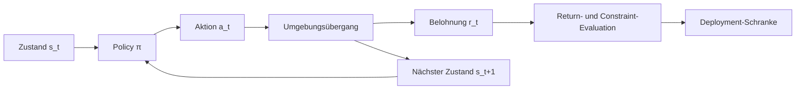



Reinforcement Learning ist kein einzelnes Modell, das eine Belohnung maximiert.
Es ist eine Methode zur Spezifikation und Validierung sequenzieller Entscheidungsprobleme, bei denen Aktionen zukünftige Beobachtungen und Datenverteilungen verändern.

## 1. Das Problem: Der Unterschied zwischen Vorhersage und Steuerung

Supervised Learning sagt richtige Antworten aus festen Daten voraus.
Eine RL-Policy wählt Aktionen aus, und diese Aktionen beeinflussen den nächsten Zustand sowie nachfolgende Trainingsdaten.

Dadurch entstehen folgende Risiken.

- Schlupflöcher in der Belohnung ausnutzen.
- Simulatorartefakte erlernen.
- Sicherheitsconstraints während der Exploration verletzen.
- Aktionen überschätzen, die im Offline-Datensatz fehlen.
- Fehler am Verteilungsende trotz besserem durchschnittlichem Return erhöhen.
- Evaluation durch unbeobachtete Confounder verzerren.

Fragen Sie zuerst, ob RL nötig ist.

- Sind sequenzielle Entscheidungen tatsächlich wichtig?
- Verändern Aktionen zukünftige Zustände?
- Ist das Problem mit expliziter Optimierung oder Regeln schwer zu lösen?
- Ist ein sicherer Simulator oder Offline-Datensatz verfügbar?
- Lassen sich Belohnungen und Constraints messen?

Für eine einmalige Klassifikation oder unabhängige Auswahl können ein Contextual Bandit oder Supervised Learning einfacher sein.

## 2. Denkmodell: MDP und Evaluationsgrenzen



Ein Markov-Entscheidungsprozess wird durch folgende Elemente dargestellt.

$$
\mathcal{M}=(\mathcal{S},\mathcal{A},P,R,\gamma)
$$

- Zustandsraum $\mathcal{S}$
- Aktionsraum $\mathcal{A}$
- Übergang $P(s'\mid s,a)$
- Belohnung $R(s,a,s')$
- Diskontfaktor $\gamma$

Wenn die tatsächlichen Beobachtungen nicht den vollständigen Zustand bilden, ist eine POMDP-Perspektive erforderlich.
Verlauf, Belief States und rekurrente Modelle können dies approximieren, lösen aber nicht automatisch die Identifizierbarkeit.

## 3. Den Umgebungsvertrag formulieren

```yaml
observation:
  fields: "policy가 실제 시점에 관측 가능한 값만"
  latency: "측정부터 행동까지 지연"
action:
  bounds: "물리·운영 한계"
  duration: "행동이 유지되는 시간"
transition:
  time_step: "결정 간격"
episode:
  start: "초기 상태 분포"
  termination: "성공·실패·시간 제한 구분"
reward:
  components: "목표와 shaping"
constraints:
  hard: "절대 금지"
  soft: "비용으로 최적화"
```

Zukünftige Informationen in der Beobachtung sind Leakage.
Bilden Sie reale Deployment-Latenz und fehlende Werte ebenfalls in der Umgebung nach.

Eine Beendigung durch das Zeitlimit muss von einem natürlichen terminalen Zustand unterschieden werden, damit Value Targets korrekt sind.

## 4. Return, Value und Advantage

Diskontierter Return:

$$
G_t=\sum_{k=0}^{\infty}\gamma^k r_{t+k+1}
$$

Zustandswert und Aktionswert:

$$
V^\pi(s)=\mathbb{E}_\pi[G_t\mid S_t=s]
$$

$$
Q^\pi(s,a)=\mathbb{E}_\pi[G_t\mid S_t=s,A_t=a]
$$

Der Advantage zeigt, um wie viel besser eine Aktion in einem bestimmten Zustand als der Durchschnitt ist.

$$
A^\pi(s,a)=Q^\pi(s,a)-V^\pi(s)
$$

Diese Definitionen sind konzeptionelle Baselines, die vor der Wahl eines Algorithmus validiert werden müssen.
Wenn Terminal Masks, Belohnungsskalen oder Diskontierung in der Implementierung falsch sind, lernt kein Algorithmus korrekt.

## 5. Baseline-Hierarchie

Vergleichen Sie vor dem Einsatz komplexen RL:

1. Aktuelle Produktions-Policy
2. Zufällige, aber sichere Policy
3. Feste Regeln
4. Greedy- oder myopische Optimierung
5. Model Predictive Control
6. Contextual Bandit
7. Imitation Learning
8. RL-Policy

Wenn RL nur wenig besser als eine einfache Baseline ist, aber wesentlich höhere Erklärungs- und Betriebskosten verursacht, lohnt sich ein Deployment möglicherweise nicht.

Erstellen Sie eine kleine Umgebung, in der ein Orakel oder Dynamic Programming möglich ist.
Der Vergleich mit einem bekannten optimalen Wert kann Implementierungsfehler schnell offenlegen.

## 6. Online-, Offline- und modellbasierte Ansätze unterscheiden

### Online RL

Die Policy sammelt Daten durch Interaktion mit der Umgebung.

- Exploration ist möglich.
- Sicherheit und Kosten sind in der realen Umgebung zentrale Bedenken.
- Simulatoren führen Simulatorbias ein.

### Offline RL

Die Policy wird mit einem festen Datensatz trainiert.

- Historische Daten lassen sich ohne neue riskante Aktionen verwenden.
- Wertschätzungen für Aktionen außerhalb des Supports der Behavior Policy sind instabil.
- Protokollierte Propensities und Abdeckung sind wichtig.

### Modellbasiertes RL

Ein Übergangs- oder Dynamikmodell wird gelernt und zur Planung verwendet.

- Kann die Stichprobeneffizienz verbessern.
- Modellfehler summieren sich über einen Rollout.
- Unsicherheit und Planung mit kurzem Horizont sind wichtig.

Ein hybrider Ansatz kann Offline-Vortraining mit begrenztem Online-Fine-Tuning verbinden, benötigt aber in jeder Stufe eine Risikoschranke.

## 7. Offline-Evaluation einer Policy

Hierbei wird eine neue Policy anhand protokollierter Daten evaluiert, ohne sie in der realen Welt bereitzustellen.

Grundidee des Importance Sampling:

$$
\hat{V}_{IS}=\frac{1}{n}\sum_{i=1}^{n}
\left(\prod_t\frac{\pi(a_t\mid s_t)}{\mu(a_t\mid s_t)}\right)G_i
$$

- $\pi$: Zu evaluierende Ziel-Policy
- $\mu$: Behavior Policy, die die Daten erzeugt hat

Das Produkt der Wahrscheinlichkeitsverhältnisse kann eine extrem hohe Varianz besitzen.
Vergleichen Sie gewichtetes IS, Per-decision IS, direkte Methoden und Doubly-robust-Schätzer.

Übliche Annahmen:

- Wahrscheinlichkeiten der Behavior Policy wurden erfasst oder können geschätzt werden.
- Aktionen der Ziel-Policy liegen innerhalb des Behavior Supports.
- Relevante Confounder sind im Zustand enthalten.
- Der Datenerzeugungsprozess ist hinreichend stabil.

Wenn diese Annahmen scheitern, ist auch eine ausgefeilte Zahl nicht vertrauenswürdig.

## 8. Gestaltung von Belohnung und Constraints

Eine Belohnung ist ein Proxy für ein Ziel.
Die Optimierung eines Proxys erzeugt unbeabsichtigte Abkürzungen.

Entwurfsverfahren:

1. Endgültige Outcome-Metrik definieren.
2. Harte Constraints von der Belohnung trennen.
3. Prüfen, ob Shaping-Terme mit dem endgültigen Ziel in Konflikt stehen.
4. Skala jeder Komponente erfassen.
5. Pfade, die der Agent ausnutzen könnte, adversarial testen.
6. Diagnosemetriken aufnehmen, die beobachtet, aber nicht belohnt werden.

Ein Constrained MDP setzt Obergrenzen für Kosten $C_i$.

$$
\max_\pi J_R(\pi)\quad
\text{unter den Nebenbedingungen}\quad J_{C_i}(\pi)\le d_i
$$

Eine Strafe allein garantiert harte Sicherheit nicht vollständig.
Verwenden Sie Action Shields, regelbasierte Interlocks und Laufzeitmonitore als getrennte Schichten.

## 9. Praktischer Workflow

```python
for seed in seeds:
    env = make_env(version=env_version, seed=seed)
    policy = train(config, env)
    report = evaluate(
        policy,
        scenarios=evaluation_scenarios,
        deterministic=True,
        record_trajectories=True,
    )
    save(policy, report, config, env_version)
```

Entscheidend sind mehrere Seeds und feste Evaluationsszenarien.

Stufen:

1. API und Return-Berechnung in einer kleinen deterministischen Umgebung validieren
2. Regelbasierte, MPC- und Imitation-Baselines erstellen
3. Trainingsstabilität über mehrere Seeds evaluieren
4. Domain Randomization und Störungstests ausführen
5. Zurückgehaltene Szenarien und Anfangszustände evaluieren
6. Offline-OPE durchführen oder Shadow-Modus verwenden
7. Canary mit eingeschränkter Aktionshülle
8. Laufzeitmonitore und Fallbacks verifizieren

## 10. Evaluationsdesign

Der durchschnittliche Episode Return allein reicht nicht aus.

- Erfolgsquote und Fehlertypen
- Median und Varianz des Return
- Untere Quantile oder CVaR
- Rate und Schwere der Constraint-Verletzungen
- Eingriffsrate
- Stichprobeneffizienz
- Konvergenzstabilität über Seeds
- Aktionsglätte
- Empfindlichkeit gegenüber Distribution Shift
- Inferenzlatenz

Trennen Sie Umgebungsstochastik von Trainingsseeds.
Evaluieren Sie dieselbe Policy wiederholt über mehrere Umgebungsseeds.

Gepaarte Szenarien für den Policyvergleich können die Varianz reduzieren.

## 11. Checkliste zur Evaluation

- [ ] Ist dies ein sequenzielles Entscheidungsproblem, das RL erfordert?
- [ ] Sind zukünftige Informationen aus Beobachtungen ausgeschlossen?
- [ ] Werden terminale Zustände von Time-limit Truncation unterschieden?
- [ ] Sind Belohnungskomponenten von Diagnosemetriken getrennt?
- [ ] Werden harte Constraints auch zur Laufzeit durchgesetzt?
- [ ] Sind regelbasierte, Greedy-, MPC- und Imitation-Baselines verfügbar?
- [ ] Werden mehrere Trainings- und Evaluationsseeds verwendet?
- [ ] Werden neben Durchschnittswerten auch Tail Return und Schwere von Verletzungen untersucht?
- [ ] Wurde der Behavior Support der Offline-Daten analysiert?
- [ ] Werden Annahmen und Unsicherheit der OPE-Schätzer berichtet?
- [ ] Sind Simulatorversion und Szenarien fixiert?
- [ ] Wurden Shadow-, Canary- und Fallback-Pfade getestet?

## 12. Häufige Fehler und Grenzen

### Eine erhöhte Belohnung als Verbesserung des realen Ziels behandeln

Ein Agent kann den Belohnungsproxy ausnutzen.
Messen Sie endgültige Outcomes und menschlich interpretierbare Diagnosemetriken getrennt.

### Unterschiede in der Episodenlänge ignorieren

Lange Episoden können mehr Belohnung erhalten, oder Fehler beim Umgang mit Zeitlimits können Werte verzerren.
Definieren Sie Terminierungssemantik und Normalisierung eindeutig.

### Aktionen außerhalb des Offline-Datensatzes vertrauen

Ein Funktionsapproximator kann einen hohen Q-Wert vorhersagen, obwohl keine stützenden Daten existieren.
Support-Constraints und konservative Ziele sind erforderlich.

### Die beste Policy aus dem Simulator sofort bereitstellen

Eine Policy kann kleine Modellfehler im Simulator systematisch ausnutzen.
Realismustests, Shadow-Modus und eine eingeschränkte Hülle sind erforderlich.

RL ersetzt nicht automatisch einen validierten Sicherheitscontroller.
Insbesondere in Hochrisikosystemen müssen unabhängige Interlocks und menschliche Aufsicht erhalten bleiben.

## 13. Offizielle Referenzen

- [Offizielle Online-Ausgabe von Reinforcement Learning: An Introduction](http://incompleteideas.net/book/the-book-2nd.html)
- [Offizielle Gymnasium-Dokumentation](https://gymnasium.farama.org/)
- [Offizielle Stable-Baselines3-Dokumentation](https://stable-baselines3.readthedocs.io/)
- [Ursprüngliche D4RL-Publikation](https://arxiv.org/abs/2004.07219)
- [Ursprüngliche Publikation zu Doubly Robust Off-policy Evaluation](https://arxiv.org/abs/1511.03722)

## 14. Fazit

Ausgangspunkt des Reinforcement Learning ist kein Algorithmusname, sondern ein Vertrag für Zustände, Aktionen, Übergänge, Belohnungen und Constraints.
Nur ein gestuftes Deployment mit Offline-Evaluation und Schranken für Tail-Risiken kann einen hohen Return in eine wirklich nützliche Policy verwandeln.
