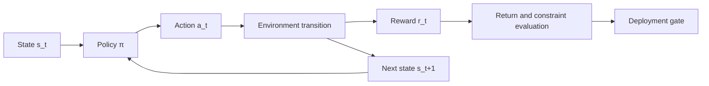



Reinforcement learning is not a single model that maximizes reward.
It is a method for specifying and validating sequential decision problems in which actions change future observations and data distributions.

## 1. The problem: The difference between prediction and control

Supervised learning predicts correct answers from fixed data.
An RL policy selects actions, and those actions affect the next state and subsequent training data.

This creates the following risks.

- Exploiting loopholes in the reward.
- Learning simulator artifacts.
- Violating safety constraints during exploration.
- Overestimating actions absent from the offline dataset.
- Increasing tail failures despite better average return.
- Distorting evaluation through unobserved confounders.

First ask whether RL is necessary.

- Do sequential decisions actually matter?
- Do actions change future states?
- Is the problem difficult to solve with explicit optimization or rules?
- Is a safe simulator or offline dataset available?
- Can rewards and constraints be measured?

For a one-time classification or independent choice, a contextual bandit or supervised learning may be simpler.

## 2. Mental model: MDP and evaluation boundaries



A Markov decision process is represented by the following elements.

$$
\mathcal{M}=(\mathcal{S},\mathcal{A},P,R,\gamma)
$$

- State space \(\mathcal{S}\)
- Action space \(\mathcal{A}\)
- Transition \(P(s'\mid s,a)\)
- Reward \(R(s,a,s')\)
- Discount factor \(\gamma\)

If actual observations are not the complete state, a POMDP perspective is needed.
History, belief states, and recurrent models can approximate this, but do not automatically solve identifiability.

## 3. Write the environment contract

```yaml
observation:
  fields: "policy가 실제 시점에 관측 가능한 값만"
  latency: "측정부터 행동까지 지연"
action:
  bounds: "물리·운영 한계"
  duration: "행동이 유지되는 시간"
transition:
  time_step: "결정 간격"
episode:
  start: "초기 상태 분포"
  termination: "성공·실패·시간 제한 구분"
reward:
  components: "목표와 shaping"
constraints:
  hard: "절대 금지"
  soft: "비용으로 최적화"
```

Future information in the observation is leakage.
Reproduce real deployment latency and missingness in the environment as well.

Time-limit termination must be distinguished from a natural terminal state so that value targets are correct.

## 4. Return, value, and advantage

Discounted return:

$$
G_t=\sum_{k=0}^{\infty}\gamma^k r_{t+k+1}
$$

State value and action value:

$$
V^\pi(s)=\mathbb{E}_\pi[G_t\mid S_t=s]
$$

$$
Q^\pi(s,a)=\mathbb{E}_\pi[G_t\mid S_t=s,A_t=a]
$$

Advantage indicates how much better an action is than average in a particular state.

$$
A^\pi(s,a)=Q^\pi(s,a)-V^\pi(s)
$$

These definitions are conceptual baselines that must be validated before choosing an algorithm.
If terminal masks, reward scales, or discounts are wrong in the implementation, no algorithm will learn correctly.

## 5. Baseline hierarchy

Compare the following before using complex RL.

1. Current production policy
2. Random but safe policy
3. Fixed rules
4. Greedy or myopic optimization
5. Model predictive control
6. Contextual bandit
7. Imitation learning
8. RL policy

If RL is only slightly better than a simple baseline while carrying much higher explanation and operational costs, it may not be worth deploying.

Build a small environment in which an oracle or dynamic programming is possible.
Comparison with a known optimal value can quickly reveal implementation errors.

## 6. Distinguish online, offline, and model-based approaches

### Online RL

The policy collects data by interacting with the environment.

- Exploration is possible.
- Safety and cost are major concerns in the real environment.
- Simulators introduce simulator bias.

### Offline RL

The policy is trained on a fixed dataset.

- Historical data can be used without taking new risky actions.
- Value estimates for actions outside the behavior policy's support are unstable.
- Logged propensities and coverage are important.

### Model-based RL

A transition or dynamics model is learned and used for planning.

- Can improve sample efficiency.
- Model error accumulates over a rollout.
- Uncertainty and short-horizon planning are important.

A hybrid can perform offline pretraining followed by limited online fine-tuning, but it requires a risk gate at each stage.

## 7. Offline policy evaluation

This is the problem of evaluating a new policy from logged data without deploying it in the real world.

The basic idea of importance sampling:

$$
\hat{V}_{IS}=\frac{1}{n}\sum_{i=1}^{n}
\left(\prod_t\frac{\pi(a_t\mid s_t)}{\mu(a_t\mid s_t)}\right)G_i
$$

- \(\pi\): Target policy to evaluate
- \(\mu\): Behavior policy that generated the data

The product of probability ratios can have extremely high variance.
Compare weighted IS, per-decision IS, direct methods, and doubly robust estimators.

Common assumptions:

- Behavior policy probabilities were recorded or can be estimated.
- Target policy actions are within behavior support.
- Relevant confounders are included in the state.
- The data-generation process is sufficiently stable.

If these assumptions fail, even a sophisticated number is not trustworthy.

## 8. Reward and constraint design

A reward is a proxy for an objective.
Optimizing a proxy creates unintended shortcuts.

Design procedure:

1. Define the final outcome metric.
2. Separate hard constraints from the reward.
3. Check whether shaping terms conflict with the final objective.
4. Record the scale of each component.
5. Red-team paths the agent could exploit.
6. Include diagnostic metrics that will be observed but not rewarded.

A constrained MDP imposes upper bounds on costs \(C_i\).

$$
\max_\pi J_R(\pi)\quad
\text{subject to}\quad J_{C_i}(\pi)\le d_i
$$

A penalty alone does not fully guarantee hard safety.
Use action shields, rule-based interlocks, and runtime monitors as separate layers.

## 9. Practical workflow

```python
for seed in seeds:
    env = make_env(version=env_version, seed=seed)
    policy = train(config, env)
    report = evaluate(
        policy,
        scenarios=evaluation_scenarios,
        deterministic=True,
        record_trajectories=True,
    )
    save(policy, report, config, env_version)
```

The key is multiple seeds and fixed evaluation scenarios.

Stages:

1. Validate the API and return calculation in a small deterministic environment
2. Build rule-based, MPC, and imitation baselines
3. Evaluate training stability across multiple seeds
4. Run domain randomization and disturbance tests
5. Evaluate held-out scenarios and initial states
6. Perform offline OPE or use shadow mode
7. Canary with a restricted action envelope
8. Verify runtime monitors and fallbacks

## 10. Evaluation design

Average episode return alone is insufficient.

- Success rate and failure types
- Return median and variance
- Lower quantiles or CVaR
- Constraint violation rate and severity
- Intervention rate
- Sample efficiency
- Convergence stability across seeds
- Action smoothness
- Sensitivity to distribution shift
- Inference latency

Separate environmental stochasticity from training seeds.
Evaluate the same policy repeatedly across multiple environment seeds.

Using paired scenarios for policy comparison can reduce variance.

## 11. Evaluation checklist

- [ ] Is this a sequential decision problem that requires RL?
- [ ] Is future information excluded from observations?
- [ ] Are terminal states distinguished from time-limit truncation?
- [ ] Are reward components separated from diagnostic metrics?
- [ ] Are hard constraints enforced at runtime as well?
- [ ] Are rule-based, greedy, MPC, and imitation baselines available?
- [ ] Are multiple training and evaluation seeds used?
- [ ] Are tail return and violation severity examined in addition to averages?
- [ ] Has the behavior support of offline data been analyzed?
- [ ] Are the assumptions and uncertainty of OPE estimators reported?
- [ ] Are the simulator version and scenarios fixed?
- [ ] Have shadow, canary, and fallback paths been tested?

## 12. Common failures and limitations

### Treating increased reward as improvement in the real objective

An agent can exploit the reward proxy.
Measure final outcomes and human-interpretable diagnostic metrics separately.

### Ignoring differences in episode length

Long episodes may earn more reward, or time-limit handling errors may distort value.
Define termination semantics and normalization clearly.

### Trusting actions outside the offline dataset

A function approximator may predict a high Q value even when no supporting data exists.
Support constraints and conservative objectives are required.

### Immediately deploying the best policy from the simulator

A policy can systematically exploit small model errors in the simulator.
Realism tests, shadow mode, and a restricted envelope are required.

RL does not automatically replace a validated safety controller.
Especially in high-risk systems, retain independent interlocks and human supervision.

## 13. Official references

- [Official online edition of Reinforcement Learning: An Introduction](http://incompleteideas.net/book/the-book-2nd.html)
- [Official Gymnasium documentation](https://gymnasium.farama.org/)
- [Official Stable-Baselines3 documentation](https://stable-baselines3.readthedocs.io/)
- [Original D4RL paper](https://arxiv.org/abs/2004.07219)
- [Original paper on Doubly Robust Off-policy Evaluation](https://arxiv.org/abs/1511.03722)

## 14. Conclusion

The starting point of reinforcement learning is not an algorithm name, but a contract for states, actions, transitions, rewards, and constraints.
Only staged deployment that includes offline evaluation and tail-risk gates can turn high return into a genuinely useful policy.
