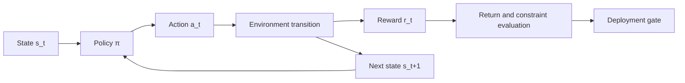



El aprendizaje por refuerzo no es un modelo único que maximice la recompensa.
Es un método para especificar y validar problemas de decisión secuencial en los que las acciones cambian observaciones futuras y distribuciones de datos.

## 1. El problema: La diferencia entre predicción y control

El aprendizaje supervisado predice respuestas correctas a partir de datos fijos.
Una política RL selecciona acciones, y esas acciones afectan el siguiente estado y los datos de entrenamiento posteriores.

Esto crea los siguientes riesgos.

- Explotar lagunas en la recompensa.
- Artefactos del simulador de aprendizaje.
- Violar las restricciones de seguridad durante la exploración.
- Sobreestimar acciones ausentes del conjunto de datos fuera de línea.
- Aumento de los fallos de cola a pesar de un mejor rendimiento medio.
- Distorsionar la evaluación a través de factores de confusión no observados.

Primero pregunte si RL es necesario.

- ¿Importan realmente las decisiones secuenciales?
- ¿Las acciones cambian los estados futuros?
- ¿Es el problema difícil de resolver con optimización o reglas explícitas?
- ¿Hay disponible un simulador seguro o un conjunto de datos fuera de línea?
- ¿Se pueden medir las recompensas y las limitaciones?

Para una clasificación única o una elección independiente, un bandido contextual o un aprendizaje supervisado puede ser más sencillo.

## 2. Modelo mental: MDP y límites de evaluación



Un proceso de decisión de Markov está representado por los siguientes elementos.

$$
\mathcal{M}=(\mathcal{S},\mathcal{A},P,R,\gamma)
$$

- Espacio de estado \(\mathcal{S}\)
- Espacio de acción \(\mathcal{A}\)
- Transición \(P(s'\mid s,a)\)
- Recompensa \(R(s,a,s')\)
- Factor de descuento \(\gamma\)

Si las observaciones reales no son el estado completo, se necesita una perspectiva POMDP.
La historia, los estados de creencias y los modelos recurrentes pueden aproximarse a esto, pero no resuelven automáticamente la identificabilidad.

## 3. Redactar el contrato medioambiental.

```yaml
observation:
  fields: "policy가 실제 시점에 관측 가능한 값만"
  latency: "측정부터 행동까지 지연"
action:
  bounds: "물리·운영 한계"
  duration: "행동이 유지되는 시간"
transition:
  time_step: "결정 간격"
episode:
  start: "초기 상태 분포"
  termination: "성공·실패·시간 제한 구분"
reward:
  components: "목표와 shaping"
constraints:
  hard: "절대 금지"
  soft: "비용으로 최적화"
```

La información futura en la observación es una fuga.
Reproduzca también la latencia de implementación real y las ausencias en el entorno.

La terminación del plazo debe distinguirse de un estado terminal natural para que los objetivos de valor sean correctos.

## 4. Retorno, valor y ventaja

Devolución con descuento:

$$
G_t=\sum_{k=0}^{\infty}\gamma^k r_{t+k+1}
$$

Valor de estado y valor de acción:

$$
V^\pi(s)=\mathbb{E}_\pi[G_t\mid S_t=s]
$$

$$
Q^\pi(s,a)=\mathbb{E}_\pi[G_t\mid S_t=s,A_t=a]
$$

La ventaja indica cuánto mejor es una acción que el promedio en un estado particular.

$$
A^\pi(s,a)=Q^\pi(s,a)-V^\pi(s)
$$

Estas definiciones son líneas de base conceptuales que deben validarse antes de elegir un algoritmo.
Si las máscaras de terminal, las escalas de recompensas o los descuentos son incorrectos en la implementación, ningún algoritmo aprenderá correctamente.

## 5. Jerarquía de referencia

Compare lo siguiente antes de usar el complejo RL.

1. Política de producción actual
2. Política aleatoria pero segura
3. Reglas fijas
4. Optimización codiciosa o miope
5. Modelo de control predictivo
6. Bandido contextual
7. Aprendizaje por imitación
8. Política RL

Si RL es solo un poco mejor que una línea de base simple y conlleva costos operativos y explicativos mucho más altos, puede que no valga la pena implementarlo.

Construya un pequeño entorno en el que sea posible un oráculo o una programación dinámica.
La comparación con un valor óptimo conocido puede revelar rápidamente errores de implementación.

## 6. Distinga los enfoques en línea, fuera de línea y basados en modelos

### En línea RL

La política recopila datos interactuando con el medio ambiente.

- La exploración es posible.
- La seguridad y el coste son preocupaciones importantes en el entorno real.
- Los simuladores introducen un sesgo de simulación.

### Sin conexión RL

La política se entrena en un conjunto de datos fijo.

- Los datos históricos se pueden utilizar sin realizar nuevas acciones riesgosas.
- Las estimaciones de valor para acciones fuera del apoyo de la política de comportamiento son inestables.
- Las propensiones registradas y la cobertura son importantes.

### Basado en modelo RL

Se aprende y utiliza un modelo de transición o dinámica para la planificación.

- Puede mejorar la eficiencia de la muestra.
- El error del modelo se acumula durante una implementación.
- La incertidumbre y la planificación a corto plazo son importantes.

Un híbrido puede realizar un entrenamiento previo fuera de línea seguido de un ajuste limitado en línea, pero requiere una puerta de riesgo en cada etapa.

## 7. Evaluación de políticas fuera de línea

Este es el problema de evaluar una nueva política a partir de datos registrados sin implementarla en el mundo real.

La idea básica del muestreo de importancia:

$$
\hat{V}_{IS}=\frac{1}{n}\sum_{i=1}^{n}
\left(\prod_t\frac{\pi(a_t\mid s_t)}{\mu(a_t\mid s_t)}\right)G_i
$$

- \(\pi\): Política de destino para evaluar
- \(\mu\): Política de comportamiento que generó los datos.

El producto de razones de probabilidad puede tener una varianza extremadamente alta.
Compare IS ponderado, por decisión IS, métodos directos y estimadores doblemente robustos.

Supuestos comunes:

- Las probabilidades de la política de comportamiento se registraron o pueden estimarse.
- Las acciones políticas objetivo están dentro del apoyo al comportamiento.
- Los factores de confusión relevantes están incluidos en el estado.
- El proceso de generación de datos es suficientemente estable.

Si estos supuestos fallan, ni siquiera una cifra sofisticada será digna de confianza.

## 8. Diseño de recompensas y restricciones

Una recompensa es un sustituto de un objetivo.
La optimización de un proxy crea atajos no deseados.

Procedimiento de diseño:

1. Definir la métrica del resultado final.
2. Separe las restricciones estrictas de la recompensa.
3. Comprobar si los términos de configuración entran en conflicto con el objetivo final.
4. Registre la escala de cada componente.
5. Rutas del equipo rojo que el agente podría explotar.
6. Incluir métricas de diagnóstico que serán observadas pero no recompensadas.

Un MDP restringido impone límites superiores a los costos \(C_i\).

$$
\max_\pi J_R(\pi)\quad
\text{subject to}\quad J_{C_i}(\pi)\le d_i
$$

Una penalización por sí sola no garantiza plenamente la seguridad.
Utilice escudos de acción, interbloqueos basados ​​en reglas y monitores de tiempo de ejecución como capas separadas.

## 9. Flujo de trabajo práctico

```python
for seed in seeds:
    env = make_env(version=env_version, seed=seed)
    policy = train(config, env)
    report = evaluate(
        policy,
        scenarios=evaluation_scenarios,
        deterministic=True,
        record_trajectories=True,
    )
    save(policy, report, config, env_version)
```

La clave son múltiples semillas y escenarios de evaluación fijos.

Etapas:

1. Valide el API y devuelva el cálculo en un entorno determinista pequeño
2. Cree líneas base basadas en reglas, MPC y de imitación.
3. Evaluar la estabilidad del entrenamiento en múltiples semillas.
4. Ejecute pruebas de perturbación y aleatorización de dominios.
5. Evaluar escenarios pendientes y estados iniciales.
6. Realice OPE sin conexión o use el modo sombra
7. Canario con dotación de acción restringida
8. Verificar los monitores de tiempo de ejecución y las alternativas

## 10. Diseño de evaluación

El retorno promedio de los episodios por sí solo es insuficiente.

- Tasa de éxito y tipos de fracaso.
- Mediana y varianza del retorno.
- Cuantiles inferiores o CVaR
- Tasa y gravedad de violación de restricciones
- Tasa de intervención
- Eficiencia de la muestra
- Estabilidad de convergencia entre semillas.
- Suavidad de acción
- Sensibilidad al cambio de distribución.
- Latencia de inferencia

Separe la estocasticidad ambiental de las semillas de entrenamiento.
Evalúe la misma política repetidamente en múltiples semillas ambientales.

El uso de escenarios pareados para comparar políticas puede reducir la variación.

## 11. Lista de verificación de evaluación

- [] ¿Es este un problema de decisión secuencial que requiere RL?
- [ ] ¿Se excluye de las observaciones la información futura?
- [ ] ¿Se distinguen los estados terminales del truncamiento de plazos?
- [] ¿Están separados los componentes de recompensa de las métricas de diagnóstico?
- [] ¿También se aplican restricciones estrictas en tiempo de ejecución?
- [] ¿Están disponibles líneas de base basadas en reglas, codiciosas, MPC y de imitación?
- [ ] ¿Se utilizan múltiples semillas de capacitación y evaluación?
- [ ] ¿Se examinan el retorno de cola y la gravedad de la infracción además de los promedios?
- [ ] ¿Se ha analizado el soporte del comportamiento de los datos fuera de línea?
- [ ] ¿Se informan los supuestos y la incertidumbre de los estimadores OPE?
- [] ¿Están arreglados la versión y los escenarios del simulador?
- [] ¿Se han probado las rutas de sombra, canarias y de respaldo?

## 12. Fallos y limitaciones comunes

### Tratar el aumento de la recompensa como una mejora en el objetivo real

Un agente puede explotar el proxy de recompensa.
Mida los resultados finales y las métricas de diagnóstico interpretables por humanos por separado.

### Ignorar las diferencias en la duración del episodio

Los episodios largos pueden generar más recompensas o los errores en el manejo del límite de tiempo pueden distorsionar el valor.
Defina claramente la semántica de terminación y la normalización.

### Confiar en acciones fuera del conjunto de datos fuera de línea

Un aproximador de funciones puede predecir un valor Q alto incluso cuando no existen datos de respaldo.
Se requieren restricciones de soporte y objetivos conservadores.

### Implementación inmediata de la mejor política del simulador

Una política puede explotar sistemáticamente pequeños errores del modelo en el simulador.
Se requieren pruebas de realismo, modo sombra y una envolvente restringida.

RL no reemplaza automáticamente un controlador de seguridad validado.
Especialmente en sistemas de alto riesgo, conserve interbloqueos independientes y supervisión humana.

## 13. Referencias oficiales

- [Edición oficial en línea de Aprendizaje por refuerzo: Introducción](https://incompleteideas.net/book/the-book-2nd.html)
- [Documentación oficial del gimnasio](https://gymnasium.farama.org/)
- [Documentación oficial de Stable-Baselines3](https://stable-baselines3.readthedocs.io/)
- [Papel original D4RL](https://arxiv.org/abs/2004.07219)
- [Documento original sobre evaluación doblemente robusta fuera de políticas](https://arxiv.org/abs/1511.03722)

## 14. Conclusión

El punto de partida del aprendizaje por refuerzo no es el nombre de un algoritmo, sino un contrato de estados, acciones, transiciones, recompensas y restricciones.
Sólo una implementación por etapas que incluya evaluación fuera de línea y puertas de riesgo de cola puede convertir un alto rendimiento en una política realmente útil.
