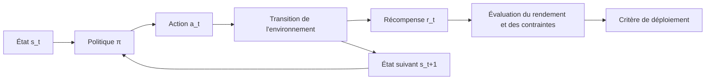



L’apprentissage par renforcement ne se résume pas à un modèle qui maximise une récompense.
C’est une méthode pour spécifier et valider un problème de décision séquentielle dans lequel les actions modifient les observations futures et la distribution des données.

## 1. Problème : la différence entre prédiction et contrôle

L’apprentissage supervisé prédit une réponse à partir de données fixes.
Une politique d’apprentissage par renforcement choisit une action, laquelle influence l’état suivant et les données d’apprentissage ultérieures.

Les risques suivants en découlent :

- exploiter les failles de la récompense ;
- apprendre les artefacts du simulateur ;
- enfreindre les contraintes de sécurité pendant l’exploration ;
- surestimer les actions absentes du jeu de données hors ligne ;
- augmenter les défaillances extrêmes malgré un meilleur rendement moyen ;
- fausser l’évaluation à cause de facteurs de confusion non observés.

Il faut d’abord se demander si l’apprentissage par renforcement est nécessaire.

- La décision séquentielle est-elle réellement importante ?
- Les actions modifient-elles les états futurs ?
- Le problème est-il difficile à résoudre avec une optimisation explicite ou des règles ?
- Dispose-t-on d’un simulateur sûr ou de données hors ligne ?
- Peut-on mesurer la récompense et les contraintes ?

Pour une classification ponctuelle ou des choix indépendants, un bandit contextuel ou l’apprentissage supervisé peut être plus simple.

## 2. Modèle mental : MDP et frontière d’évaluation



Un processus de décision markovien se représente par les éléments suivants :

$$
\mathcal{M}=(\mathcal{S},\mathcal{A},P,R,\gamma)
$$

- espace d’états \(\mathcal{S}\) ;
- espace d’actions \(\mathcal{A}\) ;
- transition \(P(s'\mid s,a)\) ;
- récompense \(R(s,a,s')\) ;
- facteur d’actualisation \(\gamma\).

Lorsque l’observation réelle ne constitue pas un état complet, il faut adopter le point de vue d’un POMDP.
L’historique, l’état de croyance ou un modèle récurrent peuvent l’approximer, sans pour autant résoudre automatiquement le problème d’identifiabilité.

## 3. Rédiger le contrat de l’environnement

```yaml
observation:
  fields: "policy가 실제 시점에 관측 가능한 값만"
  latency: "측정부터 행동까지 지연"
action:
  bounds: "물리·운영 한계"
  duration: "행동이 유지되는 시간"
transition:
  time_step: "결정 간격"
episode:
  start: "초기 상태 분포"
  termination: "성공·실패·시간 제한 구분"
reward:
  components: "목표와 shaping"
constraints:
  hard: "절대 금지"
  soft: "비용으로 최적화"
```

La présence d’informations futures dans l’observation constitue une fuite de données.
La latence et les valeurs manquantes du déploiement réel doivent également être reproduites dans l’environnement.

Il faut distinguer une fin due à la limite de temps d’un véritable état terminal afin de calculer correctement la cible de valeur.

## 4. Rendement, valeur et avantage

Rendement actualisé :

$$
G_t=\sum_{k=0}^{\infty}\gamma^k r_{t+k+1}
$$

Valeur d’état et valeur d’action :

$$
V^\pi(s)=\mathbb{E}_\pi[G_t\mid S_t=s]
$$

$$
Q^\pi(s,a)=\mathbb{E}_\pi[G_t\mid S_t=s,A_t=a]
$$

L’avantage indique dans quelle mesure une action est meilleure que la moyenne dans un état donné.

$$
A^\pi(s,a)=Q^\pi(s,a)-V^\pi(s)
$$

Ces définitions forment une base conceptuelle à vérifier avant même de choisir un algorithme.
Si le masque terminal, l’échelle de récompense ou l’actualisation sont erronés dans l’implémentation, aucun algorithme ne pourra apprendre correctement.

## 5. Hiérarchie des baselines

Avant d’employer un système d’apprentissage par renforcement complexe, comparez :

1. la politique actuellement en production ;
2. une politique aléatoire mais sûre ;
3. des règles fixes ;
4. une optimisation gloutonne ou à courte vue ;
5. un contrôle prédictif par modèle ;
6. un bandit contextuel ;
7. l’apprentissage par imitation ;
8. une politique d’apprentissage par renforcement.

Si cette dernière ne dépasse que légèrement une baseline simple tout en étant beaucoup plus difficile à expliquer et à exploiter, son déploiement peut ne présenter aucun intérêt.

Créez un petit environnement dans lequel un oracle ou la programmation dynamique est possible.
La comparaison à une valeur optimale connue permet de repérer rapidement les erreurs d’implémentation.

## 6. Distinguer apprentissage en ligne, hors ligne et fondé sur un modèle

### Apprentissage par renforcement en ligne

La politique recueille des données en interagissant avec l’environnement.

- L’exploration est possible.
- Dans le monde réel, les enjeux de sécurité et de coût sont importants.
- Dans un simulateur, un biais de simulation subsiste.

### Apprentissage par renforcement hors ligne

La politique est entraînée sur un jeu de données fixe.

- Les données historiques sont exploitées sans essayer de nouvelles actions risquées.
- L’estimation de la valeur des actions hors du support de la politique de comportement est instable.
- Les propensions journalisées et la couverture sont essentielles.

### Apprentissage par renforcement fondé sur un modèle

Un modèle des transitions ou de la dynamique est appris puis utilisé pour la planification.

- Il peut améliorer l’efficacité en nombre d’échantillons.
- L’erreur du modèle s’accumule au fil du déroulement.
- L’incertitude et la planification à horizon court sont importantes.

Une approche hybride peut préentraîner le système hors ligne avant un ajustement en ligne limité, mais chaque étape nécessite ses propres critères de risque.

## 7. Évaluation hors politique

Il s’agit d’évaluer une nouvelle politique à partir de données journalisées, sans la déployer réellement.

Idée fondamentale de l’échantillonnage d’importance :

$$
\hat{V}_{IS}=\frac{1}{n}\sum_{i=1}^{n}
\left(\prod_t\frac{\pi(a_t\mid s_t)}{\mu(a_t\mid s_t)}\right)G_i
$$

- \(\pi\) : politique cible à évaluer ;
- \(\mu\) : politique de comportement ayant produit les données.

Le produit des rapports de probabilités peut avoir une variance extrêmement élevée.
Comparez l’échantillonnage d’importance pondéré, par décision, la méthode directe et un estimateur doublement robuste.

Hypothèses communes :

- les probabilités de la politique de comportement sont enregistrées ou peuvent être estimées ;
- les actions de la politique cible se trouvent dans le support de la politique de comportement ;
- les facteurs de confusion pertinents sont inclus dans l’état ;
- le processus de génération des données est suffisamment stable.

Si ces hypothèses ne sont pas respectées, même un chiffre très précis n’est pas fiable.

## 8. Concevoir la récompense et les contraintes

La récompense est un indicateur indirect de l’objectif.
Optimiser cet indicateur peut créer des raccourcis non souhaités.

Procédure de conception :

1. Définir l’indicateur du résultat final.
2. Séparer les contraintes strictes de la récompense.
3. Vérifier que les termes de façonnage ne contredisent pas l’objectif final.
4. Consigner l’échelle de chaque composante.
5. Rechercher de manière contradictoire les voies que l’agent pourrait exploiter.
6. Prévoir des indicateurs diagnostiques observés indépendamment de la récompense.

Un MDP contraint fixe une limite supérieure aux coûts \(C_i\).

$$
\max_\pi J_R(\pi)\quad
\text{subject to}\quad J_{C_i}(\pi)\le d_i
$$

Une pénalité unique ne garantit pas entièrement une contrainte de sécurité stricte.
Ajoutez des couches distinctes : bouclier d’action, verrouillage à base de règles et surveillance à l’exécution.

## 9. Workflow pratique

```python
for seed in seeds:
    env = make_env(version=env_version, seed=seed)
    policy = train(config, env)
    report = evaluate(
        policy,
        scenarios=evaluation_scenarios,
        deterministic=True,
        record_trajectories=True,
    )
    save(policy, report, config, env_version)
```

L’essentiel est d’utiliser plusieurs graines et des scénarios d’évaluation fixes.

Étapes :

1. Vérifier l’API et le calcul du rendement dans un petit environnement déterministe.
2. Construire des baselines à base de règles, de MPC et d’imitation.
3. Évaluer la stabilité de l’apprentissage sur plusieurs graines.
4. Tester la randomisation du domaine et les perturbations.
5. Évaluer des scénarios et des états initiaux tenus à l’écart.
6. Effectuer une évaluation hors politique ou passer en mode fantôme.
7. Lancer un canari avec une enveloppe d’actions limitée.
8. Vérifier la surveillance à l’exécution et le mécanisme de repli.

## 10. Conception de l’évaluation

Le rendement moyen par épisode ne suffit pas.

- taux de réussite et types de défaillances ;
- médiane et variance du rendement ;
- quantile inférieur ou CVaR ;
- taux et gravité des violations de contraintes ;
- taux d’intervention ;
- efficacité en nombre d’échantillons ;
- stabilité de la convergence entre les graines ;
- régularité des actions ;
- sensibilité au changement de distribution ;
- latence d’inférence.

Séparez la stochasticité de l’environnement de la graine d’apprentissage.
Évaluez plusieurs fois la même politique avec différentes graines d’environnement.

Des scénarios appariés réduisent la variance lors de la comparaison des politiques.

## 11. Checklist d’évaluation

- [ ] Le problème exige-t-il réellement une décision séquentielle par apprentissage par renforcement ?
- [ ] L’observation est-elle dépourvue d’informations futures ?
- [ ] Les états terminaux sont-ils distingués des troncatures dues à la limite de temps ?
- [ ] Les composantes de la récompense sont-elles séparées des indicateurs diagnostiques ?
- [ ] Les contraintes strictes sont-elles aussi imposées à l’exécution ?
- [ ] Existe-t-il des baselines à base de règles, gloutonnes, MPC et par imitation ?
- [ ] Plusieurs graines d’apprentissage et d’évaluation sont-elles utilisées ?
- [ ] Le rendement extrême et la gravité des violations sont-ils examinés en plus de la moyenne ?
- [ ] Le support de la politique de comportement dans les données hors ligne a-t-il été analysé ?
- [ ] Les hypothèses et l’incertitude de l’estimateur hors politique sont-elles présentées ?
- [ ] La version du simulateur et les scénarios sont-ils figés ?
- [ ] Les chemins de mode fantôme, de canari et de repli ont-ils été testés ?

## 12. Échecs fréquents et limites

### Prendre la hausse de la récompense pour une amélioration de l’objectif réel

L’agent peut exploiter l’indicateur indirect qu’est la récompense.
Examinez séparément le résultat final et des indicateurs diagnostiques compréhensibles par les humains.

### Ignorer les différences de durée des épisodes

Un épisode long peut accumuler davantage de récompenses, et une mauvaise gestion de la limite de temps peut fausser la valeur.
Définissez clairement la signification de la fin et la normalisation.

### Faire confiance aux actions hors du jeu de données hors ligne

Même si l’approximateur de fonction prédit une valeur Q élevée, aucune donnée ne l’étaye nécessairement.
Il faut une contrainte de support et un objectif conservateur.

### Déployer immédiatement la meilleure politique du simulateur

La politique peut exploiter systématiquement de petites erreurs du modèle du simulateur.
Des tests de réalisme, un mode fantôme et une enveloppe limitée sont nécessaires.

L’apprentissage par renforcement ne remplace pas automatiquement un contrôleur de sécurité éprouvé.
Dans les systèmes à haut risque en particulier, conservez un verrouillage indépendant et une supervision humaine.

## 13. Références officielles

- [Version publique officielle de Reinforcement Learning: An Introduction](https://incompleteideas.net/book/the-book-2nd.html)
- [Documentation officielle de Gymnasium](https://gymnasium.farama.org/)
- [Documentation officielle de Stable-Baselines3](https://stable-baselines3.readthedocs.io/)
- [Article original sur D4RL](https://arxiv.org/abs/2004.07219)
- [Article original sur l’évaluation hors politique doublement robuste](https://arxiv.org/abs/1511.03722)

## 14. Conclusion

Le point de départ de l’apprentissage par renforcement n’est pas le nom d’un algorithme, mais le contrat qui définit les états, les actions, les transitions, la récompense et les contraintes.
Un rendement élevé ne devient une politique réellement utile qu’avec un déploiement progressif comprenant une évaluation hors ligne et des critères portant sur les risques extrêmes.
