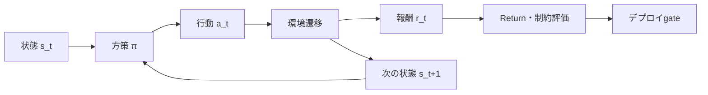



強化学習はrewardを最大化する一つのモデルではない。
行動が将来の観測とデータ分布を変える逐次意思決定問題を仕様化し、検証する方法である。

## 1. 問題：予測と制御の違い

教師あり学習は固定されたデータから正解を予測する。
強化学習のpolicyは行動を選択し、その行動が次の状態と以後の学習データに影響を与える。

したがって、次のリスクが生じる。

- rewardの抜け穴を悪用する。
- simulator artifactを学習する。
- 探索中に安全制約へ違反する。
- offline datasetにない行動を過大評価する。
- 平均returnが良くてもtail failureが増える。
- 観測されないconfounderによって評価が歪む。

まずRLが必要かを問う。

- 逐次的な決定は本当に重要か？
- 行動が将来の状態を変えるか？
- 明示的な最適化やルールでは解きにくいか？
- 安全なsimulatorまたはoffline dataがあるか？
- rewardと制約を測定できるか？

一度の分類や独立した選択であれば、contextual banditまたはsupervised learningのほうが単純なことがある。

## 2. Mental model：MDPと評価境界



Markov decision processは次の要素で表す。

$$
\mathcal{M}=(\mathcal{S},\mathcal{A},P,R,\gamma)
$$

- 状態空間 \(\mathcal{S}\)
- 行動空間 \(\mathcal{A}\)
- 遷移 \(P(s'\mid s,a)\)
- 報酬 \(R(s,a,s')\)
- 割引率 \(\gamma\)

実際の観測が完全な状態でない場合は、POMDPの視点が必要になる。
history、belief state、recurrent modelで近似できるが、identifiabilityが自動的に解決するわけではない。

## 3. 環境契約を作成する

```yaml
observation:
  fields: "policy가 실제 시점에 관측 가능한 값만"
  latency: "측정부터 행동까지 지연"
action:
  bounds: "물리·운영 한계"
  duration: "행동이 유지되는 시간"
transition:
  time_step: "결정 간격"
episode:
  start: "초기 상태 분포"
  termination: "성공·실패·시간 제한 구분"
reward:
  components: "목표와 shaping"
constraints:
  hard: "절대 금지"
  soft: "비용으로 최적화"
```

未来の情報がobservationに入ればleakageである。
実際のデプロイの遅延とmissingnessも環境内で再現する。

時間制限による終了と自然なterminal stateを区別しなければ、value targetが正しくならない。

## 4. Return、value、advantage

割引return：

$$
G_t=\sum_{k=0}^{\infty}\gamma^k r_{t+k+1}
$$

state valueとaction value：

$$
V^\pi(s)=\mathbb{E}_\pi[G_t\mid S_t=s]
$$

$$
Q^\pi(s,a)=\mathbb{E}_\pi[G_t\mid S_t=s,A_t=a]
$$

advantageは、特定の状態で行動が平均よりどれだけ優れているかを示す。

$$
A^\pi(s,a)=Q^\pi(s,a)-V^\pi(s)
$$

この定義はalgorithmの選択より先に検証すべきconceptual baselineである。
実装でterminal mask、reward scale、discountが誤っていれば、どのアルゴリズムも正しく学習できない。

## 5. Baseline hierarchy

複雑なRLの前に、次と比較する。

1. 現在の運用方策
2. ランダムだが安全な方策
3. 固定ルール
4. greedyまたはmyopic optimization
5. model predictive control
6. contextual bandit
7. imitation learning
8. RL policy

RLが単純なbaselineをわずかに上回るだけで、説明と運用のコストがはるかに大きいなら、デプロイする価値がない場合がある。

oracleまたはdynamic programmingが可能な小さな環境を作る。
既知のoptimal valueと比較すれば、実装エラーを素早く見つけられる。

## 6. Online、offline、model-basedを区別する

### Online RL

policyが環境と相互作用しながらデータを収集する。

- 探索が可能である。
- 実環境では安全性・コストの問題が大きい。
- simulatorではsimulator biasがある。

### Offline RL

固定datasetでpolicyを学習する。

- 新たな危険行動なしに過去のデータを活用できる。
- behavior policy support外の行動のvalue推定が不安定である。
- logged propensityとcoverageが重要である。

### Model-based RL

遷移またはdynamics modelを学習し、planningに使用する。

- sample efficiencyを高められる。
- model errorがrollout中に累積する。
- uncertaintyと短いhorizonの計画が重要である。

offline pretraining後に限定的なonline fine-tuningを行うhybridも可能だが、段階ごとのリスクgateが必要である。

## 7. Offline policy evaluation

新しいpolicyを実際にデプロイせず、logged dataで評価する問題である。

importance samplingの基本idea：

$$
\hat{V}_{IS}=\frac{1}{n}\sum_{i=1}^{n}
\left(\prod_t\frac{\pi(a_t\mid s_t)}{\mu(a_t\mid s_t)}\right)G_i
$$

- \(\pi\)：評価するtarget policy
- \(\mu\)：データを生成したbehavior policy

確率比の積はvarianceが非常に大きくなることがある。
weighted IS、per-decision IS、direct method、doubly robust estimatorを比較する。

共通の前提：

- behavior policy probabilityが記録されているか、推定可能である。
- target policyの行動がbehavior support内にある。
- 関連するconfounderが状態に含まれている。
- データ生成過程が十分に安定している。

前提が崩れれば、数値が精緻でも信頼できない。

## 8. Rewardとconstraintの設計

rewardは目標のproxyである。
proxyの最適化は意図しないshortcutを生む。

設計手順：

1. 最終結果の指標を定義する。
2. hard constraintをrewardから分離する。
3. shaping termが最終目標と衝突しないか確認する。
4. 各componentのscaleを記録する。
5. agentが悪用できる経路をred-teamする。
6. rewardとは別に観察する診断metricを設ける。

Constrained MDPではコスト \(C_i\) に上限を設ける。

$$
\max_\pi J_R(\pi)\quad
\text{subject to}\quad J_{C_i}(\pi)\le d_i
$$

一つのpenaltyでhard safetyを完全に保証しない。
action shield、rule-based interlock、runtime monitorを別レイヤーに置く。

## 9. 実践workflow

```python
for seed in seeds:
    env = make_env(version=env_version, seed=seed)
    policy = train(config, env)
    report = evaluate(
        policy,
        scenarios=evaluation_scenarios,
        deterministic=True,
        record_trajectories=True,
    )
    save(policy, report, config, env_version)
```

要点は複数のseedと固定されたevaluation scenarioである。

段階：

1. 小さなdeterministic環境でAPIとreturn計算を検証
2. ルール・MPC・imitation baselineを構築
3. 複数seedで学習安定性を評価
4. domain randomizationとdisturbance test
5. held-out scenarioと初期状態を評価
6. offline OPEまたはshadow mode
7. 限定的なaction envelopeでcanary
8. runtime monitorとfallbackを確認

## 10. 評価設計

平均episode returnだけでは不十分である。

- 成功率と失敗類型
- return medianと分散
- 下位quantileまたはCVaR
- constraint violation rateとseverity
- intervention rate
- sample efficiency
- convergence stability across seeds
- action smoothness
- distribution shift sensitivity
- inference latency

環境のstochasticityと学習seedを分離する。
同じpolicyを複数のenvironment seedで繰り返し評価する。

policyの比較にpaired scenarioを使えばvarianceを減らせる。

## 11. 評価checklist

- [ ] RLが必要な逐次意思決定問題か？
- [ ] observationに未来の情報が含まれていないか？
- [ ] terminalとtime-limit truncationを区別しているか？
- [ ] reward componentと診断metricを分離したか？
- [ ] hard constraintはruntimeレイヤーでも強制されるか？
- [ ] ルール、greedy、MPC、imitation baselineがあるか？
- [ ] 複数のtraining seedとevaluation seedを使っているか？
- [ ] 平均だけでなくtail returnと違反severityを確認するか？
- [ ] offline dataのbehavior supportを分析したか？
- [ ] OPE estimatorの前提と不確実性を報告するか？
- [ ] simulator versionとscenarioを固定したか？
- [ ] shadow、canary、fallbackの経路を試験したか？

## 12. よくある失敗と限界

### rewardの上昇を実際の目標改善とみなす

agentはreward proxyを悪用する可能性がある。
最終outcomeと、人が理解できる診断metricを別途確認する。

### episodeの長さの違いを無視する

長いepisodeがより多くのrewardを得たり、time-limit処理のエラーがvalueを歪めたりすることがある。
終了の意味とnormalizationを明確にする。

### offline dataset外の行動を信頼する

function approximatorが高いQを予測しても、裏付けるデータがない場合がある。
support constraintとconservative objectiveが必要である。

### simulatorで最高の方策をすぐにデプロイする

simulatorの小さなmodel errorをpolicyが体系的に悪用する可能性がある。
realism test、shadow mode、限定的なenvelopeが必要である。

RLは検証済みの安全controllerを自動的に置き換えるものではない。
特に高リスクのシステムでは、独立したinterlockと人による監督を維持しなければならない。

## 13. 公式参考資料

- [Reinforcement Learning: An Introduction公式公開版](https://incompleteideas.net/book/the-book-2nd.html)
- [Gymnasium公式ドキュメント](https://gymnasium.farama.org/)
- [Stable-Baselines3公式ドキュメント](https://stable-baselines3.readthedocs.io/)
- [D4RLの原論文](https://arxiv.org/abs/2004.07219)
- [Doubly Robust Off-policy Evaluationの原論文](https://arxiv.org/abs/1511.03722)

## 14. まとめ

強化学習の出発点はalgorithm名ではなく、状態、行動、遷移、reward、制約の契約である。
offline評価とtail-risk gateを含む段階的なデプロイがあってこそ、高いreturnが実際に有用な方策になる。
