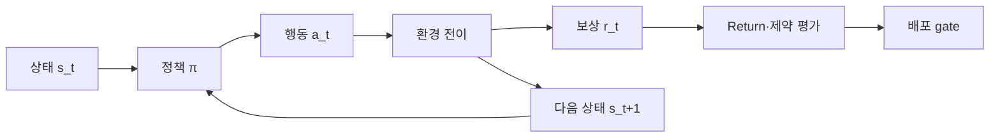



강화학습은 reward를 최대화하는 모델 하나가 아니다.
행동이 미래 관측과 데이터 분포를 바꾸는 순차 의사결정 문제를 명세하고 검증하는 방법이다.

## 1. 문제: 예측과 제어의 차이

지도학습은 고정된 데이터에서 정답을 예측한다.
강화학습의 policy는 행동을 선택하고, 그 행동이 다음 상태와 이후 학습 데이터에 영향을 준다.

따라서 다음 위험이 생긴다.

- reward의 빈틈을 악용한다.
- simulator artifact를 학습한다.
- 탐색 중 안전 제약을 위반한다.
- offline dataset에 없는 행동을 과대평가한다.
- 평균 return이 좋아도 tail failure가 증가한다.
- 관측되지 않은 confounder로 평가가 왜곡된다.

먼저 RL이 필요한지 묻는다.

- 순차 결정이 실제로 중요한가?
- 행동이 미래 상태를 바꾸는가?
- 명시적 최적화나 규칙으로 풀기 어려운가?
- 안전한 simulator 또는 offline data가 있는가?
- reward와 제약을 측정할 수 있는가?

한 번의 분류나 독립적 선택이면 contextual bandit 또는 supervised learning이 더 단순할 수 있다.

## 2. Mental model: MDP와 평가 경계



Markov decision process는 다음 요소로 표현한다.

$$
\mathcal{M}=(\mathcal{S},\mathcal{A},P,R,\gamma)
$$

- 상태 공간 \(\mathcal{S}\)
- 행동 공간 \(\mathcal{A}\)
- 전이 \(P(s'\mid s,a)\)
- 보상 \(R(s,a,s')\)
- 할인율 \(\gamma\)

실제 관측이 완전한 상태가 아니라면 POMDP 관점이 필요하다.
history, belief state, recurrent model이 이를 근사할 수 있지만 identifiability가 자동으로 해결되지는 않는다.

## 3. 환경 계약을 작성한다

```yaml
observation:
  fields: "policy가 실제 시점에 관측 가능한 값만"
  latency: "측정부터 행동까지 지연"
action:
  bounds: "물리·운영 한계"
  duration: "행동이 유지되는 시간"
transition:
  time_step: "결정 간격"
episode:
  start: "초기 상태 분포"
  termination: "성공·실패·시간 제한 구분"
reward:
  components: "목표와 shaping"
constraints:
  hard: "절대 금지"
  soft: "비용으로 최적화"
```

미래 정보가 observation에 들어가면 leakage다.
실제 배포 지연과 missingness도 환경에 재현한다.

시간 제한 종료와 자연스러운 terminal state를 구분해야 value target이 맞는다.

## 4. Return, value, advantage

할인 return:

$$
G_t=\sum_{k=0}^{\infty}\gamma^k r_{t+k+1}
$$

state value와 action value:

$$
V^\pi(s)=\mathbb{E}_\pi[G_t\mid S_t=s]
$$

$$
Q^\pi(s,a)=\mathbb{E}_\pi[G_t\mid S_t=s,A_t=a]
$$

advantage는 특정 상태에서 행동이 평균보다 얼마나 나은지를 나타낸다.

$$
A^\pi(s,a)=Q^\pi(s,a)-V^\pi(s)
$$

이 정의는 algorithm 선택보다 먼저 검증해야 할 conceptual baseline이다.
구현에서 terminal mask, reward scale, discount가 틀리면 어떤 알고리즘도 올바르게 학습하지 못한다.

## 5. Baseline hierarchy

복잡한 RL 전에 다음을 비교한다.

1. 현재 운영 정책
2. 무작위지만 안전한 정책
3. 고정 규칙
4. greedy 또는 myopic optimization
5. model predictive control
6. contextual bandit
7. imitation learning
8. RL policy

RL이 단순 baseline보다 조금만 나으면서 설명과 운영 비용이 훨씬 크면 배포 가치가 없을 수 있다.

oracle 또는 dynamic programming이 가능한 작은 환경을 만든다.
알려진 optimal value와 비교하면 구현 오류를 빠르게 찾을 수 있다.

## 6. Online, offline, model-based를 구분한다

### Online RL

policy가 환경과 상호작용하며 데이터를 모은다.

- 탐색이 가능하다.
- 실제 환경에서는 안전·비용 문제가 크다.
- simulator에서는 simulator bias가 있다.

### Offline RL

고정 dataset으로 policy를 학습한다.

- 새로운 위험 행동 없이 과거 데이터를 활용한다.
- behavior policy support 밖 행동의 value 추정이 불안정하다.
- logged propensity와 coverage가 중요하다.

### Model-based RL

전이 또는 dynamics model을 학습해 planning에 사용한다.

- sample efficiency를 높일 수 있다.
- model error가 rollout 동안 누적된다.
- uncertainty와 짧은 horizon 계획이 중요하다.

하이브리드로 offline pretraining 후 제한된 online fine-tuning을 할 수 있지만 단계별 위험 gate가 필요하다.

## 7. Offline policy evaluation

새 policy를 실제 배포하지 않고 logged data로 평가하려는 문제다.

importance sampling의 기본 idea:

$$
\hat{V}_{IS}=\frac{1}{n}\sum_{i=1}^{n}
\left(\prod_t\frac{\pi(a_t\mid s_t)}{\mu(a_t\mid s_t)}\right)G_i
$$

- \(\pi\): 평가할 target policy
- \(\mu\): 데이터를 만든 behavior policy

확률 비율의 곱은 variance가 매우 커질 수 있다.
weighted IS, per-decision IS, direct method, doubly robust estimator를 비교한다.

공통 전제:

- behavior policy probability가 기록돼 있거나 추정 가능하다.
- target policy 행동이 behavior support 안에 있다.
- 관련 confounder가 상태에 포함된다.
- 데이터 생성 과정이 충분히 안정적이다.

전제가 깨지면 수치가 정교해도 신뢰할 수 없다.

## 8. Reward와 constraint 설계

reward는 목표의 proxy다.
proxy 최적화는 의도하지 않은 shortcut을 만든다.

설계 절차:

1. 최종 결과 지표를 정의한다.
2. hard constraint를 reward와 분리한다.
3. shaping term이 최종 목표와 충돌하지 않는지 본다.
4. 각 component의 scale을 기록한다.
5. agent가 악용할 수 있는 경로를 red-team한다.
6. reward 없이 관찰할 진단 metric을 둔다.

Constrained MDP는 비용 (C_i)에 상한을 둔다.

$$
\max_\pi J_R(\pi)\quad
\text{subject to}\quad J_{C_i}(\pi)\le d_i
$$

penalty 하나로 hard safety를 완전히 보장하지 않는다.
action shield, rule-based interlock, runtime monitor를 별도 계층으로 둔다.

## 9. 실전 workflow

```python
for seed in seeds:
    env = make_env(version=env_version, seed=seed)
    policy = train(config, env)
    report = evaluate(
        policy,
        scenarios=evaluation_scenarios,
        deterministic=True,
        record_trajectories=True,
    )
    save(policy, report, config, env_version)
```

핵심은 여러 seed와 고정 evaluation scenario다.

단계:

1. 작은 deterministic 환경으로 API와 return 계산 검증
2. 규칙·MPC·imitation baseline 구축
3. 여러 seed로 학습 안정성 평가
4. domain randomization과 disturbance test
5. held-out scenario와 초기 상태 평가
6. offline OPE 또는 shadow mode
7. 제한된 action envelope로 canary
8. runtime monitor와 fallback 확인

## 10. 평가 설계

평균 episode return만으로 부족하다.

- 성공률과 실패 유형
- return median과 분산
- 하위 quantile 또는 CVaR
- constraint violation rate와 severity
- intervention rate
- sample efficiency
- convergence stability across seeds
- action smoothness
- distribution shift sensitivity
- inference latency

환경의 stochasticity와 학습 seed를 분리한다.
같은 policy를 여러 environment seed에서 반복 평가한다.

policy 비교에는 paired scenario를 사용하면 variance를 줄일 수 있다.

## 11. 평가 checklist

- [ ] RL이 필요한 순차 의사결정 문제인가?
- [ ] observation에 미래 정보가 포함되지 않았는가?
- [ ] terminal과 time-limit truncation을 구분하는가?
- [ ] reward component와 진단 metric이 분리됐는가?
- [ ] hard constraint가 runtime 계층에서도 강제되는가?
- [ ] 규칙, greedy, MPC, imitation baseline이 있는가?
- [ ] 여러 training seed와 evaluation seed를 사용하는가?
- [ ] 평균뿐 아니라 tail return과 위반 severity를 보는가?
- [ ] offline data의 behavior support를 분석했는가?
- [ ] OPE estimator의 전제와 불확실성을 보고하는가?
- [ ] simulator version과 scenario를 고정했는가?
- [ ] shadow, canary, fallback 경로를 시험했는가?

## 12. 흔한 실패와 한계

### reward 상승을 실제 목표 개선으로 본다

agent가 reward proxy를 악용할 수 있다.
최종 outcome과 사람이 이해할 수 있는 진단 metric을 별도로 본다.

### episode 길이 차이를 무시한다

긴 episode가 더 많은 reward를 얻거나 time-limit 처리 오류가 value를 왜곡할 수 있다.
종료 의미와 normalization을 명확히 한다.

### offline dataset 밖 행동을 신뢰한다

function approximator가 높은 Q를 예측해도 근거 데이터가 없을 수 있다.
support constraint와 conservative objective가 필요하다.

### simulator 최고 정책을 바로 배포한다

simulator의 작은 model error를 policy가 체계적으로 악용할 수 있다.
realism test, shadow mode, 제한된 envelope가 필요하다.

RL은 검증된 안전 제어기를 자동 대체하지 않는다.
특히 고위험 시스템에서는 독립 interlock과 사람 감독을 유지해야 한다.

## 13. 공식 참고자료

- [Reinforcement Learning: An Introduction 공식 공개본](https://incompleteideas.net/book/the-book-2nd.html)
- [Gymnasium 공식 문서](https://gymnasium.farama.org/)
- [Stable-Baselines3 공식 문서](https://stable-baselines3.readthedocs.io/)
- [D4RL 원 논문](https://arxiv.org/abs/2004.07219)
- [Doubly Robust Off-policy Evaluation 원 논문](https://arxiv.org/abs/1511.03722)

## 14. 마무리

강화학습의 출발점은 algorithm 이름이 아니라 상태, 행동, 전이, reward, 제약의 계약이다.
offline 평가와 tail-risk gate를 포함한 단계적 배포가 있어야 높은 return이 실제로 유용한 정책이 된다.
