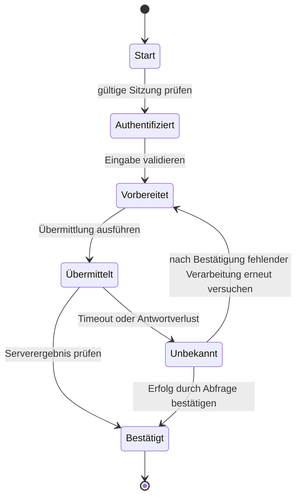



## Problem: Ein Klickskript kann eine Demo sein, ist aber keine Produktionsautomatisierung

Browserautomatisierung kann die Bildschirme, die ein Mensch sehen würde, schnell nachbilden.

DOM, Sitzung, Netzwerk und Geschäftszustand verändern sich jedoch fortlaufend.

- Ein CSS-Pfad bricht nach einer Neugestaltung der Oberfläche.
- Eine Schaltfläche ist sichtbar, kann wegen eines Overlays aber nicht angeklickt werden.
- Der Klick gelingt, doch die serverseitige Verarbeitung scheitert.
- Ein Wiederholungsversuch nach einem Timeout erzeugt einen doppelten Antrag.
- Der Versuch, CAPTCHA oder MFA zu umgehen, verletzt die Sicherheitsrichtlinie.
- Personenbezogene Informationen bleiben in einem Fehler-Screenshot zurück.
- Nach einem Absturz des Browserprozesses ist unklar, wo fortgesetzt werden soll.

Robuste RPA ist keine Sammlung von Selektoren, sondern ein beobachtbarer Zustandsautomat.

## Denkmodell: Bildschirmaktionen vom Geschäftszustand trennen



`Klick abgeschlossen` bedeutet nicht, dass die Geschäftsaktion `Übermittlung abgeschlossen` ist.

Unabhängige Nachweise wie URL, Erfolgsmeldung, Netzwerkantwort, Backend-Abfrage oder Referenznummer sind zu prüfen.

### Zustand in drei Ebenen betrachten

- **Browserzustand**: Seite, Frame, DOM, Cookie, lokaler Speicher
- **Workflow-Zustand**: aktueller Schritt, Versuch, Checkpoint, Frist
- **Geschäftszustand**: tatsächlicher Zustand von Antrag, Bestellung oder Geschäftsdatensatz

Der Browserzustand geht am leichtesten verloren.

Workflow- und Geschäftszustand müssen in einem externen dauerhaften Speicher oder im maßgeblichen System überprüft werden.

## Locator-Entwurf

Die offizielle Playwright-Dokumentation empfiehlt, Locators anhand benutzersichtbarer Attribute und ausdrücklicher Verträge zu priorisieren.

### Empfohlene Priorität

1. Rolle und barrierefreier Name
2. Label
3. Text oder Platzhalter
4. ausdrückliche Test-ID
5. stabiles CSS-Attribut
6. lange CSS-/XPath-Ausdrücke nur als letzte Möglichkeit

```ts
await page.getByRole('button', { name: 'Submit' }).click();
await expect(page.getByRole('status')).toContainText('Completed');
```

`div:nth-child(...)` ist an eine Position in der DOM-Hierarchie gekoppelt und bricht schon bei kleinen Markup-Änderungen.

Entspricht ein Locator mehreren Elementen, wird der Vertrag eingegrenzt, statt das Problem mit `.first()` zu verbergen.

### Umfang des automatischen Wartens

Playwright-Aktionen warten auf Aktionsbedingungen wie Sichtbarkeit, Stabilität und aktivierten Zustand.

Das bedeutet nicht, dass sie auf den Abschluss der Geschäftsaktion warten.

Statt unnötiger fester Pausen wird die erwartete Bedingung angegeben.

```ts
await expect(page.getByText('Processing complete')).toBeVisible();
```

Auch Netzwerkleerlauf ist in einer Anwendung mit Hintergrund-Polling möglicherweise keine Abschlussbedingung.

## Workflow: produktionsreife Automatisierung aufbauen

### Schritt 1. Automatisierungsberechtigung und Nutzungsbedingungen prüfen

Nutzungsbedingungen der Website, API-Verfügbarkeit, Roboterrichtlinie, Genehmigung des Kontoinhabers und Rate Limits prüfen.

CAPTCHA, MFA oder Anti-Bot-Kontrollen nicht umgehen.

Erscheint eine Sicherheitsprüfung, wird in einen Zustand zur menschlichen Übergabe gewechselt.

Existiert eine offizielle API, ist zu bewerten, ob sie stabiler als der Browser ist.

### Schritt 2. Eingabevertrag validieren

Vor dem Öffnen des Browsers Pflichtfelder, Typen, Formate und Duplikatschlüssel prüfen.

Version der Eingabequelle und Zeilen-ID aufzeichnen.

Sensible Informationen nur bei Bedarf aus einem Secret Store abrufen und in Logs maskieren.

### Schritt 3. Zustandsautomat und Checkpoints definieren

Jeder Zustand erhält:

- Eintrittsbedingung
- Aktion
- Erfolgsnachweis
- Timeout
- Wiederholbarkeit
- Checkpoint-Daten
- Kompensation oder menschliche Übergabe

Passwörter oder vollständiges Seiten-HTML dürfen nicht wahllos in Checkpoints gespeichert werden.

### Schritt 4. Authentifizierung als eigenes Modul gestalten

Vor der Wiederverwendung einer Sitzung Ablauf und Kontoidentität prüfen.

Die Storage-State-Datei mit derselben Sensibilität wie Zugangsdaten schützen.

Ist MFA erforderlich, wird ein genehmigter interaktiver Schritt bereitgestellt.

Fehlgeschlagene Anmeldeversuche begrenzen, um eine Kontosperrung zu verhindern.

### Schritt 5. Geschäftsaktionen statt Page Objects abstrahieren

Absicht durch einen Namen wie `submitApplication()` statt `clickButton3()` ausdrücken.

UI-Änderungen in einem Locator-Adapter isolieren.

Eine Geschäftsaktion sollte Erfolgsnachweis und Fehlertaxonomie gemeinsam zurückgeben.

### Schritt 6. Auf Navigation und Pop-ups gemeinsam mit ihren Ereignissen warten

Da ein Ereignis eintreten kann, bevor eine Aktion endet, wird zuerst das Warten registriert.

```ts
const popupPromise = page.waitForEvent('popup');
await page.getByRole('link', { name: 'Open details' }).click();
const popup = await popupPromise;
await popup.waitForLoadState('domcontentloaded');
```

Downloads werden nach demselben Muster behandelt; ihre Prüfsummen und Dateinamen werden verifiziert.

### Schritt 7. Frame- und Shadow-Grenzen ausdrücklich machen

Für Elemente in einem iframe wird ein Frame-Locator verwendet.

Cross-Origin-Frames und Browser-Berechtigungsgrenzen müssen verstanden werden.

Ein Ladefehler eines Frames darf nicht als gewöhnlicher Element-Timeout fehldiagnostiziert werden.

### Schritt 8. Übermittlung idempotent gestalten

Wenn möglich, wird eine Geschäftsreferenz oder ein clientseitig erzeugter Schlüssel in das Formular aufgenommen.

Vor der Übermittlung wird abgefragt, ob er bereits verarbeitet wurde.

Nach einem Timeout darf nicht sofort erneut geklickt werden.

Zuerst anhand von Ergebnisseite, Verlauf, API oder Bestätigungs-ID prüfen, ob die Verarbeitung stattfand.

Ist das Ergebnis unbekannt, wird es im Zustand `unknown` isoliert.

### Schritt 9. Wiederholungstaxonomie erstellen

- Locator vorübergehend nicht verfügbar: begrenzte Wiederholungen erlaubt
- Netzwerkfehler 5xx: nach Prüfung der Idempotenz mit Backoff wiederholen
- Validierungsfehler: keine Wiederholung, bis die Eingabe korrigiert ist
- Authentifizierungs-Challenge: menschliche Übergabe
- Warnung vor Kontosperrung: sofort stoppen
- Änderung des UI-Vertrags: gesamten Batch stoppen und prüfen

Nicht jeden Timeout durch Neuladen der Seite behandeln.

### Schritt 10. Rate und Parallelität begrenzen

Eine Geschwindigkeit über der eines Menschen kann das Zielsystem überlasten.

Parallelität nach Konto, Tenant und Endpoint begrenzen.

Pacing mit Jitter verwenden.

Geschäftszeiten und Wartungsfenster berücksichtigen.

### Schritt 11. Nachweise sicher erfassen

- Lauf-ID
- Eingabezeilen-ID
- Zustandsübergang
- sicherer Teil der Seiten-URL
- Version des Locator-Vertrags
- Antwortstatus
- Bestätigungsreferenz
- bereinigter Screenshot
- begrenzte Aufbewahrung von Traces oder Videos

Screenshots und Traces können Passwörter, Token und personenbezogene Informationen enthalten.

Maskierung, Zugriffskontrolle, Aufbewahrungs- und Löschrichtlinien anwenden.

### Schritt 12. Human-in-the-loop als normalen Zustand behandeln

Mehrdeutige Entscheidungen, rechtliche Einwilligung, CAPTCHA und folgenreiche Übermittlungen werden an einen Menschen übergeben.

Das Übergabepaket enthält aktuellen Schritt, Prüfbedarf, Frist und Fortsetzungsmethode.

Nach Abschluss durch die Person fragt der Workflow den Geschäftszustand erneut ab.

## Praxisbeispiel: wiederholte Formularübermittlung

### Vorbereitung

1. Eingabeschema und Pflichtfelder validieren.
2. Für jede Zeile eine deterministische Operations-ID erzeugen.
3. Laut einem dauerhaften Ledger bereits verarbeitete Operationen ausschließen.
4. Sitzung mit einem genehmigten Konto prüfen.

### Ausführung

1. Auf der Listenseite die Aktion für einen neuen Datensatz mit einem Rollen-Locator auswählen.
2. Formularfelder mit Label-Locators ausfüllen.
3. Werte zurücklesen und vergleichen, um ihre Darstellung in der Oberfläche zu bestätigen.
4. Die Zusammenfassungsseite unmittelbar vor der Übermittlung erfassen und sensible Werte maskieren.
5. Zuerst das Warten auf Antwort oder Bestätigungselement registrieren.
6. Die Übermittlungsschaltfläche genau einmal drücken.
7. Bestätigungs-ID extrahieren.
8. Operations-ID auf dem Ergebnis-Abfragebildschirm vergleichen.
9. Abgeschlossenen Zustand und Nachweisreferenz atomar im Ledger erfassen.

### Timeout

1. Keine neue Übermittlung ausführen.
2. Auf der Verlaufsseite nach der Operations-ID suchen.
3. Wird sie gefunden, den Vorgang als abgeschlossen abgleichen.
4. Wird sie nicht gefunden, erst nach einer sicheren Wartezeit wiederholen.
5. Lässt sich das Ergebnis nicht bestimmen, für eine menschliche Prüfung isolieren.

## Teststrategie

### Vertragstests

In der Testumgebung prüfen, dass Rollen, Labels und Test-IDs erhalten bleiben.

### Fixture-Tests

Gespeicherte, sichere HTML-Fixtures verwenden, um Parsing und Zustandserkennung zu testen.

Dokumentieren, dass Fixtures echtes JavaScript-Verhalten nicht vollständig nachbilden können.

### Fehlerinjektion

Netzwerkverzögerungen, 5xx-Antworten, Pop-up-Blockierung, Downloadfehler und Sitzungsablauf injizieren.

### Canary-Läufe

Mit einem kleinen genehmigten Batch beginnen und Fehlerrate sowie UI-Drift beobachten.

### Abgleichstests

Doppelte Eingaben, einen Erfolg nach Timeout und einen alten Checkpoint bereitstellen und prüfen, dass das Endergebnis keine Duplikate enthält.

## Prüfliste zur Verifikation

### Vertrag und Sicherheit

- [ ] Automatisierungsberechtigung und Nutzungsbedingungen wurden geprüft.
- [ ] CAPTCHA und MFA werden nicht umgangen.
- [ ] Konto- und Sitzungsidentität werden geprüft.
- [ ] Secrets und Storage State sind geschützt.
- [ ] Für Screenshots, Traces und Logs besteht eine Richtlinie zu sensiblen Informationen.

### Zuverlässigkeit

- [ ] Rollen-, Label- und Test-ID-Locators werden bevorzugt.
- [ ] Statt fester Pausen wird auf erwartete Zustände gewartet.
- [ ] Der Geschäftsabschluss wird mit unabhängigen Nachweisen bestätigt.
- [ ] Nach einem Timeout wird der Geschäftszustand abgeglichen.
- [ ] Jeder Zustand besitzt Timeout- und Wiederholungsrichtlinie.
- [ ] Parallelitäts- und Rate-Limits sind eingerichtet.

### Betrieb

- [ ] Checkpoints sind dauerhaft und minimieren sensible Informationen.
- [ ] Bei Erkennung einer UI-Änderung stoppt der Batch.
- [ ] Canary- und Dry-run-Modi sind verfügbar.
- [ ] Verfahren für menschliche Übergabe und Fortsetzung bestehen.
- [ ] Bestätigungs-IDs sind mit Eingabezeilen verknüpft.
- [ ] Browser und Kontexte sind zwischen Läufen isoliert.

## Häufige Fehler und Einschränkungen

### Nur den Timeout erhöhen

Dadurch erscheint ein langsamer Fehler lediglich später.

Es ist festzulegen, auf welchen Zustand gewartet wird und welches Ziel-SLO gilt.

### Einen erfolgreichen Screenshot als Geschäftserfolg behandeln

Der Bildschirm kann veraltet oder optimistisch sein.

Bestätigungsreferenz und Ergebnisabfrage gemeinsam verwenden.

### Selektorreparatur automatisch anwenden

Sie kann eine ähnliche, aber andere Schaltfläche auswählen und eine falsche Nebenwirkung verursachen.

Selbstheilende Selektoren für folgenreiche Aktionen erfordern eine menschliche Prüfung.

### Ein Browserprofil unter mehreren Workern teilen

Dies verursacht Cookie- und Speicher-Races sowie Konflikte zwischen Kontositzungen.

Isolierte Kontexte und eindeutige Kontoverantwortung verwenden.

### RPA als dauerhafte Integration belassen

UI-Automatisierung ist fragil.

Für langfristige, hochvolumige oder zentrale Abläufe ist eine Roadmap zur Migration auf eine offizielle API oder Partnerintegration zu pflegen.

## Offizielle Referenzen

- [Playwright Locators](https://playwright.dev/docs/locators)
- [Automatisches Warten in Playwright](https://playwright.dev/docs/actionability)
- [Bewährte Verfahren für Playwright](https://playwright.dev/docs/best-practices)
- [Playwright-Authentifizierung](https://playwright.dev/docs/auth)
- [Playwright Trace Viewer](https://playwright.dev/docs/trace-viewer)

## Fazit

Robuste Browserautomatisierung entsteht durch eindeutige Zustände und überprüfbare Abschlussbedingungen, nicht durch raffiniertere Selektoren.

Browser- und Geschäftszustand werden getrennt, Timeouts als unbekannt behandelt und Idempotenz sowie Abgleich eingebaut.

Schritte, die menschliches Urteil oder eine Sicherheitsgrenze erfordern, müssen als formale Übergaben entworfen statt umgangen werden, damit die Automatisierung langfristig Bestand hat.
