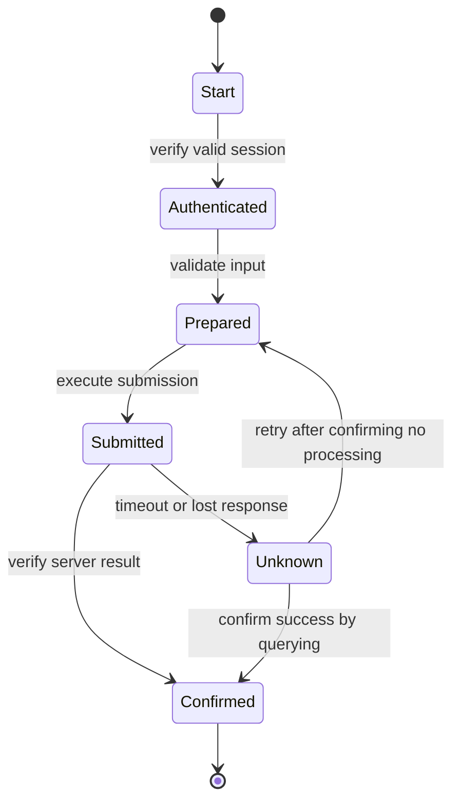



## Problem: a click script may be a demo, but it is not production automation

Browser automation can quickly reproduce the screens that a person would see.

But the DOM, session, network, and business state keep changing.

- A CSS path breaks after a UI redesign.
- A button is visible but cannot be clicked because of an overlay.
- The click succeeds, but server-side processing fails.
- A retry after a timeout creates a duplicate application.
- Attempting to bypass CAPTCHA or MFA violates security policy.
- Personal information remains in an error screenshot.
- After the browser process crashes, it is unclear where to resume.

Robust RPA is not a collection of selectors; it is an observable state machine.

## Mental model: separate screen actions from business state



`click completed` does not mean the business action is `submission completed`.

Verify independent evidence such as the URL, a success message, a network response, a backend query, or a reference number.

### View state in three layers

- **Browser state**: page, frame, DOM, cookie, local storage
- **Workflow state**: current step, attempt, checkpoint, deadline
- **Business state**: actual state of the application, order, or business record

Browser state is the easiest to lose.

Workflow and business state must be verified in an external durable store or in the system of record.

## Locator design

The official Playwright documentation recommends prioritizing locators based on user-facing attributes and explicit contracts.

### Recommended priority

1. Role and accessible name
2. Label
3. Text or placeholder
4. Explicit test ID
5. Stable CSS attribute
6. Long CSS/XPath expressions only as a last resort

```ts
await page.getByRole('button', { name: 'Submit' }).click();
await expect(page.getByRole('status')).toContainText('Completed');
```

`div:nth-child(...)`, which is coupled to a position in the DOM hierarchy, breaks even with small markup changes.

If a locator matches multiple elements, narrow the contract instead of hiding the issue with `.first()`.

### Scope of auto-waiting

Playwright actions wait for actionability conditions such as visibility, stability, and enabled state.

That does not mean they wait for the business action to finish.

State the expected condition instead of using unnecessary fixed sleeps.

```ts
await expect(page.getByText('Processing complete')).toBeVisible();
```

Network idle may not be a completion condition in an application with background polling either.

## Workflow: building production-ready automation

### Step 1. Verify automation authorization and terms of use

Check the site's terms, API availability, robot policy, account-owner approval, and rate limits.

Do not bypass CAPTCHA, MFA, or anti-bot controls.

When a security check appears, transition to a human-handoff state.

If an official API exists, assess whether it is more stable than the browser.

### Step 2. Validate the input contract

Before opening the browser, check required fields, types, formats, and duplicate keys.

Record the input source version and row ID.

Retrieve sensitive information from a secret store only when needed and mask it in logs.

### Step 3. Define the state machine and checkpoints

Give each state the following:

- entry condition
- action
- success evidence
- timeout
- retryability
- checkpoint data
- compensation or human handoff

Do not indiscriminately store passwords or full-page HTML in checkpoints.

### Step 4. Make authentication a separate module

Before reusing a session, verify its expiration and account identity.

Protect the storage state file with the same sensitivity as a credential.

When MFA is required, provide an approved interactive step.

Limit failed login attempts to prevent account lockout.

### Step 5. Abstract business actions rather than page objects

Express intent with a name such as `submitApplication()` instead of `clickButton3()`.

Isolate UI changes in a locator adapter.

A business action should return success evidence and an error taxonomy together.

### Step 6. Wait for navigation and popups together with their events

Because an event can occur before an action finishes, register the wait first.

```ts
const popupPromise = page.waitForEvent('popup');
await page.getByRole('link', { name: 'Open details' }).click();
const popup = await popupPromise;
await popup.waitForLoadState('domcontentloaded');
```

Handle downloads with the same pattern and verify their checksums and filenames.

### Step 7. Make frame and shadow boundaries explicit

Use a frame locator for elements inside an iframe.

Understand cross-origin frames and browser permission boundaries.

Do not misdiagnose a frame load failure as an ordinary element timeout.

### Step 8. Make submission idempotent

When possible, include a business reference or client-generated key in the form.

Query whether it has already been processed before submitting.

Do not immediately click again after a timeout.

First use the results page, history, API, or confirmation ID to verify whether processing occurred.

If the outcome is unknown, isolate it in the `unknown` state.

### Step 9. Create a retry taxonomy

- locator temporarily unavailable: limited retries allowed
- network 5xx: back off after verifying idempotency
- validation error: no retry until the input is corrected
- authentication challenge: human handoff
- account lockout warning: stop immediately
- UI contract change: stop and review the entire batch

Do not handle every timeout by reloading the page.

### Step 10. Limit rate and concurrency

A speed faster than a human's can overwhelm the target system.

Limit concurrency by account, tenant, and endpoint.

Use pacing with jitter.

Consider business hours and maintenance windows.

### Step 11. Collect evidence safely

- run ID
- input row ID
- state transition
- safe portion of the page URL
- locator contract version
- response status
- confirmation reference
- sanitized screenshot
- limited retention of traces or videos

Screenshots and traces can contain passwords, tokens, and personal information.

Apply masking, access control, retention, and deletion policies.

### Step 12. Treat human-in-the-loop as a normal state

Hand ambiguous choices, legal consent, CAPTCHA, and high-impact submissions to a person.

Include the current step, what must be checked, the deadline, and the resumption method in the handoff packet.

After the person finishes, have the workflow query the business state again.

## Practical example: repeated form submission

### Preparation

1. Validate the input schema and mandatory fields.
2. Create a deterministic operation ID for each row.
3. Exclude operations already processed according to a durable ledger.
4. Verify the session with an approved account.

### Execution

1. On the list page, select the new-record action with a role locator.
2. Fill form fields with label locators.
3. Read the values back and compare them to ensure the UI reflects them.
4. Capture the summary screen immediately before submission, masking sensitive values.
5. Register the wait for the response or confirmation element first.
6. Press the submit button exactly once.
7. Extract the confirmation ID.
8. Compare the operation ID on the result-query screen.
9. Atomically record the completed state and evidence reference in the ledger.

### Timeout

1. Do not make a new submission.
2. Search for the operation ID on the history page.
3. If found, reconcile it as complete.
4. If not found, retry only after a safe amount of time has passed.
5. If the result cannot be determined, isolate it for human review.

## Testing strategy

### Contract tests

Verify in the test environment that roles, labels, and test IDs are preserved.

### Fixture tests

Use stored, safe HTML fixtures to test parsing and state detection.

Document the limitation that fixtures cannot fully reproduce real JavaScript behavior.

### Failure injection

Inject network delays, 5xx responses, popup blocking, download failures, and session expiration.

### Canary runs

Start with a small approved batch and observe the error rate and UI drift.

### Reconciliation tests

Supply duplicate input, a success after timeout, and an old checkpoint, and verify that the final result contains no duplicates.

## Verification checklist

### Contract and security

- [ ] Automation authorization and terms of use have been verified.
- [ ] CAPTCHA and MFA are not bypassed.
- [ ] The account and session identity are verified.
- [ ] Secrets and storage state are protected.
- [ ] There is a sensitive-information policy for screenshots, traces, and logs.

### Reliability

- [ ] Role, label, and test ID locators are preferred.
- [ ] Expected states are awaited instead of fixed sleeps.
- [ ] Business completion is confirmed with independent evidence.
- [ ] Business state is reconciled after a timeout.
- [ ] Each state has a timeout and retry policy.
- [ ] Concurrency and rate limits are in place.

### Operations

- [ ] Checkpoints are durable and minimize sensitive information.
- [ ] The batch stops when a UI change is detected.
- [ ] Canary and dry-run modes are available.
- [ ] Human handoff and resumption procedures exist.
- [ ] Confirmation IDs are linked to input rows.
- [ ] Browsers and contexts are isolated between runs.

## Common failures and limitations

### Only increasing the timeout

This merely makes a slow failure appear later.

Specify which state is being awaited and the target SLO.

### Treating a successful screenshot as business success

The screen may be stale or optimistic.

Use a confirmation reference and a result query together.

### Applying selector repair automatically

It can select a similar but different button and cause an incorrect side effect.

Self-healing selectors for high-impact actions require human review.

### Sharing a browser profile among multiple workers

This creates cookie and storage races and account-session conflicts.

Use isolated contexts and clear account ownership.

### Leaving RPA in place as a permanent integration

UI automation is brittle.

For long-term, high-volume, or core flows, maintain a roadmap for migration to an official API or partner integration.

## Official references

- [Playwright Locators](https://playwright.dev/docs/locators)
- [Playwright Auto-waiting](https://playwright.dev/docs/actionability)
- [Playwright Best Practices](https://playwright.dev/docs/best-practices)
- [Playwright Authentication](https://playwright.dev/docs/auth)
- [Playwright Trace Viewer](https://playwright.dev/docs/trace-viewer)

## Conclusion

Robust browser automation comes from clear states and verifiable completion conditions, not from cleverer selectors.

Separate browser state from business state, treat timeouts as unknown, and build in idempotency and reconciliation.

Stages that require human judgment or a security boundary must be designed as formal handoffs rather than bypassed if the automation is to survive over time.
