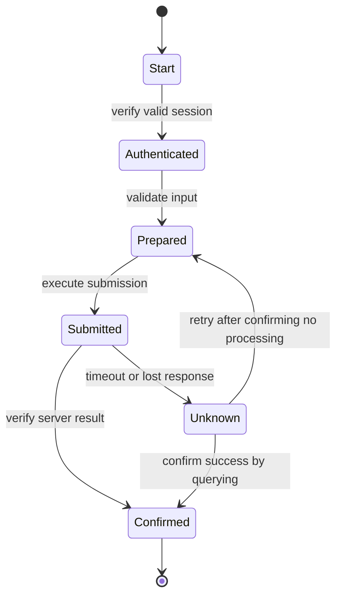



## Problema: un script de clic puede ser una demostración, pero no es una automatización de producción

La automatización del navegador puede reproducir rápidamente las pantallas que vería una persona.

Pero el DOM, la sesión, la red y el estado comercial siguen cambiando.

- Una ruta CSS se interrumpe después de un rediseño UI.
- Un botón está visible pero no se puede hacer clic debido a una superposición.
- El clic se realiza correctamente, pero falla el procesamiento del lado del servidor.
- Un reintento después de un tiempo de espera crea una aplicación duplicada.
- Intentar omitir CAPTCHA o MFA viola la política de seguridad.
- La información personal permanece en una captura de pantalla de error.
- Después de que el proceso del navegador falla, no está claro dónde continuar.

Robusto RPA no es una colección de selectores; es una máquina de estados observable.

## Modelo mental: separar las acciones de la pantalla del estado del negocio



`click completed` no significa que la acción comercial sea `submission completed`.

Verifique evidencia independiente como URL, un mensaje de éxito, una respuesta de red, una consulta de backend o un número de referencia.

### Ver estado en tres capas

- **Estado del navegador**: página, marco, DOM, cookie, almacenamiento local
- **Estado del flujo de trabajo**: paso actual, intento, punto de control, fecha límite
- **Estado comercial**: estado real de la solicitud, pedido o registro comercial

El estado del navegador es el más fácil de perder.

El flujo de trabajo y el estado del negocio deben verificarse en un almacén duradero externo o en el sistema de registro.

## Diseño de localizador

La documentación oficial de Playwright recomienda priorizar los localizadores en función de los atributos de cara al usuario y los contratos explícitos.

### Prioridad recomendada

1. Rol y nombre accesible
2. Etiqueta
3. Texto o marcador de posición
4. Prueba explícita ID
5. Atributo CSS estable
6. Expresiones XPath largas CSS/solo como último recurso

```ts
await page.getByRole('button', { name: 'Submit' }).click();
await expect(page.getByRole('status')).toContainText('Completed');
```

`div:nth-child(...)`, que está acoplado a una posición en la jerarquía DOM, se equilibra con pequeños cambios de marcado.

Si un localizador coincide con varios elementos, limite el contrato en lugar de ocultar el problema con `.first()`.

### Alcance de la espera automática

Las acciones de los dramaturgos esperan condiciones de capacidad de acción como visibilidad, estabilidad y estado de habilitación.

Eso no quiere decir que esperen a que finalice la acción empresarial.

Indique la condición esperada en lugar de utilizar períodos de sueño fijos innecesarios.

```ts
await expect(page.getByText('Processing complete')).toBeVisible();
```

La inactividad de la red tampoco puede ser una condición de finalización en una aplicación con sondeo en segundo plano.

## Flujo de trabajo: creación de automatización lista para producción

### Paso 1. Verificar la autorización de automatización y los términos de uso

Verifique los términos del sitio, la disponibilidad de API, la política de robots, la aprobación del propietario de la cuenta y los límites de tarifas.

No omitas CAPTCHA, MFA ni los controles anti-bot.

Cuando aparezca un control de seguridad, pase a un estado de transferencia humana.

Si existe un API oficial, evalúe si es más estable que el navegador.

### Paso 2. Validar el contrato de entrada

Antes de abrir el navegador, verifique los campos obligatorios, los tipos, los formatos y las claves duplicadas.

Registre la versión de la fuente de entrada y la fila ID.

Recupere información confidencial de un almacén secreto solo cuando sea necesario y enmascarela en registros.

### Paso 3. Definir la máquina de estados y los puntos de control

Dé a cada estado lo siguiente:

- condición de entrada
- acción
- evidencia de éxito
- tiempo de espera
- reintento
- datos del punto de control
- compensación o transferencia humana

No almacene indiscriminadamente contraseñas o páginas completas HTML en los puntos de control.

### Paso 4. Haga de la autenticación un módulo separado

Antes de reutilizar una sesión, verifique su vencimiento y la identidad de la cuenta.

Proteja el archivo de estado de almacenamiento con la misma sensibilidad que una credencial.

Cuando se requiera MFA, proporcione un paso interactivo aprobado.

Limite los intentos fallidos de inicio de sesión para evitar el bloqueo de la cuenta.

### Paso 5. Acciones comerciales abstractas en lugar de objetos de página

Exprese la intención con un nombre como `submitApplication()` en lugar de `clickButton3()`.

Aislar UI cambios en un adaptador de localizador.

Una acción empresarial debería arrojar pruebas de éxito y una taxonomía de errores juntas.

### Paso 6. Espere la navegación y las ventanas emergentes junto con sus eventos

Dado que un evento puede ocurrir antes de que finalice una acción, primero registre la espera.

```ts
const popupPromise = page.waitForEvent('popup');
await page.getByRole('link', { name: 'Open details' }).click();
const popup = await popupPromise;
await popup.waitForLoadState('domcontentloaded');
```

Maneje las descargas con el mismo patrón y verifique sus sumas de verificación y nombres de archivos.

### Paso 7. Hacer explícitos los límites del marco y la sombra

Utilice un localizador de marcos para elementos dentro de un iframe.

Comprenda los marcos de origen cruzado y los límites de permisos del navegador.

No diagnostique erróneamente una falla de carga del marco como un tiempo de espera de elemento ordinario.

### Paso 8. Hacer que el envío sea idempotente

Cuando sea posible, incluya una referencia comercial o una clave generada por el cliente en el formulario.

Consulte si ya ha sido procesado antes de enviarlo.

No vuelva a hacer clic inmediatamente después de un tiempo de espera.

Primero use la página de resultados, el historial, API o la confirmación ID para verificar si se produjo el procesamiento.

Si se desconoce el resultado, aíslelo en el estado `unknown`.

### Paso 9. Crear una taxonomía de reintento

- localizador no disponible temporalmente: se permiten reintentos limitados
- red 5xx: retroceda después de verificar la idempotencia
- error de validación: no se puede volver a intentar hasta que se corrija la entrada
- desafío de autenticación: transferencia humana
- advertencia de bloqueo de cuenta: detenerse inmediatamente
- UI cambio de contrato: detener y revisar todo el lote

No gestione cada tiempo de espera recargando la página.

### Paso 10. Tasa límite y concurrencia

Una velocidad más rápida que la de un humano puede abrumar al sistema objetivo.

Limite la simultaneidad por cuenta, inquilino y punto final.

Utilice el ritmo con inquietud.

Considere los horarios comerciales y las ventanas de mantenimiento.

### Paso 11. Recopilar pruebas de forma segura

- ejecutar ID
- fila de entrada ID
- transición de estado
- parte segura de la página URL
- versión de contrato de localizador
- estado de respuesta
- referencia de confirmación
- captura de pantalla desinfectada
- retención limitada de rastros o vídeos

Las capturas de pantalla y los seguimientos pueden contener contraseñas, tokens e información personal.

Aplicar políticas de enmascaramiento, control de acceso, retención y eliminación.

### Paso 12. Trate al ser humano involucrado como un estado normal

Entregue opciones ambiguas, consentimiento legal, CAPTCHA y presentaciones de alto impacto a una persona.

Incluya el paso actual, lo que se debe verificar, la fecha límite y el método de reanudación en el paquete de transferencia.

Una vez que la persona termine, haga que el flujo de trabajo vuelva a consultar el estado del negocio.

## Ejemplo práctico: envío repetido de formularios

### Preparación

1. Valide el esquema de entrada y los campos obligatorios.
2. Cree una operación determinista ID para cada fila.
3. Excluir operaciones ya procesadas según un libro de contabilidad duradero.
4. Verificar la sesión con una cuenta aprobada.

### Ejecución

1. En la página de lista, seleccione la acción de nuevo registro con un localizador de roles.
2. Complete los campos del formulario con localizadores de etiquetas.
3. Vuelva a leer los valores y compárelos para asegurarse de que UI los refleje.
4. Capture la pantalla de resumen inmediatamente antes del envío, enmascarando los valores confidenciales.
5. Registre primero la espera del elemento de respuesta o confirmación.
6. Presione el botón enviar exactamente una vez.
7. Extraiga la confirmación ID.
8. Compare la operación ID en la pantalla de consulta de resultados.
9. Registre atómicamente el estado completo y la referencia de evidencia en el libro mayor.

### Tiempo de espera

1. No realizar un nuevo envío.
2. Busque la operación ID en la página del historial.
3. Si lo encuentra, concílelo como completo.
4. Si no lo encuentra, vuelva a intentarlo sólo después de que haya transcurrido un tiempo seguro.
5. Si no se puede determinar el resultado, aíslelo para revisión humana.

## Estrategia de prueba

### Pruebas de contrato

Verifique en el entorno de prueba que se conserven los roles, las etiquetas y los ID de prueba.

### Pruebas de accesorios

Utilice accesorios HTML seguros y almacenados para probar el análisis y la detección de estado.

Documente la limitación de que los dispositivos no pueden reproducir completamente el comportamiento real de JavaScript.

### Inyección fallida

Inyecte retrasos en la red, respuestas 5xx, bloqueo de ventanas emergentes, fallas de descarga y caducidad de sesiones.

### Carreras canarias

Comience con un pequeño lote aprobado y observe la tasa de error y la deriva UI.

### Pruebas de conciliación

Proporcione entradas duplicadas, un éxito después del tiempo de espera y un punto de control antiguo, y verifique que el resultado final no contenga duplicados.

## Lista de verificación de verificación

### Contrato y seguridad

- [ ] Se han verificado la autorización de automatización y los términos de uso.
- [ ] CAPTCHA y MFA no se omiten.
- [ ] Se verifica la identidad de la cuenta y la sesión.
- [] Los secretos y el estado de almacenamiento están protegidos.
- [] Existe una política de información confidencial para capturas de pantalla, seguimientos y registros.

### Fiabilidad

- [] Se prefieren los localizadores de función, etiqueta y prueba ID.
- [] Se esperan estados esperados en lugar de periodos de sueño fijos.
- [ ] La finalización del negocio se confirma con evidencia independiente.
- [ ] El estado del negocio se concilia después de un tiempo de espera.
- [] Cada estado tiene una política de tiempo de espera y reintento.
- [ ] Existen límites de simultaneidad y tasas.

### Operaciones

- [ ] Los puntos de control son duraderos y minimizan la información confidencial.
- [ ] El lote se detiene cuando se detecta un cambio UI.
- [ ] Los modos Canary y Dry-Run están disponibles.
- [ ] Existen procedimientos humanos de transferencia y reanudación.
- [] Los ID de confirmación están vinculados a filas de entrada.
- [] Los navegadores y contextos están aislados entre ejecuciones.

## Fallos y limitaciones comunes

### Solo aumenta el tiempo de espera

Esto simplemente hace que más tarde aparezca un lento fracaso.

Especifique qué estado se está esperando y el objetivo SLO.

### Tratar una captura de pantalla exitosa como un éxito empresarial

La pantalla puede estar obsoleta u optimista.

Utilice una referencia de confirmación y una consulta de resultados juntas.

### Aplicar la reparación del selector automáticamente

Puede seleccionar un botón similar pero diferente y provocar un efecto secundario incorrecto.

Los selectores de autorreparación para acciones de alto impacto requieren revisión humana.

### Compartir un perfil de navegador entre varios trabajadores

Esto crea carreras de cookies y almacenamiento y conflictos entre sesiones de cuenta.

Utilice contextos aislados y propiedad clara de la cuenta.

### Dejar RPA en su lugar como una integración permanente

La automatización UI es frágil.

Para flujos principales, de gran volumen o a largo plazo, mantenga una hoja de ruta para la migración a una API oficial o una integración de socios.

## Referencias oficiales

- [Localizadores de dramaturgos](https://playwright.dev/docs/locators)
- [Espera automática del dramaturgo](https://playwright.dev/docs/actionability)
- [Prácticas recomendadas para dramaturgos](https://playwright.dev/docs/best-practices)
- [Autenticación de dramaturgo](https://playwright.dev/docs/auth)
- [Visor de seguimiento del dramaturgo](https://playwright.dev/docs/trace-viewer)

## Conclusión

La automatización sólida del navegador proviene de estados claros y condiciones de finalización verificables, no de selectores más inteligentes.

Separe el estado del navegador del estado del negocio, trate los tiempos de espera como desconocidos e incorpore idempotencia y reconciliación.

Las etapas que requieren juicio humano o un límite de seguridad deben diseñarse como transferencias formales en lugar de pasarse por alto si se quiere que la automatización sobreviva en el tiempo.
