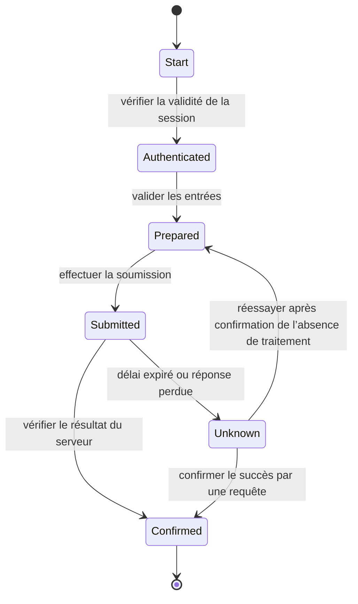



## Problème : un script de clics peut servir de démonstration, mais ce n’est pas une automatisation de production

L’automatisation du navigateur permet de reproduire rapidement les écrans qu’une personne verrait.

Mais le DOM, la session, le réseau et l’état métier changent en permanence.

- Un chemin CSS casse après une refonte de l’interface.
- Un bouton est visible, mais une superposition empêche de cliquer dessus.
- Le clic réussit, mais le traitement côté serveur échoue.
- Une nouvelle tentative après expiration du délai crée une demande en double.
- Tenter de contourner un CAPTCHA ou une MFA enfreint la politique de sécurité.
- Des informations personnelles subsistent dans une capture d’écran d’erreur.
- Après le plantage du processus du navigateur, le point de reprise n’est pas clair.

Une RPA robuste n’est pas un ensemble de sélecteurs : c’est une machine à états observable.

## Modèle mental : séparer les actions à l’écran de l’état métier



`click completed` ne signifie pas que l’action métier est `submission completed`.

Vérifiez des preuves indépendantes comme l’URL, un message de réussite, une réponse réseau, une requête au système dorsal ou un numéro de référence.

### Considérer l’état selon trois couches

- **État du navigateur** : page, cadre, DOM, cookie, stockage local
- **État du flux de travail** : étape actuelle, tentative, point de reprise, échéance
- **État métier** : état réel de la demande, de la commande ou du dossier métier

L’état du navigateur est le plus facile à perdre.

L’état du flux de travail et l’état métier doivent être vérifiés dans un stockage externe durable ou dans le système de référence.

## Conception des localisateurs

La documentation officielle de Playwright recommande de privilégier les localisateurs fondés sur les attributs visibles par l’utilisateur et sur des contrats explicites.

### Ordre de priorité recommandé

1. Rôle et nom accessible
2. Étiquette
3. Texte ou espace réservé
4. Identifiant de test explicite
5. Attribut CSS stable
6. Expressions CSS ou XPath longues, uniquement en dernier recours

```ts
await page.getByRole('button', { name: 'Submit' }).click();
await expect(page.getByRole('status')).toContainText('Completed');
```

`div:nth-child(...)`, qui dépend d’une position dans la hiérarchie du DOM, casse au moindre changement du balisage.

Si un localisateur correspond à plusieurs éléments, précisez le contrat au lieu de masquer le problème avec `.first()`.

### Portée de l’attente automatique

Les actions Playwright attendent que soient remplies des conditions d’actionnabilité telles que la visibilité, la stabilité et l’état activé.

Cela ne signifie pas qu’elles attendent la fin de l’action métier.

Indiquez la condition attendue au lieu d’utiliser des temporisations fixes inutiles.

```ts
await expect(page.getByText('Processing complete')).toBeVisible();
```

Dans une application qui interroge le serveur en arrière-plan, l’inactivité réseau n’est pas nécessairement une condition d’achèvement non plus.

## Flux de travail : construire une automatisation prête pour la production

### Étape 1. Vérifier l’autorisation d’automatiser et les conditions d’utilisation

Vérifiez les conditions du site, la disponibilité d’une API, la politique relative aux robots, l’accord du propriétaire du compte et les limites de débit.

Ne contournez ni CAPTCHA, ni MFA, ni mécanisme anti-robot.

Lorsqu’un contrôle de sécurité apparaît, passez à un état de transfert vers un opérateur humain.

S’il existe une API officielle, évaluez si elle est plus stable que le navigateur.

### Étape 2. Valider le contrat des entrées

Avant d’ouvrir le navigateur, vérifiez les champs obligatoires, les types, les formats et les clés en double.

Consignez la version de la source d’entrée et l’identifiant de la ligne.

Ne récupérez les informations sensibles dans un coffre de secrets qu’au moment nécessaire et masquez-les dans les journaux.

### Étape 3. Définir la machine à états et les points de reprise

Attribuez à chaque état les éléments suivants :

- condition d’entrée
- action
- preuve de réussite
- délai d’expiration
- possibilité de nouvelle tentative
- données du point de reprise
- compensation ou transfert vers un humain

Ne stockez pas indistinctement des mots de passe ou le code HTML complet de la page dans les points de reprise.

### Étape 4. Isoler l’authentification dans un module

Avant de réutiliser une session, vérifiez sa date d’expiration et l’identité du compte.

Protégez le fichier d’état de stockage comme une information d’authentification.

Lorsqu’une MFA est requise, prévoyez une étape interactive approuvée.

Limitez le nombre d’échecs de connexion afin d’éviter le verrouillage du compte.

### Étape 5. Abstraire les actions métier plutôt que les objets de page

Exprimez l’intention avec un nom comme `submitApplication()` plutôt que `clickButton3()`.

Isolez les changements d’interface dans un adaptateur de localisateurs.

Une action métier doit renvoyer à la fois une preuve de réussite et une taxonomie des erreurs.

### Étape 6. Attendre la navigation et les fenêtres contextuelles en même temps que leurs événements

Un événement pouvant survenir avant la fin d’une action, enregistrez d’abord l’attente.

```ts
const popupPromise = page.waitForEvent('popup');
await page.getByRole('link', { name: 'Open details' }).click();
const popup = await popupPromise;
await popup.waitForLoadState('domcontentloaded');
```

Traitez les téléchargements selon le même schéma et vérifiez leur somme de contrôle et leur nom de fichier.

### Étape 7. Expliciter les limites des cadres et du DOM fantôme

Utilisez un localisateur de cadre pour les éléments situés dans un iframe.

Comprenez les cadres inter-origines et les limites des autorisations du navigateur.

Ne diagnostiquez pas à tort l’échec de chargement d’un cadre comme une simple expiration du délai d’un élément.

### Étape 8. Rendre la soumission idempotente

Dans la mesure du possible, incluez dans le formulaire une référence métier ou une clé générée par le client.

Avant de soumettre, interrogez le système pour savoir si elle a déjà été traitée.

Après l’expiration d’un délai, ne cliquez pas immédiatement une seconde fois.

Vérifiez d’abord, à l’aide de la page des résultats, de l’historique, de l’API ou de l’identifiant de confirmation, si le traitement a eu lieu.

Si le résultat est inconnu, isolez-le dans l’état `unknown`.

### Étape 9. Créer une taxonomie des nouvelles tentatives

- localisateur temporairement indisponible : nouvelles tentatives limitées autorisées
- erreur réseau 5xx : appliquer un délai progressif après vérification de l’idempotence
- erreur de validation : aucune nouvelle tentative avant correction de l’entrée
- défi d’authentification : transfert vers un humain
- avertissement de verrouillage du compte : arrêt immédiat
- modification du contrat d’interface : arrêt et examen du lot entier

Ne traitez pas toutes les expirations de délai en rechargeant la page.

### Étape 10. Limiter le débit et la concurrence

Une vitesse supérieure à celle d’une personne peut saturer le système cible.

Limitez la concurrence par compte, locataire et point de terminaison.

Cadencez les opérations avec une gigue aléatoire.

Tenez compte des heures ouvrées et des fenêtres de maintenance.

### Étape 11. Recueillir les preuves en toute sécurité

- identifiant d’exécution
- identifiant de ligne d’entrée
- transition d’état
- partie non sensible de l’URL de la page
- version du contrat de localisateur
- état de la réponse
- référence de confirmation
- capture d’écran expurgée
- conservation limitée des traces ou vidéos

Les captures d’écran et les traces peuvent contenir des mots de passe, des jetons et des informations personnelles.

Appliquez des règles de masquage, de contrôle d’accès, de conservation et de suppression.

### Étape 12. Traiter l’intervention humaine comme un état normal

Confiez à une personne les choix ambigus, le consentement juridique, les CAPTCHA et les soumissions à fort impact.

Incluez dans le dossier de transfert l’étape actuelle, ce qui doit être vérifié, l’échéance et la méthode de reprise.

Une fois l’intervention terminée, faites de nouveau interroger l’état métier par le flux de travail.

## Exemple pratique : soumissions répétées d’un formulaire

### Préparation

1. Valider le schéma d’entrée et les champs obligatoires.
2. Créer un identifiant d’opération déterministe pour chaque ligne.
3. Exclure les opérations déjà traitées selon un registre durable.
4. Vérifier la session avec un compte approuvé.

### Exécution

1. Sur la page de liste, sélectionner l’action de création avec un localisateur de rôle.
2. Remplir les champs du formulaire avec des localisateurs d’étiquette.
3. Relire les valeurs et les comparer pour s’assurer que l’interface les reflète correctement.
4. Capturer l’écran récapitulatif juste avant la soumission, en masquant les valeurs sensibles.
5. Enregistrer d’abord l’attente de la réponse ou de l’élément de confirmation.
6. Appuyer exactement une fois sur le bouton de soumission.
7. Extraire l’identifiant de confirmation.
8. Comparer l’identifiant d’opération sur l’écran d’interrogation des résultats.
9. Enregistrer atomiquement dans le registre l’état terminé et la référence de la preuve.

### Expiration du délai

1. Ne pas effectuer de nouvelle soumission.
2. Rechercher l’identifiant d’opération dans la page d’historique.
3. S’il est trouvé, le rapprocher comme terminé.
4. S’il ne l’est pas, ne réessayer qu’après un délai sûr.
5. Si le résultat ne peut être déterminé, l’isoler pour examen humain.

## Stratégie de test

### Tests de contrat

Vérifiez dans l’environnement de test que les rôles, étiquettes et identifiants de test sont préservés.

### Tests sur fixtures

Utilisez des fixtures HTML enregistrées et sûres pour tester l’analyse et la détection d’état.

Documentez le fait que les fixtures ne peuvent pas reproduire entièrement le comportement réel du JavaScript.

### Injection de défaillances

Injectez des retards réseau, des réponses 5xx, le blocage des fenêtres contextuelles, des échecs de téléchargement et l’expiration de la session.

### Exécutions canaris

Commencez par un petit lot approuvé et observez le taux d’erreur ainsi que la dérive de l’interface.

### Tests de rapprochement

Fournissez une entrée en double, une réussite survenue après expiration du délai et un ancien point de reprise, puis vérifiez que le résultat final ne comporte aucun doublon.

## Liste de contrôle de la vérification

### Contrat et sécurité

- [ ] L’autorisation d’automatiser et les conditions d’utilisation ont-elles été vérifiées ?
- [ ] Les CAPTCHA et la MFA ne sont-ils pas contournés ?
- [ ] L’identité du compte et de la session est-elle vérifiée ?
- [ ] Les secrets et l’état de stockage sont-ils protégés ?
- [ ] Existe-t-il une politique relative aux informations sensibles dans les captures d’écran, traces et journaux ?

### Fiabilité

- [ ] Les localisateurs de rôle, d’étiquette et d’identifiant de test sont-ils privilégiés ?
- [ ] Attend-on les états prévus plutôt que des temporisations fixes ?
- [ ] L’achèvement métier est-il confirmé par une preuve indépendante ?
- [ ] L’état métier est-il rapproché après l’expiration d’un délai ?
- [ ] Chaque état possède-t-il un délai et une politique de nouvelle tentative ?
- [ ] Des limites de concurrence et de débit sont-elles en place ?

### Exploitation

- [ ] Les points de reprise sont-ils durables et réduisent-ils au minimum les informations sensibles ?
- [ ] Le lot s’arrête-t-il lorsqu’une modification de l’interface est détectée ?
- [ ] Des modes canari et d’exécution à blanc sont-ils disponibles ?
- [ ] Existe-t-il des procédures de transfert vers un humain et de reprise ?
- [ ] Les identifiants de confirmation sont-ils reliés aux lignes d’entrée ?
- [ ] Les navigateurs et les contextes sont-ils isolés entre les exécutions ?

## Échecs fréquents et limites

### Se contenter d’augmenter le délai

Cela ne fait qu’ajourner l’apparition d’un échec lent.

Précisez l’état attendu et le SLO cible.

### Considérer une capture d’écran réussie comme une réussite métier

L’écran peut être obsolète ou optimiste.

Utilisez conjointement une référence de confirmation et une requête de résultat.

### Appliquer automatiquement la réparation des sélecteurs

Le système peut choisir un bouton similaire, mais différent, et provoquer un effet de bord incorrect.

Les sélecteurs autoréparables utilisés pour des actions à fort impact exigent un examen humain.

### Partager un profil de navigateur entre plusieurs travailleurs

Cela crée des courses sur les cookies et le stockage ainsi que des conflits de session de compte.

Utilisez des contextes isolés et attribuez clairement les comptes.

### Conserver la RPA comme intégration permanente

L’automatisation de l’interface est fragile.

Pour les flux durables, volumineux ou essentiels, maintenez une feuille de route de migration vers une API officielle ou une intégration partenaire.

## Références officielles

- [Localisateurs Playwright](https://playwright.dev/docs/locators)
- [Attente automatique de Playwright](https://playwright.dev/docs/actionability)
- [Bonnes pratiques de Playwright](https://playwright.dev/docs/best-practices)
- [Authentification Playwright](https://playwright.dev/docs/auth)
- [Visualiseur de traces Playwright](https://playwright.dev/docs/trace-viewer)

## Conclusion

Une automatisation robuste du navigateur repose sur des états explicites et des conditions d’achèvement vérifiables, et non sur des sélecteurs plus astucieux.

Séparez l’état du navigateur de l’état métier, traitez les expirations de délai comme des résultats inconnus et intégrez l’idempotence ainsi que le rapprochement.

Pour que l’automatisation résiste au temps, les étapes exigeant un jugement humain ou franchissant une frontière de sécurité doivent être conçues comme des transferts formels, et non contournées.
