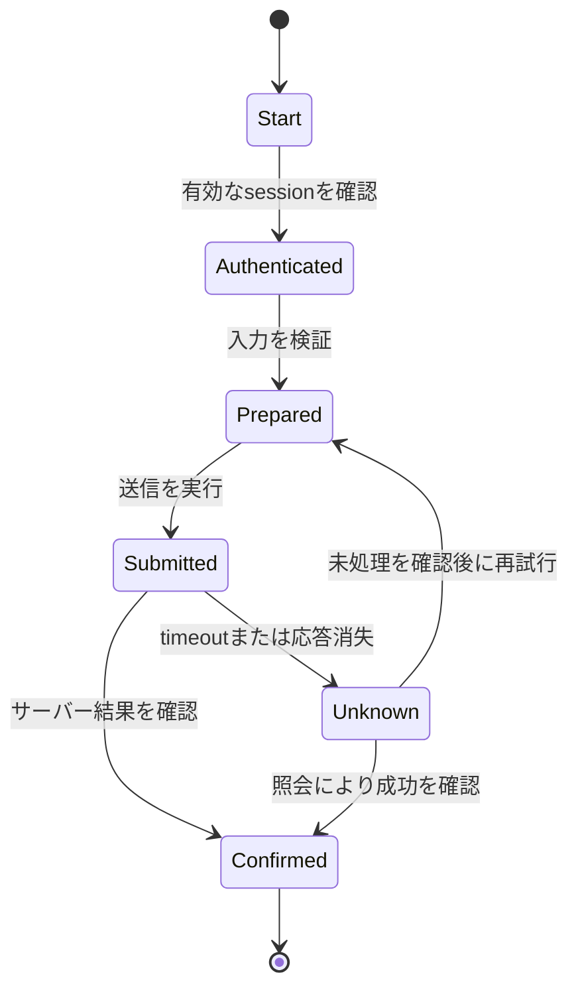



## 問題：click scriptはdemoにはなっても、運用自動化ではない

ブラウザ自動化は、人が見ていた画面を素早く再現できる。

しかし、DOMとsession、network、業務状態は絶えず変化する。

- CSSパスがUI刷新によって壊れる。
- ボタンは見えていてもoverlayのため押せない。
- clickには成功したがserver処理は失敗する。
- timeout後の再試行で重複申請が発生する。
- CAPTCHAやMFAを迂回しようとしてセキュリティポリシーに違反する。
- エラーscreenshotに個人情報が残る。
- browser processのcrash後、どの段階から再開すべきか分からない。

堅牢なRPAはselectorの集合ではなく、観測可能な状態machineである。

## Mental model：画面操作と業務状態を分離する



`click完了`は業務上の`送信完了`ではない。

URL、成功message、network response、backend照会、reference numberのような独立したevidenceを確認する。

### 状態を三つの層で捉える

- **Browser state**：page、frame、DOM、cookie、local storage
- **Workflow state**：現在の段階、attempt、checkpoint、deadline
- **Business state**：実際の申請・注文・業務recordの状態

browser stateが最も消失しやすい。

workflowとbusiness stateは、外部のdurable storeまたは結果systemで確認しなければならない。

## Locator設計

Playwright公式ドキュメントは、user-facing attributeとexplicit contractを優先するlocatorを推奨している。

### 推奨優先順位

1. roleとaccessible name
2. label
3. textまたはplaceholder
4. 明示的なtest ID
5. 安定したCSS attribute
6. 長いCSS/XPathは最後の手段

```ts
await page.getByRole('button', { name: 'Submit' }).click();
await expect(page.getByRole('status')).toContainText('Completed');
```

DOM階層内の位置に結合した`div:nth-child(...)`は、小さなmarkup変更でも壊れる。

locatorが複数のelementを捕捉する場合、`.first()`で覆い隠すのではなく、契約をさらに絞り込む。

### auto-waitの範囲

Playwright actionはvisibility、stability、enabledのようなactionability条件を待つ。

だからといって、業務完了を待っているわけではない。

不要なfixed sleepの代わりに期待する状態を明示する。

```ts
await expect(page.getByText('Processing complete')).toBeVisible();
```

network idleも、background pollingがあるapplicationでは完了条件にならない場合がある。

## Workflow：運用可能な自動化を作る

### Step 1. 自動化の権限と利用条件を確認する

siteの規約、APIの提供有無、robotポリシー、アカウント所有者の承認、rate limitを確認する。

CAPTCHA、MFA、anti-botを迂回しない。

セキュリティ確認が現れたらhuman handoff状態へ移行する。

公式APIがある場合は、browserよりAPIの方が安定しているか検討する。

### Step 2. input contractを検証する

browserを開く前に、必須field、type、format、duplicate keyを検査する。

入力source versionとrow IDを記録する。

機密情報は必要な瞬間にsecret storeから取得し、logではmaskingする。

### Step 3. 状態machineとcheckpointを定義する

各状態に次の項目を設ける。

- entry condition
- action
- success evidence
- timeout
- retryability
- checkpoint data
- compensationまたはhuman handoff

checkpointにpasswordやfull page HTMLを無条件に保存してはならない。

### Step 4. authenticationを別moduleにする

sessionを再利用する前に、有効期限とaccount identityを確認する。

storage state fileはcredentialと同等の機密度で保護する。

MFAが必要な場合は、承認されたinteractive stepを設ける。

loginの失敗回数を制限し、account lockoutを防ぐ。

### Step 5. page objectより業務actionを抽象化する

`clickButton3()`ではなく`submitApplication()`のように意図を表現する。

UI変更はlocator adapterに隔離する。

業務actionはsuccess evidenceとerror taxonomyを併せて返す。

### Step 6. navigationとpopupをeventとともに待つ

eventがactionより先に発生することがあるため、先にwaitを登録する。

```ts
const popupPromise = page.waitForEvent('popup');
await page.getByRole('link', { name: 'Open details' }).click();
const popup = await popupPromise;
await popup.waitForLoadState('domcontentloaded');
```

downloadも同じpatternで処理し、checksumとファイル名を検証する。

### Step 7. frameとshadow boundaryを明示する

iframe内のelementにはframe locatorを使用する。

cross-origin frameとbrowser permissionの境界を理解する。

frame loadの失敗を一般的なelement timeoutと誤診しない。

### Step 8. 送信をidempotentにする

可能なら、業務referenceまたはclient-generated keyをformに含める。

送信前に既存の処理有無を照会する。

timeout後、直ちにもう一度clickしてはならない。

まず結果page、history、API、confirmation IDから処理の有無を確認する。

結果が不明なら`unknown`状態に隔離する。

### Step 9. retry taxonomyを作る

- locatorが一時的にunavailable：限定的な再試行が可能
- network 5xx：idempotencyを確認後にbackoff
- validation error：入力を修正するまで再試行禁止
- authentication challenge：human handoff
- account lockout警告：即時中断
- UI contract変更：batch全体を中断しreview

すべてのtimeoutをpage reloadで処理してはならない。

### Step 10. rateとconcurrencyを制限する

人間より速い処理速度がtarget systemを圧倒することがある。

account、tenant、endpointごとにconcurrencyを制限する。

jitterを含むpacingを使用する。

業務時間とmaintenance windowを考慮する。

### Step 11. evidenceを安全に収集する

- run ID
- input row ID
- state transition
- page URLの安全な部分
- locator contract version
- response status
- confirmation reference
- sanitized screenshot
- traceまたはvideoの限定的な保存

screenshotとtraceにはpassword、token、個人情報が含まれる場合がある。

masking、access control、retention、削除ポリシーを適用する。

### Step 12. human-in-the-loopを正常状態として扱う

曖昧な選択、法的同意、CAPTCHA、high-impactな送信は人に引き継ぐ。

handoff packetには、現在の段階、確認事項、deadline、再開方法を含める。

人が完了した後、workflowはbusiness stateを再照会する。

## 実践例：formの反復送信

### 準備

1. input schemaとmandatory fieldを検証する。
2. rowごとにdeterministic operation IDを作成する。
3. 処理済みのoperationをdurable ledgerから除外する。
4. 承認されたaccountでsessionを確認する。

### 実行

1. list pageで新しいrecord actionをrole locatorにより選択する。
2. form fieldをlabel locatorで埋める。
3. 値がUIに反映されたか読み取って照合する。
4. 送信直前の要約画面をcaptureするが、機密値は隠す。
5. responseまたはconfirmation elementのwaitを先に登録する。
6. 送信buttonを一度だけ押す。
7. confirmation IDを抽出する。
8. 結果照会画面でoperation IDを照合する。
9. ledgerに完了状態とevidence referenceを原子的に記録する。

### timeout

1. 新しい送信を行わない。
2. history pageでoperation IDを検索する。
3. foundなら完了としてreconcileする。
4. not foundであり、安全な時間が経過した場合に限り再試行する。
5. 判断できない場合は、人が確認できるよう隔離する。

## Test戦略

### contract test

test environmentでrole、label、test IDが維持されているか確認する。

### fixture test

保存済みの安全なHTML fixtureを使い、parsingとstate detectionをtestする。

fixtureでは実際のJavaScriptの動作を完全に再現できないという限界を記録する。

### failure injection

network delay、5xx、popupブロック、download失敗、session expiryを注入する。

### canary run

小規模な承認済みbatchから開始し、エラー率とUI driftを確認する。

### reconciliation test

重複入力、timeout後の成功、古いcheckpointを投入し、最終的に重複がないか確認する。

## 検証Checklist

### 契約とセキュリティ

- [ ] 自動化の権限と利用条件を確認した。
- [ ] CAPTCHAとMFAを迂回しない。
- [ ] accountとsession identityを検証する。
- [ ] secretとstorage stateを保護する。
- [ ] screenshot、trace、logの機密情報ポリシーがある。

### 安定性

- [ ] role、label、test ID locatorを優先する。
- [ ] fixed sleepの代わりに期待する状態を待つ。
- [ ] 業務完了を独立したevidenceで確認する。
- [ ] timeout後にbusiness stateをreconcileする。
- [ ] 状態別のtimeoutとretry policyがある。
- [ ] concurrencyとrate limitがある。

### 運用

- [ ] checkpointがdurableで、機密情報を最小限にする。
- [ ] UI変更を検知したらbatchを中断する。
- [ ] canaryとdry run modeがある。
- [ ] human handoffと再開手順がある。
- [ ] confirmation IDとinput rowが関連付けられている。
- [ ] browser・contextがrun間で隔離されている。

## よく起きる失敗と限界

### timeoutを延ばすだけ

遅い失敗がさらに遅く見えるだけである。

どの状態を待っているのか、target SLOは何かを明示する。

### screenshotの成功を業務の成功とみなす

画面はstaleまたはoptimisticな場合がある。

confirmation referenceと結果照会を併用する。

### selector repairを自動適用する

似ている別のbuttonを選び、誤った副作用を引き起こす可能性がある。

high-impact actionのself-healing selectorにはhuman reviewを必須とする。

### browser profileを複数workerで共有する

cookieとstorageのrace、account sessionの衝突が発生する。

隔離されたcontextと明確なaccount ownershipを使用する。

### RPAを恒久的なintegrationとして放置する

UI自動化はbrittleである。

長期・大量・中核的なフローについては、公式APIやpartner integrationへ移行するroadmapを用意する。

## 公式参考資料

- [Playwright Locators](https://playwright.dev/docs/locators)
- [Playwright Auto-waiting](https://playwright.dev/docs/actionability)
- [Playwright Best Practices](https://playwright.dev/docs/best-practices)
- [Playwright Authentication](https://playwright.dev/docs/auth)
- [Playwright Trace Viewer](https://playwright.dev/docs/trace-viewer)

## まとめ

堅牢なbrowser automationは、より巧妙なselectorではなく、明確な状態と検証可能な完了条件から生まれる。

browser stateとbusiness stateを分離し、timeoutをunknownとして扱い、idempotencyとreconciliationを組み込もう。

人の判断とセキュリティ境界が必要な段階は迂回せず、正式なhandoffとして設計してこそ、自動化は長く維持できる。
