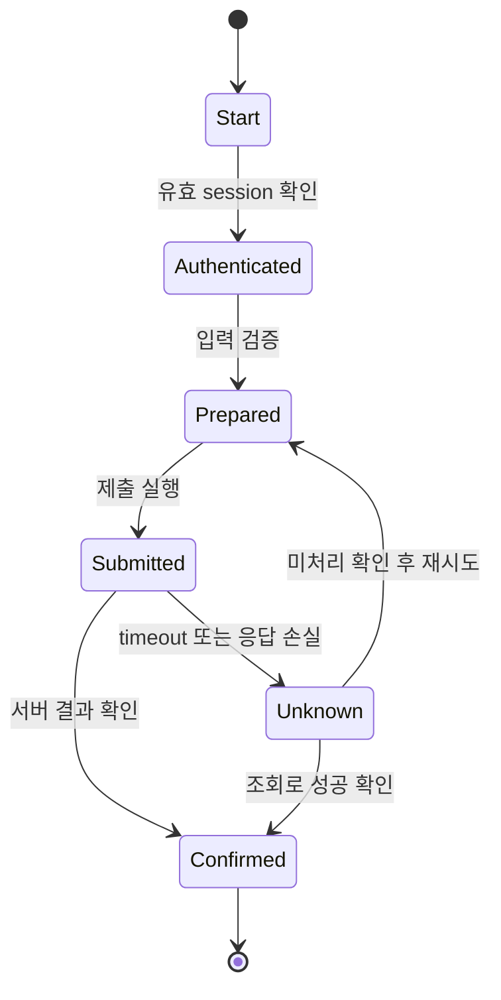



## 문제: click script는 demo가 될 수 있어도 운영 자동화는 아니다

브라우저 자동화는 사람이 보던 화면을 빠르게 재현할 수 있다.

하지만 DOM과 session, network, 업무 상태는 계속 변한다.

- CSS 경로가 UI 개편으로 깨진다.
- 버튼은 보이지만 overlay 때문에 누를 수 없다.
- click은 성공했지만 server 처리는 실패한다.
- timeout 뒤 재시도해 중복 신청이 생긴다.
- CAPTCHA나 MFA를 우회하려다 보안 정책을 위반한다.
- 오류 screenshot에 개인정보가 남는다.
- browser process crash 뒤 어느 단계부터 이어갈지 모른다.

견고한 RPA는 selector 모음이 아니라 관찰 가능한 상태 machine이다.

## Mental model: 화면 행동과 업무 상태를 분리한다



`click 완료`는 업무 `제출 완료`가 아니다.

URL, 성공 message, network response, backend 조회, reference number 같은 독립 evidence를 확인한다.

### 상태를 세 층으로 본다

- **Browser state**: page, frame, DOM, cookie, local storage
- **Workflow state**: 현재 단계, attempt, checkpoint, deadline
- **Business state**: 실제 신청·주문·업무 record의 상태

browser state는 가장 쉽게 사라진다.

workflow와 business state는 외부 durable store 또는 결과 system에서 확인해야 한다.

## Locator 설계

Playwright 공식 문서는 user-facing attribute와 explicit contract를 우선하는 locator를 권장한다.

### 권장 우선순위

1. role과 accessible name
2. label
3. text 또는 placeholder
4. 명시적 test ID
5. 안정된 CSS attribute
6. 긴 CSS/XPath는 마지막 수단

```ts
await page.getByRole('button', { name: 'Submit' }).click();
await expect(page.getByRole('status')).toContainText('Completed');
```

DOM 계층 위치에 결합된 `div:nth-child(...)`는 작은 markup 변경에도 깨진다.

locator가 여러 element를 잡으면 `.first()`로 덮기보다 계약을 더 좁힌다.

### auto-wait의 범위

Playwright action은 visibility, stability, enabled 같은 actionability 조건을 기다린다.

그렇다고 업무 완료를 기다리는 것은 아니다.

불필요한 fixed sleep 대신 기대 상태를 명시한다.

```ts
await expect(page.getByText('Processing complete')).toBeVisible();
```

network idle도 background polling이 있는 application에서는 완료 조건이 아닐 수 있다.

## Workflow: 운영 가능한 자동화 만들기

### Step 1. 자동화 권한과 이용 조건을 확인한다

site 약관, API 제공 여부, robot 정책, 계정 소유자 승인, rate limit을 확인한다.

CAPTCHA, MFA, anti-bot을 우회하지 않는다.

보안 확인이 나오면 human handoff 상태로 전환한다.

공식 API가 있다면 browser보다 API가 더 안정적인지 검토한다.

### Step 2. input contract를 검증한다

browser를 열기 전에 필수 field, type, format, duplicate key를 검사한다.

입력 source version과 row ID를 기록한다.

민감정보는 필요한 순간에 secret store에서 가져오고 log에서 masking한다.

### Step 3. 상태 machine과 checkpoint를 정의한다

각 상태에 다음을 둔다.

- entry condition
- action
- success evidence
- timeout
- retryability
- checkpoint data
- compensation 또는 human handoff

checkpoint에는 password나 full page HTML을 무조건 저장하지 않는다.

### Step 4. authentication을 별도 module로 만든다

session 재사용 전 만료와 account identity를 확인한다.

storage state file은 credential과 같은 민감도로 보호한다.

MFA가 필요한 경우 승인된 interactive step을 둔다.

login 실패 횟수를 제한해 account lockout을 막는다.

### Step 5. page object보다 업무 action을 추상화한다

`clickButton3()` 대신 `submitApplication()`처럼 의도를 표현한다.

UI 변경은 locator adapter에 격리한다.

업무 action은 success evidence와 error taxonomy를 함께 반환한다.

### Step 6. navigation과 popup을 event와 함께 기다린다

event가 action보다 먼저 발생할 수 있으므로 wait를 먼저 등록한다.

```ts
const popupPromise = page.waitForEvent('popup');
await page.getByRole('link', { name: 'Open details' }).click();
const popup = await popupPromise;
await popup.waitForLoadState('domcontentloaded');
```

download도 같은 pattern으로 처리하고 checksum과 파일 이름을 검증한다.

### Step 7. frame과 shadow boundary를 명시한다

iframe 안 element는 frame locator를 사용한다.

cross-origin frame과 browser permission 경계를 이해한다.

frame load 실패를 일반 element timeout으로 오진하지 않는다.

### Step 8. 제출을 idempotent하게 만든다

가능하면 업무 reference 또는 client-generated key를 form에 포함한다.

제출 전 기존 처리 여부를 조회한다.

timeout 뒤 즉시 다시 click하지 않는다.

먼저 결과 page, history, API, confirmation ID로 처리 여부를 확인한다.

결과를 모르면 `unknown` 상태로 격리한다.

### Step 9. retry taxonomy를 만든다

- locator가 잠시 unavailable: 제한 재시도 가능
- network 5xx: idempotency 확인 뒤 backoff
- validation error: 입력 수정 전 재시도 금지
- authentication challenge: human handoff
- account lockout 경고: 즉시 중단
- UI contract 변경: 전체 batch 중단과 review

모든 timeout을 page reload로 처리하지 않는다.

### Step 10. rate와 concurrency를 제한한다

사람보다 빠른 속도가 target system을 압도할 수 있다.

account, tenant, endpoint별 concurrency를 제한한다.

jitter를 포함한 pacing을 사용한다.

업무 시간과 maintenance window를 고려한다.

### Step 11. evidence를 안전하게 수집한다

- run ID
- input row ID
- state transition
- page URL의 안전한 부분
- locator contract version
- response status
- confirmation reference
- sanitized screenshot
- trace 또는 video의 제한된 보존

screenshot과 trace에는 password, token, 개인정보가 들어갈 수 있다.

masking, access control, retention, 삭제 정책을 적용한다.

### Step 12. human-in-the-loop를 정상 상태로 둔다

모호한 선택, 법적 동의, CAPTCHA, high-impact 제출은 사람에게 넘긴다.

handoff packet에는 현재 단계, 확인할 내용, deadline, 재개 방법을 포함한다.

사람이 완료한 뒤 workflow가 business state를 다시 조회한다.

## 실전 예제: 반복 form 제출

### 준비

1. input schema와 mandatory field를 검증한다.
2. row별 deterministic operation ID를 만든다.
3. 이미 처리된 operation을 durable ledger에서 제외한다.
4. 승인된 account로 session을 확인한다.

### 실행

1. list page에서 새 record action을 role locator로 선택한다.
2. form field를 label locator로 채운다.
3. 값이 UI에 반영됐는지 읽어 대조한다.
4. 제출 직전 요약 화면을 capture하되 민감 값을 가린다.
5. response 또는 confirmation element wait를 먼저 등록한다.
6. 제출 button을 한 번만 누른다.
7. confirmation ID를 추출한다.
8. 결과 조회 화면에서 operation ID를 대조한다.
9. ledger에 완료 상태와 evidence reference를 원자적으로 기록한다.

### timeout

1. 새 제출을 하지 않는다.
2. history page에서 operation ID를 검색한다.
3. found면 완료로 reconcile한다.
4. not found이며 안전한 시간이 지난 경우에만 재시도한다.
5. 판단 불가면 사람이 확인하도록 격리한다.

## Test 전략

### contract test

test environment에서 role, label, test ID가 유지되는지 확인한다.

### fixture test

저장된 안전한 HTML fixture로 parsing과 state detection을 test한다.

fixture가 실제 JavaScript 동작을 완전히 재현하지 못하는 한계를 기록한다.

### failure injection

network delay, 5xx, popup 차단, download 실패, session expiry를 주입한다.

### canary run

작은 승인된 batch로 시작하고 오류율과 UI drift를 본다.

### reconciliation test

중복 입력, timeout 후 성공, 오래된 checkpoint를 넣어 최종 중복이 없는지 확인한다.

## 검증 Checklist

### 계약과 보안

- [ ] 자동화 권한과 이용 조건을 확인했다.
- [ ] CAPTCHA와 MFA를 우회하지 않는다.
- [ ] account와 session identity를 검증한다.
- [ ] secret과 storage state를 보호한다.
- [ ] screenshot, trace, log의 민감정보 정책이 있다.

### 안정성

- [ ] role, label, test ID locator를 우선한다.
- [ ] fixed sleep 대신 기대 상태를 기다린다.
- [ ] 업무 완료를 독립 evidence로 확인한다.
- [ ] timeout 뒤 business state를 reconcile한다.
- [ ] 상태별 timeout과 retry policy가 있다.
- [ ] concurrency와 rate limit이 있다.

### 운영

- [ ] checkpoint가 durable하고 민감정보를 최소화한다.
- [ ] UI 변경 탐지 시 batch를 중단한다.
- [ ] canary와 dry run mode가 있다.
- [ ] human handoff와 재개 절차가 있다.
- [ ] confirmation ID와 input row가 연결된다.
- [ ] browser·context가 run 사이 격리된다.

## 자주 겪는 실패와 한계

### timeout을 늘리기만 한다

느린 실패가 더 늦게 보일 뿐이다.

어느 상태를 기다리는지와 target SLO를 명시한다.

### screenshot 성공을 업무 성공으로 본다

화면은 stale하거나 optimistic할 수 있다.

confirmation reference와 결과 조회를 함께 사용한다.

### selector repair를 자동 적용한다

비슷한 다른 button을 선택해 잘못된 부작용을 만들 수 있다.

high-impact action의 self-healing selector는 human review를 요구한다.

### browser profile을 여러 worker가 공유한다

cookie와 storage race, account session 충돌이 생긴다.

격리된 context와 명확한 account ownership을 사용한다.

### RPA를 영구 integration으로 방치한다

UI 자동화는 brittle하다.

장기·대량·핵심 흐름은 공식 API나 partner integration으로 전환할 roadmap을 둔다.

## 공식 참고자료

- [Playwright Locators](https://playwright.dev/docs/locators)
- [Playwright Auto-waiting](https://playwright.dev/docs/actionability)
- [Playwright Best Practices](https://playwright.dev/docs/best-practices)
- [Playwright Authentication](https://playwright.dev/docs/auth)
- [Playwright Trace Viewer](https://playwright.dev/docs/trace-viewer)

## 마무리

견고한 browser automation은 더 영리한 selector보다 명확한 상태와 검증 가능한 완료 조건에서 나온다.

browser state와 business state를 분리하고, timeout을 unknown으로 다루고, idempotency와 reconciliation을 넣자.

사람의 판단과 보안 경계가 필요한 단계는 우회하지 않고 정식 handoff로 설계해야 자동화가 오래 살아남는다.
