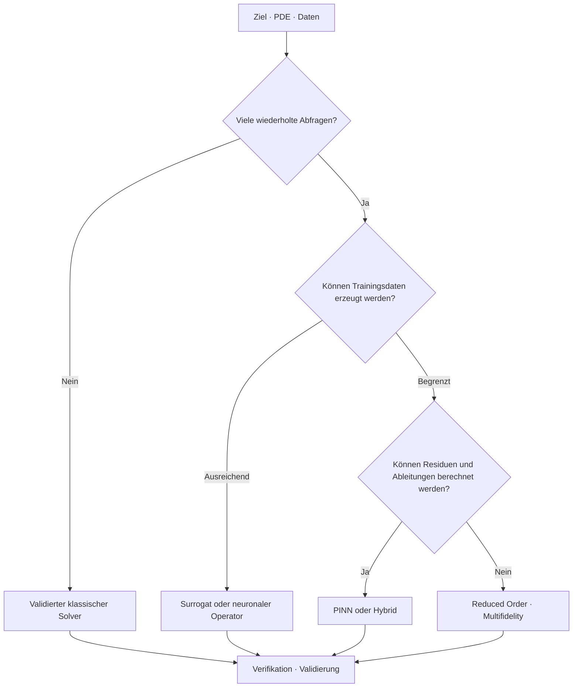



Die wichtigste Entscheidung in Scientific ML ist nicht, welches neuronale Netz verwendet wird, sondern **warum eine lernbasierte Lösung benötigt wird**.
Ein Problem, das eine einzelne High-Fidelity-Lösung verlangt, und eines, das schnelle Näherungen für wiederholte Abfragen braucht, erfordern völlig verschiedene Solver.

## 1. Das Problem: Verwendungszweck statt Methodennamen wählen

Zuerst sind folgende Fragen zu beantworten.

- Wird eine Vorwärtslösung für eine einzelne Bedingung benötigt?
- Handelt es sich um ein inverses Problem zur Schätzung eines unbekannten Parameters oder Feldes?
- Werden viele Kombinationen von Randbedingungen und Parametern wiederholt ausgewertet?
- Sind Beobachtungen dünn und physikalische Beschränkungen wichtig?
- Wird der Solver in Echtzeitregelung oder Optimierung aufgerufen?
- Wird nur Interpolation benötigt oder auch Extrapolation über den Trainingsbereich hinaus?
- Welches Garantieniveau ist für Erhaltung und Stabilität erforderlich?

Ein klassischer Solver löst direkt die maßgeblichen Gleichungen und ihre Diskretisierung.
Ein PINN verwendet Gleichungsresiduen und Beobachtungsfehler als Lernziel.
Ein neuronaler Operator lernt aus Daten eine Abbildung von Funktionen auf Funktionen.
Ein Surrogat approximiert eine niedrigdimensionale Abbildung ausgewählter Eingaben auf Ausgaben.

Jede Methode zahlt im Voraus andere Rechenkosten.

## 2. Denkmodell: Offline-Kosten gegen Online-Abfragen tauschen



Die Gesamtkosten lassen sich wie folgt vereinfachen.

$$
C_{\text{total}} = C_{\text{setup}} + C_{\text{train}} + N_q C_{\text{query}} + C_{\text{validation}}
$$

Ist die Abfragezahl \(N_q\) klein, werden die Trainingskosten womöglich nie amortisiert.
Schnelle Inferenz darf nicht hervorgehoben werden, während Kosten von Datenerzeugung und erneutem Training verborgen bleiben.

## 3. Einen Problemvertrag schreiben

```yaml
physics:
  equations: "지배방정식과 constitutive relation"
  domain: "geometry와 좌표계"
  initial_boundary_conditions: "well-posedness 확인"
goal:
  type: "forward | inverse | repeated-query | control"
  outputs: "field, integral quantity, uncertainty"
operating_domain:
  parameters: "학습·검증 범위"
acceptance:
  physics: "conservation과 residual 기준"
  numerical: "reference 대비 오차와 수렴"
  operational: "latency와 memory"
```

Sind die Gleichungen selbst unvollständig oder Randbedingungen unzureichend, löst ein Netz das physikalische Problem nicht von selbst.
Zuerst sind Wohlgestelltheit und Identifizierbarkeit zu prüfen.

## 4. Einen klassischen numerischen Solver als Basislinie verwenden

Finite-Differenzen-, Finite-Volumen-, Finite-Elemente- und Spektralverfahren besitzen jeweils Stärken und Schwächen hinsichtlich Geometrie und Erhaltungseigenschaften.

Stärken klassischer Solver:

- Diskretisierung und Stabilitätsanalyse sind ausdrücklich.
- Konvergenz kann durch Netzverfeinerung geprüft werden.
- Einige Formulierungen erzwingen lokale Erhaltung.
- Die Behandlung von Randbedingungen ist strukturiert.
- Ein einzelnes Problem benötigt keine Trainingsdaten.

Einschränkungen:

- Große Parametersweeps sind teuer.
- Inverse Probleme verlangen iterative Optimierung.
- Komplexe Submodelle zu differenzieren ist schwierig.
- Echtzeitanforderungen werden möglicherweise nicht erfüllt.

Ein Scientific-ML-Kandidat wird mit einem gut konfigurierten klassischen Solver verglichen, nicht mit einer schwachen Basislinie.

## 5. Wann ein PINN zu wählen ist

Eine repräsentative PINN-Zielfunktion kann wie folgt geschrieben werden.

$$
\mathcal{L}=\lambda_r\mathcal{L}_{\text{residual}}+
\lambda_b\mathcal{L}_{\text{boundary}}+
\lambda_i\mathcal{L}_{\text{initial}}+
\lambda_d\mathcal{L}_{\text{data}}
$$

Möglicherweise günstige Bedingungen:

- Beobachtungen sind dünn, die maßgeblichen Gleichungen aber bekannt.
- Inverse Parameter werden gemeinsam mit dem Feld geschätzt.
- Residuen lassen sich mit automatischer Differenzierung berechnen.
- Netzerzeugung ist besonders schwierig, während Koordinaten-Sampling möglich ist.
- Eine differenzierbare nachgelagerte Zielfunktion ist wichtig.

Bedingungen, die Vorsicht verlangen:

- steife oder mehrskalige PDEs
- Schocks und Diskontinuitäten
- hochdimensionale, komplexe Geometrie
- Loss-Terme mit erheblich unterschiedlichen Größenordnungen
- Fehlerakkumulation über lange Zeitintegration

Ein kleiner Trainings-Loss garantiert keinen kleinen Lösungsfehler.
Er wird zusammen mit einer unabhängigen Referenz und dem Erhaltungsfehler bewertet.

## 6. Wann ein neuronaler Operator zu wählen ist

Ein neuronaler Operator approximiert einen Operator von einer Eingabefunktion \(a(x)\) auf eine Lösungsfunktion \(u(x)\).

$$
\mathcal{G}_{\theta}: a(x) \mapsto u(x)
$$

Möglicherweise günstige Bedingungen:

- Veränderliche Koeffizienten, Anregungen und Randbedingungen werden wiederholt abgefragt.
- Ein ausreichend großer und repräsentativer Simulationsdatensatz kann erzeugt werden.
- Innerhalb derselben Problemfamilie wird schnelle Feldvorhersage benötigt.
- Strukturelle Generalisierung über Auflösungsänderungen hinweg soll genutzt werden.

Vorsichtspunkte:

- Auf Geometrien und Parametern außerhalb der Trainingsverteilung kann die Leistung schwach sein.
- Datensatzerzeugung ist teuer.
- Diskretisierungsinvarianz wird von Implementierung und Trainingsbedingungen begrenzt.
- Erhaltene Größen können trotz kleinem punktweisen Fehler falsch sein.

Trainings- und Deployment-Bereiche sind anzugeben und ein Out-of-domain-Detektor bereitzustellen.

## 7. Surrogate und Modelle reduzierter Ordnung

Werden nur Zielgrößen statt des gesamten Feldes benötigt, kann ein niedrigdimensionales Surrogat einfacher sein.

- gaußscher Prozess
- Polynomial Chaos
- Radial-Basis-Modell
- Baumensemble
- kompaktes neuronales Netz
- ROM auf Basis einer Proper Orthogonal Decomposition

Je niedriger die Eingabedimension und einfacher die Ausgabestruktur, desto kleiner ist der Vorteil eines komplexen Operatormodells.
Sind Unsicherheitsschätzung und aktives Lernen wichtig, kann die Familie gaußscher Prozesse eine gute Basislinie bilden.

Auch hybride Ansätze sind möglich.

- Korrektur eines groben Solvers lernen
- nur einen nicht aufgelösten Abschluss lernen
- Solver-Präkonditionierer lernen
- Iterationszahl mit einem gelernten Initialisierer verringern
- Surrogat im sicheren Bereich und vollständigen Solver außerhalb verwenden

Große Beschleunigungen sind möglich, ohne die gesamte Physik durch eine Black Box zu ersetzen.

## 8. Praktischer Workflow

### Schritt 1. Entdimensionalisierung

Unterschiede in Einheiten und Skalen verringern und die maßgeblichen dimensionslosen Kennzahlen bestimmen.
Dies hilft sowohl Trainingsstabilität als auch Versuchsplanung.

### Schritt 2. Referenzhierarchie

Mindestens drei Referenzstufen verwenden.

1. Kleines Problem mit hergestellter oder analytischer Lösung
2. Numerische Lösung mit verifizierter Netz- und Zeitschrittkonvergenz
3. Wenn möglich unabhängiges Experiment oder unabhängige Beobachtung

### Schritt 3. Nach physikalischem Regime teilen

Nicht nur auf zufällige Stichprobensplits vertrauen.
Parameterintervalle, Geometriefamilien und Zeitfenster in Gruppen trennen.

### Schritt 4. Unter demselben Budget vergleichen

- Zeit zur Datenerzeugung
- Trainingszeit
- Hyperparametersuche
- Inferenzlatenz
- Speicher
- Häufigkeit erneuten Trainings

Sämtliche Punkte in die Gesamtkosten einbeziehen.

### Schritt 5. Fehlerbewusstes Routing

```python
def predict(case, surrogate, reference_solver, domain):
    if not domain.contains(case):
        return reference_solver.solve(case), "fallback-out-of-domain"
    estimate, uncertainty = surrogate(case)
    if uncertainty > domain.max_uncertainty:
        return reference_solver.solve(case), "fallback-uncertain"
    return estimate, "surrogate"
```

Ein Fallback ist kein Fehler, sondern eine Deployment-Schutzmaßnahme.

## 9. Evaluationsentwurf

Fehler werden auf mehreren Ebenen gemessen.

- punktweise Norm
- relative Feldnorm
- Gradienten- und Flussfehler
- Fehler einer Integralgröße
- Verletzungen von Rand- und Anfangsbedingungen
- PDE-Residuum
- globaler und lokaler Erhaltungsfehler
- Stabilität über den Rollout-Horizont
- Unsicherheitskalibrierung
- Latenz und gesamte Rechenkosten

Beispiel eines relativen \(L_2\)-Fehlers:

$$
e_{rel}=\frac{\lVert u_{pred}-u_{ref}\rVert_2}{\lVert u_{ref}\rVert_2}
$$

Ist der Nenner klein, wird der relative Fehler instabil; deshalb ist auch der absolute Fehler zu untersuchen.

Ein einzelnes räumliches Mittel kann eine lokale Spitze verbergen.
Bereiche und Größen, die Sicherheit und Entwurf bestimmen, werden getrennt evaluiert.

## 10. Prüfliste zur Evaluation

- [ ] Ist das Ziel eindeutig als Vorwärts-, inverses oder Wiederholungsabfrageproblem bestimmt?
- [ ] Wurden Wohlgestelltheit der PDE und Randbedingungen geprüft?
- [ ] Gibt es eine validierte Basislinie eines klassischen Solvers?
- [ ] Wurden Entdimensionalisierung und Skalenanalyse durchgeführt?
- [ ] Sind Trainingsverteilung und Deployment-Domäne angegeben?
- [ ] Gibt es neben einem Zufallssplit zurückgehaltene Regime und Geometrien?
- [ ] Werden neben Feldnormen Erhaltung und Zielgrößen gemessen?
- [ ] Sind Datenerzeugung und Tuning in den Gesamtkosten enthalten?
- [ ] Wurde der Diskretisierungsfehler der Referenzlösung geschätzt?
- [ ] Gibt es einen Fallback anhand von Out-of-domain-Erkennung und Unsicherheit?
- [ ] Schließt der Vergleich der Inferenzgeschwindigkeit I/O und Vorverarbeitung ein?
- [ ] Werden reproduzierbare Seeds sowie Versionen von Code, Modellen und Datensätzen bewahrt?

## 11. Häufige Fehler und Einschränkungen

### Ein PINN als universellen netzfreien Ersatz behandeln

Koordinaten-Sampling kann die Netzerzeugung vermeiden, doch Kosten für Optimierung und Residuenauswertung bleiben.
Bei hochdimensionalen, steifen und diskontinuierlichen Problemen kann der Ansatz schwieriger sein.

### Residual-Loss als Lösungsfehler interpretieren

Ein kleines Residuum an Kollokationspunkten garantiert keine Genauigkeit im gesamten Gebiet.
Validiert wird mit unabhängigen Punkten, erhaltenen Größen und Referenzlösungen.

### Annehmen, ein neuronales Operatormodell behandle jede Geometrie

Geometriekodierung und Trainingsverteilung bestimmen den Generalisierungsbereich.
Ungesehene Topologien erfordern getrennte Validierung.

### Nur Beschleunigung betrachten und Offline-Kosten ausschließen

Eine einzelne Inferenz kann schnell sein, während Datensatzerzeugung und erneutes Training wesentlich teurer sind.
Die Amortisierung wird mit der erwarteten Abfragezahl berechnet.

Jede Methode besitzt Modellformfehler und Daten-Bias.
Scientific ML beseitigt Validierung nicht, sondern fügt einen weiteren zu validierenden Gegenstand hinzu.

## 12. Offizielle Referenzen

- [Ursprüngliche Veröffentlichung zu physics-informed neural networks](https://doi.org/10.1016/j.jcp.2018.10.045)
- [Ursprüngliche Veröffentlichung zum Fourier Neural Operator](https://arxiv.org/abs/2010.08895)
- [Ursprüngliche Veröffentlichung zu DeepONet](https://doi.org/10.1038/s42256-021-00302-5)
- [Offizielle SciPy-Dokumentation](https://docs.scipy.org/doc/scipy/)
- [Offizielle NeuralOperator-Dokumentation](https://neuraloperator.github.io/dev/)

## 13. Fazit

Die Wahl eines Scientific-ML-Solvers ist keine Frage eines modischen Modells.
Anhand von Problemziel, Zahl wiederholter Abfragen, Datenverfügbarkeit, Erhaltungsanforderungen und Fehlerkosten wird die einfachste überprüfbare Methode gewählt.
