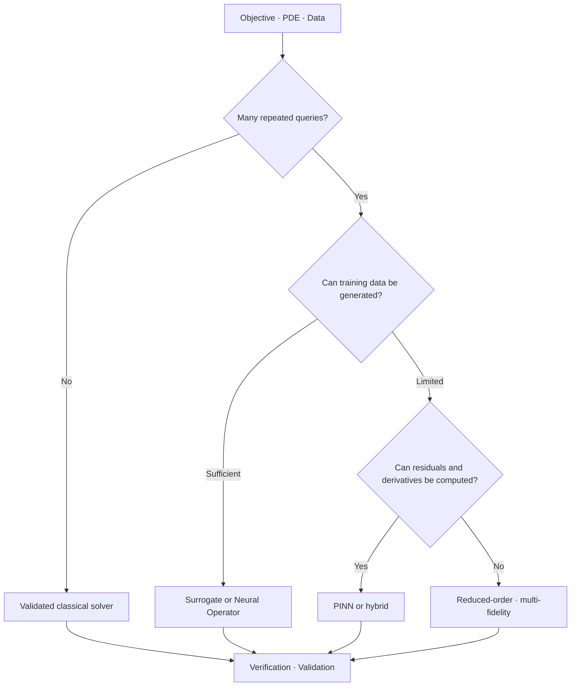



The most important choice in Scientific ML is not which neural network to use, but defining **why a learning-based solution is needed**.
A problem that requires one high-fidelity solution and a problem that requires fast approximations for repeated queries demand entirely different solvers.

## 1. The Problem: Choose the Intended Use, Not a Method Name

First, answer the following questions.

- Do you need a forward solution for one condition?
- Is this an inverse problem that estimates an unknown parameter or field?
- Will you repeatedly evaluate many combinations of boundaries and parameters?
- Are observations sparse and physics constraints important?
- Will the solver be called within real-time control or optimization?
- Do you need only interpolation, or is extrapolation beyond the training range also required?
- What level of guarantee is required for conservation and stability?

A classical solver directly solves governing equations and their discretization.
A PINN uses equation residuals and observation errors as its learning objective.
A neural operator learns a mapping from functions to functions from data.
A surrogate approximates a low-dimensional mapping between selected inputs and outputs.

Each method pays a different computational cost up front.

## 2. Mental Model: Trading Offline Cost for Online Queries



The total cost can be simplified as follows.

$$
C_{\text{total}} = C_{\text{setup}} + C_{\text{train}} + N_q C_{\text{query}} + C_{\text{validation}}
$$

When the number of queries \(N_q\) is small, the training cost may never be recovered.
Do not focus only on fast inference while hiding the costs of data generation and retraining.

## 3. Write a Problem Contract

```yaml
physics:
  equations: "지배방정식과 constitutive relation"
  domain: "geometry와 좌표계"
  initial_boundary_conditions: "well-posedness 확인"
goal:
  type: "forward | inverse | repeated-query | control"
  outputs: "field, integral quantity, uncertainty"
operating_domain:
  parameters: "학습·검증 범위"
acceptance:
  physics: "conservation과 residual 기준"
  numerical: "reference 대비 오차와 수렴"
  operational: "latency와 memory"
```

If the equations themselves are incomplete or boundary conditions are insufficient, a network will not solve the physics problem for you.
Review well-posedness and identifiability first.

## 4. Use a Classical Numerical Solver as the Baseline

Finite difference, finite volume, finite element, and spectral methods each have strengths and weaknesses with respect to geometry and conservation properties.

Strengths of classical solvers:

- Their discretization and stability analysis are explicit.
- Convergence can be checked through mesh refinement.
- Some formulations enforce local conservation.
- Boundary-condition handling is structured.
- A single problem requires no training data.

Limitations:

- Large parameter sweeps are expensive.
- Inverse problems require iterative optimization.
- Differentiating complex submodels is difficult.
- They may not satisfy real-time requirements.

Compare a Scientific ML candidate against a well-configured classical solver, not a weak baseline.

## 5. When to Choose a PINN

A representative PINN objective can be written as follows.

$$
\mathcal{L}=\lambda_r\mathcal{L}_{\text{residual}}+
\lambda_b\mathcal{L}_{\text{boundary}}+
\lambda_i\mathcal{L}_{\text{initial}}+
\lambda_d\mathcal{L}_{\text{data}}
$$

Conditions that may be favorable:

- Observations are sparse, but the governing equations are known.
- Inverse parameters are estimated together with the field.
- Residuals can be computed with automatic differentiation.
- Mesh generation is particularly difficult, while coordinate sampling is possible.
- A differentiable downstream objective is important.

Conditions that require caution:

- Stiff or multiscale PDEs
- Shocks and discontinuities
- High-dimensional, complex geometry
- Loss terms with substantially different magnitudes
- Error accumulation over long time integration

A small training loss does not guarantee a small solution error.
Evaluate it together with an independent reference and conservation error.

## 6. When to Choose a Neural Operator

A neural operator approximates an operator from an input function \(a(x)\) to a solution function \(u(x)\).

$$
\mathcal{G}_{\theta}: a(x) \mapsto u(x)
$$

Conditions that may be favorable:

- You repeatedly query varying coefficients, forcing, and boundary conditions.
- You can create a sufficiently large and representative simulation dataset.
- Fast field prediction is needed within the same problem family.
- You want to exploit structural generalization across changes in resolution.

Cautions:

- Performance may be weak on geometries and parameters outside the training distribution.
- Dataset generation is expensive.
- Discretization invariance is limited by implementation and training conditions.
- Conserved quantities may be wrong even when pointwise error is small.

Specify the training and deployment ranges and provide an out-of-domain detector.

## 7. Surrogates and Reduced-Order Models

If you need only quantities of interest rather than the entire field, a low-dimensional surrogate may be simpler.

- Gaussian process
- polynomial chaos
- radial basis model
- tree ensemble
- compact neural network
- proper orthogonal decomposition-based ROM

The lower the input dimension and the simpler the output structure, the smaller the advantage of a complex operator model.
When uncertainty estimation and active learning are important, the Gaussian process family can be a good baseline.

Hybrid approaches are also possible.

- Learn a correction to a coarse solver
- Learn only an unresolved closure
- Learn a solver preconditioner
- Reduce the number of iterations with a learned initializer
- Use a surrogate in the safe region and a full solver outside it

Large speedups are possible without replacing all of physics with a black box.

## 8. Practical Workflow

### Step 1. Nondimensionalization

Reduce differences in units and scales, and identify the governing dimensionless numbers.
This benefits both training stability and experimental design.

### Step 2. Reference Hierarchy

Use at least three levels of reference.

1. A small problem with a manufactured or analytical solution
2. A numerical solution with verified mesh and time-step convergence
3. An independent experiment or observation, if possible

### Step 3. Split by Physics Regime

Do not rely only on random sample splits.
Separate parameter intervals, geometry families, and time windows into groups.

### Step 4. Compare Under the Same Budget

- Data-generation time
- Training time
- Hyperparameter search
- Inference latency
- Memory
- Retraining frequency

Include all of them in total cost.

### Step 5. Failure-Aware Routing

```python
def predict(case, surrogate, reference_solver, domain):
    if not domain.contains(case):
        return reference_solver.solve(case), "fallback-out-of-domain"
    estimate, uncertainty = surrogate(case)
    if uncertainty > domain.max_uncertainty:
        return reference_solver.solve(case), "fallback-uncertain"
    return estimate, "surrogate"
```

A fallback is not a failure; it is a deployment safeguard.

## 9. Evaluation Design

Measure error at multiple levels.

- pointwise norm
- relative field norm
- gradient and flux error
- integral-quantity error
- boundary- and initial-condition violations
- PDE residual
- global and local conservation error
- stability over rollout horizon
- uncertainty calibration
- latency and total computational cost

Example of relative \(L_2\) error:

$$
e_{rel}=\frac{\lVert u_{pred}-u_{ref}\rVert_2}{\lVert u_{ref}\rVert_2}
$$

Relative error is unstable in cases where the denominator is small, so examine absolute error as well.

A single spatial average can hide a local peak.
Evaluate regions and quantities that determine safety and design separately.

## 10. Evaluation Checklist

- [ ] Is the objective clearly identified as forward, inverse, or repeated-query?
- [ ] Have the well-posedness of the PDE and boundary conditions been reviewed?
- [ ] Is there a validated classical-solver baseline?
- [ ] Have nondimensionalization and scale analysis been performed?
- [ ] Are the training distribution and deployment domain specified?
- [ ] Are there regime and geometry holdouts in addition to a random split?
- [ ] Are conservation and quantities of interest measured in addition to field norms?
- [ ] Are data generation and tuning included in total cost?
- [ ] Has the discretization error of the reference solution been estimated?
- [ ] Is there a fallback based on out-of-domain detection and uncertainty?
- [ ] Does the inference speed comparison include I/O and preprocessing?
- [ ] Are reproducible seeds and versions of code, models, and datasets preserved?

## 11. Common Failures and Limitations

### Treating a PINN as a Universal Mesh-Free Replacement

Coordinate sampling may avoid mesh generation, but optimization and residual-evaluation costs remain.
The approach can be more difficult for high-dimensional, stiff, and discontinuous problems.

### Interpreting Residual Loss as Solution Error

A small residual at collocation points does not guarantee accuracy across the entire domain.
Validate with independent points, conserved quantities, and reference solutions.

### Assuming One Neural Operator Model Handles Every Geometry

Geometry encoding and the training distribution determine the range of generalization.
Unseen topologies require separate validation.

### Looking Only at Speedup and Excluding Offline Cost

A single inference may be fast, while dataset generation and retraining may be far more expensive.
Calculate amortization using the expected number of queries.

Every method has model-form error and data bias.
Scientific ML does not eliminate validation; it introduces one more subject that must be validated.

## 12. Official References

- [Original paper on physics-informed neural networks](https://doi.org/10.1016/j.jcp.2018.10.045)
- [Original paper on the Fourier Neural Operator](https://arxiv.org/abs/2010.08895)
- [Original paper on DeepONet](https://doi.org/10.1038/s42256-021-00302-5)
- [Official SciPy documentation](https://docs.scipy.org/doc/scipy/)
- [Official NeuralOperator documentation](https://neuraloperator.github.io/dev/)

## 13. Conclusion

Selecting a Scientific ML solver is not a matter of choosing a fashionable model.
Choose the simplest verifiable method based on the problem objective, number of repeated queries, data availability, conservation requirements, and cost of failure.
