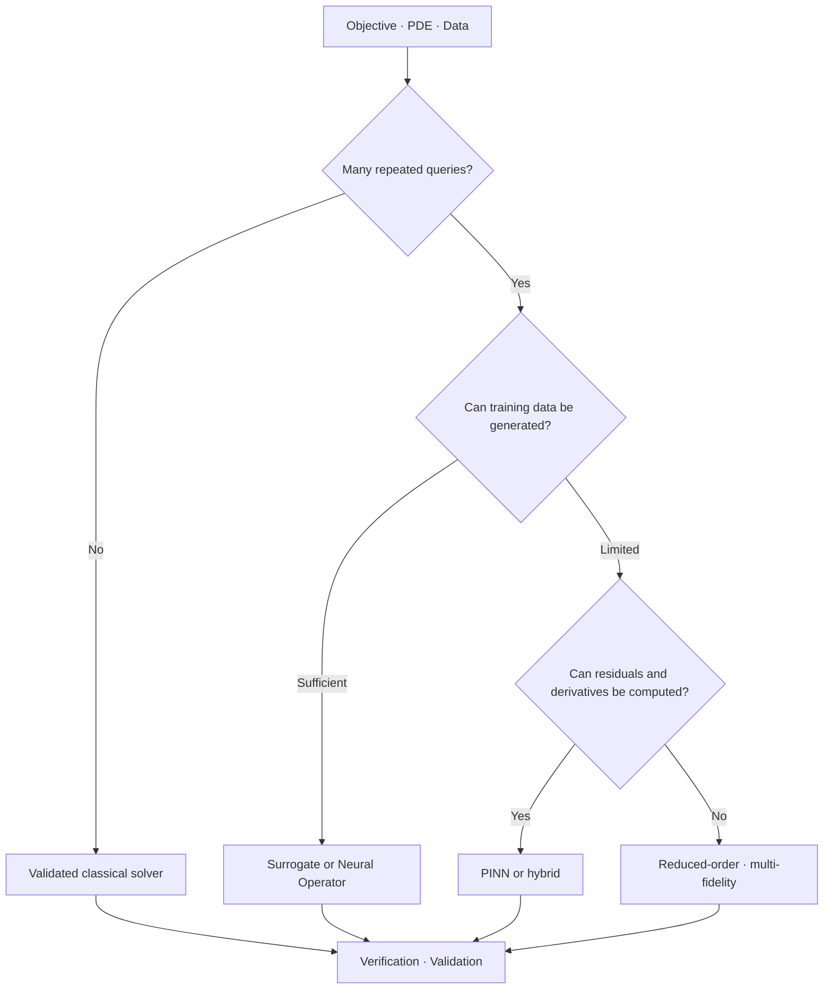



La elección más importante en Scientific ML no es qué red neuronal usar, sino definir **por qué se necesita una solución basada en el aprendizaje**.
Un problema que requiere una solución de alta fidelidad y un problema que requiere aproximaciones rápidas para consultas repetidas exigen solucionadores completamente diferentes.

## 1. El problema: elija el uso previsto, no el nombre del método

Primero, responda las siguientes preguntas.

- ¿Necesita una solución avanzada para una condición?
- ¿Es este un problema inverso que estima un parámetro o campo desconocido?
- ¿Evaluarás repetidamente muchas combinaciones de límites y parámetros?
- ¿Son escasas las observaciones y las limitaciones físicas importantes?
- ¿Se llamará al solucionador dentro del control u optimización en tiempo real?
- ¿Necesita sólo interpolación o también es necesaria una extrapolación más allá del rango de entrenamiento?
- ¿Qué nivel de garantía se requiere para la conservación y estabilidad?

Un solucionador clásico resuelve directamente las ecuaciones gobernantes y su discretización.
Un PINN utiliza residuos de ecuaciones y errores de observación como objetivo de aprendizaje.
Un operador neuronal aprende un mapeo de funciones a funciones a partir de datos.
Un sustituto se aproxima a un mapeo de baja dimensión entre entradas y salidas seleccionadas.

Cada método paga un costo computacional diferente por adelantado.

## 2. Modelo mental: negociar el costo fuera de línea por consultas en línea



El costo total se puede simplificar de la siguiente manera.

$$
C_{\text{total}} = C_{\text{setup}} + C_{\text{train}} + N_q C_{\text{query}} + C_{\text{validation}}
$$

Cuando el número de consultas \(N_q\) es pequeño, es posible que el costo de capacitación nunca se recupere.
No se centre únicamente en la inferencia rápida mientras oculta los costos de generación de datos y reentrenamiento.

## 3. Escriba un contrato problemático

```yaml
physics:
  equations: "지배방정식과 constitutive relation"
  domain: "geometry와 좌표계"
  initial_boundary_conditions: "well-posedness 확인"
goal:
  type: "forward | inverse | repeated-query | control"
  outputs: "field, integral quantity, uncertainty"
operating_domain:
  parameters: "학습·검증 범위"
acceptance:
  physics: "conservation과 residual 기준"
  numerical: "reference 대비 오차와 수렴"
  operational: "latency와 memory"
```

Si las ecuaciones en sí están incompletas o las condiciones de contorno son insuficientes, una red no resolverá el problema de física por usted.
Primero revise la buena postura y la identificabilidad.

## 4. Utilice un solucionador numérico clásico como base

Los métodos de diferencias finitas, volúmenes finitos, elementos finitos y espectrales tienen fortalezas y debilidades con respecto a la geometría y las propiedades de conservación.

Puntos fuertes de los solucionadores clásicos:

- Su discretización y análisis de estabilidad son explícitos.
- La convergencia se puede comprobar mediante el refinamiento de la malla.
- Algunas formulaciones imponen la conservación local.
- El manejo de las condiciones límite está estructurado.
- Un solo problema no requiere datos de entrenamiento.

Limitaciones:

- Los barridos de parámetros grandes son caros.
- Los problemas inversos requieren optimización iterativa.
- Diferenciar submodelos complejos es difícil.
- Es posible que no satisfagan los requisitos en tiempo real.

Compare un candidato científico ML con un solucionador clásico bien configurado, no con una línea de base débil.

## 5. Cuándo elegir un PINN

Un objetivo PINN representativo se puede escribir de la siguiente manera.

$$
\mathcal{L}=\lambda_r\mathcal{L}_{\text{residual}}+
\lambda_b\mathcal{L}_{\text{boundary}}+
\lambda_i\mathcal{L}_{\text{initial}}+
\lambda_d\mathcal{L}_{\text{data}}
$$

Condiciones que pueden resultar favorables:

- Las observaciones son escasas, pero se conocen las ecuaciones que las rigen.
- Los parámetros inversos se estiman junto con el campo.
- Los residuos se pueden calcular con diferenciación automática.
- La generación de mallas es particularmente difícil, mientras que el muestreo de coordenadas es posible.
- Es importante un objetivo downstream diferenciable.

Condiciones que requieren precaución:

- PDE rígidas o multiescala
- Choques y discontinuidades
- Geometría compleja y de alta dimensión
- Plazos de pérdida con magnitudes sustancialmente diferentes
- Acumulación de errores durante una integración prolongada

Una pequeña pérdida de entrenamiento no garantiza un pequeño error de solución.
Evalúelo junto con una referencia independiente y un error de conservación.

## 6. Cuándo elegir un operador neuronal

Un operador neuronal aproxima un operador de una función de entrada \(a(x)\) a una función de solución \(u(x)\).

$$
\mathcal{G}_{\theta}: a(x) \mapsto u(x)
$$

Condiciones que pueden resultar favorables:

- Consultas repetidamente diferentes coeficientes, forzamientos y condiciones de contorno.
- Puede crear un conjunto de datos de simulación suficientemente grande y representativo.
- Se necesita una predicción de campo rápida dentro de la misma familia de problemas.
- Quiere explotar la generalización estructural a través de cambios en la resolución.

Precauciones:

- El rendimiento puede ser débil en geometrías y parámetros fuera de la distribución de entrenamiento.
- La generación de conjuntos de datos es cara.
- La invariancia de la discretización está limitada por las condiciones de implementación y capacitación.
- Las cantidades conservadas pueden ser erróneas incluso cuando el error puntual es pequeño.

Especifique los rangos de entrenamiento y despliegue y proporcione un detector fuera de dominio.

## 7. Modelos sustitutos y de orden reducido

Si sólo necesita cantidades de interés en lugar de todo el campo, un sustituto de dimensiones bajas puede ser más sencillo.

- proceso gaussiano
- caos polinomial
- modelo de base radial
- conjunto de árboles
- red neuronal compacta
- ROM basada en descomposición ortogonal adecuada

Cuanto menor sea la dimensión de entrada y más simple la estructura de salida, menor será la ventaja de un modelo de operador complejo.
Cuando la estimación de la incertidumbre y el aprendizaje activo son importantes, la familia de procesos gaussianos puede ser una buena base.

También son posibles enfoques híbridos.

- Aprenda una corrección para un solucionador aproximado.
- Aprenda sólo un cierre no resuelto
- Aprenda un precondicionador de solucionador
- Reducir el número de iteraciones con un inicializador aprendido.
- Utilice un sustituto en la región segura y un solucionador completo fuera de ella.

Es posible realizar grandes aceleraciones sin reemplazar toda la física con una caja negra.

## 8. Flujo de trabajo práctico

### Paso 1. No dimensionalización

Reducir las diferencias en unidades y escalas, e identificar los números adimensionales que los gobiernan.
Esto beneficia tanto la estabilidad del entrenamiento como el diseño experimental.

### Paso 2. Jerarquía de referencia

Utilice al menos tres niveles de referencia.

1. Un pequeño problema con una solución fabricada o analítica.
2. Una solución numérica con malla verificada y convergencia de pasos de tiempo.
3. Un experimento u observación independiente, si es posible.

### Paso 3. Dividir por régimen de física

No confíe únicamente en divisiones de muestras aleatorias.
Separe los intervalos de parámetros, las familias de geometría y las ventanas de tiempo en grupos.

### Paso 4. Comparar con el mismo presupuesto

- Tiempo de generación de datos
- tiempo de entrenamiento
- Búsqueda de hiperparámetros
- Latencia de inferencia
- Memoria
- Frecuencia de reentrenamiento

Inclúyalos todos en el costo total.

### Paso 5. Enrutamiento consciente de fallas

```python
def predict(case, surrogate, reference_solver, domain):
    if not domain.contains(case):
        return reference_solver.solve(case), "fallback-out-of-domain"
    estimate, uncertainty = surrogate(case)
    if uncertainty > domain.max_uncertainty:
        return reference_solver.solve(case), "fallback-uncertain"
    return estimate, "surrogate"
```

Un retroceso no es un fracaso; es una salvaguardia de implementación.

## 9. Diseño de evaluación

Mida el error en múltiples niveles.

- norma puntual
- norma de campo relativa
- error de gradiente y flujo
- error de cantidad integral
- violaciones de límites y condiciones iniciales
- PDE residual
- error de conservación global y local
- estabilidad durante el horizonte de implementación
- calibración de incertidumbre
- latencia y coste computacional total

Ejemplo de error relativo \(L_2\):

$$
e_{rel}=\frac{\lVert u_{pred}-u_{ref}\rVert_2}{\lVert u_{ref}\rVert_2}
$$

El error relativo es inestable en los casos en que el denominador es pequeño, por lo que se debe examinar también el error absoluto.

Un único promedio espacial puede ocultar un pico local.
Evaluar regiones y cantidades que determinan la seguridad y el diseño por separado.

## 10. Lista de verificación de evaluación

- [ ] ¿El objetivo está claramente identificado como consulta directa, inversa o repetida?
- [ ] ¿Se ha revisado el buen planteamiento de PDE y las condiciones de contorno?
- [] ¿Existe una base de referencia de resolución clásica validada?
- [ ] ¿Se han realizado análisis de adimensionalización y escala?
- [] ¿Se especifica el dominio de implementación y distribución de la capacitación?
- [] ¿Existen obstáculos al régimen y la geometría además de una división aleatoria?
- [ ] ¿Se miden la conservación y las cantidades de interés además de las normas de campo?
- [ ] ¿La generación de datos y el ajuste están incluidos en el costo total?
- [ ] ¿Se ha estimado el error de discretización de la solución de referencia?
- [] ¿Existe un recurso alternativo basado en la detección fuera del dominio y la incertidumbre?
- [] ¿La comparación de velocidad de inferencia incluye I/O y preprocesamiento?
- [] ¿Se conservan las semillas y versiones reproducibles de código, modelos y conjuntos de datos?

## 11. Fallas y limitaciones comunes

### Tratar un PINN como un reemplazo universal sin malla

El muestreo de coordenadas puede evitar la generación de malla, pero los costos de optimización y evaluación residual persisten.
El enfoque puede ser más difícil para problemas de alta dimensión, rígidos y discontinuos.

### Interpretación de la pérdida residual como error de solución

Un pequeño residuo en los puntos de colocación no garantiza la precisión en todo el dominio.
Validar con puntos independientes, cantidades conservadas y soluciones de referencia.

### Suponiendo que un modelo de operador neuronal maneja cada geometría

La codificación geométrica y la distribución del entrenamiento determinan el rango de generalización.
Las topologías invisibles requieren una validación separada.

### Considerando solo la aceleración y excluyendo el costo sin conexión

Una única inferencia puede ser rápida, mientras que la generación y el reentrenamiento de conjuntos de datos pueden ser mucho más costosos.
Calcule la amortización utilizando el número esperado de consultas.

Cada método tiene error de forma de modelo y sesgo de datos.
Scientific ML no elimina la validación; introduce una asignatura más que debe ser convalidada.

## 12. Referencias oficiales

- [Artículo original sobre redes neuronales basadas en la física](https://doi.org/10.1016/j.jcp.2018.10.045)
- [Artículo original sobre el operador neuronal de Fourier](https://arxiv.org/abs/2010.08895)
- [Artículo original sobre DeepONet](https://doi.org/10.1038/s42256-021-00302-5)
- [Documentación oficial de SciPy](https://docs.scipy.org/doc/scipy/)
- [Documentación oficial de NeuralOperator](https://neuraloperator.github.io/dev/)

## 13. Conclusión

Seleccionar un solucionador científico ML no es cuestión de elegir un modelo de moda.
Elija el método verificable más simple según el objetivo del problema, la cantidad de consultas repetidas, la disponibilidad de datos, los requisitos de conservación y el costo de la falla.
