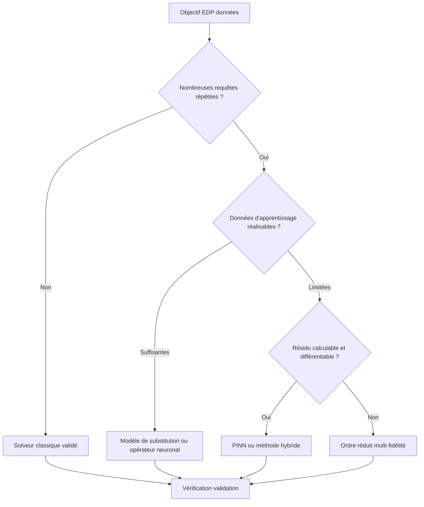



En ML scientifique, le choix essentiel n’est pas celui du réseau neuronal, mais la définition de la raison pour laquelle une méthode fondée sur l’apprentissage est nécessaire.
Calculer une unique solution de haute fidélité et approximer rapidement de nombreuses requêtes sont deux problèmes qui exigent des solveurs très différents.

## 1. Problème : choisir un usage, pas le nom d’une méthode

Il faut d’abord répondre aux questions suivantes.

- Faut-il obtenir la solution directe pour une seule condition ?
- S’agit-il d’un problème inverse visant à estimer un paramètre ou un champ inconnu ?
- Faut-il évaluer de nombreuses combinaisons de conditions aux limites et de paramètres ?
- Les observations sont-elles rares alors que les contraintes physiques sont importantes ?
- Le solveur sera-t-il appelé dans une boucle de commande en temps réel ou d’optimisation ?
- Une simple interpolation suffit-elle, ou faut-il aussi extrapoler hors du domaine d’apprentissage ?
- Quel niveau de garantie est requis en matière de conservation et de stabilité ?

Un solveur classique résout directement les équations gouvernantes et leur discrétisation.
Un PINN utilise comme objectif d’apprentissage le résidu des équations et l’erreur d’observation.
Un opérateur neuronal apprend à partir de données une application de fonction à fonction.
Un modèle de substitution approxime une application de faible dimension entre des entrées et des sorties choisies.

Chaque méthode paie à l’avance un coût de calcul différent.

## 2. Modèle mental : échanger un coût hors ligne contre des requêtes en ligne



Le coût total peut être simplifié ainsi.

$$
C_{\text{total}} = C_{\text{configuration}} + C_{\text{apprentissage}} + N_q C_{\text{requête}} + C_{\text{validation}}
$$

Si le nombre de requêtes (N_q) est faible, le coût de l’apprentissage risque de ne jamais être amorti.
Il ne faut pas mettre en avant la seule rapidité de l’inférence tout en masquant le coût de génération des données et de réapprentissage.

## 3. Rédiger le contrat du problème

```yaml
physics:
  equations: "지배방정식과 constitutive relation"
  domain: "geometry와 좌표계"
  initial_boundary_conditions: "well-posedness 확인"
goal:
  type: "forward | inverse | repeated-query | control"
  outputs: "field, integral quantity, uncertainty"
operating_domain:
  parameters: "학습·검증 범위"
acceptance:
  physics: "conservation과 residual 기준"
  numerical: "reference 대비 오차와 수렴"
  operational: "latency와 memory"
```

Si les équations elles-mêmes sont incomplètes ou si les conditions aux limites manquent, un réseau ne résoudra pas le problème physique à votre place.
Il faut d’abord examiner le caractère bien posé du problème et son identifiabilité.

## 4. Prendre un solveur numérique classique comme référence

Les différences finies, les volumes finis, les éléments finis et les méthodes spectrales présentent chacun des avantages et des inconvénients selon la géométrie et les propriétés de conservation recherchées.

Atouts des solveurs classiques :

- la discrétisation et l’analyse de stabilité sont explicites ;
- la convergence peut être vérifiée par raffinement du maillage ;
- certaines formulations imposent la conservation locale ;
- le traitement des conditions aux limites est structuré ;
- aucun jeu de données d’apprentissage n’est requis pour un problème isolé.

Limites :

- de vastes balayages paramétriques sont coûteux ;
- les problèmes inverses nécessitent une optimisation itérative ;
- la différentiation de sous-modèles complexes est difficile ;
- ils peuvent ne pas satisfaire les contraintes du temps réel.

Un candidat de ML scientifique doit être comparé à un solveur classique correctement configuré, et non à une référence artificiellement faible.

## 5. Quand choisir un PINN

Un objectif représentatif d’un PINN peut s’écrire ainsi.

$$
\mathcal{L}=\lambda_r\mathcal{L}_{\text{residual}}+
\lambda_b\mathcal{L}_{\text{boundary}}+
\lambda_i\mathcal{L}_{\text{initial}}+
\lambda_d\mathcal{L}_{\text{data}}
$$

Situations potentiellement favorables :

- les observations sont rares, mais les équations gouvernantes sont connues ;
- les paramètres inverses doivent être estimés avec le champ ;
- le résidu peut être calculé par différentiation automatique ;
- la génération du maillage est particulièrement difficile, alors que l’échantillonnage des coordonnées reste possible ;
- un objectif aval différentiable est important.

Situations exigeant de la prudence :

- EDP raides ou multi-échelles ;
- chocs et discontinuités ;
- géométries complexes de grande dimension ;
- termes de perte dont les ordres de grandeur diffèrent fortement ;
- accumulation des erreurs lors d’une intégration temporelle longue.

Une faible perte d’apprentissage ne garantit pas une faible erreur de solution.
Il faut aussi examiner une référence indépendante et l’erreur de conservation.

## 6. Quand choisir un opérateur neuronal

Un opérateur neuronal approxime l’opérateur qui associe une fonction d’entrée (a(x)) à une fonction solution (u(x)).

$$
\mathcal{G}_{\theta}: a(x) \mapsto u(x)
$$

Situations potentiellement favorables :

- les requêtes sont répétées pour divers coefficients, forçages ou conditions aux limites ;
- il est possible de produire un jeu de simulations suffisant et représentatif ;
- une prédiction rapide du champ est nécessaire au sein d’une même famille de problèmes ;
- on souhaite exploiter une généralisation structurelle aux changements de résolution.

Points de vigilance :

- la méthode peut être fragile face à des géométries et paramètres extérieurs à la distribution d’apprentissage ;
- la génération du jeu de données coûte cher ;
- l’invariance à la discrétisation dépend de l’implémentation et des conditions d’apprentissage ;
- une faible erreur ponctuelle peut masquer des quantités conservées erronées.

Il faut expliciter le domaine d’apprentissage et celui du déploiement, puis mettre en place un détecteur de cas hors domaine.

## 7. Modèles de substitution et modèles d’ordre réduit

Lorsque seules les quantités d’intérêt sont nécessaires, et non le champ complet, un modèle de substitution de faible dimension peut être plus simple.

- processus gaussien ;
- chaos polynomial ;
- modèle à fonctions de base radiales ;
- ensemble d’arbres ;
- réseau neuronal compact ;
- modèle d’ordre réduit fondé sur la décomposition orthogonale propre.

Plus la dimension des entrées et la structure des sorties sont petites, moins un modèle d’opérateur complexe apporte d’avantages.
Si l’estimation d’incertitude et l’apprentissage actif sont importants, la famille des processus gaussiens peut constituer une bonne référence.

Des approches hybrides sont également possibles.

- apprendre la correction d’un solveur grossier ;
- n’apprendre que la fermeture non résolue ;
- apprendre un préconditionneur du solveur ;
- réduire le nombre d’itérations grâce à une initialisation apprise ;
- utiliser le substitut dans la zone sûre et le solveur complet en dehors.

Il est possible d’obtenir une accélération considérable sans transformer toute la physique en boîte noire.

## 8. Déroulement pratique

### Étape 1. Adimensionnement

Réduire les écarts d’unités et d’échelles, puis identifier les nombres sans dimension qui gouvernent le problème.
Cette étape facilite à la fois la stabilité de l’apprentissage et la conception des expériences.

### Étape 2. Hiérarchie des références

Établir au moins trois niveaux de référence.

1. Un petit problème disposant d’une solution manufacturée ou analytique
2. Une solution numérique dont la convergence en maillage et en pas de temps a été vérifiée
3. Si possible, une expérience ou une observation indépendante

### Étape 3. Séparer selon le régime physique

Ne pas se limiter à un découpage aléatoire des échantillons.
Regrouper les intervalles de paramètres, les familles de géométries et les fenêtres temporelles.

### Étape 4. Comparer à budget identique

- temps de génération des données ;
- temps d’apprentissage ;
- recherche d’hyperparamètres ;
- latence d’inférence ;
- mémoire ;
- fréquence de réapprentissage.

Tous ces éléments doivent être inclus dans le coût total.

### Étape 5. Routage tenant compte des défaillances

```python
def predict(case, surrogate, reference_solver, domain):
    if not domain.contains(case):
        return reference_solver.solve(case), "fallback-out-of-domain"
    estimate, uncertainty = surrogate(case)
    if uncertainty > domain.max_uncertainty:
        return reference_solver.solve(case), "fallback-uncertain"
    return estimate, "surrogate"
```

Le repli n’est pas un échec, mais un dispositif de sûreté du déploiement.

## 9. Conception de l’évaluation

Mesurer l’erreur à plusieurs niveaux.

- norme ponctuelle ;
- norme relative du champ ;
- erreur sur le gradient ou le flux ;
- erreur sur les quantités intégrales ;
- violation des conditions initiales ou aux limites ;
- résidu de l’EDP ;
- erreur de conservation globale et locale ;
- stabilité sur l’horizon de déroulement ;
- étalonnage de l’incertitude ;
- latence et coût total de calcul.

Exemple d’erreur relative (L_2) :

$$
e_{rel}=\frac{\lVert u_{pred}-u_{ref}\rVert_2}{\lVert u_{ref}\rVert_2}
$$

Dans les cas où le dénominateur est petit, l’erreur relative devient instable ; il faut donc l’examiner avec l’erreur absolue.

Une moyenne spatiale peut dissimuler un pic local.
Les régions et les quantités déterminantes pour la sûreté et la conception doivent être évaluées séparément.

## 10. Liste de contrôle de l’évaluation

- [ ] L’objectif — problème direct, inverse ou à requêtes répétées — est-il clair ?
- [ ] Le caractère bien posé de l’EDP et de ses conditions aux limites a-t-il été examiné ?
- [ ] Dispose-t-on d’un solveur classique validé comme référence ?
- [ ] L’adimensionnement et l’analyse des échelles ont-ils été effectués ?
- [ ] La distribution d’apprentissage et le domaine de déploiement sont-ils explicités ?
- [ ] En plus du découpage aléatoire, existe-t-il une réserve par régime et par géométrie ?
- [ ] Mesure-t-on la conservation et les quantités d’intérêt, en plus de la norme du champ ?
- [ ] La génération des données et le réglage sont-ils inclus dans le coût total ?
- [ ] L’erreur de discrétisation de la solution de référence a-t-elle été estimée ?
- [ ] Existe-t-il un repli pour les cas hors domaine ou trop incertains ?
- [ ] La comparaison des vitesses d’inférence inclut-elle les E/S et le prétraitement ?
- [ ] Les graines, le code, le modèle et les versions des jeux de données sont-ils conservés de façon reproductible ?

## 11. Échecs fréquents et limites

### Considérer le PINN comme un substitut universel sans maillage

Même si l’échantillonnage des coordonnées évite parfois la génération d’un maillage, le coût de l’optimisation et de l’évaluation du résidu demeure.
Les problèmes de grande dimension, raides ou discontinus peuvent être encore plus difficiles.

### Interpréter la perte résiduelle comme l’erreur de solution

Un faible résidu aux points de collocation ne garantit pas la précision sur tout le domaine.
Il faut valider sur des points indépendants, les quantités conservées et une solution de référence.

### Supposer qu’un unique opérateur neuronal traite toutes les géométries

L’encodage de la géométrie et la distribution d’apprentissage déterminent le domaine de généralisation.
Une topologie jamais observée exige une validation spécifique.

### Ne regarder que l’accélération et exclure les coûts hors ligne

Une inférence peut être rapide alors que la génération du jeu de données et le réapprentissage coûtent bien davantage.
L’amortissement doit être calculé à partir du nombre prévu de requêtes.

Toutes les méthodes comportent une erreur de forme du modèle et un biais de données.
Le ML scientifique n’élimine pas la validation : il ajoute un nouvel objet à valider.

## 12. Références officielles

- [Article fondateur sur les réseaux neuronaux informés par la physique](https://doi.org/10.1016/j.jcp.2018.10.045)
- [Article fondateur sur le Fourier Neural Operator](https://arxiv.org/abs/2010.08895)
- [Article fondateur sur DeepONet](https://doi.org/10.1038/s42256-021-00302-5)
- [Documentation officielle de SciPy](https://docs.scipy.org/doc/scipy/)
- [Documentation officielle de NeuralOperator](https://neuraloperator.github.io/dev/)

## 13. Conclusion

Choisir un solveur de ML scientifique ne consiste pas à retenir le modèle à la mode.
Il faut choisir la méthode vérifiable la plus simple à partir de l’objectif, du nombre de requêtes répétées, des données disponibles, des exigences de conservation et du coût d’une défaillance.
