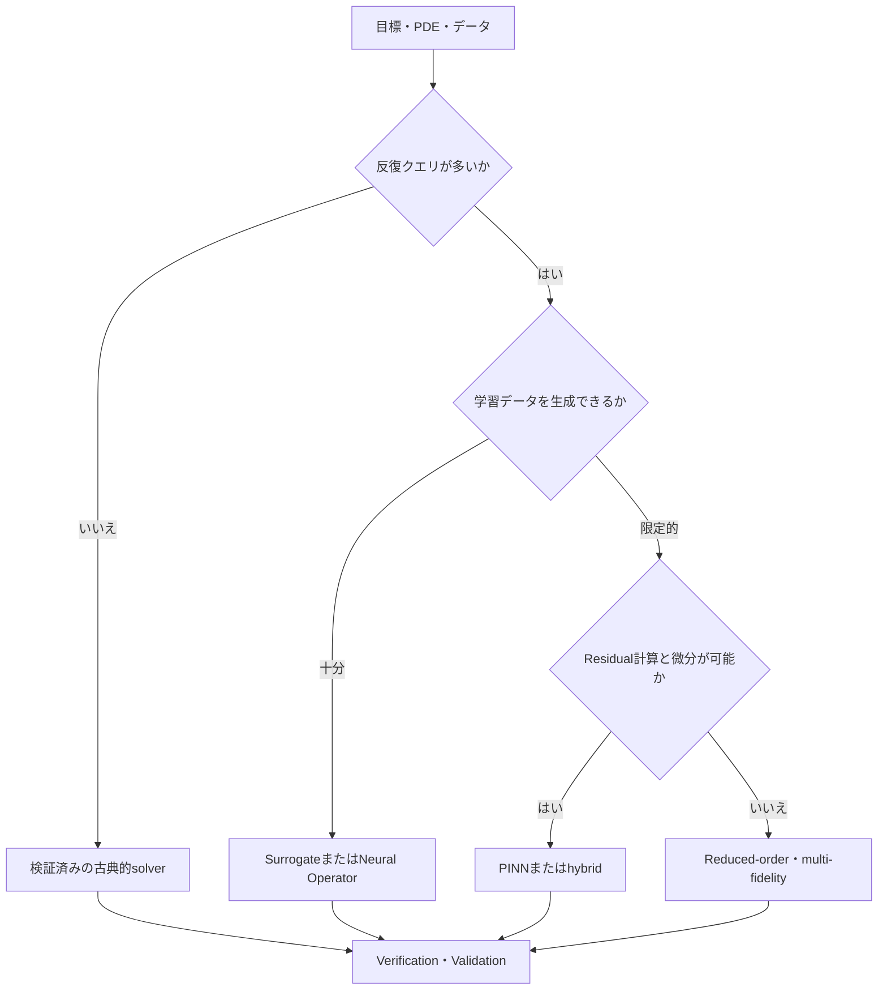



Scientific MLで最も重要な選択は、どのneural networkを使うかではなく、**なぜ学習ベースの解法が必要なのか**を定義することである。
一度だけ高精度な解を求める問題と、繰り返しクエリを高速に近似する問題では、まったく異なるsolverが必要になる。

## 1. 問題：手法名ではなく利用目的を選ぶ

まず、次の問いに答える。

- 一つの条件に対するforward solutionが必要か。
- 未知parameterまたはfieldを推定するinverse problemか。
- 多数のboundary/parameterの組み合わせを繰り返し評価するか。
- 観測が疎で、physics constraintが重要か。
- リアルタイム制御またはoptimizationの中から呼び出されるか。
- 補間だけが必要か、それとも学習範囲外への外挿も求めるか。
- conservationと安定性にどの程度の保証が必要か。

古典的solverは支配方程式とdiscretizationを直接解く。
PINNは方程式residualと観測誤差を学習objectiveとして用いる。
neural operatorは関数から関数へのmappingをデータから学習する。
surrogateは選択した入力と出力の間の低次元mappingを近似する。

各手法は、それぞれ異なる計算コストを先払いする。

## 2. Mental model：offlineコストとonlineクエリの交換



総コストを単純化すると、次のようになる。

$$
C_{\text{total}} = C_{\text{setup}} + C_{\text{train}} + N_q C_{\text{query}} + C_{\text{validation}}
$$

クエリ数 \(N_q\) が少なければ、学習コストを回収できないことがある。
高速な推論だけを示し、データ生成と再学習のコストを隠してはならない。

## 3. 問題契約を書く

```yaml
physics:
  equations: "지배방정식과 constitutive relation"
  domain: "geometry와 좌표계"
  initial_boundary_conditions: "well-posedness 확인"
goal:
  type: "forward | inverse | repeated-query | control"
  outputs: "field, integral quantity, uncertainty"
operating_domain:
  parameters: "학습·검증 범위"
acceptance:
  physics: "conservation과 residual 기준"
  numerical: "reference 대비 오차와 수렴"
  operational: "latency와 memory"
```

方程式そのものが不完全であるか、boundary conditionが不足していれば、networkが物理問題を解決してくれるわけではない。
まずwell-posednessとidentifiabilityを検討する。

## 4. 古典的数値解析器をbaselineに置く

finite difference、finite volume、finite element、spectral methodには、それぞれgeometryと保存特性に長所と短所がある。

古典的solverの強み：

- discretizationと安定性解析が明示的である。
- mesh refinementによって収束を確認できる。
- local conservationを強制するformulationがある。
- boundary conditionの処理が構造化されている。
- 単一の問題では学習データを必要としない。

限界：

- 多数のparameter sweepは高価である。
- inverse problemでは反復最適化が必要である。
- 複雑なsubmodelの微分が難しい。
- リアルタイム要件に合わないことがある。

Scientific MLの候補は、弱いbaselineではなく、適切に設定された古典的solverと比較する。

## 5. PINNを選ぶ条件

PINNの代表的なobjectiveは、次のように書ける。

$$
\mathcal{L}=\lambda_r\mathcal{L}_{\text{residual}}+
\lambda_b\mathcal{L}_{\text{boundary}}+
\lambda_i\mathcal{L}_{\text{initial}}+
\lambda_d\mathcal{L}_{\text{data}}
$$

有利になり得る条件：

- 観測は疎だが、支配方程式が分かっている。
- inverse parameterをfieldと一緒に推定する。
- automatic differentiationによってresidualを計算できる。
- mesh生成が特に難しく、座標samplingが可能である。
- differentiable downstream objectiveが重要である。

注意が必要な条件：

- stiffまたはmulti-scaleなPDE
- 衝撃波と不連続
- 高次元の複雑なgeometry
- 大きさが大幅に異なるloss term
- 長時間積分での誤差蓄積

training lossが小さくても、実際のsolution errorが小さいとは限らない。
独立したreferenceとconservation errorを併せて見る。

## 6. Neural Operatorを選ぶ条件

neural operatorは入力関数 \(a(x)\) からsolution関数 \(u(x)\) へのoperatorを近似する。

$$
\mathcal{G}_{\theta}: a(x) \mapsto u(x)
$$

有利になり得る条件：

- 多様なcoefficient、forcing、boundary conditionに対して繰り返しクエリする。
- 十分で代表性のあるsimulation datasetを作れる。
- 同じproblem family内で高速なfield predictionが必要である。
- resolution変化に対する構造的な一般化を活用したい。

注意点：

- 学習分布外のgeometryとparameterに弱いことがある。
- dataset生成コストが大きい。
- discretization invarianceは実装と学習条件によって制限される。
- pointwise errorが小さくても保存量が誤っていることがある。

学習範囲とデプロイ範囲を明示し、out-of-domain detectorを設ける。

## 7. Surrogateとreduced-order model

field全体ではなく関心量だけが必要なら、低次元surrogateのほうが単純な場合がある。

- Gaussian process
- polynomial chaos
- radial basis model
- tree ensemble
- compact neural network
- proper orthogonal decompositionベースのROM

入力次元と出力構造が小さいほど、複雑なoperator modelの利点は小さくなる。
不確実性推定とactive learningが重要なら、Gaussian process系列が良いbaselineになり得る。

hybridアプローチも可能である。

- coarse solverのcorrectionを学習
- unresolved closureだけを学習
- solver preconditionerを学習
- learned initializerで反復回数を削減
- 安全領域ではsurrogate、領域外ではfull solver

physics全体をblack boxに置き換えなくても、大きな高速化を得られる。

## 8. 実践workflow

### Step 1. nondimensionalization

単位とscaleの差を減らし、支配的な無次元数を特定する。
これは学習の安定性と実験設計の両方に役立つ。

### Step 2. reference hierarchy

少なくとも三段階の基準を設ける。

1. manufactured solutionまたは解析解がある小さな問題
2. mesh/time-step convergenceを確認した数値解
3. 可能なら独立した実験または観測

### Step 3. split by physics regime

ランダムなsample splitだけにしない。
parameter区間、geometry family、時間windowをgroupとして分ける。

### Step 4. 同じbudgetで比較

- データ生成時間
- 学習時間
- hyperparameter search
- 推論latency
- memory
- 再学習頻度

すべてを総コストに含める。

### Step 5. failure-aware routing

```python
def predict(case, surrogate, reference_solver, domain):
    if not domain.contains(case):
        return reference_solver.solve(case), "fallback-out-of-domain"
    estimate, uncertainty = surrogate(case)
    if uncertainty > domain.max_uncertainty:
        return reference_solver.solve(case), "fallback-uncertain"
    return estimate, "surrogate"
```

fallbackは失敗ではなく、デプロイ上の安全装置である。

## 9. 評価設計

誤差を複数の水準で測定する。

- pointwise norm
- relative field norm
- gradient・flux誤差
- integral quantity誤差
- boundary/initial condition違反
- PDE residual
- global/local conservation error
- stability over rollout horizon
- uncertainty calibration
- latencyと総計算コスト

相対 \(L_2\) 誤差の例：

$$
e_{rel}=\frac{\lVert u_{pred}-u_{ref}\rVert_2}{\lVert u_{ref}\rVert_2}
$$

分母が小さいケースでは相対誤差が不安定になるため、絶対誤差と併せて見る。

空間平均一つでは局所的なpeakを隠すことがある。
安全と設計を左右するregionとquantityを別途評価する。

## 10. 評価checklist

- [ ] forward、inverse、repeated-queryのどれが目標か明確である。
- [ ] PDEとboundary conditionのwell-posednessを検討した。
- [ ] 検証済みの古典的solver baselineがある。
- [ ] nondimensionalizationとscale分析を行った。
- [ ] 学習分布とデプロイdomainを明示した。
- [ ] random split以外にregime・geometry holdoutがある。
- [ ] field norm以外にconservationと関心量を測定する。
- [ ] データ生成とtuningを総コストに含めた。
- [ ] reference solutionのdiscretization errorを推定した。
- [ ] out-of-domainと不確実性に基づくfallbackがある。
- [ ] inference速度の比較にI/Oとpreprocessingを含めた。
- [ ] 再現可能なseed、code、model、dataset versionを保存する。

## 11. よくある失敗と限界

### PINNをmesh-freeな汎用代替手段とみなす

座標samplingによってmesh生成を避けられても、optimizationとresidual評価のコストは残る。
高次元、stiff、不連続な問題ではさらに難しくなることがある。

### residual lossを解の誤差と解釈する

collocation pointでresidualが小さくても、domain全体の精度は保証されない。
独立点、保存量、reference解で検証する。

### neural operatorの一つのモデルがすべてのgeometryを扱うと仮定する

geometry encodingと学習分布が一般化の範囲を決める。
未見のtopologyには別途検証が必要である。

### 高速化だけを見てofflineコストを除外する

一回の推論は速くても、dataset生成と再学習のほうがはるかに高価なことがある。
予想クエリ数に基づいてamortizationを計算する。

すべての手法はmodel form errorとデータ偏りを持つ。
Scientific MLは検証を不要にする方法ではなく、検証対象を一つ増やす方法である。

## 12. 公式参考資料

- [Physics-informed neural networks原論文](https://doi.org/10.1016/j.jcp.2018.10.045)
- [Fourier Neural Operator原論文](https://arxiv.org/abs/2010.08895)
- [DeepONet原論文](https://doi.org/10.1038/s42256-021-00302-5)
- [SciPy公式文書](https://docs.scipy.org/doc/scipy/)
- [NeuralOperator公式文書](https://neuraloperator.github.io/dev/)

## 13. まとめ

Scientific ML solverの選択は、流行しているモデルを選ぶことではない。
問題の目的、反復クエリ数、データ可用性、保存要件、失敗コストを基準に、最も単純で検証可能な手法を選ばなければならない。
