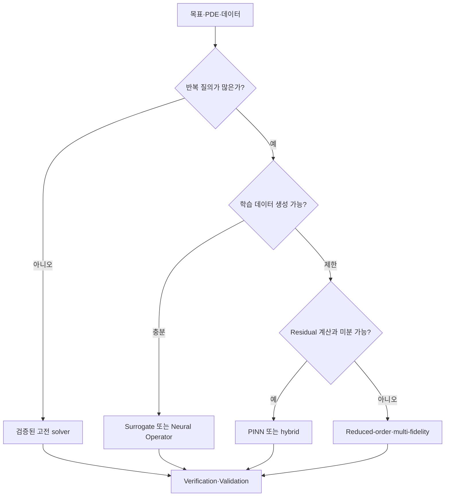



Scientific ML에서 가장 중요한 선택은 어떤 neural network를 쓸지가 아니라 **왜 학습 기반 해법이 필요한지**를 정의하는 것이다.
한 번의 고정밀 해를 구하는 문제와 반복 질의를 빠르게 근사하는 문제는 전혀 다른 solver를 요구한다.

## 1. 문제: 방법 이름이 아니라 사용 목적을 선택한다

먼저 다음 질문에 답한다.

- 한 조건의 forward solution이 필요한가?
- 미지 parameter 또는 field를 추정하는 inverse problem인가?
- 많은 boundary/parameter 조합을 반복 평가하는가?
- 관측이 희소하고 physics constraint가 중요한가?
- 실시간 제어 또는 optimization 안에서 호출되는가?
- 보간만 필요한가, 학습 범위 밖 외삽도 요구하는가?
- conservation과 안정성에 어느 정도 보장이 필요한가?

고전 solver는 지배방정식과 discretization을 직접 푼다.
PINN은 방정식 residual과 관측 오차를 학습 objective로 사용한다.
neural operator는 함수에서 함수로의 mapping을 데이터로 학습한다.
surrogate는 선택한 입력과 출력 사이의 저차원 mapping을 근사한다.

각 방법은 다른 계산 비용을 선불로 지불한다.

## 2. Mental model: offline 비용과 online 질의의 교환



총 비용을 단순화하면 다음과 같다.

$$
C_{\text{total}} = C_{\text{setup}} + C_{\text{train}} + N_q C_{\text{query}} + C_{\text{validation}}
$$

질의 수 (N_q)가 작으면 학습 비용을 회수하지 못할 수 있다.
빠른 추론만 보고 데이터 생성과 재학습 비용을 숨기지 않는다.

## 3. 문제 계약을 작성한다

```yaml
physics:
  equations: "지배방정식과 constitutive relation"
  domain: "geometry와 좌표계"
  initial_boundary_conditions: "well-posedness 확인"
goal:
  type: "forward | inverse | repeated-query | control"
  outputs: "field, integral quantity, uncertainty"
operating_domain:
  parameters: "학습·검증 범위"
acceptance:
  physics: "conservation과 residual 기준"
  numerical: "reference 대비 오차와 수렴"
  operational: "latency와 memory"
```

방정식 자체가 불완전하거나 boundary condition이 부족하면 network가 물리 문제를 해결해 주지 않는다.
먼저 well-posedness와 identifiability를 검토한다.

## 4. 고전 수치해석기를 baseline으로 둔다

finite difference, finite volume, finite element, spectral method는 각각 geometry와 보존 특성에 장단점이 있다.

고전 solver의 강점:

- discretization과 안정성 분석이 명시적이다.
- mesh refinement로 수렴을 확인할 수 있다.
- local conservation을 강제하는 formulation이 있다.
- boundary condition 처리가 구조화돼 있다.
- 단일 문제에서 학습 데이터가 필요 없다.

한계:

- 많은 parameter sweep이 비싸다.
- inverse problem에는 반복 최적화가 필요하다.
- 복잡한 submodel의 미분이 어렵다.
- 실시간 요구에 맞지 않을 수 있다.

Scientific ML 후보는 약한 baseline이 아니라 잘 설정된 고전 solver와 비교한다.

## 5. PINN을 선택할 조건

PINN의 대표 objective는 다음처럼 쓸 수 있다.

$$
\mathcal{L}=\lambda_r\mathcal{L}_{\text{residual}}+
\lambda_b\mathcal{L}_{\text{boundary}}+
\lambda_i\mathcal{L}_{\text{initial}}+
\lambda_d\mathcal{L}_{\text{data}}
$$

유리할 수 있는 조건:

- 관측은 희소하지만 지배방정식이 알려져 있다.
- inverse parameter를 field와 함께 추정한다.
- automatic differentiation으로 residual을 계산할 수 있다.
- mesh 생성이 특별히 어렵고 좌표 sampling이 가능하다.
- differentiable downstream objective가 중요하다.

주의할 조건:

- stiff하거나 multi-scale한 PDE
- 충격과 불연속
- 높은 차원의 복잡 geometry
- 서로 크기가 크게 다른 loss term
- 긴 시간 적분에서 오류 누적

training loss가 작다고 실제 solution error가 작다는 보장은 없다.
독립 reference와 conservation error를 함께 본다.

## 6. Neural Operator를 선택할 조건

neural operator는 입력 함수 (a(x))에서 solution 함수 (u(x))로의 operator를 근사한다.

$$
\mathcal{G}_{\theta}: a(x) \mapsto u(x)
$$

유리할 수 있는 조건:

- 다양한 coefficient, forcing, boundary condition에 반복 질의한다.
- 충분하고 대표적인 simulation dataset을 만들 수 있다.
- 같은 problem family 안에서 빠른 field prediction이 필요하다.
- resolution 변화에 대한 구조적 일반화를 활용하고 싶다.

주의:

- 학습 분포 밖 geometry와 parameter에 약할 수 있다.
- dataset 생성 비용이 크다.
- discretization invariance는 구현과 학습 조건에 따라 제한된다.
- pointwise error가 작아도 보존량이 틀릴 수 있다.

학습 범위와 배포 범위를 명시하고 out-of-domain detector를 둔다.

## 7. Surrogate와 reduced-order model

전체 field가 아니라 관심량만 필요하면 저차원 surrogate가 더 단순할 수 있다.

- Gaussian process
- polynomial chaos
- radial basis model
- tree ensemble
- compact neural network
- proper orthogonal decomposition 기반 ROM

입력 차원과 출력 구조가 작을수록 복잡한 operator model의 이점이 줄어든다.
불확실성 추정과 active learning이 중요하면 Gaussian process 계열이 좋은 baseline이 될 수 있다.

hybrid 접근도 가능하다.

- coarse solver의 correction 학습
- unresolved closure만 학습
- solver preconditioner 학습
- learned initializer로 반복 횟수 감소
- 안전 영역은 surrogate, 경계 밖은 full solver

physics 전체를 black box로 바꾸지 않아도 큰 속도 이득을 얻을 수 있다.

## 8. 실전 workflow

### Step 1. nondimensionalization

단위와 scale 차이를 줄이고 지배 무차원수를 식별한다.
이는 학습 안정성과 실험 설계 모두에 도움이 된다.

### Step 2. reference hierarchy

최소 세 단계의 기준을 둔다.

1. 제조해 또는 해석해가 있는 작은 문제
2. mesh/time-step convergence를 확인한 수치해
3. 가능하면 독립 실험 또는 관측

### Step 3. split by physics regime

무작위 sample split만 하지 않는다.
parameter 구간, geometry family, 시간 window를 group으로 나눈다.

### Step 4. 같은 budget으로 비교

- 데이터 생성 시간
- 학습 시간
- hyperparameter search
- 추론 latency
- memory
- 재학습 빈도

모두 총비용에 포함한다.

### Step 5. failure-aware routing

```python
def predict(case, surrogate, reference_solver, domain):
    if not domain.contains(case):
        return reference_solver.solve(case), "fallback-out-of-domain"
    estimate, uncertainty = surrogate(case)
    if uncertainty > domain.max_uncertainty:
        return reference_solver.solve(case), "fallback-uncertain"
    return estimate, "surrogate"
```

fallback은 실패가 아니라 배포 안전장치다.

## 9. 평가 설계

오차를 여러 수준에서 측정한다.

- pointwise norm
- relative field norm
- gradient·flux 오차
- integral quantity 오차
- boundary/initial condition 위반
- PDE residual
- global/local conservation error
- stability over rollout horizon
- uncertainty calibration
- latency와 총 계산 비용

상대 (L_2) 오차 예:

$$
e_{rel}=\frac{\lVert u_{pred}-u_{ref}\rVert_2}{\lVert u_{ref}\rVert_2}
$$

분모가 작은 사례에서는 상대 오차가 불안정하므로 절대 오차와 함께 본다.

공간 평균 하나가 국소 peak를 숨길 수 있다.
안전과 설계를 좌우하는 region과 quantity를 별도로 평가한다.

## 10. 평가 checklist

- [ ] forward, inverse, repeated-query 중 목표가 명확한가?
- [ ] PDE와 boundary condition의 well-posedness를 검토했는가?
- [ ] 검증된 고전 solver baseline이 있는가?
- [ ] nondimensionalization과 scale 분석을 했는가?
- [ ] 학습 분포와 배포 domain을 명시했는가?
- [ ] random split 외에 regime·geometry holdout이 있는가?
- [ ] field norm 외에 conservation과 관심량을 측정하는가?
- [ ] 데이터 생성과 tuning을 총비용에 포함했는가?
- [ ] reference solution의 discretization error를 추정했는가?
- [ ] out-of-domain과 불확실성 기반 fallback이 있는가?
- [ ] inference 속도 비교에 I/O와 preprocessing을 포함했는가?
- [ ] 재현 가능한 seed, code, model, dataset version을 보존하는가?

## 11. 흔한 실패와 한계

### PINN을 mesh-free 범용 대체제로 본다

좌표 sampling이 mesh 생성을 피할 수 있어도 optimization과 residual 평가 비용은 남는다.
고차원, stiff, 불연속 문제에서 더 어려울 수 있다.

### residual loss를 해 오차로 해석한다

collocation point에서 작은 residual이 전체 domain 정확성을 보장하지 않는다.
독립점, 보존량, reference 해로 검증한다.

### neural operator의 한 모델이 모든 geometry를 다룬다고 가정한다

geometry encoding과 학습 분포가 일반화 범위를 결정한다.
보지 못한 topology에는 별도 검증이 필요하다.

### 속도 향상만 보고 offline 비용을 제외한다

한 번의 추론은 빠르지만 dataset 생성과 재학습이 훨씬 비쌀 수 있다.
예상 질의 수로 amortization을 계산한다.

모든 방법은 모델 form error와 데이터 편향을 가진다.
Scientific ML은 검증을 없애는 방법이 아니라 검증 대상이 하나 더 생기는 방법이다.

## 12. 공식 참고자료

- [Physics-informed neural networks 원 논문](https://doi.org/10.1016/j.jcp.2018.10.045)
- [Fourier Neural Operator 원 논문](https://arxiv.org/abs/2010.08895)
- [DeepONet 원 논문](https://doi.org/10.1038/s42256-021-00302-5)
- [SciPy 공식 문서](https://docs.scipy.org/doc/scipy/)
- [NeuralOperator 공식 문서](https://neuraloperator.github.io/dev/)

## 13. 마무리

Scientific ML solver 선택은 유행하는 모델을 고르는 일이 아니다.
문제 목적, 반복 질의 수, 데이터 가용성, 보존 요구, 실패 비용을 기준으로 가장 단순한 검증 가능한 방법을 선택해야 한다.
