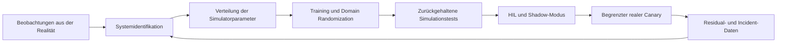



Ziel von Sim-to-Real ist nicht, die Simulation vollkommen identisch mit der Realität zu machen.
Es geht darum, Evidenz dafür aufzubauen, dass eine für das Deployment vorgesehene Policy im gesamten Bereich realer Unsicherheit die geforderte Leistung und die Sicherheitsconstraints einhält.

## 1. Das Problem: Ein Simulator ist zugleich Näherungsmodell und Trainingsdatengenerator

Unterschiede zwischen Realität und Simulation bestehen auf mehreren Ebenen.

- Geometrie und Masseneigenschaften
- Reibung, Dämpfung und Nachgiebigkeit
- Verzögerung, Sättigung und Spiel von Aktuatoren
- Sensorrauschen, Bias und Aussetzer
- Kontakt- und Kollisionsmodelle
- Aktualisierungszeitpunkt des Controllers
- Rendering, Beleuchtung und Textur
- Kommunikationslatenz und Paketverlust
- Verhalten von Menschen und Umgebung

Eine Policy kann statt einer durchschnittlichen Simulation die Fehlermuster eines Simulators erlernen.
Eine alleinige Optimierung des Simulation Return kann die reale Leistung verschlechtern.

## 2. Denkmodell: Die Realitätslücke als Budget verwalten



Wenn wir reale Zustandsübergänge von simulierten unterscheiden, lässt sich die Lücke wie folgt auffassen.

$$
\Delta(s,a)=f_{real}(s,a)-f_{sim}(s,a)
$$

Die Lücke ist keine einzelne Konstante, sondern eine Funktion, die sich nach Zustand und Aktion ändert.
Ermitteln Sie neben dem Durchschnittsfehler auch die schlechtesten Bereiche und das Verteilungsende.

## 3. Zuerst den Deployment-Vertrag definieren

```yaml
task:
  success: "관찰 가능한 완료 조건"
operating_design_domain:
  environment: "허용 표면·조명·장애물 범위"
  payload: "허용 범위"
  speed: "동작 속도 한계"
safety:
  hard_constraints: "거리·힘·속도·workspace"
  fallback: "정지·안전 자세·기존 제어기"
evaluation:
  primary: "성공률과 안전 위반"
  tail: "worst-case와 CVaR"
```

Lassen Sie die Policy außerhalb der Operating Design Domain nicht selbstsicher handeln.
Errichten Sie mit OOD-Erkennung, Guards oder menschlicher Freigabe eine geeignete Grenze.

## 4. Systemidentifikation

Schätzen Sie Simulatorparameter aus Eingaben und Reaktionen realer Geräte.

Beispielziele:

- Trägheitsparameter
- Reibungskoeffizienten
- Motorkonstanten
- Aktuatorverzögerung
- Sensorbias und Rauschspektren
- Kontaktsteifigkeit
- Controllerlatenz

Das Parameterschätzproblem:

$$
\theta^*=\arg\min_{\theta}
\sum_t \lVert y_t^{real}-y_t^{sim}(\theta)\rVert_W^2
$$

Nicht jeder Parameter ist identifizierbar.
Unterschiedliche Kombinationen können ähnliche Trajektorien erzeugen.

Gegenmaßnahmen:

- Sichere Experimente mit ausreichender Anregung entwerfen
- Parametersensitivität analysieren
- Profile Likelihood oder Posterior-Unsicherheit verwenden
- Eine plausible Verteilung statt einer Punktschätzung nutzen
- Kalibrierungs- und Validierungstrajektorien trennen

Wenn das Identifikationsexperiment selbst gefährlich ist, kombinieren Sie Herstellerdaten, Komponententests und konservative Bereiche.

## 5. Domain Randomization

Ziehen Sie während des Trainings Simulatorparameter aus einer Verteilung.

$$
\theta \sim p(\theta),\qquad
\max_\pi \mathbb{E}_{\theta}[J(\pi;\theta)]
$$

Ziele der Randomisierung:

- Dynamikparameter
- Sensorrauschen und -verzögerung
- Aktuatorreaktion
- Anfangszustand
- Objektplatzierung
- Visuelles Erscheinungsbild
- Störungen

Ein zu enger Bereich schließt die Realität nicht ein.
Ein zu weiter Bereich kann die Policy übermäßig konservativ machen oder ihr Lernen verhindern.

Stützen Sie Verteilungen auf Messungen, Fertigungstoleranzen und Umweltbeobachtungen statt auf willkürliche Gleichverteilungen.
Korrelierte Parameter unabhängig zu ziehen kann physikalisch unmögliche Kombinationen erzeugen.

## 6. Curriculum und adaptive Randomisierung

Jede Variation von Anfang an mit ihrem Maximalbereich einzuführen kann das Lernsignal beseitigen.

Beispiel-Curriculum:

1. Nominale Dynamik und einfache Umgebung
2. Variation des Anfangszustands und geringes Sensorrauschen
3. Variation der Dynamik
4. Verzögerung und Störungen
5. Visuelle und Kontaktvariation
6. Zurückgehaltene Extremkombinationen

Adaptive Randomisierung erweitert die Grenze des Bereichs, in dem die Policy derzeit gut funktioniert.
Wenn sich jedoch gleichzeitig die Evaluationsverteilung ändert, entsteht eine Überschätzung.
Bewahren Sie eine separate, feste, zurückgehaltene Testverteilung.

## 7. Repräsentation und Steuerfrequenz

Verwenden Sie wenn möglich physikalisch stabile Repräsentationen statt roher Beobachtungen.

- Relative Position und Orientierung
- Normalisierter Gelenkzustand
- Gefilterte Geschwindigkeit
- Unsicherheits- oder Gültigkeitsflags
- Kontaktzustand

Stellen Sie sicher, dass Filter keine zukünftigen Werte verwenden.

Wenn sich Simulationsschritte von realen Controllerzyklen unterscheiden, ändert sich die Dynamik der Policy.

- Action-Hold-Methode
- Zeitstempel der Beobachtungen
- Berechnungslatenz
- Asynchrone Sensoren
- Verworfene Frames

Bilden Sie all dies im Simulator nach und verarbeiten Sie es anhand von Zeitstempeln.

## 8. Residuale und hybride Steuerung

Es kann nur eine kleine Korrektur zusätzlich zu einem validierten Controller trainiert werden.

$$
u = u_{base} + \alpha u_{learned}
$$

Vorteile:

- Nutzt Stabilität und Constraints der Baseline.
- Erleichtert die Begrenzung des erlernten Aktionsbereichs.
- Verringert die erforderliche Lernkomplexität.

Vorsicht:

- Die Korrektur kann Annahmen des Basiscontrollers verletzen.
- Sättigung und Anti-Windup müssen gemeinsam berücksichtigt werden.
- Validieren Sie $\alpha$ und die Aktionshülle.

Ein Laufzeit-Sicherheitsfilter kann so entworfen werden, dass er die endgültige Aktion projiziert.
Die Eingriffshäufigkeit des Filters ist eine wichtige Qualitätsmetrik der Policy.

## 9. Praktischer Transfer-Workflow

### Stufe 0. Kleine deterministische Tests

- Koordinatensysteme
- Einheiten
- Vorzeichen von Aktionen
- Reset
- Terminierung
- Kollisionsgruppen

Testen Sie den grundlegenden Vertrag.

### Stufe 1. Nominales Training und Baseline

Vergleichen Sie unter denselben Szenarien mit Regeln oder einem bestehenden Controller.

### Stufe 2. Randomisierte Simulation

Trennen Sie die Trainingsverteilung von einer unabhängigen Testverteilung.

### Stufe 3. Stress- und Fehlerinjektion

- Sensoraussetzer
- Aktuatorverzögerung
- Geringe Reibung
- Externe Störungen
- Wahrnehmungsfehler

### Stufe 4. Software-in-the-Loop und Hardware-in-the-Loop

Beziehen Sie echte Zeitabläufe, Middleware und Controllerschnittstellen ein.

### Stufe 5. Shadow-Modus

Die Policy schlägt Aktionen vor, die aber nicht auf das reale Gerät angewendet werden.
Vergleichen Sie sie mit Aktionen des bestehenden Controllers und analysieren Sie gefährliche Aktionen.

### Stufe 6. Begrenzter Canary

Verwenden Sie geringe Geschwindigkeiten, einen kleinen Arbeitsraum, Aufsicht und einen sofortigen Stoppmechanismus.

## 10. Praxisbeispiel: Action Guard

```python
def guarded_action(observation, learned_policy, safe_controller, limits):
    proposal = learned_policy(observation)
    if not observation.valid:
        return safe_controller(observation), "invalid-observation"
    projected = limits.project(proposal)
    if limits.intervention_too_large(proposal, projected):
        return safe_controller(observation), "large-intervention"
    return projected, "learned"
```

Verbergen Sie Guard-Aktivität nicht, sondern zeichnen Sie sie als Ereignisse auf.
Häufige Eingriffe signalisieren, dass die Policy die reale Domäne nicht versteht.

## 11. Evaluationsdesign

Verwenden Sie in Simulation und Realität dieselben Definitionen.

- Aufgabenerfolg
- Abschlusszeit
- Anzahl und Schwere von Sicherheitsverletzungen
- Mindestabstand oder Kraftreserve
- Energie und Aktionsglätte
- Eingriffsquote des Guards
- Erfolg der Wiederherstellung
- Verfehlte Latenzfristen
- Sim-Real-Residuum nach Zustand und Aktion

Untersuchen Sie Ergebnisse zusätzlich zur durchschnittlichen Erfolgsquote je Szenario.

- Nominal
- Parameterextreme
- Kombinierte Störungen
- Sensorfehler
- Unbekannte Objekte oder Layouts
- Grenzen der Operating Design Domain

Bei wenigen realen Versuchen ist die Unsicherheit hoch.
Extrapolieren Sie eine Handvoll Erfolge nicht zu einem Nachweis allgemeiner Sicherheit.

## 12. Checkliste zur Evaluation

- [ ] Wurden Operating Design Domain und verbotene Domäne festgelegt?
- [ ] Sind die Simulatorparameter durch Evidenz und Unsicherheitsschätzungen gestützt?
- [ ] Sind Kalibrierungs- und Validierungstrajektorien getrennt?
- [ ] Ist die Korrelationsstruktur der Randomisierung physikalisch gültig?
- [ ] Sind Trainingsverteilung und zurückgehaltene Stressverteilung getrennt?
- [ ] Wurden Sensor-, Aktuator- und Berechnungslatenz nachgebildet?
- [ ] Sind Tests für Koordinatensysteme und Einheiten automatisiert?
- [ ] Wurde unter denselben Bedingungen mit einem einfachen Controller verglichen?
- [ ] Wird harte Sicherheit auch außerhalb der Policy durchgesetzt?
- [ ] Wurden Shadow- und HIL-Stufen abgeschlossen?
- [ ] Besitzt der reale Canary eine eingeschränkte Aktionshülle?
- [ ] Werden Guard-Eingriffe und Residuen erfasst?
- [ ] Wurden sofortiger Stopp und Fallback praktisch getestet?

## 13. Häufige Fehler und Grenzen

### Glauben, eine breitere Randomisierung werde das Problem lösen

Zufall kann eine falsche Simulatorstruktur nicht korrigieren.
Analysieren Sie reale Residuen, um Fehler der Modellform von Parameterunsicherheit zu unterscheiden.

### Nur den visuellen Realismus verbessern

Steuerungsfehler können aus Lücken in Dynamik und Zeitverhalten entstehen.
Priorisieren Sie Lücken, die die Aufgabe laut Sensitivitätsanalyse beeinflussen.

### Simulationstests während des Trainings wiederverwenden

Zurückgehaltene Szenarien werden faktisch als Validierungsdaten kontaminiert.
Halten Sie die endgültige Stresssuite separat.

### Nur erfolgreiche reale Fälle bewahren

Fehler und Guard-Eingriffe können für die Verbesserung des Transfers wichtigere Daten sein.
Erfassen Sie alle Versuche und ihre Bedingungen innerhalb sicherer Grenzen.

Sim-to-Real kann mit endlichen Tests nicht jede reale Bedingung garantieren.
Einschränkungen des Betriebsbereichs, Laufzeitmonitore und Fallbacks bleiben erforderlich.

## 14. Offizielle Referenzen

- [Originalpublikation: Domain Randomization for Transferring Deep Neural Networks](https://arxiv.org/abs/1703.06907)
- [Originalpublikation: Dynamics Randomization](https://arxiv.org/abs/1710.06537)
- [Offizielle NVIDIA-Isaac-Lab-Dokumentation](https://isaac-sim.github.io/IsaacLab/)
- [Offizielle MuJoCo-Dokumentation](https://mujoco.readthedocs.io/)
- [Offizielle ROS-2-Dokumentation](https://docs.ros.org/en/rolling/)

## 15. Fazit

Sim-to-Real ist keine einmalige Übertragung, sondern ein iterativer Prozess, der reale Residuen misst und Simulatorverteilungen sowie Sicherheitsgrenzen aktualisiert.
Ein Testsystem, das Unsicherheit abbildet, und ein gestuftes Deployment sind wichtiger als ein im Durchschnitt genaues Modell.
