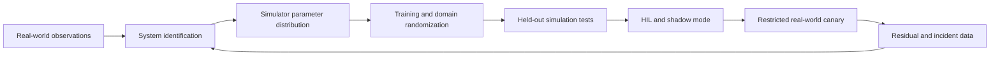



The goal of sim-to-real is not to make simulation perfectly identical to reality.
It is to build evidence that a policy intended for deployment maintains the required performance and safety constraints across the range of real-world uncertainty.

## 1. The problem: A simulator is both an approximate model and a training data generator

Differences between reality and simulation exist at multiple layers.

- Geometry and mass properties
- Friction, damping, and compliance
- Actuator delay, saturation, and backlash
- Sensor noise, bias, and dropout
- Contact and collision models
- Controller update timing
- Rendering, lighting, and texture
- Communication latency and packet loss
- The behavior of people and the surrounding environment

A policy can learn a simulator's error patterns rather than an average simulation.
Optimizing only simulation return can make real-world performance worse.

## 2. Mental model: Manage the reality gap as a budget



If we distinguish real-world transitions from simulation transitions, we can think of the gap as follows.

$$
\Delta(s,a)=f_{real}(s,a)-f_{sim}(s,a)
$$

The gap is not a single constant, but a function that varies by state and action.
In addition to average error, find the worst regions and the tail.

## 3. Define the deployment contract first

```yaml
task:
  success: "관찰 가능한 완료 조건"
operating_design_domain:
  environment: "허용 표면·조명·장애물 범위"
  payload: "허용 범위"
  speed: "동작 속도 한계"
safety:
  hard_constraints: "거리·힘·속도·workspace"
  fallback: "정지·안전 자세·기존 제어기"
evaluation:
  primary: "성공률과 안전 위반"
  tail: "worst-case와 CVaR"
```

Do not let the policy act confidently outside the operating design domain.
Establish an appropriate boundary using OOD detection, guards, or human approval.

## 4. System identification

Estimate simulator parameters from the inputs and responses of real equipment.

Example targets:

- Inertial parameters
- Friction coefficients
- Motor constants
- Actuator lag
- Sensor bias and noise spectra
- Contact stiffness
- Controller latency

The parameter estimation problem:

$$
\theta^*=\arg\min_{\theta}
\sum_t \lVert y_t^{real}-y_t^{sim}(\theta)\rVert_W^2
$$

Not every parameter is identifiable.
Different combinations can produce similar trajectories.

Responses:

- Design safe experiments with sufficient excitation
- Analyze parameter sensitivity
- Use profile likelihood or posterior uncertainty
- Use a plausible distribution instead of a point estimate
- Separate calibration and validation trajectories

If the identification experiment itself is dangerous, combine manufacturer data, component tests, and conservative ranges.

## 5. Domain randomization

During training, sample simulator parameters from a distribution.

$$
\theta \sim p(\theta),\qquad
\max_\pi \mathbb{E}_{\theta}[J(\pi;\theta)]
$$

Randomization targets:

- Dynamics parameters
- Sensor noise and delay
- Actuator response
- Initial state
- Object placement
- Visual appearance
- Disturbances

A range that is too narrow will not include reality.
A range that is too wide can make the policy overly conservative or prevent it from learning.

Base distributions on measurements, manufacturing tolerances, and environmental observations rather than arbitrary uniform ranges.
Sampling correlated parameters independently can create physically impossible combinations.

## 6. Curriculum and adaptive randomization

Introducing every variation at its maximum range from the outset can eliminate the learning signal.

Example curriculum:

1. Nominal dynamics and a simple environment
2. Initial-state variation and small sensor noise
3. Dynamics variation
4. Delay and disturbances
5. Visual and contact variation
6. Held-out extreme combinations

Adaptive randomization expands the boundary of the range in which the policy currently performs well.
Changing the evaluation distribution at the same time, however, leads to overestimation.
Maintain a separate, fixed held-out test distribution.

## 7. Representation and control frequency

When possible, use physically stable representations instead of raw observations.

- Relative position and orientation
- Normalized joint state
- Filtered velocity
- Uncertainty or validity flags
- Contact state

Ensure that filters do not use future values.

When simulation steps differ from real controller cycles, the policy dynamics change.

- Action-hold method
- Observation timestamps
- Computation latency
- Asynchronous sensors
- Dropped frames

Reproduce all of these in the simulator and process them using timestamps.

## 8. Residual and hybrid control

You can train only a small correction on top of a validated controller.

$$
u = u_{base} + \alpha u_{learned}
$$

Advantages:

- Leverages baseline stability and constraints.
- Makes the learned action range easier to restrict.
- Reduces the required learning complexity.

Cautions:

- The correction can violate assumptions of the base controller.
- Saturation and anti-windup must be considered together.
- Validate \(\alpha\) and the action envelope.

A runtime safety filter can be designed to project the final action.
The filter's intervention frequency is an important policy quality metric.

## 9. Practical transfer workflow

### Stage 0. Small deterministic tests

- Coordinate frames
- Units
- Action signs
- Reset
- Termination
- Collision groups

Test the basic contract.

### Stage 1. Nominal training and baseline

Compare against rules or an existing controller under the same scenarios.

### Stage 2. Randomized simulation

Separate the training distribution from an independent test distribution.

### Stage 3. Stress and fault injection

- Sensor dropout
- Actuator delay
- Low friction
- External disturbances
- Perception errors

### Stage 4. Software-in-the-loop and hardware-in-the-loop

Include actual timing, middleware, and controller interfaces.

### Stage 5. Shadow mode

The policy proposes actions, but they are not applied to the real equipment.
Compare them against actions from the existing controller and analyze dangerous actions.

### Stage 6. Restricted canary

Use low speeds, a small workspace, a supervisor, and an immediate stop mechanism.

## 10. Practical example: Action guard

```python
def guarded_action(observation, learned_policy, safe_controller, limits):
    proposal = learned_policy(observation)
    if not observation.valid:
        return safe_controller(observation), "invalid-observation"
    projected = limits.project(proposal)
    if limits.intervention_too_large(proposal, projected):
        return safe_controller(observation), "large-intervention"
    return projected, "learned"
```

Do not hide guard activity; record it as events.
Frequent intervention signals that the policy does not understand the real domain.

## 11. Evaluation design

Use the same definitions in simulation and reality.

- Task success
- Completion time
- Safety violation count and severity
- Minimum distance or force margin
- Energy and action smoothness
- Guard intervention rate
- Recovery success
- Latency deadline misses
- Sim-real residual by state and action

In addition to the average success rate, examine results by scenario.

- Nominal
- Parameter extremes
- Compound disturbances
- Sensor faults
- Unseen objects or layouts
- Operating design domain boundaries

With few real-world trials, uncertainty is high.
Do not extrapolate a handful of successes into proof of general safety.

## 12. Evaluation checklist

- [ ] Have the operating design domain and prohibited domain been specified?
- [ ] Are the simulator parameters supported by evidence and uncertainty estimates?
- [ ] Are calibration and validation trajectories separated?
- [ ] Is the randomization correlation structure physically valid?
- [ ] Are the training distribution and held-out stress distribution separated?
- [ ] Have sensor, actuator, and computation latency been reproduced?
- [ ] Are coordinate-frame and unit tests automated?
- [ ] Has comparison with a simple controller under the same conditions been performed?
- [ ] Is hard safety enforced outside the policy as well?
- [ ] Have the shadow and HIL stages been completed?
- [ ] Does the real-world canary have a restricted action envelope?
- [ ] Are guard interventions and residuals recorded?
- [ ] Have the immediate stop and fallback been tested in practice?

## 13. Common failures and limitations

### Believing that wider randomization will solve the problem

Randomness cannot fix an incorrect simulator structure.
Analyze real-world residuals to distinguish model-form error from parameter uncertainty.

### Improving visual realism alone

Control failures can originate in dynamics and timing gaps.
Prioritize gaps that affect the task through sensitivity analysis.

### Reusing simulation tests during training

Held-out scenarios are effectively contaminated as validation data.
Keep the final stress suite separate.

### Retaining only successful real-world cases

Failures and guard interventions may be more important data for improving transfer.
Record all trials and their conditions within safe bounds.

Sim-to-real cannot guarantee every real-world condition with finite testing.
Operating-range restrictions, runtime monitors, and fallbacks remain necessary.

## 14. Official references

- [Original paper: Domain Randomization for Transferring Deep Neural Networks](https://arxiv.org/abs/1703.06907)
- [Original paper: Dynamics Randomization](https://arxiv.org/abs/1710.06537)
- [Official NVIDIA Isaac Lab documentation](https://isaac-sim.github.io/IsaacLab/)
- [Official MuJoCo documentation](https://mujoco.readthedocs.io/)
- [Official ROS 2 documentation](https://docs.ros.org/en/rolling/)

## 15. Conclusion

Sim-to-real is not a one-time transfer but an iterative process of measuring real-world residuals and updating simulator distributions and safety boundaries.
A test system that represents uncertainty, together with staged deployment, matters more than an accurate average model.
