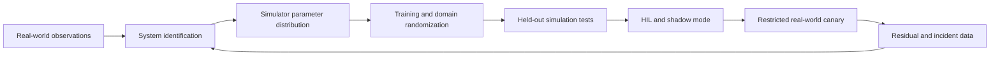



El objetivo de sim-to-real no es hacer que la simulación sea perfectamente idéntica a la realidad.
Se trata de generar evidencia de que una política destinada a ser implementada mantiene las limitaciones de desempeño y seguridad requeridas en todo el rango de incertidumbre del mundo real.

## 1. El problema: un simulador es a la vez un modelo aproximado y un generador de datos de entrenamiento

Las diferencias entre realidad y simulación existen en múltiples capas.

- Geometría y propiedades de masa.
- Fricción, amortiguación y cumplimiento.
- Retraso, saturación y reacción del actuador.
- Ruido, polarización y abandono del sensor
- Modelos de contacto y colisión.
- Tiempo de actualización del controlador
- Renderizado, iluminación y textura.
- Latencia de comunicación y pérdida de paquetes.
- El comportamiento de las personas y el entorno.

Una política puede aprender los patrones de error de un simulador en lugar de una simulación promedio.
Optimizar únicamente el rendimiento de la simulación puede empeorar el rendimiento en el mundo real.

## 2. Modelo mental: Gestionar la brecha de la realidad como presupuesto



Si distinguimos las transiciones del mundo real de las transiciones de simulación, podemos pensar en la brecha de la siguiente manera.

$$
\Delta(s,a)=f_{real}(s,a)-f_{sim}(s,a)
$$

La brecha no es una constante única, sino una función que varía según el estado y la acción.
Además del error promedio, encuentre las peores regiones y la cola.

## 3. Primero defina el contrato de implementación

```yaml
task:
  success: "관찰 가능한 완료 조건"
operating_design_domain:
  environment: "허용 표면·조명·장애물 범위"
  payload: "허용 범위"
  speed: "동작 속도 한계"
safety:
  hard_constraints: "거리·힘·속도·workspace"
  fallback: "정지·안전 자세·기존 제어기"
evaluation:
  primary: "성공률과 안전 위반"
  tail: "worst-case와 CVaR"
```

No permita que la política actúe con confianza fuera del dominio del diseño operativo.
Establezca un límite apropiado mediante OOD detección, guardias o aprobación humana.

## 4. Identificación del sistema

Estimar los parámetros del simulador a partir de las entradas y respuestas de equipos reales.

Objetivos de ejemplo:

- Parámetros inerciales
- Coeficientes de fricción
- Constantes del motor
- Retraso del actuador
- Polarización del sensor y espectros de ruido.
- Rigidez de contacto
- Latencia del controlador

El problema de estimación de parámetros:

$$
\theta^*=\arg\min_{\theta}
\sum_t \lVert y_t^{real}-y_t^{sim}(\theta)\rVert_W^2
$$

No todos los parámetros son identificables.
Diferentes combinaciones pueden producir trayectorias similares.

Respuestas:

- Diseñar experimentos seguros con suficiente excitación.
- Analizar la sensibilidad de los parámetros.
- Utilizar perfil de probabilidad o incertidumbre posterior.
- Utilice una distribución plausible en lugar de una estimación puntual.
- Trayectorias separadas de calibración y validación.

Si el experimento de identificación en sí es peligroso, combine los datos del fabricante, las pruebas de los componentes y los rangos conservadores.

## 5. Aleatorización de dominios

Durante el entrenamiento, muestree los parámetros del simulador a partir de una distribución.

$$
\theta \sim p(\theta),\qquad
\max_\pi \mathbb{E}_{\theta}[J(\pi;\theta)]
$$

Objetivos de aleatorización:

- Parámetros dinámicos
- Ruido y retraso del sensor
- Respuesta del actuador
- Estado inicial
- Colocación de objetos
- Aspecto visual
- Perturbaciones

Un rango demasiado estrecho no incluirá la realidad.
Un rango demasiado amplio puede hacer que la política sea demasiado conservadora o impedir que aprenda.

Base las distribuciones en mediciones, tolerancias de fabricación y observaciones ambientales en lugar de rangos uniformes arbitrarios.
El muestreo de parámetros correlacionados de forma independiente puede crear combinaciones físicamente imposibles.

## 6. Plan de estudios y aleatorización adaptativa

Introducir cada variación en su rango máximo desde el principio puede eliminar la señal de aprendizaje.

Ejemplo de plan de estudios:

1. Dinámica nominal y entorno sencillo.
2. Variación del estado inicial y pequeño ruido del sensor.
3. Variación de la dinámica
4. Retrasos y perturbaciones
5. Variación visual y de contacto.
6. Combinaciones extremas retenidas

La aleatorización adaptativa amplía el límite del rango en el que la política actualmente funciona bien.
Sin embargo, cambiar al mismo tiempo la distribución de las evaluaciones conduce a una sobreestimación.
Mantenga una distribución de prueba fija y separada.

## 7. Frecuencia de representación y control.

Cuando sea posible, utilice representaciones físicamente estables en lugar de observaciones sin procesar.

- Posición relativa y orientación.
- Estado articular normalizado
- Velocidad filtrada
- Banderas de incertidumbre o validez.
- Estado de contacto

Asegúrese de que los filtros no utilicen valores futuros.

Cuando los pasos de la simulación difieren de los ciclos reales del controlador, la dinámica de las políticas cambia.

- Método de retención de acción
- Marcas de tiempo de observación
- Latencia de cálculo
- Sensores asíncronos
- Marcos caídos

Reproduzca todo esto en el simulador y procéselos usando marcas de tiempo.

## 8. Control residual e híbrido

Puedes entrenar solo una pequeña corrección además de un controlador validado.

$$
u = u_{base} + \alpha u_{learned}
$$

Ventajas:

- Aprovecha la estabilidad y las limitaciones de la línea base.
- Hace que el rango de acción aprendido sea más fácil de restringir.
- Reduce la complejidad de aprendizaje requerida.

Precauciones:

- La corrección puede violar supuestos del controlador de base.
- La saturación y el anti-windup deben considerarse juntos.
- Validar \(\alpha\) y el sobre de acción.

Se puede diseñar un filtro de seguridad en tiempo de ejecución para proyectar la acción final.
La frecuencia de intervención del filtro es una métrica importante de calidad de las políticas.

## 9. Flujo de trabajo de transferencia práctico

### Etapa 0. Pequeñas pruebas deterministas

- Marcos de coordenadas
- Unidades
- Señales de acción
- Reiniciar
- Terminación
- Grupos de colisión

Pruebe el contrato básico.

### Etapa 1. Formación nominal y línea base

Compare con reglas o con un controlador existente en los mismos escenarios.

### Etapa 2. Simulación aleatoria

Separe la distribución de entrenamiento de una distribución de prueba independiente.

### Etapa 3. Inyección de tensiones y fallos

- Abandono del sensor
- Retardo del actuador
- Baja fricción
- perturbaciones externas
- Errores de percepción

### Etapa 4. Software-in-the-loop y hardware-in-the-loop

Incluya interfaces de sincronización, middleware y controlador reales.

### Etapa 5. Modo sombra

La política propone acciones, pero no se aplican al equipamiento real.
Compárelos con acciones del controlador existente y analice acciones peligrosas.

### Etapa 6. Canario restringido

Utilice velocidades bajas, un espacio de trabajo pequeño, un supervisor y un mecanismo de parada inmediata.

## 10. Ejemplo práctico: Acción de guardia

```python
def guarded_action(observation, learned_policy, safe_controller, limits):
    proposal = learned_policy(observation)
    if not observation.valid:
        return safe_controller(observation), "invalid-observation"
    projected = limits.project(proposal)
    if limits.intervention_too_large(proposal, projected):
        return safe_controller(observation), "large-intervention"
    return projected, "learned"
```

No oculte la actividad de guardia; registrarlo como eventos.
La intervención frecuente indica que la política no comprende el ámbito real.

## 11. Diseño de evaluación

Utilice las mismas definiciones en simulación y realidad.

- Éxito de la tarea
- tiempo de finalización
- Recuento y gravedad de las infracciones de seguridad
- Distancia mínima o margen de fuerza
- Energía y suavidad de acción.
- Tasa de intervención de guardia
- Éxito de la recuperación
- Se incumple el plazo de latencia
- Residual Sim-real por estado y acción.

Además de la tasa de éxito promedio, examine los resultados por escenario.

- nominales
- Extremos de parámetros
- perturbaciones compuestas
- Fallos de sensores
- Objetos o diseños invisibles
- Límites del dominio de diseño operativo

Con pocas pruebas en el mundo real, la incertidumbre es alta.
No extrapole un puñado de éxitos como prueba de seguridad general.

## 12. Lista de verificación de evaluación

- [ ] ¿Se ha especificado el dominio de diseño operativo y el dominio prohibido?
- [ ] ¿Los parámetros del simulador están respaldados por evidencia y estimaciones de incertidumbre?
- [ ] ¿Están separadas las trayectorias de calibración y validación?
- [ ] ¿Es físicamente válida la estructura de correlación de aleatorización?
- [] ¿Están separadas la distribución del entrenamiento y la distribución del estrés prolongado?
- [ ] ¿Se ha reproducido la latencia del sensor, del actuador y del cálculo?
- [] ¿Están automatizadas las pruebas unitarias y de marco de coordenadas?
- [ ] ¿Se ha realizado una comparación con un controlador simple en las mismas condiciones?
- [] ¿Se aplica también una seguridad estricta fuera de la política?
- [ ] ¿Se han completado las etapas de sombra y HIL?
- [ ] ¿El canario del mundo real tiene un ámbito de acción restringido?
- [ ] ¿Se registran las intervenciones de guardia y los residuales?
- [ ] ¿Se han probado en la práctica la parada inmediata y el retroceso?

## 13. Fallos y limitaciones comunes

### Creer que una aleatorización más amplia resolverá el problema

La aleatoriedad no puede arreglar una estructura de simulador incorrecta.
Analice los residuos del mundo real para distinguir el error de forma del modelo de la incertidumbre de los parámetros.

### Mejorar el realismo visual solo

Las fallas de control pueden originarse en desfases de dinámica y sincronización.
Priorizar brechas que afectan la tarea mediante análisis de sensibilidad.

### Reutilización de pruebas de simulación durante el entrenamiento

Los escenarios retenidos están efectivamente contaminados como datos de validación.
Mantenga el conjunto de estrés final separado.

### Conservar solo casos exitosos del mundo real

Los fallos y las intervenciones de los guardias pueden ser datos más importantes para mejorar la transferencia.
Registre todas las pruebas y sus condiciones dentro de límites seguros.

Sim-to-real no puede garantizar todas las condiciones del mundo real con pruebas finitas.
Siguen siendo necesarias restricciones del alcance operativo, monitores de tiempo de ejecución y alternativas.

## 14. Referencias oficiales

- [Artículo original: Aleatorización de dominios para la transferencia de redes neuronales profundas](https://arxiv.org/abs/1703.06907)
- [Artículo original: Aleatorización dinámica](https://arxiv.org/abs/1710.06537)
- [Documentación oficial de Isaac Lab NVIDIA](https://isaac-sim.github.io/IsaacLab/)
- [Documentación oficial de MuJoCo](https://mujoco.readthedocs.io/)
- [Documentación oficial ROS 2](https://docs.ros.org/en/rolling/)

## 15. Conclusión

Sim-to-real no es una transferencia única, sino un proceso iterativo de medición de residuos del mundo real y actualización de las distribuciones del simulador y los límites de seguridad.
Un sistema de prueba que represente incertidumbre, junto con una implementación por etapas, es más importante que un modelo promedio preciso.
