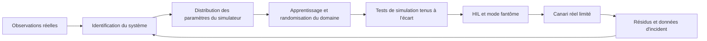



Le but du sim-to-real n’est pas de rendre la simulation parfaitement identique à la réalité.
Il s’agit d’accumuler des preuves que la politique à déployer maintiendra les performances requises et les contraintes de sécurité dans la plage d’incertitude du monde réel.

## 1. Problème : le simulateur est à la fois un modèle approximatif et un générateur de données d’apprentissage

Les différences entre réalité et simulation existent à plusieurs niveaux.

- géométrie et propriétés de masse ;
- frottement, amortissement et compliance ;
- retard, saturation et jeu des actionneurs ;
- bruit, biais et perte de données des capteurs ;
- modèles de contact et de collision ;
- cadence de mise à jour du contrôleur ;
- rendu, éclairage et textures ;
- latence des communications et perte de paquets ;
- comportement des personnes et de l’environnement.

La politique peut apprendre les motifs d’erreur du simulateur plutôt que son comportement moyen.
Maximiser seulement le rendement en simulation peut dégrader les performances réelles.

## 2. Modèle mental : gérer l’écart avec le réel comme un budget



En distinguant les transitions réelles des transitions simulées, on peut représenter l’écart comme suit :

$$
\Delta(s,a)=f_{real}(s,a)-f_{sim}(s,a)
$$

Cet écart n’est pas une constante unique, mais une fonction qui varie selon l’état et l’action.
Il faut rechercher les pires régions et la traîne de la distribution, en plus de l’erreur moyenne.

## 3. Définir d’abord le contrat de déploiement

```yaml
task:
  success: "관찰 가능한 완료 조건"
operating_design_domain:
  environment: "허용 표면·조명·장애물 범위"
  payload: "허용 범위"
  speed: "동작 속도 한계"
safety:
  hard_constraints: "거리·힘·속도·workspace"
  fallback: "정지·안전 자세·기존 제어기"
evaluation:
  primary: "성공률과 안전 위반"
  tail: "worst-case와 CVaR"
```

La politique ne doit pas agir avec assurance en dehors du domaine de conception opérationnelle.
Définissez une frontière adaptée au moyen d’une détection hors distribution, d’une protection ou d’une approbation humaine.

## 4. Identification du système

Les paramètres du simulateur sont estimés à partir des entrées et réponses de l’équipement réel.

Exemples de paramètres :

- paramètres inertiels ;
- coefficient de frottement ;
- constante du moteur ;
- retard de l’actionneur ;
- biais du capteur et spectre du bruit ;
- rigidité du contact ;
- latence du contrôleur.

Problème d’estimation des paramètres :

$$
\theta^*=\arg\min_{\theta}
\sum_t \lVert y_t^{real}-y_t^{sim}(\theta)\rVert_W^2
$$

Tous les paramètres ne sont pas identifiables.
Des combinaisons différentes peuvent produire des trajectoires similaires.

Réponses possibles :

- concevoir des expériences sûres avec une excitation suffisante ;
- analyser la sensibilité des paramètres ;
- utiliser la vraisemblance profilée ou l’incertitude a posteriori ;
- préférer une distribution plausible à une estimation ponctuelle ;
- séparer les trajectoires d’étalonnage et de validation.

Si l’expérience d’identification est elle-même dangereuse, combinez les données du fabricant, des essais de composants et des plages conservatrices.

## 5. Randomisation du domaine

Pendant l’apprentissage, les paramètres du simulateur sont échantillonnés dans une distribution.

$$
\theta \sim p(\theta),\qquad
\max_\pi \mathbb{E}_{\theta}[J(\pi;\theta)]
$$

Éléments à randomiser :

- paramètres dynamiques ;
- bruit et retard des capteurs ;
- réponse des actionneurs ;
- état initial ;
- placement des objets ;
- apparence visuelle ;
- perturbations.

Une plage trop étroite ne couvre pas la réalité.
Une plage trop large peut produire une politique excessivement prudente, voire empêcher l’apprentissage.

La distribution doit reposer sur des mesures, les tolérances de fabrication et l’observation de l’environnement, plutôt que sur une plage uniforme arbitraire.
Échantillonner indépendamment des paramètres corrélés peut créer des combinaisons physiquement impossibles.

## 6. Curriculum et randomisation adaptative

Appliquer dès le départ toutes les variations sur leur plage maximale peut faire disparaître le signal d’apprentissage.

Exemple de curriculum :

1. dynamique nominale et environnement simple ;
2. état initial et faible bruit des capteurs ;
3. variations de la dynamique ;
4. retards et perturbations ;
5. variations visuelles et de contact ;
6. combinaisons extrêmes tenues à l’écart.

La randomisation adaptative élargit la frontière de la plage que la politique maîtrise actuellement.
Mais modifier en même temps la distribution d’évaluation entraîne une surestimation.
Conservez séparément une distribution de test fixe et tenue à l’écart.

## 7. Représentation et fréquence de contrôle

Lorsque c’est possible, utilisez une représentation physiquement stable plutôt que des observations brutes.

- position et orientation relatives ;
- état normalisé des articulations ;
- vitesse filtrée ;
- incertitude ou indicateur de validité ;
- état du contact.

Vérifiez que le filtre n’utilise pas de valeurs futures.

Si le pas de simulation diffère du cycle du contrôleur réel, la dynamique de la politique change.

- méthode de maintien de l’action ;
- horodatage des observations ;
- latence de calcul ;
- capteurs asynchrones ;
- images perdues.

Tous ces phénomènes doivent être reproduits dans le simulateur et traités en fonction des horodatages.

## 8. Contrôle résiduel et hybride

Il est possible de n’apprendre qu’une petite correction ajoutée à un contrôleur éprouvé.

$$
u = u_{base} + \alpha u_{learned}
$$

Avantages :

- exploiter la stabilité et les contraintes du système de base ;
- limiter plus facilement la plage des actions apprises ;
- réduire la complexité de l’apprentissage nécessaire.

Points d’attention :

- la correction peut invalider les hypothèses du contrôleur de base ;
- la saturation et l’anti-windup doivent être pris en compte ensemble ;
- \(\alpha\) et l’enveloppe des actions doivent être validés.

Un filtre de sécurité à l’exécution peut projeter l’action finale.
La fréquence de ses interventions est un indicateur important de la qualité de la politique.

## 9. Workflow de transfert vers le réel

### Étape 0. Petit test déterministe

- repères de coordonnées ;
- unités ;
- signe des actions ;
- réinitialisation ;
- terminaison ;
- groupes de collision.

Testez les contrats fondamentaux.

### Étape 1. Apprentissage nominal et baseline

Comparez la politique, dans les mêmes scénarios, à un système à base de règles ou à un contrôleur existant.

### Étape 2. Simulation randomisée

Séparez la distribution d’apprentissage d’une distribution de test indépendante.

### Étape 3. Tests de résistance et injection de fautes

- perte de données des capteurs ;
- retard des actionneurs ;
- faible frottement ;
- perturbation externe ;
- erreur de perception.

### Étape 4. Software-in-the-loop et hardware-in-the-loop

Incluez la cadence réelle, le middleware et l’interface du contrôleur.

### Étape 5. Mode fantôme

La politique propose une action sans que celle-ci soit appliquée à l’équipement réel.
Comparez-la à l’action du contrôleur existant et analysez les actions dangereuses.

### Étape 6. Canari limité

Imposez une faible vitesse, un petit espace de travail, un observateur et un dispositif d’arrêt immédiat.

## 10. Exemple pratique : protection des actions

```python
def guarded_action(observation, learned_policy, safe_controller, limits):
    proposal = learned_policy(observation)
    if not observation.valid:
        return safe_controller(observation), "invalid-observation"
    projected = limits.project(proposal)
    if limits.intervention_too_large(proposal, projected):
        return safe_controller(observation), "large-intervention"
    return projected, "learned"
```

Ne dissimulez pas l’intervention de la protection : consignez-la comme un événement.
Des interventions fréquentes indiquent que la politique comprend mal le domaine réel.

## 11. Conception de l’évaluation

Utilisez les mêmes définitions dans la simulation et dans le monde réel.

- réussite de la tâche ;
- temps d’exécution ;
- nombre et gravité des violations de sécurité ;
- distance minimale ou marge de force ;
- énergie et régularité des actions ;
- taux d’intervention de la protection ;
- réussite de la récupération ;
- dépassement des échéances de latence ;
- résidu simulation-réalité par état et par action.

Examinez les résultats par scénario, et pas seulement le taux de réussite moyen.

- conditions nominales ;
- valeurs extrêmes des paramètres ;
- perturbations combinées ;
- panne de capteur ;
- objet ou agencement inédit ;
- frontière du domaine de conception opérationnelle.

Lorsque le nombre d’essais réels est faible, l’incertitude est grande.
Quelques réussites ne doivent pas être extrapolées en preuve générale de sécurité.

## 12. Checklist d’évaluation

- [ ] Le domaine de conception opérationnelle et les zones interdites sont-ils explicites ?
- [ ] Les paramètres du simulateur sont-ils justifiés et accompagnés de leur incertitude ?
- [ ] Les trajectoires d’étalonnage et de validation sont-elles séparées ?
- [ ] La structure de corrélation de la randomisation est-elle physiquement plausible ?
- [ ] La distribution d’apprentissage est-elle séparée de la distribution de résistance tenue à l’écart ?
- [ ] Les latences des capteurs, des actionneurs et du calcul sont-elles reproduites ?
- [ ] Les tests des repères de coordonnées et des unités sont-ils automatisés ?
- [ ] La comparaison avec un contrôleur simple est-elle réalisée dans les mêmes conditions ?
- [ ] La sécurité stricte est-elle imposée aussi en dehors de la politique ?
- [ ] Les étapes fantôme et HIL ont-elles été effectuées ?
- [ ] Le canari réel possède-t-il une enveloppe d’actions limitée ?
- [ ] Les interventions de la protection et les résidus sont-ils consignés ?
- [ ] L’arrêt immédiat et le repli ont-ils été testés sur le système réel ?

## 13. Échecs fréquents et limites

### Croire qu’il suffit d’élargir la plage de randomisation

Le hasard ne corrige pas une structure erronée du simulateur.
Analysez les résidus réels pour distinguer l’erreur de forme du modèle de l’incertitude des paramètres.

### Se concentrer uniquement sur le réalisme visuel

Les échecs de contrôle peuvent venir de la dynamique et des écarts de cadence.
Classez les écarts qui influencent la tâche au moyen d’une analyse de sensibilité.

### Réutiliser les tests de simulation pendant l’apprentissage

Les scénarios tenus à l’écart finissent alors par être contaminés comme s’ils servaient à la validation.
Conservez une suite finale de tests de résistance séparée.

### Ne conserver que les réussites réelles

Les échecs et les interventions de la protection peuvent être plus utiles pour améliorer le transfert.
Dans les limites de sécurité, consignez tous les essais et leurs conditions.

Le sim-to-real ne peut garantir toutes les conditions réelles à partir d’un nombre fini d’essais.
Il faut continuer à limiter le domaine d’exploitation et conserver une surveillance à l’exécution ainsi qu’un mécanisme de repli.

## 14. Références officielles

- [Article original sur la randomisation du domaine pour le transfert de réseaux neuronaux profonds](https://arxiv.org/abs/1703.06907)
- [Article original sur la randomisation de la dynamique](https://arxiv.org/abs/1710.06537)
- [Documentation officielle de NVIDIA Isaac Lab](https://isaac-sim.github.io/IsaacLab/)
- [Documentation officielle de MuJoCo](https://mujoco.readthedocs.io/)
- [Documentation officielle de ROS 2](https://docs.ros.org/en/rolling/)

## 15. Conclusion

Le sim-to-real n’est pas un transfert ponctuel, mais un processus itératif qui mesure les résidus réels et met à jour la distribution du simulateur ainsi que les frontières de sécurité.
Un dispositif de test tenant compte de l’incertitude et un déploiement progressif importent davantage qu’un modèle moyen très précis.
