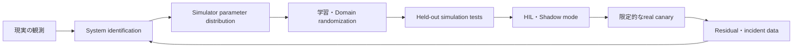



Sim-to-realの目的は、simulationを現実と完全に同じにすることではない。
デプロイするpolicyが現実の不確実性の範囲内で、要求性能と安全制約を維持できるという証拠を積み上げることである。

## 1. 問題：simulatorは近似モデルであり、学習データ生成器でもある

現実とsimulationの違いは複数の層に存在する。

- geometryとmass property
- friction、damping、compliance
- actuator delay、saturation、backlash
- sensor noise、bias、dropout
- contactとcollision model
- controller update timing
- rendering、lighting、texture
- 通信遅延とpacket loss
- 人と周辺環境の挙動

policyは平均的なsimulationよりも、simulatorの誤差パターンを学習してしまう可能性がある。
simulation returnだけを高めると、現実での性能が悪化することがある。

## 2. Mental model：現実とのギャップをbudgetとして管理する



現実の遷移とsimulationの遷移を区別すると、gapは次のように考えられる。

$$
\Delta(s,a)=f_{real}(s,a)-f_{sim}(s,a)
$$

gapは一つの定数ではなく、状態と行動によって変わる関数である。
平均誤差だけでなく、worst regionとtailを見つける必要がある。

## 3. デプロイ契約を先に定義する

```yaml
task:
  success: "관찰 가능한 완료 조건"
operating_design_domain:
  environment: "허용 표면·조명·장애물 범위"
  payload: "허용 범위"
  speed: "동작 속도 한계"
safety:
  hard_constraints: "거리·힘·속도·workspace"
  fallback: "정지·안전 자세·기존 제어기"
evaluation:
  primary: "성공률과 안전 위반"
  tail: "worst-case와 CVaR"
```

運用設計領域の外では、policyが確信を持って行動しないようにする。
OOD検知、guard、人による承認のうち、適切な境界を設ける。

## 4. System identification

実機の入力と応答からsimulator parameterを推定する。

対象例：

- inertial parameter
- friction coefficient
- motor constant
- actuator lag
- sensor biasとnoise spectrum
- contact stiffness
- controller latency

parameter推定問題：

$$
\theta^*=\arg\min_{\theta}
\sum_t \lVert y_t^{real}-y_t^{sim}(\theta)\rVert_W^2
$$

すべてのparameterを識別できるとは限らない。
異なる組み合わせが似たtrajectoryを生成することがある。

対処法：

- excitationが十分な安全実験の設計
- parameter sensitivity分析
- profile likelihoodまたはposterior uncertainty
- 一点推定ではなくplausible distribution
- calibration trajectoryとvalidation trajectoryの分離

識別実験自体が危険な場合は、製造資料、component test、保守的な範囲を組み合わせる。

## 5. Domain randomization

学習中にsimulator parameterを分布からsamplingする。

$$
\theta \sim p(\theta),\qquad
\max_\pi \mathbb{E}_{\theta}[J(\pi;\theta)]
$$

randomizationの対象：

- dynamics parameter
- sensor noiseとdelay
- actuator response
- initial state
- object placement
- visual appearance
- disturbance

範囲が狭すぎると現実を包含できない。
広すぎるとpolicyが過度に保守的になるか、学習できなくなる。

分布は恣意的なuniform rangeではなく、測定、製造tolerance、環境観察に基づかせる。
相関するparameterを独立にsamplingすると、物理的に不可能な組み合わせが生じることがある。

## 6. Curriculumとadaptive randomization

最初からすべての変動を最大範囲で与えると、学習信号が消えることがある。

curriculumの例：

1. nominal dynamicsと単純な環境
2. 初期状態と小さなsensor noise
3. dynamics variation
4. delayとdisturbance
5. visual・contactの変化
6. held-outの極端な組み合わせ

adaptive randomizationは、policyが現在うまく対処できる範囲の境界を拡張する。
ただしevaluation分布まで同時に変えると過大評価につながる。
固定されたheld-out test distributionを別途維持する。

## 7. Representationとcontrol frequency

可能であればraw observationより、物理的に安定したrepresentationを使用する。

- 相対位置と方向
- normalized joint state
- filtered velocity
- uncertaintyまたはvalidity flag
- contact state

filterが未来の値を使用していないか注意する。

simulationのstepとreal controller cycleが異なると、policy dynamicsが変わる。

- action hold方式
- observation timestamp
- computation latency
- asynchronous sensor
- dropped frame

すべてをsimulatorで再現し、timestampに基づいて処理する。

## 8. Residualとhybrid control

検証済みcontrollerに小さなcorrectionだけを学習させることができる。

$$
u = u_{base} + \alpha u_{learned}
$$

利点：

- 基本的な安定性と制約を活用できる。
- learned actionの範囲を制限しやすい。
- 必要な学習の複雑さを減らせる。

注意点：

- correctionがbase controllerの前提を崩す可能性がある。
- saturationとanti-windupを併せて考慮する。
- \(\alpha\)とaction envelopeを検証する。

runtime safety filterが最終actionを投影するよう設計できる。
filterの介入頻度はpolicy品質の重要な指標である。

## 9. 実環境への移行workflow

### Stage 0. 小さなdeterministic test

- 座標frame
- unit
- action sign
- reset
- termination
- collision group

基本契約をtestする。

### Stage 1. nominal trainingとbaseline

ルールまたは既存controllerと同じscenarioで比較する。

### Stage 2. randomized simulation

学習分布と独立したtest distributionを分離する。

### Stage 3. stressとfault injection

- sensor dropout
- actuator delay
- 低いfriction
- 外部disturbance
- perception error

### Stage 4. software-in-the-loopとhardware-in-the-loop

実際のtiming、middleware、controller interfaceを含める。

### Stage 5. shadow mode

policyはactionを提案するが、実機には適用しない。
既存controllerのactionと比較し、危険なactionを分析する。

### Stage 6. 限定的なcanary

低速、小さなworkspace、監視者、即時停止装置を用意する。

## 10. 実践例：action guard

```python
def guarded_action(observation, learned_policy, safe_controller, limits):
    proposal = learned_policy(observation)
    if not observation.valid:
        return safe_controller(observation), "invalid-observation"
    projected = limits.project(proposal)
    if limits.intervention_too_large(proposal, projected):
        return safe_controller(observation), "large-intervention"
    return projected, "learned"
```

guardは隠さずeventとして記録する。
介入が多い場合は、policyが実際のdomainを理解していない兆候である。

## 11. 評価設計

simulationとrealで同じ定義を使用する。

- task success
- completion time
- safety violation countとseverity
- min distanceまたはforce margin
- energyとaction smoothness
- guard intervention rate
- recovery success
- latency deadline miss
- 状態・行動ごとのsim-real residual

平均成功率だけでなく、scenarioごとの結果を見る。

- nominal
- parameter extremes
- 複合disturbance
- sensor fault
- unseen objectまたはlayout
- 運用設計領域の境界

real trialの数が少なければ不確実性は大きい。
数回の成功を一般的な安全性の証明へ拡大解釈しない。

## 12. 評価checklist

- [ ] 運用設計領域と禁止領域を明示したか？
- [ ] simulator parameterの根拠とuncertaintyがあるか？
- [ ] calibration trajectoryとvalidation trajectoryを分離したか？
- [ ] randomizationの相関構造は物理的に妥当か？
- [ ] 学習分布とheld-out stress分布を分離したか？
- [ ] sensor・actuator・computation latencyを再現したか？
- [ ] 座標frameと単位testを自動化したか？
- [ ] 単純なcontrollerと同じ条件で比較したか？
- [ ] hard safetyはpolicyの外側でも強制されるか？
- [ ] shadowとHILの段階を経たか？
- [ ] real canaryは限定されたaction envelopeを持つか？
- [ ] guard interventionとresidualを記録しているか？
- [ ] 即時停止とfallbackを実際に試験したか？

## 13. よくある失敗と限界

### randomizationの範囲を広げれば解決すると考える

ランダム性では誤ったsimulator構造を修正できない。
現実のresidualを分析し、model form errorとparameter uncertaintyを区別する。

### visual realismだけを高める

制御の失敗はdynamicsとtiming gapから生じることがある。
taskに影響するgapをsensitivityによって優先順位付けする。

### simulation testを学習中に繰り返し使用する

held-out scenarioが事実上validationに汚染される。
最終stress suiteを分離する。

### realの成功例だけを残す

失敗とguard介入は、transfer改善により重要なデータとなる場合がある。
安全な範囲内ですべてのtrialと条件を記録する。

sim-to-realでは有限の試験ですべての現実条件を保証できない。
運用範囲の制限、runtime monitor、fallbackが引き続き必要である。

## 14. 公式参考資料

- [Domain Randomization for Transferring Deep Neural Networksの原論文](https://arxiv.org/abs/1703.06907)
- [Dynamics Randomizationの原論文](https://arxiv.org/abs/1710.06537)
- [NVIDIA Isaac Lab公式ドキュメント](https://isaac-sim.github.io/IsaacLab/)
- [MuJoCo公式ドキュメント](https://mujoco.readthedocs.io/)
- [ROS 2公式ドキュメント](https://docs.ros.org/en/rolling/)

## 15. まとめ

Sim-to-realは一度限りのtransferではなく、現実のresidualを測定し、simulator分布と安全境界を更新する反復プロセスである。
正確な平均モデルよりも、不確実性を含む試験体系と段階的なデプロイのほうが重要である。
