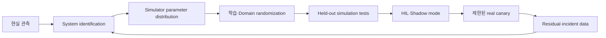



Sim-to-real의 목표는 simulation을 현실과 완전히 같게 만드는 것이 아니다.
배포할 policy가 현실의 불확실성 범위 안에서 요구 성능과 안전 제약을 유지하도록 증거를 쌓는 것이다.

## 1. 문제: simulator는 근사 모델이자 학습 데이터 생성기다

현실과 simulation의 차이는 여러 층에 존재한다.

- geometry와 mass property
- friction, damping, compliance
- actuator delay, saturation, backlash
- sensor noise, bias, dropout
- contact와 collision model
- controller update timing
- rendering, lighting, texture
- 통신 지연과 packet loss
- 사람과 주변 환경의 행동

policy는 평균적 simulation보다 simulator의 오류 패턴을 학습할 수 있다.
simulation return만 높이면 현실 성능이 악화될 수 있다.

## 2. Mental model: 현실 격차를 budget으로 관리한다



현실 전이와 simulation 전이를 구분하면 gap을 다음처럼 생각할 수 있다.

$$
\Delta(s,a)=f_{real}(s,a)-f_{sim}(s,a)
$$

gap은 하나의 상수가 아니라 상태와 행동에 따라 달라지는 함수다.
평균 오차 외에 worst region과 tail을 찾아야 한다.

## 3. 배포 계약을 먼저 정의한다

```yaml
task:
  success: "관찰 가능한 완료 조건"
operating_design_domain:
  environment: "허용 표면·조명·장애물 범위"
  payload: "허용 범위"
  speed: "동작 속도 한계"
safety:
  hard_constraints: "거리·힘·속도·workspace"
  fallback: "정지·안전 자세·기존 제어기"
evaluation:
  primary: "성공률과 안전 위반"
  tail: "worst-case와 CVaR"
```

운영 설계 영역 밖에서는 policy가 자신 있게 행동하지 않게 한다.
OOD 감지, guard, 사람 승인 중 적절한 경계를 둔다.

## 4. System identification

실제 장비의 입력과 응답으로 simulator parameter를 추정한다.

대상 예:

- inertial parameter
- friction coefficient
- motor constant
- actuator lag
- sensor bias와 noise spectrum
- contact stiffness
- controller latency

parameter 추정 문제:

$$
\theta^*=\arg\min_{\theta}
\sum_t \lVert y_t^{real}-y_t^{sim}(\theta)\rVert_W^2
$$

모든 parameter가 식별 가능한 것은 아니다.
서로 다른 조합이 비슷한 trajectory를 만들 수 있다.

대응:

- excitation이 충분한 안전 실험 설계
- parameter sensitivity 분석
- profile likelihood 또는 posterior uncertainty
- 한 점 추정 대신 plausible distribution
- calibration과 validation trajectory 분리

식별 실험 자체가 위험하면 제조 자료, component test, 보수적 범위를 결합한다.

## 5. Domain randomization

학습 중 simulator parameter를 분포에서 sampling한다.

$$
\theta \sim p(\theta),\qquad
\max_\pi \mathbb{E}_{\theta}[J(\pi;\theta)]
$$

randomization 항목:

- dynamics parameter
- sensor noise와 delay
- actuator response
- initial state
- object placement
- visual appearance
- disturbance

범위가 너무 좁으면 현실을 포함하지 못한다.
너무 넓으면 policy가 지나치게 보수적이거나 학습하지 못한다.

분포는 임의의 uniform range가 아니라 측정, 제조 tolerance, 환경 관찰에 기반한다.
상관된 parameter를 독립 sampling하면 물리적으로 불가능한 조합을 만들 수 있다.

## 6. Curriculum과 adaptive randomization

처음부터 모든 변동을 최대 범위로 주면 학습 신호가 사라질 수 있다.

curriculum 예:

1. nominal dynamics와 단순 환경
2. 초기 상태와 작은 sensor noise
3. dynamics variation
4. delay와 disturbance
5. visual·contact 변화
6. held-out 극단 조합

adaptive randomization은 policy가 현재 잘하는 범위의 경계를 확장한다.
하지만 evaluation 분포까지 함께 바꾸면 과대평가한다.
고정된 held-out test distribution을 별도로 유지한다.

## 7. Representation과 control frequency

가능하면 raw observation보다 물리적으로 안정된 representation을 사용한다.

- 상대 위치와 방향
- normalized joint state
- filtered velocity
- uncertainty 또는 validity flag
- contact state

filter가 미래 값을 사용하지 않는지 주의한다.

simulation의 step과 real controller cycle이 달라지면 policy dynamics가 바뀐다.

- action hold 방식
- observation timestamp
- computation latency
- asynchronous sensor
- dropped frame

모두 simulator에 재현하고 timestamp 기반으로 처리한다.

## 8. Residual과 hybrid control

검증된 controller 위에 작은 correction만 학습할 수 있다.

$$
u = u_{base} + \alpha u_{learned}
$$

장점:

- 기본 안정성과 제약을 활용한다.
- learned action 범위를 제한하기 쉽다.
- 필요한 학습 복잡도를 줄인다.

주의:

- correction이 base controller 가정을 깨뜨릴 수 있다.
- saturation과 anti-windup을 함께 고려한다.
- \(\alpha\)와 action envelope를 검증한다.

runtime safety filter가 최종 action을 투영하도록 설계할 수 있다.
filter 개입 빈도는 policy 품질의 중요한 지표다.

## 9. 실전 전이 workflow

### Stage 0. 작은 deterministic test

- 좌표 frame
- unit
- action sign
- reset
- termination
- collision group

기본 계약을 test한다.

### Stage 1. nominal training과 baseline

규칙 또는 기존 controller와 같은 scenario에서 비교한다.

### Stage 2. randomized simulation

학습 분포와 독립 test distribution을 분리한다.

### Stage 3. stress와 fault injection

- sensor dropout
- actuator delay
- 낮은 friction
- 외부 disturbance
- perception error

### Stage 4. software-in-the-loop와 hardware-in-the-loop

실제 timing, middleware, controller interface를 포함한다.

### Stage 5. shadow mode

policy가 action을 제안하지만 실제 장비에는 적용하지 않는다.
기존 controller action과 비교하고 위험 action을 분석한다.

### Stage 6. 제한된 canary

낮은 속도, 작은 workspace, 감시자, 즉시 중단 장치를 둔다.

## 10. 실전 예제: action guard

```python
def guarded_action(observation, learned_policy, safe_controller, limits):
    proposal = learned_policy(observation)
    if not observation.valid:
        return safe_controller(observation), "invalid-observation"
    projected = limits.project(proposal)
    if limits.intervention_too_large(proposal, projected):
        return safe_controller(observation), "large-intervention"
    return projected, "learned"
```

guard는 숨기지 않고 event로 기록한다.
개입이 잦으면 policy가 실제 domain을 이해하지 못한다는 신호다.

## 11. 평가 설계

simulation과 real에서 같은 정의를 사용한다.

- task success
- completion time
- safety violation count와 severity
- min distance 또는 force margin
- energy와 action smoothness
- guard intervention rate
- recovery success
- latency deadline miss
- 상태·행동별 sim-real residual

평균 성공률 외에 scenario별 결과를 본다.

- nominal
- parameter extremes
- 복합 disturbance
- sensor fault
- unseen object 또는 layout
- 운영 설계 영역 경계

real trial 수가 적으면 불확실성이 크다.
성공 몇 회를 일반적 안전성 증명으로 확대하지 않는다.

## 12. 평가 checklist

- [ ] 운영 설계 영역과 금지 영역을 명시했는가?
- [ ] simulator parameter의 근거와 uncertainty가 있는가?
- [ ] calibration과 validation trajectory가 분리됐는가?
- [ ] randomization의 상관 구조가 물리적으로 타당한가?
- [ ] 학습 분포와 held-out stress 분포가 분리됐는가?
- [ ] sensor·actuator·computation latency를 재현했는가?
- [ ] 좌표 frame과 단위 test가 자동화됐는가?
- [ ] 단순 controller와 같은 조건에서 비교했는가?
- [ ] hard safety가 policy 밖에서도 강제되는가?
- [ ] shadow와 HIL 단계를 거쳤는가?
- [ ] real canary가 제한된 action envelope를 갖는가?
- [ ] guard intervention과 residual이 기록되는가?
- [ ] 즉시 정지와 fallback을 실제 시험했는가?

## 13. 흔한 실패와 한계

### randomization 범위를 넓히면 해결된다고 믿는다

무작위성은 잘못된 simulator 구조를 고치지 못한다.
현실 residual을 분석해 model form error와 parameter uncertainty를 구분한다.

### visual realism만 높인다

제어 실패는 dynamics와 timing gap에서 올 수 있다.
task에 영향을 주는 gap을 sensitivity로 우선순위화한다.

### simulation test를 학습 중 반복 사용한다

held-out scenario가 사실상 validation으로 오염된다.
최종 stress suite를 분리한다.

### real 성공 사례만 남긴다

실패와 guard 개입이 transfer 개선에 더 중요한 데이터일 수 있다.
안전한 범위에서 전체 trial과 조건을 기록한다.

sim-to-real은 유한한 시험으로 모든 현실 조건을 보장할 수 없다.
운영 범위 제한, runtime monitor, fallback이 계속 필요하다.

## 14. 공식 참고자료

- [Domain Randomization for Transferring Deep Neural Networks 원 논문](https://arxiv.org/abs/1703.06907)
- [Dynamics Randomization 원 논문](https://arxiv.org/abs/1710.06537)
- [NVIDIA Isaac Lab 공식 문서](https://isaac-sim.github.io/IsaacLab/)
- [MuJoCo 공식 문서](https://mujoco.readthedocs.io/)
- [ROS 2 공식 문서](https://docs.ros.org/en/rolling/)

## 15. 마무리

Sim-to-real은 한 번의 transfer가 아니라 현실 residual을 측정하고 simulator 분포와 안전 경계를 갱신하는 반복 과정이다.
정확한 평균 모델보다 불확실성을 포함한 시험 체계와 단계적 배포가 더 중요하다.
