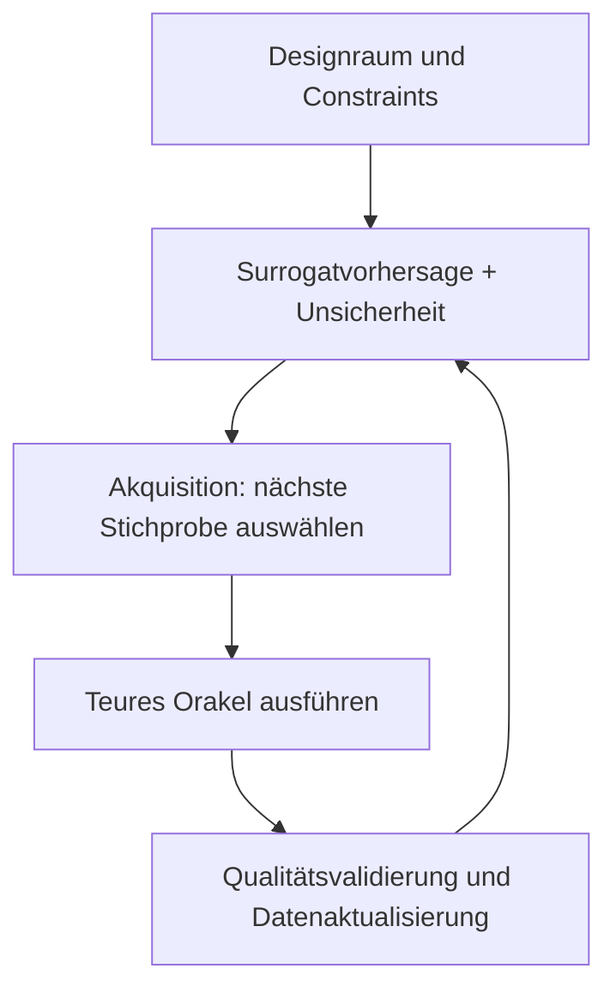



Ein Surrogatmodell approximiert schnell die Eingabe-Ausgabe-Beziehung einer teuren Simulation oder eines Experiments. Richtig entworfen kann es die Rechenkosten für Exploration, Optimierung, Sensitivitätsanalyse und Entscheidungen in Echtzeit drastisch senken. Weil es jedoch auch außerhalb seiner Trainingsdomäne plausible Werte erzeugt, kann ein Modell mit geringem Durchschnittsfehler mitunter das gefährlichste Modell sein.

Entscheidend ist, das Surrogat nicht als einfachen Regressor zu behandeln, sondern als **Approximationssystem mit definierter Gültigkeitsdomäne, Unsicherheit und Regeln für die Rückkehr zum Originalmodell**.

## 1. Das Problem: Die Illusion eines verlässlichen Bereichs ist gefährlicher als der Approximationsfehler

Eine teure Funktion $f$ und ein Beobachtungs- oder Simulationsergebnis $y$ seien wie folgt gegeben.

\[
y = f(x) + \epsilon
\]

Da die direkte Auswertung von $f(x)$ an der Eingabe $x$ teuer ist, trainieren wir $\hat f(x)$. Typische Fehler sind:

- Nur mit beliebigen vorhandenen Ergebnissen trainieren, ohne den Eingaberaum gleichmäßig abzudecken.
- Nur den durchschnittlichen RMSE betrachten und Fehler an wichtigen Extremen, Grenzen und Übergangsbereichen übersehen.
- Interpolationsleistung verifizieren und annehmen, das Modell lasse sich auch für Extrapolation verwenden.
- Die prädiktive Varianz eines Modells mit der Gesamtunsicherheit verwechseln.
- Einem Optimierer erlauben, kleine Surrogatfehler auszunutzen und ein unrealistisches Optimum zu finden.
- Active Learning wiederholt nur denselben engen Bereich abtasten lassen.
- Numerisches Scheitern oder Nichtkonvergenz des Originalsimulators als gültigen Wert behandeln.

Surrogatgestützte Optimierung hängt weniger von der Frage „Ist es im Durchschnitt genau?“ ab als von „Ist es in dem vom Optimierer besuchten Bereich konservativ genau?“.

### Verschiedene Unsicherheiten nicht in einer einzigen Zahl vereinen

Folgende Unsicherheiten haben unterschiedliche Ursachen.

- **Aleatorische Unsicherheit**: Mess- oder Umgebungsvariation, die sich zwischen Wiederholungen ändert
- **Epistemische Unsicherheit**: Unsicherheit über die Form der Funktion aufgrund unzureichender Daten
- **Parameterunsicherheit**: Unsicherheit geschätzter Parameter des Originalmodells
- **Numerische Unsicherheit**: Fehler durch Gitter, Zeitschritt und Konvergenz
- **Modelldiskrepanz**: Systematische Unterschiede zwischen Originalmodell und Realität

Selbst wenn ein Surrogat den Originalsimulator perfekt reproduziert, verringert sich die Diskrepanz zwischen Originalmodell und Realität nicht.

## 2. Denkmodell: Ein geschlossener Kreislauf aus Approximator, Grenzwächter und ursprünglichem Orakel

Betrachten Sie ein Surrogatsystem als Zusammenspiel dreier Komponenten.



1. **Orakel**: Eine hochgenaue Simulation oder ein Experiment
2. **Surrogat**: Sagt aus einer Eingabe schnell Ausgabe und Unsicherheit voraus
3. **Akquisitionsrichtlinie**: Wählt den Punkt aus, an dem der nächste Orakelaufruf den größten Wert besitzt

Eine vierte Komponente ist unerlässlich: der **Domänenwächter**. Liegt eine Eingabe außerhalb des Trainingssupports oder ist die Unsicherheit hoch, verwirft er eine allein vom Surrogat getroffene Entscheidung und leitet sie an das Orakel oder einen Menschen weiter.

### Der Designraum kann eine zulässige Mannigfaltigkeit statt eines rechteckigen Bereichs sein

Wer für jede Variable nur Minimum und Maximum auflistet, kann physikalisch unmögliche Kombinationen einschließen.

\[
\mathcal{X}_{valid}
=\{x\in\mathbb{R}^d:\; l\le x\le u,\; g_j(x)\le0,\; h_k(x)=0\}
\]

- $l,u$: Wertebereiche der Variablen
- $g_j$: Ungleichheitsconstraints
- $h_k$: Gleichheits- und Erhaltungsconstraints

Trainingsstichproben und Optimierungskandidaten müssen innerhalb von $\mathcal{X}_{valid}$ erzeugt werden. Verwenden Sie wenn möglich Koordinaten, die die Problemstruktur widerspiegeln, etwa dimensionslose Kennzahlen, Erhaltungsgrößen und Symmetrien. Dies reduziert die Dimensionalität und verbessert die Generalisierung über verschiedene Skalen.

### Active Learning wählt keinen „unsicheren Punkt“, sondern einen „Punkt mit hohem Informationswert“

Der Akquisitionswert eines Kandidaten $x$ lässt sich allgemein wie folgt schreiben.

\[
a(x)=
\alpha\,U(x)
+\beta\,V(x)
+\gamma\,R(x)
-\eta\,C(x)
\]

- $U(x)$: epistemische Unsicherheit
- $V(x)$: potenzielle Verbesserung des Ziels oder Entscheidungswert
- $R(x)$: Repräsentativität eines noch nicht ausreichend erkundeten Bereichs
- $C(x)$: Experiment- oder Simulationskosten und Ausfallrisiko

Die Koeffizienten können sich je nach Phase ändern. Decken Sie anfangs den Raum breit ab; erkunden Sie später Entscheidungsgrenzen oder die Umgebung des Optimums im Detail.

## 3. Praktischer Workflow

### Schritt 1. Zuerst Zweck und zulässigen Fehler des Surrogats definieren

Selbst für dieselbe Originalfunktion erfordern verschiedene Anwendungen unterschiedliche Modelle.

| Anwendung | Wichtige Leistungsmerkmale |
|---|---|
| Schnelle Visualisierung | Glatte Approximation in der gesamten Domäne, geringe Latenz |
| Optimierung | Genauigkeit von Rangfolge und Constraints nahe dem Optimum, Konservativität |
| Sensitivitätsanalyse | Erhalt globaler Trends und Interaktionen |
| Steuerung und Entscheidung | Lokaler Fehler, Stabilität, begrenzte Worst-Case-Latenz |
| Unsicherheitsfortpflanzung | Verteilungsschwänze und Qualität der Vorhersageintervalle |

Dokumentieren Sie zu Beginn:

- Eingaben, Ausgaben, Einheiten und zulässige Bereiche
- Zulässigkeitsconstraints und verbotene Bereiche
- Kosten und Parallelisierbarkeit der Originalläufe
- Zulässige absolute und relative Fehler je Ausgabe
- Wichtige Grenzen, Extreme und Übergangsbereiche
- Bedingungen, unter denen das Surrogat eine Anfrage ablehnen muss
- Bedingungen, die eine erneute Orakelvalidierung der endgültigen Entscheidung erfordern

### Schritt 2. Zuerst die Qualität des ursprünglichen Orakels prüfen

Ein Surrogat lernt auch die Fehler des Orakels. Prüfen Sie vor der Datenerzeugung:

- Sind deterministische Ergebnisse bei derselben Eingabe reproduzierbar?
- Werden Zufallsseeds, Anfangsbedingungen und Solver-Versionen erfasst?
- Gibt es einen Statuscode, der Konvergenzfehler von physikalischen Ergebnissen unterscheidet?
- Ist eine Unabhängigkeit von Gitter oder Zeitschritt beziehungsweise eine Schätzung des numerischen Fehlers verfügbar?
- Wird das Postprocessing der Ausgabe versioniert?
- Werden fehlgeschlagene Läufe samt Ursache bewahrt?

Wenn numerische Fehler als fehlende Daten entfernt werden, wird die Fehlergrenze unsichtbar. Erfolg kann als separates Klassifikationsproblem modelliert oder die Ausfallwahrscheinlichkeit als Constraint der Akquisition verwendet werden.

### Schritt 3. Den zulässigen Bereich mit einem anfänglichen DoE abdecken

Die anfänglichen Stichproben liefern die Mindestkarte, die das Modell für den Start des Active Learning benötigt.

Raumfüllende Designs sind in niedrig- und mitteldimensionalen kontinuierlichen Räumen nützlich.

- Latin Hypercube
- Sequenzen mit geringer Diskrepanz
- Maximin-Distanzdesigns
- Stratifizierte Stichproben, die Constraints erfüllen

Stratifizieren Sie bei kategorischen oder bedingten Variablen so, dass jede wichtige Kombination enthalten ist. Fügen Sie gesonderte Stichproben für Randbedingungen und bekannte Übergangsbereiche hinzu.

Raumfüllung wird in hohen Dimensionen schnell schwieriger. Erwägen Sie dann zunächst:

- Physikgestützte Dimensionsreduktion und Entdimensionierung
- Sensitivitätsscreening
- Annahmen sparsamer Interaktionen
- Niedrigdimensionale Repräsentationen strukturierter Ausgaben
- Betriebliche Constraints, die den benötigten Bereich einschränken

Wenn Informationen aus dem Testbereich verwendet werden, nur weil die Sensitivitätsanalyse vor dem anfänglichen DoE auf allen Daten durchgeführt wurde, entsteht Selektionsbias. Trennen Sie Designdaten von Validierungsdaten.

### Schritt 4. Zur Ausgabestruktur passende Modellfamilien vergleichen

Die Modellwahl hängt von Datenmenge, Dimensionalität, Glattheit, Diskontinuitäten, Ausgabestruktur und Unsicherheitsanforderungen ab.

- Kleine Datenmengen und glatte Funktionen: Lokale probabilistische Modelle sind oft stark.
- Tabellarische Daten, gemischte Variablen und Diskontinuitäten: Baumbasierte Modelle können robust sein.
- Große Datenmengen, hohe Dimensionen und mehrere Ausgaben: Neuronale Netze können besser skalieren.
- Räumliche Felder oder Zeitreihenausgaben: Ausgabe mit Basis, POD oder Autoencoder komprimieren und anschließend latente Koeffizienten vorhersagen oder Operator Learning erwägen.
- Bekannte physikalische Constraints: Erhaltungssätze und Randbedingungen lassen sich in Loss, Architektur oder Postprocessing einbinden.

Physikalische Constraints machen Extrapolation jedoch nicht automatisch sicher. Falsche Constraints oder Skalierung können stattdessen systematischen Bias erzeugen.

### Schritt 5. Unsicherheiten getrennt schätzen

Eine Vorhersage lässt sich wie folgt darstellen.

\[
y\mid x,\mathcal D
\sim
\text{Vorhersageverteilung}
\left(\mu(x),\; \sigma^2_{alea}(x)+\sigma^2_{epi}(x)\right)
\]

Zu den praktischen Methoden gehören:

- Posterior-Verteilungen auf Basis probabilistischer Prozesse
- Bootstrap- oder Ensemblevarianz
- Vorhersage aleatorischer Varianz mit heteroskedastischer Likelihood
- Kalibrierung der Abdeckung bei endlichen Stichproben mit Conformal Prediction
- Vorhersage bedingter Quantile mit Quantilregression

Wenn Ensemblemitglieder dieselben Daten und denselben Bias teilen, können sie trotz geringer Varianz gemeinsam falschliegen. Unsicherheit ist nicht bloß Modellvarianz, sondern **ein eigenständiges Validierungsziel**.

Evaluationspunkte:

- Abdeckung der Vorhersageintervalle
- Intervallbreite und Schärfe
- Korrelation zwischen Fehler und Unsicherheit
- Tatsächlicher Fehler bei Stichproben mit hoher Unsicherheit
- Bedingte Abdeckung nach Bereich und Ausgabeniveau
- Ob Unsicherheit bei Extrapolation zunimmt

### Schritt 6. Die Active-Learning-Schleife einschließlich Batches, Ausfällen und Kosten entwerfen

```python
dataset = initial_design()

while budget.remaining() > 0:
    surrogate = fit_surrogate(dataset)
    candidates = sample_feasible_candidates()

    mean, uncertainty = surrogate.predict(candidates)
    failure_risk = failure_model.predict(candidates)
    score = acquisition(mean, uncertainty, candidates, failure_risk)

    batch = select_diverse_batch(score, candidates, budget)
    results = run_oracle(batch)
    dataset = validate_and_append(dataset, results)

    if stopping_rule(dataset, surrogate):
        break
```

Wenn mehrere Läufe parallel gesendet werden, kann die alleinige Auswahl der höchsten Akquisitionswerte redundante, nahe beieinanderliegende Punkte erzeugen. Berücksichtigen Sie Abstände innerhalb des Batches, erwartete Informationsüberlappung und kategorische Balance.

Wenn ein Orakelausfall teuer ist, multiplizieren Sie mit der Erfolgswahrscheinlichkeit oder verwenden Sie sie als Constraint.

\[
a_{safe}(x)=a(x)\,P(\text{Erfolg}\mid x)
\]

Wenn die Ausfallgrenze selbst wichtiges Wissen darstellt, vermeiden Sie sie jedoch nicht vollständig, sondern erkunden Sie sie mit begrenztem Budget.

### Schritt 7. Validierungsdaten nach Zweck aufteilen

Ein einzelnes zufälliges Holdout reicht nicht aus.

1. **Interpolationssatz**: Interpolationsleistung innerhalb der Trainingsdomäne
2. **Grenzsatz**: Variablen- und Constraint-Grenzen sowie Übergangsbereiche
3. **Entscheidungssatz**: Tatsächlich von Optimierung oder Steuerung besuchte Bereiche
4. **Stresssatz**: Seltene, aber wichtige Extremkombinationen
5. **Außerhalb-der-Domäne-Satz**: Ablehnungsverhalten in absichtlich nicht unterstützten Bereichen

Untersuchen Sie zusätzlich zu MAE und RMSE je Ausgabe:

- Relativen Fehler und Fehler nach Skala
- Maximal- und obere Quantilfehler
- Gradienten, Rangfolge und Monotonie
- Residuen der Erhaltungsgleichungen
- Rate der Constraint-Verletzungen
- Regret des Optimums
- Abdeckung der Vorhersageintervalle
- Inferenzlatenz

Evaluieren Sie für Optimierungsanwendungen die vom Surrogat vorgeschlagenen Kandidaten erneut mit dem Orakel und messen Sie den Regret.

\[
\mathrm{regret}=f(x_{suggested})-f(x_{best\;known})
\]

Dies gilt für ein Minimierungsproblem; behandeln Sie Constraint-Verletzungen mit einer separaten Strafe oder einer Unzulässigkeitsentscheidung.

### Schritt 8. Domänenwächter und Fallback als Teil des Modells bereitstellen

Folgende Signale lassen sich kombinieren.

- Verletzungen von Eingabebereichen oder Constraints
- Abstand zum Trainingsdatensatz
- Lokale Datendichte
- Uneinigkeit im Ensemble
- Breite des Vorhersageintervalls
- OOD-Klassifikationswert
- Bekannte Fehler- oder Diskontinuitätsbereiche

```python
def guarded_predict(x):
    if not satisfies_hard_constraints(x):
        return Reject("invalid input")

    prediction, uncertainty = surrogate.predict(x)
    domain_score = support_estimator.score(x)

    if domain_score < MIN_SUPPORT or uncertainty > MAX_UNCERTAINTY:
        return Defer("oracle or expert review")

    return Accept(prediction, uncertainty)
```

Legen Sie Schwellenwerte anhand eines separaten Validierungssatzes fest und evaluieren Sie sowohl Ablehnungsquote als auch Fehler der verbleibenden Stichproben. Da sich die Genauigkeit leicht durch mehr Ablehnungen erhöhen lässt, verwenden Sie eine Coverage-Risk-Kurve.

### Schritt 9. Abbruchkriterien und Aktualisierungsbedingungen im Voraus definieren

Active Learning muss nicht zwingend fortfahren, bis das Budget erschöpft ist. Mögliche Abbruchkriterien sind:

- Unabhängiger Validierungsfehler liegt unter der Toleranz
- Maximaler Fehler in wichtigen Bereichen liegt unter der Toleranz
- Unsicherheitsreduktion bleibt über mehrere Iterationen vernachlässigbar
- Erwarteter Entscheidungswert einer weiteren Stichprobe ist geringer als ihre Kosten
- Optimaler Kandidat bleibt über wiederholte Läufe stabil
- Gesamtes Budget ist erschöpft

Trainieren Sie neu, wenn sich nach dem Deployment neue Orakelergebnisse ansammeln, erfassen Sie jedoch sowohl Datenversion als auch Akquisitionsrichtlinie. Aktiv ausgewählte Stichproben unterscheiden sich von der ursprünglichen Betriebsverteilung und dürfen daher nicht unverändert zur Berechnung einfacher Durchschnittsleistung verwendet werden.

## 4. Checkliste für Evaluation und Validierung

### Problem und Domäne

- [ ] Zweck und zulässiger Fehler des Surrogats sind festgelegt.
- [ ] Eingabeeinheiten, Bereiche sowie Gleichheits- und Ungleichheitsconstraints sind versioniert.
- [ ] Wichtige Grenz-, Übergangs- und Extrembereiche sind separat definiert.
- [ ] Nicht unterstützte OOD-Bereiche und Ablehnungsregeln sind definiert.

### Orakel und Daten

- [ ] Version, Konfiguration, Zufälligkeit und Konvergenzzustand der Originalläufe sind erfasst.
- [ ] Numerische Unsicherheit und Messvariation werden unterschieden.
- [ ] Fehlgeschlagene Läufe werden mit Ursachen bewahrt statt gelöscht.
- [ ] Das anfängliche DoE deckt den zulässigen Bereich und wichtige Kategorien ab.
- [ ] Auswahlwahrscheinlichkeit und Begründung von Active-Learning-Stichproben werden nachverfolgt.

### Modell und Unsicherheit

- [ ] Vergleich mit einfachen Regressions- und Interpolations-Baselines durchgeführt.
- [ ] Ausgabestruktur und physikalische Constraints flossen in die Modellwahl ein.
- [ ] Epistemische, aleatorische, numerische und Diskrepanzunsicherheit werden nicht verwechselt.
- [ ] Abdeckung, Breite und Fehlerkorrelation der Unsicherheit wurden validiert.
- [ ] Sicherheit wird nicht allein aus Ensemblevarianz abgeleitet.

### Evaluation und Betrieb

- [ ] Interpolations-, Grenz-, Entscheidungs- und Stresssätze werden unterschieden.
- [ ] Neben dem Durchschnitt wurden Maximal- und Tailfehler geprüft.
- [ ] Optimierungskandidaten wurden mit dem Orakel erneut validiert.
- [ ] Der Coverage-Risk-Kompromiss des Domänenwächters wurde evaluiert.
- [ ] Kosten und Latenz des Orakel-Fallbacks wurden einbezogen.
- [ ] Abbruchkriterien für Active Learning wurden im Voraus definiert.

## 5. Grenzen und Vorsichtsmaßnahmen

Erstens können spärliche Daten in einem hochdimensionalen Raum nicht jeden Bereich zuverlässig abdecken. Strukturelle Annahmen, Dimensionsreduktion und eine eingeschränkte Support-Domäne sind nötig; Extrapolationsfähigkeit darf nicht übertrieben dargestellt werden.

Zweitens ist ein Unsicherheitsschätzer ebenfalls ein Modell. Bei Distribution Shift, gemeinsamem Bias oder einer falsch spezifizierten Likelihood kann er selbstsicher falschliegen. Unabhängige Stresstests und eine Ablehnungsrichtlinie sind erforderlich.

Drittens gewinnt Active Learning nur Wissen über die Bereiche, die seine Akquisitionsfunktion als wichtig definiert. Wenn das Modell später für andere Zwecke wiederverwendet werden kann, bewahren Sie Explorationsvielfalt und ein separates raumfüllendes Budget.

Viertens können Multifidelity-Modelle reichlich kostengünstige Daten nutzen, aber schaden, wenn die Korrelation zwischen niedriger und hoher Fidelity schwach ist oder der Bias zustandsabhängig variiert. Die Diskrepanz zwischen Fidelity-Stufen muss explizit validiert werden.

Schließlich bildet die Surrogatgenauigkeit keine Obergrenze für die reale Genauigkeit. Surrogat-Orakel-Fehler, Orakel-Realitäts-Diskrepanz und Eingabeunsicherheit summieren sich nacheinander. Endgültige Entscheidungen müssen diese gesamte Fehlerkette in getrennten Teilen ausweisen.
