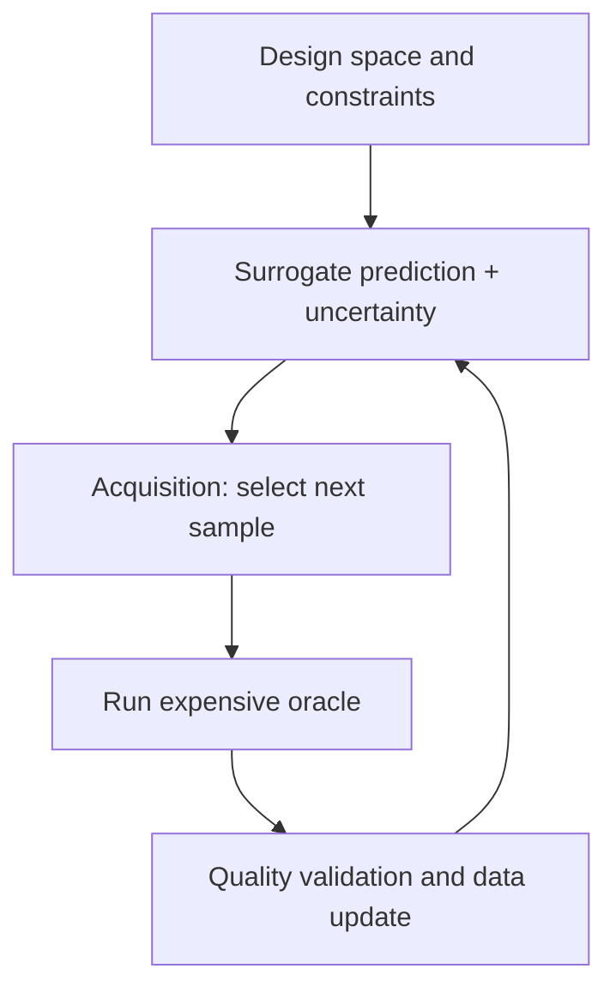



A surrogate model quickly approximates the input-output relationship of an expensive simulation or experiment. When designed properly, it can dramatically reduce the computational cost of exploration, optimization, sensitivity analysis, and real-time decision-making. Yet because it produces plausible values even outside its training domain, a model with low average error can sometimes be the most dangerous model.

The key is to treat the surrogate not as a simple regressor, but as **an approximation system with a defined validity domain, uncertainty, and rules for returning to the original model**.

## 1. The problem: the illusion of a reliable range is more dangerous than approximation error

Consider an expensive function \(f\) and an observation or simulation result \(y\) as follows.

\[
y = f(x) + \epsilon
\]

Because directly evaluating \(f(x)\) at input \(x\) is expensive, we train \(\hat f(x)\). Typical failures include the following.

- Training only on arbitrary existing results without covering the input space evenly.
- Looking only at average RMSE and missing failures in important extremes, boundaries, and transition regions.
- Verifying interpolation performance and assuming the model can also be used for extrapolation.
- Mistaking a model's predictive variance for total uncertainty.
- Allowing an optimizer to exploit small surrogate errors and find an unrealistic optimum.
- Having active learning repeatedly sample only the same narrow region.
- Treating numerical failure or non-convergence in the original simulator as a valid value.

Surrogate-based optimization depends less on “Is it accurate on average?” than on “Is it conservatively accurate in the region the optimizer visits?”

### Do not combine different uncertainties into a single number

The following have different causes.

- **Aleatoric uncertainty**: measurement or environmental variation that changes across repetitions
- **Epistemic uncertainty**: uncertainty about the function's form due to insufficient data
- **Parameter uncertainty**: uncertainty in estimated parameters of the original model
- **Numerical uncertainty**: grid, time-step, and convergence errors
- **Model discrepancy**: systematic differences between the original model and reality

Even if a surrogate perfectly replicates the original simulator, the discrepancy between the original model and reality does not decrease.

## 2. Mental model: a closed loop of approximator, boundary monitor, and original oracle

View a surrogate system as having three components.



1. **Oracle**: a high-fidelity simulation or experiment
2. **Surrogate**: quickly predicts output and uncertainty from an input
3. **Acquisition policy**: selects the point at which the next oracle call is most valuable

A fourth component is essential: the **domain guard**. If an input lies outside the training support or uncertainty is high, it rejects a decision made by the surrogate alone and sends it to the oracle or a human.

### The design space may be a feasible manifold rather than a rectangular range

Listing only the minimum and maximum of each variable may include physically impossible combinations.

\[
\mathcal{X}_{valid}
=\{x\in\mathbb{R}^d:\; l\le x\le u,\; g_j(x)\le0,\; h_k(x)=0\}
\]

- \(l,u\): variable ranges
- \(g_j\): inequality constraints
- \(h_k\): equality and conservation constraints

Training samples and optimization candidates must be generated within \(\mathcal{X}_{valid}\). When possible, use coordinates that reflect the problem structure, such as dimensionless numbers, conserved quantities, and symmetries. This reduces dimensionality and helps generalization across scales.

### Active learning selects not an “uncertain point,” but a “point with high information value”

The acquisition score of a candidate \(x\) can generally be written as follows.

\[
a(x)=
\alpha\,U(x)
+\beta\,V(x)
+\gamma\,R(x)
-\eta\,C(x)
\]

- \(U(x)\): epistemic uncertainty
- \(V(x)\): potential objective improvement or decision value
- \(R(x)\): representativeness of a region that has not yet been explored sufficiently
- \(C(x)\): experiment or simulation cost and failure risk

The coefficients can change by phase. Early on, cover the space broadly; later, explore decision boundaries or the neighborhood of the optimum in detail.

## 3. Practical workflow

### Step 1. Define the surrogate's purpose and allowable error first

Even for the same original function, different uses require different models.

| Use | Important performance characteristics |
|---|---|
| Fast visualization | Smooth approximation across the full domain, low latency |
| Optimization | Ranking and constraint accuracy near the optimum, conservatism |
| Sensitivity analysis | Preservation of global trends and interactions |
| Control and decision-making | Local error, stability, bounded worst-case latency |
| Uncertainty propagation | Distribution tails and prediction interval quality |

Document the following at the outset.

- Inputs, outputs, units, and permitted ranges
- Feasibility constraints and prohibited regions
- Cost and parallelizability of original runs
- Permitted absolute and relative errors for each output
- Important boundaries, extremes, and transition regions
- Conditions under which the surrogate must reject a request
- Conditions requiring oracle revalidation of the final decision

### Step 2. Verify the quality of the original oracle first

A surrogate also learns the oracle's errors. Before generating data, check the following.

- Are deterministic results reproducible for the same input?
- Are random seeds, initial conditions, and solver versions recorded?
- Is there a status code distinguishing convergence failures from physical results?
- Is grid or time-step independence, or an estimate of numerical error, available?
- Is output post-processing version-controlled?
- Are failed runs preserved with their causes?

If numerical failures are erased as missing data, the failure boundary becomes invisible. Success can be modeled as a separate classification problem, or the probability of failure can be used as a constraint in acquisition.

### Step 3. Cover the feasible region with an initial DoE

The initial samples provide the minimum map the model needs to begin active learning.

Space-filling designs are useful in low- and medium-dimensional continuous spaces.

- Latin hypercube
- Low-discrepancy sequences
- Maximin distance designs
- Stratified samples satisfying constraints

If there are categorical or conditional variables, stratify so that every important combination is included. Add separate samples for boundary conditions and known transition regions.

Space-filling becomes rapidly more difficult in high dimensions. In that case, first consider the following.

- Physics-based dimensionality reduction and nondimensionalization
- Sensitivity screening
- Sparse interaction assumptions
- Low-dimensional representations of structured outputs
- Operational constraints that narrow the required region

Using information from the test region merely because sensitivity analysis was performed on all data before creating the initial DoE introduces selection bias. Separate design data from validation data.

### Step 4. Compare model families suited to the output structure

Model selection depends on data size, dimensionality, smoothness, discontinuities, output structure, and uncertainty requirements.

- Small data and smooth functions: local probabilistic models are often strong.
- Tabular data, mixed variables, and discontinuities: tree-based models can be robust.
- Large data, high dimensions, and multiple outputs: neural-network families can offer better scalability.
- Spatial-field or time-series output: compress output with a basis, POD, or autoencoder and then predict latent coefficients, or consider operator learning.
- Known physical constraints: conservation laws and boundary conditions can be incorporated into the loss, architecture, or post-processing.

However, adding physical constraints does not automatically make extrapolation safe. Incorrect constraints or scaling can instead create systematic bias.

### Step 5. Estimate uncertainties separately

A prediction can be represented as follows.

\[
y\mid x,\mathcal D
\sim
\text{PredictiveDistribution}
\left(\mu(x),\; \sigma^2_{alea}(x)+\sigma^2_{epi}(x)\right)
\]

Practical methods include the following.

- Probabilistic-process-based posteriors
- Bootstrap or ensemble variance
- Predicting aleatoric variance with a heteroscedastic likelihood
- Finite-sample coverage calibration with conformal prediction
- Conditional quantile prediction with quantile regression

If ensemble members share the same data and bias, they can all be wrong together even when variance is low. Uncertainty is not merely model variance; it is **a separate validation target**.

Evaluation items:

- Prediction interval coverage
- Interval width and sharpness
- Correlation between error and uncertainty
- Actual error among high-uncertainty samples
- Conditional coverage by region and output level
- Whether uncertainty increases under extrapolation

### Step 6. Design the active learning loop to include batches, failures, and cost

```python
dataset = initial_design()

while budget.remaining() > 0:
    surrogate = fit_surrogate(dataset)
    candidates = sample_feasible_candidates()

    mean, uncertainty = surrogate.predict(candidates)
    failure_risk = failure_model.predict(candidates)
    score = acquisition(mean, uncertainty, candidates, failure_risk)

    batch = select_diverse_batch(score, candidates, budget)
    results = run_oracle(batch)
    dataset = validate_and_append(dataset, results)

    if stopping_rule(dataset, surrogate):
        break
```

When sending multiple runs in parallel, selecting only the highest acquisition scores may produce redundant points close to one another. Consider within-batch distance, expected information overlap, and categorical balance.

When oracle failure is expensive, multiply by or constrain the probability of success.

\[
a_{safe}(x)=a(x)\,P(\text{success}\mid x)
\]

However, if the failure boundary itself is important knowledge, do not avoid it entirely; explore it with a limited budget.

### Step 7. Divide validation data by purpose

A single random holdout is insufficient.

1. **Interpolation set**: interpolation performance within the training domain
2. **Boundary set**: variable and constraint boundaries, and transition regions
3. **Decision set**: regions actually visited by optimization or control
4. **Stress set**: rare but important extreme combinations
5. **Out-of-domain set**: rejection behavior in intentionally unsupported regions

In addition to MAE and RMSE for each output, examine the following.

- Relative error and error by scale
- Maximum and upper-quantile errors
- Gradients, ranking, and monotonicity
- Conservation-equation residuals
- Constraint violation rate
- Regret of the optimum
- Prediction interval coverage
- Inference latency

For optimization use, reevaluate surrogate-proposed candidates with the oracle and measure regret.

\[
\mathrm{regret}=f(x_{suggested})-f(x_{best\;known})
\]

This is for a minimization problem; handle constraint violations with a separate penalty or an infeasibility decision.

### Step 8. Deploy the domain guard and fallback as part of the model

The following signals can be combined.

- Input range or constraint violations
- Distance to the training set
- Local data density
- Ensemble disagreement
- Prediction interval width
- OOD classification score
- Known failure or discontinuity regions

```python
def guarded_predict(x):
    if not satisfies_hard_constraints(x):
        return Reject("invalid input")

    prediction, uncertainty = surrogate.predict(x)
    domain_score = support_estimator.score(x)

    if domain_score < MIN_SUPPORT or uncertainty > MAX_UNCERTAINTY:
        return Defer("oracle or expert review")

    return Accept(prediction, uncertainty)
```

Set thresholds on a separate validation set, and evaluate both the rejection rate and error on the remaining samples. Because accuracy can be improved easily by rejecting more samples, use a coverage-risk curve.

### Step 9. Define stopping criteria and update conditions in advance

Active learning should not necessarily continue until the budget is exhausted. Possible stopping criteria include the following.

- Independent validation error is below the tolerance
- Maximum error in important regions is below the tolerance
- Uncertainty reduction remains negligible across several iterations
- The expected decision value of an additional sample is lower than its cost
- The optimal candidate remains stable across repeated runs
- The entire budget is exhausted

Retrain when new oracle results accumulate after deployment, but record both the data version and acquisition policy. Actively selected samples differ from the original operational distribution, so do not use them unchanged to calculate simple average performance.

## 4. Evaluation and validation checklist

### Problem and domain

- [ ] The surrogate's purpose and allowable error are specified.
- [ ] Input units, ranges, and equality and inequality constraints are version-controlled.
- [ ] Important boundary, transition, and extreme regions are defined separately.
- [ ] Unsupported OOD regions and rejection rules are defined.

### Oracle and data

- [ ] The version, configuration, randomness, and convergence state of original runs are recorded.
- [ ] Numerical uncertainty and measurement variation are distinguished.
- [ ] Failed runs are preserved with their causes instead of deleted.
- [ ] The initial DoE covers the feasible region and important categories.
- [ ] The selection probability and rationale for active learning samples are tracked.

### Model and uncertainty

- [ ] Compared against simple regression and interpolation baselines.
- [ ] Output structure and physical constraints informed model selection.
- [ ] Epistemic, aleatoric, numerical, and discrepancy uncertainties are not confused.
- [ ] Uncertainty coverage, width, and error correlation were validated.
- [ ] Safety is not claimed from ensemble variance alone.

### Evaluation and operations

- [ ] Interpolation, boundary, decision, and stress sets are distinguished.
- [ ] Maximum and tail error were checked in addition to the average.
- [ ] Optimization candidates were revalidated with the oracle.
- [ ] The domain guard's coverage-risk trade-off was evaluated.
- [ ] The cost and latency of oracle fallback were included.
- [ ] Active learning stopping criteria were defined in advance.

## 5. Limitations and cautions

First, sparse data in a high-dimensional space cannot reliably cover every region. Structural assumptions, dimensionality reduction, and a restricted support domain are necessary, and extrapolation capability must not be exaggerated.

Second, an uncertainty estimator is also a model. Under distribution shift, shared bias, or a misspecified likelihood, it can be confidently wrong. Independent stress testing and a rejection policy are necessary.

Third, active learning gains knowledge only about the regions its acquisition function defines as important. If the model may be reused for other future purposes, preserve exploration diversity and a separate space-filling budget.

Fourth, multifidelity models can use abundant low-cost data, but they can be harmful when correlation between low and high fidelity is weak or the bias varies with state. The discrepancy between fidelity levels must be validated explicitly.

Finally, surrogate accuracy is not an upper bound on real-world accuracy. Surrogate-oracle error, oracle-reality discrepancy, and input uncertainty accumulate in sequence. Final decisions must report this entire error chain in separate parts.
