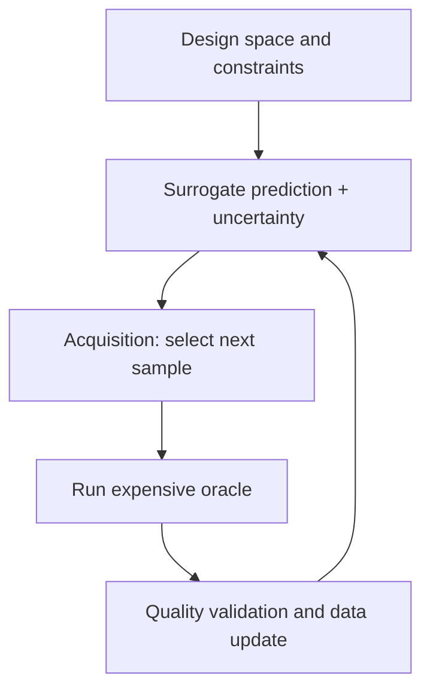



Un modelo sustituto se aproxima rápidamente a la relación entrada-salida de una simulación o experimento costoso. Cuando se diseña correctamente, puede reducir drásticamente el costo computacional de la exploración, la optimización, el análisis de sensibilidad y la toma de decisiones en tiempo real. Sin embargo, debido a que produce valores plausibles incluso fuera de su dominio de entrenamiento, un modelo con un error promedio bajo a veces puede ser el modelo más peligroso.

La clave es tratar al sustituto no como un simple regresor, sino como **un sistema de aproximación con un dominio de validez definido, incertidumbre y reglas para regresar al modelo original**.

## 1. El problema: la ilusión de un rango confiable es más peligrosa que el error de aproximación

Considere una función costosa \(f\) y un resultado de observación o simulación \(y\) de la siguiente manera.

\[
y = f(x) + \epsilon
\]

Debido a que evaluar directamente \(f(x)\) en la entrada \(x\) es costoso, entrenamos a \(\hat f(x)\). Las fallas típicas incluyen las siguientes.

- Entrenar solo sobre resultados arbitrarios existentes sin cubrir el espacio de entrada de manera uniforme.
- Considerando solo el promedio RMSE y fallas faltantes en extremos, límites y regiones de transición importantes.
- Verificar el rendimiento de la interpolación y asumir que el modelo también se puede utilizar para la extrapolación.
- Confundir la varianza predictiva de un modelo con la incertidumbre total.
- Permitir que un optimizador explote pequeños errores sustitutos y encuentre un óptimo poco realista.
- Tener aprendizaje activo muestrea repetidamente solo la misma región estrecha.
- Tratar el fallo numérico o la no convergencia en el simulador original como un valor válido.

La optimización basada en sustitutos depende menos de "¿Es precisa en promedio?" que en "¿Es conservadoramente preciso en la región que visita el optimizador?"

### No combine diferentes incertidumbres en un solo número

Los siguientes tienen diferentes causas.

- **Incertidumbre aleatoria**: medición o variación ambiental que cambia a través de las repeticiones
- **Incertidumbre epistémica**: incertidumbre sobre la forma de la función debido a datos insuficientes
- **Incertidumbre de parámetros**: incertidumbre en los parámetros estimados del modelo original
- **Incertidumbre numérica**: errores de cuadrícula, de paso de tiempo y de convergencia
- **Discrepancia del modelo**: diferencias sistemáticas entre el modelo original y la realidad.

Incluso si un sustituto replica perfectamente el simulador original, la discrepancia entre el modelo original y la realidad no disminuye.

## 2. Modelo mental: un circuito cerrado de aproximador, monitor de límites y oráculo original

Considere que un sistema sustituto tiene tres componentes.



1. **Oracle**: una simulación o experimento de alta fidelidad
2. **Sustituto**: predice rápidamente la producción y la incertidumbre a partir de una entrada
3. **Política de adquisición**: selecciona el punto en el que la próxima llamada del oráculo es más valiosa

Un cuarto componente es esencial: la **protección del dominio**. Si una entrada queda fuera del soporte de entrenamiento o la incertidumbre es alta, rechaza una decisión tomada solo por el sustituto y la envía al oráculo o a un humano.

### El espacio de diseño puede ser una variedad factible en lugar de un rango rectangular

Enumerar sólo el mínimo y el máximo de cada variable puede incluir combinaciones físicamente imposibles.

\[
\mathcal{X}_{valid}
=\{x\in\mathbb{R}^d:\; l\le x\le u,\; g_j(x)\le0,\; h_k(x)=0\}
\]

- \(l,u\): rangos variables
- \(g_j\): restricciones de desigualdad
- \(h_k\): restricciones de igualdad y conservación

Las muestras de capacitación y los candidatos de optimización deben generarse en \(\mathcal{X}_{valid}\). Cuando sea posible, utilice coordenadas que reflejen la estructura del problema, como números adimensionales, cantidades conservadas y simetrías. Esto reduce la dimensionalidad y ayuda a la generalización entre escalas.

### El aprendizaje activo no selecciona un “punto incierto”, sino un “punto con alto valor informativo”

La puntuación de adquisición de un candidato \(x\) generalmente se puede escribir de la siguiente manera.

\[
a(x)=
\alpha\,U(x)
+\beta\,V(x)
+\gamma\,R(x)
-\eta\,C(x)
\]

- \(U(x)\): incertidumbre epistémica
- \(V(x)\): posible mejora objetiva o valor de decisión
- \(R(x)\): representatividad de una región que aún no ha sido suficientemente explorada
- \(C(x)\): coste del experimento o simulación y riesgo de fallo

Los coeficientes pueden cambiar según la fase. Desde el principio, cubra el espacio ampliamente; Más adelante, explore en detalle los límites de decisión o la vecindad del óptimo.

## 3. Flujo de trabajo práctico

### Paso 1. Primero defina el propósito del sustituto y el error permitido

Incluso para la misma función original, diferentes usos requieren modelos diferentes.

| Uso | Características de rendimiento importantes |
|---|---|
| Visualización rápida | Aproximación fluida en todo el dominio, baja latencia |
| Optimización | Clasificación y precisión de restricciones cercanas al óptimo, conservadurismo |
| Análisis de sensibilidad | Preservación de tendencias e interacciones globales |
| Control y toma de decisiones | Error local, estabilidad, latencia limitada en el peor de los casos |
| Propagación de la incertidumbre | Colas de distribución y calidad del intervalo de predicción |

Documente lo siguiente desde el principio.

- Entradas, salidas, unidades y rangos permitidos.
- Restricciones de viabilidad y regiones prohibidas.
- Costo y paralelización de ejecuciones originales.
- Errores absolutos y relativos permitidos para cada salida.
- Límites importantes, extremos y regiones de transición.
- Condiciones bajo las cuales la gestante debe rechazar una solicitud
- Condiciones que requieren la revalidación de la decisión final por parte de Oracle.

### Paso 2. Primero verifique la calidad del oráculo original

Un sustituto también aprende los errores del oráculo. Antes de generar datos, verifique lo siguiente.

- ¿Son reproducibles los resultados deterministas para la misma entrada?
- ¿Se registran las semillas aleatorias, las condiciones iniciales y las versiones del solucionador?
- ¿Existe un código de estado que distinga los fallos de convergencia de los resultados físicos?
- ¿Está disponible la independencia de cuadrícula o de paso de tiempo, o una estimación del error numérico?
- ¿Está controlada la versión del posprocesamiento de salida?
- ¿Se conservan las ejecuciones fallidas con sus causas?

Si los fallos numéricos se borran como datos faltantes, el límite del fallo se vuelve invisible. El éxito se puede modelar como un problema de clasificación separado, o la probabilidad de fracaso se puede utilizar como una restricción en la adquisición.

### Paso 3. Cubrir la región factible con un DoE inicial

Las muestras iniciales proporcionan el mapa mínimo que el modelo necesita para comenzar el aprendizaje activo.

Los diseños que llenan el espacio son útiles en espacios continuos de dimensiones bajas y medias.

- hipercubo latino
- Secuencias de baja discrepancia.
- Diseños de distancia maximina.
- Muestras estratificadas que satisfacen restricciones.

Si hay variables categóricas o condicionales, estratifique para que se incluyan todas las combinaciones importantes. Agregue muestras separadas para condiciones de contorno y regiones de transición conocidas.

Llenar el espacio se vuelve rápidamente más difícil en dimensiones altas. En ese caso, primero considere lo siguiente.

- Reducción y adimensionalización de la dimensionalidad basada en la física.
- Detección de sensibilidad
- Supuestos de interacción escasa.
- Representaciones de baja dimensión de resultados estructurados.
- Restricciones operativas que reducen la región requerida.

El uso de información de la región de prueba simplemente porque se realizó un análisis de sensibilidad en todos los datos antes de crear el DoE inicial introduce un sesgo de selección. Separe los datos de diseño de los datos de validación.

### Paso 4. Comparar familias de modelos adecuadas a la estructura de salida

La selección del modelo depende del tamaño de los datos, la dimensionalidad, la suavidad, las discontinuidades, la estructura de salida y los requisitos de incertidumbre.

- Datos pequeños y funciones fluidas: los modelos probabilísticos locales suelen ser sólidos.
- Datos tabulares, variables mixtas y discontinuidades: los modelos basados ​​en árboles pueden ser robustos.
- Grandes datos, grandes dimensiones y múltiples resultados: las familias de redes neuronales pueden ofrecer una mejor escalabilidad.
- Salida de campo espacial o serie temporal: comprime la salida con una base, POD, o un codificador automático y luego predice coeficientes latentes, o considera el aprendizaje del operador.
- Restricciones físicas conocidas: las leyes de conservación y las condiciones de contorno pueden incorporarse a la pérdida, la arquitectura o el posprocesamiento.

Sin embargo, agregar restricciones físicas no hace que la extrapolación sea automáticamente segura. En cambio, las restricciones o la escala incorrectas pueden crear un sesgo sistemático.

### Paso 5. Estimar las incertidumbres por separado

Una predicción se puede representar de la siguiente manera.

\[
y\mid x,\mathcal D
\sim
\text{PredictiveDistribution}
\left(\mu(x),\; \sigma^2_{alea}(x)+\sigma^2_{epi}(x)\right)
\]

Los métodos prácticos incluyen los siguientes.

- Posteriores basados en procesos probabilísticos
- Variación de bootstrap o conjunto
- Predecir la varianza aleatoria con una probabilidad heteroscedástica.
- Calibración de cobertura de muestra finita con predicción conforme
- Predicción cuantil condicional con regresión cuantil

Si los miembros del conjunto comparten los mismos datos y el mismo sesgo, todos pueden estar equivocados incluso cuando la varianza es baja. La incertidumbre no es simplemente la variación del modelo; es **un objetivo de validación separado**.

Elementos de evaluación:

- Cobertura del intervalo de predicción
- Ancho de intervalo y nitidez.
- Correlación entre error e incertidumbre
- Error real entre muestras de alta incertidumbre.
- Cobertura condicional por región y nivel de producción.
- Si la incertidumbre aumenta con la extrapolación.

### Paso 6. Diseñe el ciclo de aprendizaje activo para incluir lotes, fallas y costos

```python
dataset = initial_design()

while budget.remaining() > 0:
    surrogate = fit_surrogate(dataset)
    candidates = sample_feasible_candidates()

    mean, uncertainty = surrogate.predict(candidates)
    failure_risk = failure_model.predict(candidates)
    score = acquisition(mean, uncertainty, candidates, failure_risk)

    batch = select_diverse_batch(score, candidates, budget)
    results = run_oracle(batch)
    dataset = validate_and_append(dataset, results)

    if stopping_rule(dataset, surrogate):
        break
```

Al enviar varias ejecuciones en paralelo, seleccionar solo las puntuaciones de adquisición más altas puede producir puntos redundantes cercanos entre sí. Considere la distancia dentro del lote, la superposición de información esperada y el equilibrio categórico.

Cuando el fracaso del oráculo es costoso, multiplique o limite la probabilidad de éxito.

\[
a_{safe}(x)=a(x)\,P(\text{success}\mid x)
\]

Sin embargo, si el límite del fracaso en sí es un conocimiento importante, no lo evite por completo; explorarlo con un presupuesto limitado.

### Paso 7. Divida los datos de validación por propósito

Una única resistencia aleatoria es insuficiente.

1. **Conjunto de interpolación**: rendimiento de interpolación dentro del dominio de entrenamiento
2. **Conjunto de límites**: límites de variables y restricciones, y regiones de transición
3. **Conjunto de decisiones**: regiones realmente visitadas por optimización o control
4. **Conjunto de estrés**: combinaciones extremas raras pero importantes
5. **Conjunto fuera del dominio**: comportamiento de rechazo en regiones intencionalmente no admitidas

Además de MAE y RMSE para cada salida, examine lo siguiente.

- Error relativo y error por escala.
- Errores máximos y cuantiles superiores.
- Gradientes, clasificación y monotonicidad.
- Residuos de la ecuación de conservación.
- Tasa de violación de restricciones
- Arrepentimiento de lo óptimo.
- Cobertura del intervalo de predicción
- Latencia de inferencia

Para un uso optimizado, reevalúe los candidatos propuestos como sustitutos con el oráculo y mida el arrepentimiento.

\[
\mathrm{regret}=f(x_{suggested})-f(x_{best\;known})
\]

Esto es para un problema de minimización; manejar las violaciones de restricciones con una sanción separada o una decisión de inviabilidad.

### Paso 8. Implementar la protección del dominio y el respaldo como parte del modelo

Se pueden combinar las siguientes señales.

- Rango de entrada o violaciones de restricciones
- Distancia al conjunto de entrenamiento.
- Densidad de datos locales
- desacuerdo en el conjunto
- Ancho del intervalo de predicción
- puntuación de clasificación OOD
- Regiones de falla o discontinuidad conocidas

```python
def guarded_predict(x):
    if not satisfies_hard_constraints(x):
        return Reject("invalid input")

    prediction, uncertainty = surrogate.predict(x)
    domain_score = support_estimator.score(x)

    if domain_score < MIN_SUPPORT or uncertainty > MAX_UNCERTAINTY:
        return Defer("oracle or expert review")

    return Accept(prediction, uncertainty)
```

Establezca umbrales en un conjunto de validación separado y evalúe tanto la tasa de rechazo como el error en las muestras restantes. Dado que la precisión se puede mejorar fácilmente rechazando más muestras, utilice una curva de riesgo de cobertura.

### Paso 9. Defina los criterios de parada y actualice las condiciones con antelación

El aprendizaje activo no necesariamente debe continuar hasta que se agote el presupuesto. Los posibles criterios de parada incluyen los siguientes.

- El error de validación independiente está por debajo de la tolerancia.
- El error máximo en regiones importantes está por debajo de la tolerancia
- La reducción de la incertidumbre sigue siendo insignificante en varias iteraciones.
- El valor de decisión esperado de una muestra adicional es menor que su costo.
- El candidato óptimo permanece estable en ejecuciones repetidas.
- Todo el presupuesto está agotado.

Vuelva a capacitarse cuando se acumulen nuevos resultados de Oracle después de la implementación, pero registre tanto la versión de los datos como la política de adquisición. Las muestras seleccionadas activamente difieren de la distribución operativa original, por lo que no las utilice sin cambios para calcular el rendimiento promedio simple.

## 4. Lista de verificación de evaluación y validación

### Problema y dominio

- [ ] Se especifica el propósito del sustituto y el error permitido.
- [ ] Las unidades de entrada, los rangos y las restricciones de igualdad y desigualdad están controlados por versión.
- [ ] Las regiones límite, de transición y extremas importantes se definen por separado.
- [ ] Se definen regiones OOD y reglas de rechazo no admitidas.

### Oráculo y datos

- [] Se registran la versión, configuración, aleatoriedad y estado de convergencia de las ejecuciones originales.
- [ ] Se distingue incertidumbre numérica y variación de medición.
- [] Las ejecuciones fallidas se conservan con sus causas en lugar de eliminarse.
- [ ] El DoE inicial cubre la región factible y las categorías importantes.
- [] Se realiza un seguimiento de la probabilidad de selección y la justificación de las muestras de aprendizaje activo.

### Modelo e incertidumbre

- [ ] Comparado con líneas base de regresión simple e interpolación.
- [] La estructura de salida y las restricciones físicas informaron la selección del modelo.
- [ ] No se confunden las incertidumbres epistémicas, aleatorias, numéricas y de discrepancia.
- [ ] Se validaron la cobertura de incertidumbre, la amplitud y la correlación de errores.
- [ ] La seguridad no se reclama únicamente por la variación del conjunto.

### Evaluación y operaciones

- [ ] Se distinguen conjuntos de interpolación, límites, decisión y tensión.
- [ ] Se comprobaron el error máximo y de cola además del promedio.
- [ ] Los candidatos a optimización fueron revalidados con el oráculo.
- [ ] Se evaluó la relación cobertura-riesgo de la guardia de dominio.
- [] Se incluyeron el costo y la latencia del respaldo de Oracle.
- [] Los criterios de parada del aprendizaje activo se definieron de antemano.

## 5. Limitaciones y precauciones

En primer lugar, los datos escasos en un espacio de alta dimensión no pueden cubrir de manera confiable todas las regiones. Son necesarios supuestos estructurales, reducción de dimensionalidad y un dominio de soporte restringido, y no se debe exagerar la capacidad de extrapolación.

En segundo lugar, un estimador de incertidumbre también es un modelo. En caso de cambio de distribución, sesgo compartido o probabilidad mal especificada, es seguro que puede estar equivocado. Son necesarias pruebas de estrés independientes y una política de rechazo.

En tercer lugar, el aprendizaje activo adquiere conocimientos sólo sobre las regiones que su función de adquisición define como importantes. Si el modelo puede reutilizarse para otros fines futuros, preservar la diversidad de exploración y un presupuesto separado para llenar el espacio.

En cuarto lugar, los modelos de multifidelidad pueden utilizar abundantes datos de bajo costo, pero pueden ser perjudiciales cuando la correlación entre la baja y la alta fidelidad es débil o el sesgo varía según el estado. La discrepancia entre los niveles de fidelidad debe validarse explícitamente.

Finalmente, la precisión sustituta no es un límite superior para la precisión del mundo real. El error del oráculo sustituto, la discrepancia entre el oráculo y la realidad y la incertidumbre de entrada se acumulan en secuencia. Las decisiones finales deben informar toda esta cadena de errores en partes separadas.
