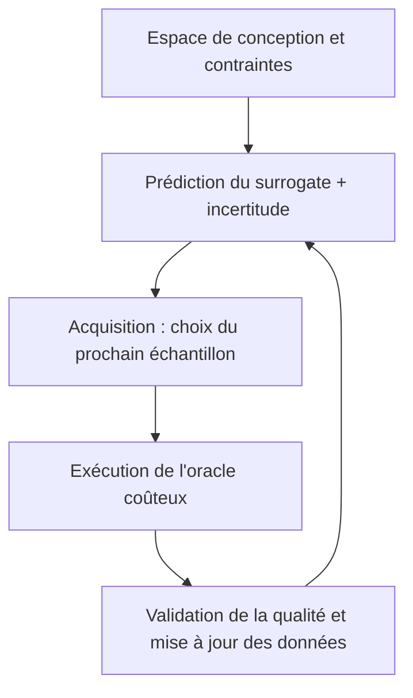



Un modèle surrogate approxime rapidement la relation entre les entrées et les sorties d'une simulation ou d'une expérience coûteuse. Correctement conçu, il peut réduire considérablement le coût de calcul de l'exploration, de l'optimisation, de l'analyse de sensibilité et de la décision en temps réel. Toutefois, comme il fournit des valeurs plausibles même hors de son domaine d'apprentissage, le modèle dont l'erreur moyenne est faible peut parfois être le plus dangereux.

L'essentiel est de ne pas considérer le surrogate comme un simple régresseur, mais comme **un système d'approximation doté d'un domaine de validité défini, d'une incertitude et de règles de retour au modèle original**.

## 1. Problème : l'illusion d'une plage fiable est plus dangereuse que l'erreur d'approximation

Considérons une fonction coûteuse $f$ et un résultat d'observation ou de simulation $y$ comme suit.

\[
y = f(x) + \epsilon
\]

Comme le calcul direct de $f(x)$ pour l'entrée $x$ est coûteux, nous apprenons $\hat f(x)$. Les échecs typiques sont les suivants.

- Entraîner le modèle uniquement sur des résultats existants arbitraires sans couvrir uniformément l'espace d'entrée.
- Ne regarder que la RMSE moyenne et manquer les échecs dans les extrêmes, frontières et régions de transition importants.
- Vérifier les performances d'interpolation et supposer que le modèle peut également extrapoler.
- Confondre la variance prédictive du modèle avec l'incertitude totale.
- Laisser l'optimiseur exploiter de petites erreurs du surrogate et trouver un optimum irréaliste.
- Faire échantillonner à l'active learning toujours la même région étroite.
- Traiter l'échec numérique ou la non-convergence du simulateur original comme une valeur normale.

Pour une optimisation fondée sur un surrogate, la question « est-il précis en moyenne ? » importe moins que « est-il prudemment précis dans la région visitée par l'optimiseur ? ».

### Ne pas réunir des incertitudes différentes en un seul chiffre

Les causes suivantes sont distinctes.

- **Incertitude aléatoire** : variation des mesures ou de l'environnement qui change à chaque répétition
- **Incertitude épistémique** : ignorance de la forme de la fonction due au manque de données
- **Incertitude des paramètres** : incertitude de l'estimation des paramètres du modèle original
- **Incertitude numérique** : erreurs de maillage, de pas de temps et de convergence
- **Discrépance du modèle** : différence systématique entre le modèle original et la réalité

Même si le surrogate reproduit parfaitement le simulateur original, la discrépance entre celui-ci et la réalité ne diminue pas.

## 2. Modèle mental : boucle fermée entre approximateur, gardien des frontières et oracle original

Un système surrogate comporte trois composants.



1. **Oracle** : simulation ou expérience de haute fidélité
2. **Surrogate** : prédit rapidement la sortie et l'incertitude à partir d'une entrée
3. **Politique d'acquisition** : sélectionne le point où le prochain appel à l'oracle aura le plus de valeur

Un quatrième élément est indispensable : le **domain guard**. Si une entrée se situe hors du support d'apprentissage ou si l'incertitude est élevée, il refuse une décision prise par le seul surrogate et l'envoie à l'oracle ou à un humain.

### L'espace de conception peut être une variété réalisable plutôt qu'un intervalle rectangulaire

Énumérer uniquement les valeurs minimales et maximales de chaque variable peut inclure des combinaisons physiquement impossibles.

\[
\mathcal{X}_{valid}
=\{x\in\mathbb{R}^d:\; l\le x\le u,\; g_j(x)\le0,\; h_k(x)=0\}
\]

- $l,u$ : intervalles des variables
- $g_j$ : contraintes d'inégalité
- $h_k$ : contraintes d'égalité et de conservation

Les échantillons d'apprentissage et les candidats à l'optimisation doivent être générés dans $\mathcal{X}_{valid}$. Dans la mesure du possible, utiliser des coordonnées qui reflètent la structure du problème, telles que nombres sans dimension, quantités conservées et symétries. Cela réduit la dimension et favorise la généralisation à d'autres échelles.

### L'active learning ne choisit pas un « point incertain », mais un « point à forte valeur informationnelle »

Le score d'acquisition d'un candidat $x$ peut généralement s'écrire ainsi.

\[
a(x)=
\alpha\,U(x)
+\beta\,V(x)
+\gamma\,R(x)
-\eta\,C(x)
\]

- $U(x)$ : incertitude épistémique
- $V(x)$ : potentiel d'amélioration de l'objectif ou valeur décisionnelle
- $R(x)$ : représentativité d'une région encore peu explorée
- $C(x)$ : coût de l'expérience ou de la simulation et risque d'échec

Les coefficients peuvent varier selon la phase. Au début, couvrir largement l'espace ; à la fin, explorer précisément les frontières de décision ou le voisinage de l'optimum.

## 3. Workflow pratique

### Étape 1. Définir d'abord l'usage du surrogate et l'erreur admissible

Même pour une fonction originale identique, les différents usages nécessitent des modèles différents.

| Usage | Caractéristiques importantes |
|---|---|
| Visualisation rapide | Approximation lisse sur l'ensemble du domaine, faible latence |
| Optimisation | Exactitude des classements et contraintes près de l'optimum, prudence |
| Analyse de sensibilité | Conservation des tendances globales et des interactions |
| Contrôle et décision | Erreur locale, stabilité, latence maximale bornée |
| Propagation d'incertitude | Traînes de distribution et qualité des intervalles de prédiction |

Documenter dès le départ les éléments suivants.

- Entrées, sorties, unités et intervalles autorisés
- Contraintes de faisabilité et régions interdites
- Coût et possibilité de parallélisation des exécutions originales
- Erreurs absolues et relatives admissibles pour chaque sortie
- Frontières, extrêmes et régions de transition importants
- Conditions dans lesquelles le surrogate doit refuser une demande
- Conditions exigeant une nouvelle validation par l'oracle de la décision finale

### Étape 2. Vérifier d'abord la qualité de l'oracle original

Le surrogate apprend aussi les erreurs de l'oracle. Avant de générer des données, vérifier les points suivants.

- Les résultats déterministes sont-ils reproductibles à entrée identique ?
- Les seeds aléatoires, conditions initiales et versions du solveur sont-elles consignées ?
- Un code de statut distingue-t-il les échecs de convergence des résultats physiques ?
- Dispose-t-on d'une indépendance au maillage ou au pas de temps, ou d'une estimation de l'erreur numérique ?
- Le post-traitement des sorties est-il versionné ?
- Les exécutions en échec et leurs causes sont-elles conservées ?

Si les échecs numériques sont supprimés comme données manquantes, la frontière d'échec devient invisible. La réussite peut être modélisée comme un problème de classification distinct, ou la probabilité d'échec employée comme contrainte d'acquisition.

### Étape 3. Couvrir la région réalisable avec un DoE initial

Les échantillons initiaux fournissent la carte minimale nécessaire au démarrage de l'active learning.

Les plans space-filling sont utiles dans les espaces continus de dimension faible ou moyenne.

- Hypercube latin
- Suites à faible discrépance
- Plans à distance maximin
- Échantillons stratifiés satisfaisant les contraintes

En présence de variables catégorielles ou conditionnelles, stratifier de manière à inclure chaque combinaison importante. Ajouter des échantillons spécifiques pour les conditions aux limites et les régions de transition connues.

Le remplissage de l'espace devient rapidement difficile en grande dimension. Il faut alors envisager d'abord les options suivantes.

- Réduction de dimension fondée sur la physique et adimensionnement
- Screening de sensibilité
- Hypothèse d'interactions éparses
- Représentation de faible dimension des sorties structurées
- Contraintes opérationnelles réduisant la région nécessaire

Utiliser des informations de la région de test sous prétexte qu'une analyse de sensibilité a porté sur toutes les données avant la création du DoE initial introduit un biais de sélection. Séparer les données de conception de celles de validation.

### Étape 4. Comparer les familles de modèles adaptées à la structure de sortie

Le choix dépend du volume et de la dimension des données, de la régularité, des discontinuités, de la structure de sortie et des besoins en incertitude.

- Petits jeux de données et fonctions régulières : les modèles locaux probabilistes sont souvent performants.
- Données tabulaires, variables mixtes et discontinuités : les modèles fondés sur des arbres peuvent être robustes.
- Grands jeux de données, grandes dimensions et sorties multiples : les réseaux de neurones peuvent mieux passer à l'échelle.
- Sorties en champs spatiaux ou séries temporelles : compresser les sorties avec une base, une POD ou un autoencoder puis prédire les coefficients latents, ou envisager l'apprentissage d'opérateurs.
- Contraintes physiques connues : intégrer les lois de conservation et conditions aux limites dans la loss, l'architecture ou le post-traitement.

L'ajout de contraintes physiques ne rend toutefois pas l'extrapolation automatiquement sûre. Des contraintes ou une mise à l'échelle incorrectes peuvent au contraire créer un biais systématique.

### Étape 5. Estimer séparément les incertitudes

Une prédiction peut être représentée ainsi.

\[
y\mid x,\mathcal D
\sim
\text{PredictiveDistribution}
\left(\mu(x),\; \sigma^2_{alea}(x)+\sigma^2_{epi}(x)\right)
\]

Les méthodes pratiques comprennent les suivantes.

- Posterior fondé sur un processus probabiliste
- Variance par bootstrap ou ensemble
- Prédiction de la variance aléatoire par une likelihood hétéroscédastique
- Ajustement de la coverage en échantillon fini par prédiction conforme
- Prédiction des quantiles conditionnels par régression quantile

Si les membres d'un ensemble partagent les mêmes données et le même biais, ils peuvent tous se tromper ensemble malgré une faible variance. L'incertitude n'est pas une simple variance du modèle, mais **une cible de validation distincte**.

Éléments d'évaluation :

- Coverage de l'intervalle de prédiction
- Largeur et sharpness des intervalles
- Corrélation entre erreur et incertitude
- Erreur réelle des échantillons à forte incertitude
- Coverage conditionnelle par région et niveau de sortie
- Augmentation de l'incertitude en extrapolation

### Étape 6. Concevoir la boucle d'active learning en incluant batchs, échecs et coûts

```python
dataset = initial_design()

while budget.remaining() > 0:
    surrogate = fit_surrogate(dataset)
    candidates = sample_feasible_candidates()

    mean, uncertainty = surrogate.predict(candidates)
    failure_risk = failure_model.predict(candidates)
    score = acquisition(mean, uncertainty, candidates, failure_risk)

    batch = select_diverse_batch(score, candidates, budget)
    results = run_oracle(batch)
    dataset = validate_and_append(dataset, results)

    if stopping_rule(dataset, surrogate):
        break
```

Lorsque plusieurs exécutions partent en parallèle, ne retenir que les meilleurs scores d'acquisition peut produire des points redondants et proches. Prendre en compte la distance au sein du batch, le chevauchement informationnel attendu et l'équilibre des catégories.

Lorsque l'échec de l'oracle est coûteux, multiplier par la probabilité de réussite ou l'imposer comme contrainte.

\[
a_{safe}(x)=a(x)\,P(\text{success}\mid x)
\]

Si la frontière d'échec constitue elle-même une information importante, ne pas l'éviter totalement, mais l'explorer avec un budget limité.

### Étape 7. Séparer les données de validation selon leur objectif

Un unique holdout aléatoire ne suffit pas.

1. **Jeu d'interpolation** : performances d'interpolation dans le domaine d'apprentissage
2. **Jeu de frontière** : frontières des variables et contraintes, et régions de transition
3. **Jeu de décision** : régions réellement visitées par l'optimisation ou le contrôle
4. **Jeu de stress** : combinaisons extrêmes, rares mais importantes
5. **Jeu hors domaine** : comportement de refus dans des régions intentionnellement non prises en charge

Outre les MAE et RMSE de chaque sortie, examiner les éléments suivants.

- Erreur relative et erreur par échelle
- Erreur maximale et aux quantiles supérieurs
- Gradients, classement et monotonie
- Résidus des équations de conservation
- Taux de violation des contraintes
- Regret de l'optimum
- Coverage des intervalles de prédiction
- Latence d'inférence

Pour un usage d'optimisation, réévaluer avec l'oracle les candidats proposés par le surrogate et mesurer le regret.

\[
\mathrm{regret}=f(x_{suggested})-f(x_{best\;known})
\]

Cette formule correspond à un problème de minimisation ; traiter les violations de contraintes par une pénalité distincte ou une décision d'infaisabilité.

### Étape 8. Déployer le domain guard et le fallback comme parties du modèle

Les signaux suivants peuvent être combinés.

- Violation d'intervalle ou de contrainte d'entrée
- Distance au jeu d'apprentissage
- Densité locale des données
- Désaccord de l'ensemble
- Largeur de l'intervalle de prédiction
- Score de classification OOD
- Régions connues de défaillance ou de discontinuité

```python
def guarded_predict(x):
    if not satisfies_hard_constraints(x):
        return Reject("invalid input")

    prediction, uncertainty = surrogate.predict(x)
    domain_score = support_estimator.score(x)

    if domain_score < MIN_SUPPORT or uncertainty > MAX_UNCERTAINTY:
        return Defer("oracle or expert review")

    return Accept(prediction, uncertainty)
```

Définir les thresholds sur un jeu de validation distinct et évaluer ensemble le taux de refus et l'erreur des échantillons restants. Comme il est facile d'améliorer l'exactitude en refusant davantage de cas, examiner la courbe coverage–risk.

### Étape 9. Définir à l'avance les critères d'arrêt et les conditions de mise à jour

L'active learning ne doit pas nécessairement se poursuivre jusqu'à épuisement du budget. Critères d'arrêt possibles :

- Erreur de validation indépendante inférieure à la tolérance
- Erreur maximale dans les régions importantes inférieure à la tolérance
- Réduction de l'incertitude négligeable pendant plusieurs itérations
- Valeur décisionnelle attendue d'un échantillon supplémentaire inférieure à son coût
- Stabilité du candidat optimal sur plusieurs exécutions
- Épuisement du budget total

Réentraîner lorsque de nouveaux résultats de l'oracle s'accumulent après le déploiement, tout en consignant la version des données et la politique d'acquisition. Les échantillons sélectionnés activement diffèrent de la distribution opérationnelle initiale et ne doivent donc pas être utilisés tels quels pour calculer une simple performance moyenne.

## 4. Checklist d'évaluation et de validation

### Problème et domaine

- [ ] L'usage du surrogate et l'erreur admissible sont précisés.
- [ ] Les unités, intervalles et contraintes d'égalité et d'inégalité des entrées sont versionnés.
- [ ] Les régions importantes de frontière, transition et extrême sont définies séparément.
- [ ] Les régions OOD non prises en charge et les règles de refus sont définies.

### Oracle et données

- [ ] La version, la configuration, l'aléa et l'état de convergence des exécutions originales sont consignés.
- [ ] L'incertitude numérique est distinguée de la variation des mesures.
- [ ] Les exécutions en échec et leurs causes sont conservées au lieu d'être supprimées.
- [ ] Le DoE initial couvre la région réalisable et les catégories importantes.
- [ ] La probabilité de sélection et la justification des échantillons d'active learning sont suivies.

### Modèle et incertitude

- [ ] Une comparaison avec des baselines simples de régression et d'interpolation a été effectuée.
- [ ] La structure des sorties et les contraintes physiques ont guidé le choix du modèle.
- [ ] Les incertitudes épistémique, aléatoire, numérique et de discrépance ne sont pas confondues.
- [ ] La coverage, la largeur et la corrélation avec l'erreur de l'incertitude ont été validées.
- [ ] La sécurité n'est pas revendiquée sur la seule variance d'un ensemble.

### Évaluation et exploitation

- [ ] Les jeux d'interpolation, de frontière, de décision et de stress sont distingués.
- [ ] Les erreurs maximale et de traîne ont été examinées en plus de la moyenne.
- [ ] Les candidats d'optimisation ont été revalidés par l'oracle.
- [ ] Le compromis coverage–risk du domain guard a été évalué.
- [ ] Le coût et la latence du fallback vers l'oracle ont été inclus.
- [ ] Les critères d'arrêt de l'active learning ont été définis à l'avance.

## 5. Limites et précautions

Premièrement, des données éparses dans un espace de grande dimension ne permettent pas de couvrir fiablement toutes les régions. Des hypothèses structurelles, une réduction de dimension et une limitation du domaine pris en charge sont nécessaires ; la capacité d'extrapolation ne doit pas être exagérée.

Deuxièmement, l'estimateur d'incertitude est lui aussi un modèle. En présence d'un changement de distribution, d'un biais partagé ou d'une likelihood incorrecte, il peut se tromper avec assurance. Des tests de stress indépendants et une politique de refus sont nécessaires.

Troisièmement, l'active learning ne connaît mieux que les régions jugées importantes par sa fonction d'acquisition. Si le modèle peut être réutilisé à d'autres fins, préserver la diversité de l'exploration et un budget space-filling distinct.

Quatrièmement, les modèles multifidélité peuvent exploiter beaucoup de données peu coûteuses, mais devenir nuisibles lorsque la corrélation entre basse et haute fidélité est faible ou que le biais varie selon l'état. La discrépance entre niveaux de fidélité doit être explicitement validée.

Enfin, l'exactitude du surrogate n'est pas une borne supérieure de l'exactitude dans le monde réel. L'erreur surrogate–oracle, la discrépance oracle–réalité et l'incertitude des entrées s'accumulent successivement. La décision finale doit rapporter séparément l'ensemble de cette chaîne d'erreurs.
