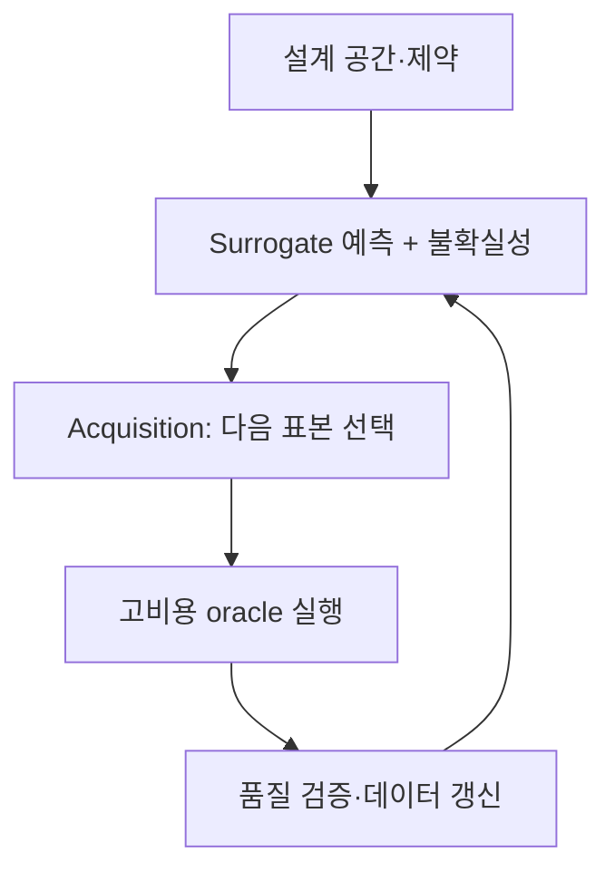



Surrogate modelは、高コストsimulationや実験の入出力関係を高速に近似する。適切に設計すれば、探索、最適化、感度解析、リアルタイム意思決定の計算コストを大幅に下げられる。しかし学習領域外でももっともらしい値を出すため、平均誤差が小さいモデルが最も危険なモデルになることもある。

核心はsurrogateを単純な回帰器ではなく、**定義された有効領域、不確実性、元モデルへ戻る規則を持つ近似システム**として捉えることである。

## 1. 問題：近似誤差より危険な「信頼範囲の錯覚」

高コスト関数 \(f\) と観測または解析結果 \(y\) を次のように考える。

\[
y = f(x) + \epsilon
\]

入力 \(x\) で \(f(x)\) を直接計算するコストが大きいため \(\hat f(x)\) を学習する。典型的な失敗は次のとおりである。

- 入力空間を均等に覆わず、任意の既存結果だけで学習する。
- 平均RMSEだけを見て重要な極端・境界・遷移領域の失敗を逃す。
- 補間性能を確認して外挿にも使えると仮定する。
- モデルの予測分散を全不確実性と誤解する。
- 最適化器がsurrogateの小さな誤差を突き、非現実的な最適点を見つける。
- active learningが同じ狭い領域だけを反復収集する。
- 元simulatorの数値失敗・未収束を正常値として処理する。

特にsurrogateベース最適化では、「平均的に正確か」より「最適化器が訪れる領域で保守的に正確か」が重要である。

### 異なる不確実性を一つの数値へまとめてはならない

次は原因が異なる。

- **aleatoric uncertainty**：反復しても変わる測定・環境変動
- **epistemic uncertainty**：データ不足により関数形状を知らない程度
- **parameter uncertainty**：元モデルparameter推定の不確実性
- **numerical uncertainty**：格子・時間間隔・収束誤差
- **model discrepancy**：元モデル自体と現実の系統差

surrogateが元simulatorを正確に複製しても、元モデルと現実間のdiscrepancyは減らない。

## 2. Mental model：近似器、境界監視器、元oracleのclosed loop

Surrogateシステムを三要素で捉える。



1. **Oracle**：高忠実度simulationまたは実験
2. **Surrogate**：入力から出力と不確実性を高速予測
3. **Acquisition policy**：次のoracle呼出し価値が最大の点を選択

必須の第四要素が**domain guard**である。入力が学習support領域外、または不確実性が高ければ、surrogate単独の決定を拒否してoracleか人へ送る。

### 設計空間は矩形範囲でなく実行可能な多様体の場合がある

各変数の最小・最大だけを並べると、物理的に不可能な組合せを含み得る。

\[
\mathcal{X}_{valid}
=\{x\in\mathbb{R}^d:\; l\le x\le u,\; g_j(x)\le0,\; h_k(x)=0\}
\]

- \(l,u\)：変数範囲
- \(g_j\)：不等式制約
- \(h_k\)：等式・保存制約

学習標本と最適化候補は \(\mathcal{X}_{valid}\) 内で生成する。可能なら無次元数、保存量、対称性など問題構造を反映した座標を使う。次元を減らし、別scaleへの一般化を助ける。

### Active learningは「不確実な点」でなく「情報価値が高い点」を選ぶ

候補 \(x\) のacquisition scoreは一般に次のように書ける。

\[
a(x)=
\alpha\,U(x)
+\beta\,V(x)
+\gamma\,R(x)
-\eta\,C(x)
\]

- \(U(x)\)：epistemic uncertainty
- \(V(x)\)：目的関数改善可能性または意思決定価値
- \(R(x)\)：未探索領域の代表性
- \(C(x)\)：実験・解析コストと失敗リスク

係数は段階に応じて変えられる。初期は空間を広く覆い、後半は意思決定境界や最適点周辺を精密に探索する。

## 3. 実践workflow

### Step 1. Surrogateの用途と許容誤差を先に定義する

同じ元関数でも用途により必要モデルは異なる。

| 用途 | 重要な性能 |
|---|---|
| 高速可視化 | 全領域の滑らかな近似、短い遅延 |
| 最適化 | 最適点付近の順位・制約精度、保守性 |
| 感度解析 | global trendと相互作用の保持 |
| 制御・意思決定 | 局所誤差、安定性、固定worst latency |
| 不確実性伝播 | 分布tailとprediction interval品質 |

最初に次を文書化する。

- 入力・出力・単位・許容範囲
- 実行可能制約と禁止領域
- 元実行コストと並列可能性
- 出力別の許容絶対・相対誤差
- 重要な境界・極端・遷移区間
- surrogateが拒否すべき条件
- 最終意思決定でoracle再検証が必要な条件

### Step 2. 元oracleの品質から確認する

Surrogateはoracleの誤りも学習する。データ生成前に次を確認する。

- 同じ入力で決定論的結果が再現するか。
- 乱数・初期条件・solver versionを記録するか。
- 収束失敗と物理結果を分けるstatus codeがあるか。
- 格子・時間間隔独立性または数値誤差推定があるか。
- 出力postprocessingがversion管理されるか。
- 失敗runも原因付きで保存するか。

数値失敗をmissingとして消すと失敗境界が見えない。成功可否を別分類問題としてモデル化する、またはacquisitionで失敗確率を制約に使える。

### Step 3. 初期DoEで実行可能領域を覆う

初期標本は、モデルがactive learningを始める最小地図を与える。

連続型の低・中次元ではspace-filling designが有用である。

- Latin hypercube
- low-discrepancy sequence
- maximin distance design
- 制約を満たす層化標本

カテゴリ・条件変数があるなら重要な各組合せを含める。境界条件と既知の遷移区間には別標本を置く。

高次元ではspace fillingが急速に難しくなる。先に次を検討する。

- 物理ベースの次元削減・無次元化
- sensitivity screening
- sparse interaction仮定
- 構造化出力の低次元表現
- 必要領域を狭める運用制約

初期DoE前に全データで感度解析したという理由でtest領域情報を使うとselection biasが生じる。設計データと検証データを分ける。

### Step 4. 出力構造に合うモデル系統を比較する

モデル選択基準はデータ量、次元、滑らかさ、不連続、出力構造、不確実性要件である。

- 小規模データ・滑らかな関数：局所的・確率的モデルが強い場合が多い。
- tabular・混合変数・不連続：treeベースモデルが堅牢な場合がある。
- 大規模データ・高次元・multi-output：neural network系が拡張性で有利な場合がある。
- spatial field・time series出力：basis/POD/autoencoderで出力を圧縮しlatent coefficientを予測、またはoperator learningを検討する。
- 既知の物理制約：loss・architecture・postprocessingへ保存則と境界条件を入れられる。

ただし物理制約を入れても外挿が自動で安全にはならない。誤った制約やscalingは系統biasを作り得る。

### Step 5. 不確実性を分離して推定する

予測は次のように表せる。

\[
y\mid x,\mathcal D
\sim
\text{PredictiveDistribution}
\left(\mu(x),\; \sigma^2_{alea}(x)+\sigma^2_{epi}(x)\right)
\]

実践手法：

- stochastic processベースposterior
- bootstrap/ensemble分散
- heteroscedastic likelihoodによるaleatoric分散予測
- conformal predictionによる有限標本coverage補正
- quantile regressionによる条件付きquantile予測

ensemble memberが同じデータとbiasを共有すれば、分散が低くても全て同時に誤り得る。不確実性は単なるmodel varianceでなく、**独立した検証対象**である。

評価項目：

- prediction interval coverage
- interval幅とsharpness
- errorとuncertaintyの相関
- high-uncertainty標本の実error
- 領域・出力level別のconditional coverage
- 外挿で不確実性が増えるか

### Step 6. Active learning loopをbatch・失敗・コストまで含めて設計する

```python
dataset = initial_design()

while budget.remaining() > 0:
    surrogate = fit_surrogate(dataset)
    candidates = sample_feasible_candidates()

    mean, uncertainty = surrogate.predict(candidates)
    failure_risk = failure_model.predict(candidates)
    score = acquisition(mean, uncertainty, candidates, failure_risk)

    batch = select_diverse_batch(score, candidates, budget)
    results = run_oracle(batch)
    dataset = validate_and_append(dataset, results)

    if stopping_rule(dataset, surrogate):
        break
```

複数runを並列投入する際、上位acquisition scoreだけを選ぶと近接点が重複する。batch内距離、予想情報の重複、カテゴリ均衡を考慮する。

Oracle失敗が高コストなら、成功確率を掛けるか制約にする。

\[
a_{safe}(x)=a(x)\,P(\text{success}\mid x)
\]

ただし失敗境界自体が重要なら、無条件に回避せず限定budgetで探索する。

### Step 7. 検証データを目的別に分ける

random holdout一つでは不十分である。

1. **Interpolation set**：学習領域内の補間性能
2. **Boundary set**：変数・制約境界と遷移区間
3. **Decision set**：最適化・制御が実際に訪れる領域
4. **Stress set**：稀だが重要な極端組合せ
5. **Out-of-domain set**：意図的に非対応とする領域での拒否動作

出力別MAE/RMSEだけでなく次を見る。

- 相対誤差とscale別誤差
- 最大・上位quantile誤差
- gradient・rank・monotonicity
- conservation residual
- constraint violation rate
- optimum regret
- prediction interval coverage
- inference latency

最適化用途ならsurrogate提案候補をoracleで再評価しregretを測る。

\[
\mathrm{regret}=f(x_{suggested})-f(x_{best\;known})
\]

最小化問題を前提とし、制約違反は別penaltyまたはinfeasible判定とする。

### Step 8. Domain guardとfallbackをモデルの一部としてデプロイする

次の信号を組み合わせられる。

- 入力範囲・制約違反
- 学習集合までの距離
- 局所データ密度
- ensemble disagreement
- prediction interval幅
- OOD分類score
- 既知の失敗・不連続領域

```python
def guarded_predict(x):
    if not satisfies_hard_constraints(x):
        return Reject("invalid input")

    prediction, uncertainty = surrogate.predict(x)
    domain_score = support_estimator.score(x)

    if domain_score < MIN_SUPPORT or uncertainty > MAX_UNCERTAINTY:
        return Defer("oracle or expert review")

    return Accept(prediction, uncertainty)
```

thresholdは別validationで決め、拒否率と残余標本の誤差を合わせて評価する。拒否を増やせば精度は容易に上がるためcoverage–risk curveで見る。

### Step 9. 停止基準と更新条件を事前に決める

Active learningはbudget終了まで無条件に続けるものではない。停止基準の例：

- 独立validation誤差が許容値以下
- 重要領域の最大誤差が許容値以下
- uncertainty低下が複数回ほぼない
- 追加標本の期待意思決定価値がコスト未満
- 最適候補が反復実行で安定
- 全budget消費

デプロイ後に新oracle結果が蓄積したら再学習するが、データversionとacquisition policyも記録する。能動選択標本は元の運用分布と異なるため、単純平均性能の計算へそのまま使わない。

## 4. 評価・検証checklist

### 問題とドメイン

- [ ] surrogateの用途と許容誤差を明示した。
- [ ] 入力単位、範囲、等式・不等式制約をversion管理する。
- [ ] 重要な境界・遷移・極端領域を別途定義した。
- [ ] 非対応OOD領域と拒否規則がある。

### Oracleとデータ

- [ ] 元runのversion、設定、乱数、収束状態を記録する。
- [ ] 数値不確実性と測定変動を区別した。
- [ ] 失敗runを削除せず原因を保存した。
- [ ] 初期DoEが実行可能領域と重要カテゴリを覆う。
- [ ] active learning標本の選択確率・理由を追跡する。

### モデルと不確実性

- [ ] 単純回帰・補間baselineと比較した。
- [ ] 出力構造と物理制約をモデル選択へ反映した。
- [ ] epistemic・aleatoric・numerical・discrepancyを混同しない。
- [ ] 不確実性のcoverage、幅、誤差相関を検証した。
- [ ] ensemble分散だけで安全性を主張しない。

### 評価と運用

- [ ] interpolation、boundary、decision、stress setを区別した。
- [ ] 平均だけでなく最大・tail誤差を確認した。
- [ ] 最適化候補をoracleで再検証した。
- [ ] domain guardのcoverage–risk trade-offを評価した。
- [ ] oracle fallbackのコストと遅延を含めた。
- [ ] active learning停止基準を事前定義した。

## 5. 限界と注意点

第一に、データが疎な高次元空間では全領域を信頼性高く覆えない。構造仮定、次元削減、support領域制限が必要で、外挿能力を誇張してはならない。

第二に、uncertainty estimatorもモデルである。distribution shift、共通bias、誤ったlikelihoodでは確信を持って誤り得る。独立stress testと拒否policyが必要である。

第三に、active learningはacquisition関数が重要と定義した領域だけをより深く知る。別の将来用途へ再利用するなら、探索多様性と別space-filling budgetを残す。

第四に、multi-fidelity modelは低コストデータを多用できるが、低・高忠実度間の相関が弱い、またはbiasが状態により変われば害になる。忠実度間discrepancyを明示的に検証する。

最後に、surrogate精度は現実精度の上限ではない。surrogate–oracle誤差、oracle–現実discrepancy、入力不確実性が連鎖的に累積する。最終意思決定ではこの全error chainを分離して報告する。
