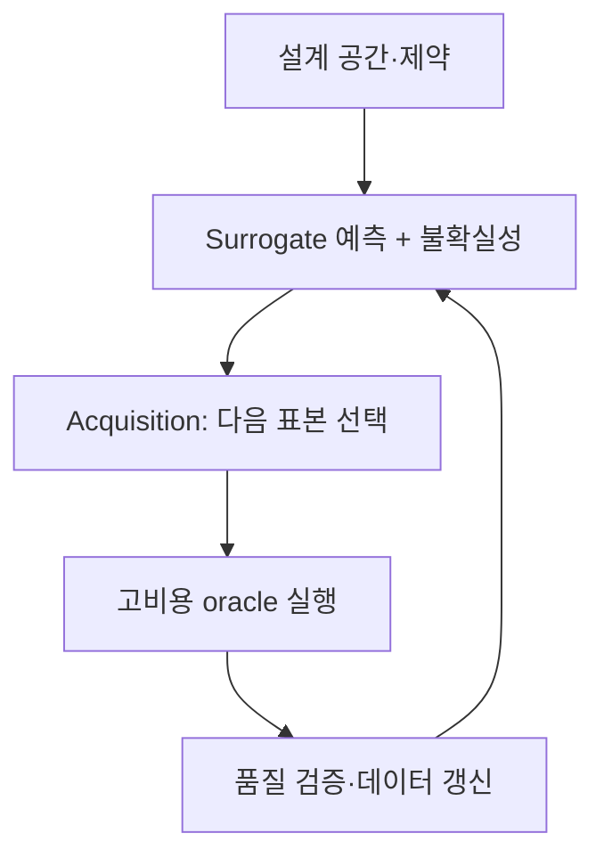

Surrogate model은 고비용 시뮬레이션이나 실험의 입력–출력 관계를 빠르게 근사한다. 제대로 설계하면 탐색, 최적화, 민감도 분석, 실시간 의사결정의 계산 비용을 크게 낮출 수 있다. 그러나 학습 영역 밖에서도 그럴듯한 값을 내놓기 때문에, 평균 오차가 작은 모델이 가장 위험한 모델이 되기도 한다.

핵심은 surrogate를 단순한 회귀기가 아니라 **정의된 유효 영역, 불확실성, 원본 모델로 되돌아가는 규칙을 가진 근사 시스템**으로 보는 것이다.

## 1. 문제: 근사 오차보다 더 위험한 “신뢰 범위의 착각”

고비용 함수 \(f\)와 관측 또는 해석 결과 \(y\)를 다음처럼 생각하자.

\[
y = f(x) + \epsilon
\]

입력 \(x\)에서 \(f(x)\)를 직접 계산하는 비용이 크기 때문에 \(\hat f(x)\)를 학습한다. 전형적인 실패는 다음과 같다.

- 입력 공간을 균일하게 덮지 못한 채 임의의 기존 결과만 학습한다.
- 평균 RMSE만 보고 중요한 극단·경계·전이 영역의 실패를 놓친다.
- 보간 성능을 확인하고 외삽에도 사용할 수 있다고 가정한다.
- 모델의 예측 분산을 전체 불확실성으로 오해한다.
- 최적화기가 surrogate의 작은 오류를 파고들어 비현실적인 최적점을 찾는다.
- active learning이 같은 좁은 영역만 반복 채집한다.
- 원본 시뮬레이터의 수치 실패·비수렴을 정상값처럼 처리한다.

특히 surrogate 기반 최적화는 “평균적으로 정확한가?”보다 “최적화기가 방문하는 영역에서 보수적으로 정확한가?”가 중요하다.

### 서로 다른 불확실성을 한 숫자로 합치면 안 된다

다음은 원인이 다르다.

- **aleatoric uncertainty**: 반복해도 달라지는 측정·환경 변동
- **epistemic uncertainty**: 데이터가 부족해 함수 형태를 모르는 정도
- **parameter uncertainty**: 원본 모델 파라미터 추정의 불확실성
- **numerical uncertainty**: 격자·시간 간격·수렴 오차
- **model discrepancy**: 원본 모델 자체와 현실의 체계적 차이

surrogate가 원본 시뮬레이터를 정확히 복제해도 원본과 현실 사이의 discrepancy는 줄어들지 않는다.

## 2. Mental model: 근사기, 경계 감시자, 원본 oracle의 폐루프

Surrogate 시스템은 세 구성요소로 본다.



1. **Oracle**: 고충실도 시뮬레이션 또는 실험
2. **Surrogate**: 입력에서 출력과 불확실성을 빠르게 예측
3. **Acquisition policy**: 다음 oracle 호출이 가장 가치 있는 지점을 선택

여기에 반드시 네 번째 요소가 필요하다. 바로 **domain guard**다. 입력이 훈련 지원 영역을 벗어나거나 불확실성이 높으면 surrogate의 단독 결정을 거부하고 oracle 또는 사람에게 보낸다.

### 설계 공간은 직사각형 범위가 아니라 실행 가능한 다양체일 수 있다

각 변수의 최소·최대만 나열하면 물리적으로 불가능한 조합이 포함될 수 있다.

\[
\mathcal{X}_{valid}
=\{x\in\mathbb{R}^d:\; l\le x\le u,\; g_j(x)\le0,\; h_k(x)=0\}
\]

- \(l,u\): 변수 범위
- \(g_j\): 부등식 제약
- \(h_k\): 등식·보존 제약

학습 표본과 최적화 후보는 \(\mathcal{X}_{valid}\) 안에서 생성해야 한다. 가능하면 무차원 수, 보존량, 대칭성처럼 문제 구조를 반영한 좌표를 사용한다. 이는 차원을 줄이고 다른 규모로의 일반화를 돕는다.

### Active learning은 “불확실한 점”이 아니라 “정보 가치가 큰 점”을 고른다

후보 \(x\)의 acquisition score를 일반적으로 다음처럼 쓸 수 있다.

\[
a(x)=
\alpha\,U(x)
+\beta\,V(x)
+\gamma\,R(x)
-\eta\,C(x)
\]

- \(U(x)\): epistemic uncertainty
- \(V(x)\): 목적함수 개선 가능성 또는 의사결정 가치
- \(R(x)\): 아직 덜 탐색한 영역의 대표성
- \(C(x)\): 실험·해석 비용과 실패 위험

계수는 단계에 따라 바뀔 수 있다. 초기에는 공간을 넓게 덮고, 후반에는 의사결정 경계나 최적점 주변을 정밀하게 탐색한다.

## 3. 실전 workflow

### Step 1. Surrogate의 용도와 허용 오차를 먼저 정의한다

같은 원본 함수라도 용도에 따라 필요한 모델이 다르다.

| 용도 | 중요한 성능 |
|---|---|
| 빠른 시각화 | 전체 영역의 부드러운 근사, 짧은 지연 |
| 최적화 | 최적점 근처 순위·제약 정확도, 보수성 |
| 민감도 분석 | 전역 추세와 상호작용 보존 |
| 제어·의사결정 | 국소 오차, 안정성, 고정된 최악 지연 |
| 불확실성 전파 | 분포의 꼬리와 예측 구간 품질 |

처음에 다음을 문서화한다.

- 입력·출력·단위·허용 범위
- 실행 가능 제약과 금지 영역
- 원본 실행 비용과 병렬 가능성
- 출력별 허용 절대·상대 오차
- 중요한 경계·극단·전이 구간
- surrogate가 거부해야 하는 조건
- 최종 의사결정에서 oracle 재검증이 필요한 조건

### Step 2. 원본 oracle의 품질부터 확인한다

Surrogate는 oracle의 오류까지 학습한다. 데이터 생성 전에 다음을 확인한다.

- 입력이 같을 때 결정론적 결과가 재현되는가?
- 난수·초기조건·솔버 버전이 기록되는가?
- 수렴 실패와 물리적 결과를 구분하는 상태 코드가 있는가?
- 격자·시간 간격 독립성 또는 수치 오차 추정이 있는가?
- 출력 후처리가 버전 관리되는가?
- 실패한 실행도 원인과 함께 보존되는가?

수치 실패를 결측으로 지워 버리면 실패 경계가 보이지 않는다. 성공 여부를 별도 분류 문제로 모델링하거나, acquisition에서 실패 확률을 제약으로 사용할 수 있다.

### Step 3. 초기 DoE로 실행 가능 영역을 덮는다

초기 표본은 모델이 active learning을 시작할 최소 지도를 제공한다.

연속형 저·중차원에서는 space-filling 설계가 유용하다.

- Latin hypercube
- 저불일치 수열
- maximin distance 설계
- 제약을 만족하는 층화 표본

범주·조건 변수가 있다면 각 중요한 조합이 포함되도록 계층화한다. 경계 조건과 알려진 전이 구간은 별도 표본을 둔다.

고차원에서는 공간 채우기가 급격히 어려워진다. 이때는 다음을 먼저 고려한다.

- 물리 기반 차원 축소·무차원화
- 민감도 screening
- 희소 상호작용 가정
- 구조화된 출력의 저차원 표현
- 필요 영역을 좁히는 운영 제약

초기 DoE를 만들기 전에 전체 데이터로 민감도 분석을 했다는 이유로 test 영역 정보를 쓰면 선택 편향이 생긴다. 설계와 검증 데이터를 분리한다.

### Step 4. 출력 구조에 맞는 모델 계열을 비교한다

모델 선택 기준은 데이터 크기, 차원, 매끄러움, 불연속, 출력 구조, 불확실성 요구다.

- 작은 데이터·매끄러운 함수: 국소적이고 확률적인 모델이 강한 경우가 많다.
- 표 형식·혼합 변수·불연속: 트리 기반 모델이 견고할 수 있다.
- 큰 데이터·고차원·다중 출력: 신경망 계열이 확장성에서 유리할 수 있다.
- 공간장·시계열 출력: basis/POD/autoencoder 등으로 출력을 압축한 뒤 latent coefficient를 예측하거나, 연산자 학습을 고려할 수 있다.
- 알려진 물리 제약: 손실·아키텍처·후처리에 보존법칙과 경계조건을 넣을 수 있다.

단, 물리 제약을 넣었다고 자동으로 외삽이 안전해지는 것은 아니다. 잘못된 제약이나 스케일링은 오히려 체계적 bias를 만든다.

### Step 5. 불확실성을 분리해서 추정한다

예측을 다음처럼 표현할 수 있다.

\[
y\mid x,\mathcal D
\sim
\text{PredictiveDistribution}
\left(\mu(x),\; \sigma^2_{alea}(x)+\sigma^2_{epi}(x)\right)
\]

실전 방법에는 다음이 있다.

- 확률적 과정 기반 posterior
- bootstrap/ensemble 분산
- 이분산 likelihood로 aleatoric 분산 예측
- conformal prediction으로 유한표본 coverage 보정
- quantile regression으로 조건부 분위수 예측

ensemble 구성원이 같은 데이터와 편향을 공유하면 분산이 낮아도 모두 함께 틀릴 수 있다. 불확실성은 단순한 모델 분산이 아니라 **별도 검증 대상**이다.

평가 항목:

- prediction interval coverage
- 구간 폭과 sharpness
- 오류와 불확실성의 상관
- 높은 불확실성 표본의 실제 오류
- 영역·출력 수준별 조건부 coverage
- 외삽에서의 불확실성 증가 여부

### Step 6. Active learning loop를 batch·실패·비용까지 포함해 설계한다

```python
dataset = initial_design()

while budget.remaining() > 0:
    surrogate = fit_surrogate(dataset)
    candidates = sample_feasible_candidates()

    mean, uncertainty = surrogate.predict(candidates)
    failure_risk = failure_model.predict(candidates)
    score = acquisition(mean, uncertainty, candidates, failure_risk)

    batch = select_diverse_batch(score, candidates, budget)
    results = run_oracle(batch)
    dataset = validate_and_append(dataset, results)

    if stopping_rule(dataset, surrogate):
        break
```

여러 실행을 병렬로 보낼 때 상위 acquisition 점수만 고르면 서로 가까운 점이 중복될 수 있다. batch 내부 거리, 예상 정보 중복, 범주 균형을 고려한다.

Oracle 실패가 비싼 경우에는 성공 확률을 곱하거나 제약한다.

\[
a_{safe}(x)=a(x)\,P(\text{success}\mid x)
\]

단, 실패 경계 자체가 중요한 지식이라면 이를 무조건 회피하지 않고 제한된 예산으로 탐색한다.

### Step 7. 검증 데이터를 목적별로 분리한다

무작위 holdout 하나로는 부족하다.

1. **Interpolation set**: 학습 영역 내부의 보간 성능
2. **Boundary set**: 변수·제약 경계와 전이 구간
3. **Decision set**: 최적화·제어가 실제 방문할 영역
4. **Stress set**: 드물지만 중요한 극단 조합
5. **Out-of-domain set**: 의도적으로 지원하지 않는 영역에서 거부 동작

출력별 MAE/RMSE만 아니라 다음을 본다.

- 상대 오차와 scale별 오차
- 최대·상위 분위 오차
- 기울기·순위·단조성
- 보존식 residual
- 제약 위반률
- 최적점 regret
- 예측 구간 coverage
- inference latency

최적화 용도라면 surrogate가 제안한 후보를 oracle로 다시 평가하고 regret를 측정한다.

\[
\mathrm{regret}=f(x_{suggested})-f(x_{best\;known})
\]

최소화 문제 기준이며, 제약 위반은 별도 페널티나 불가능 판정으로 처리한다.

### Step 8. Domain guard와 fallback을 모델의 일부로 배포한다

다음 신호를 결합할 수 있다.

- 입력 범위·제약 위반
- 훈련 집합까지의 거리
- 국소 데이터 밀도
- ensemble disagreement
- 예측 구간 폭
- OOD 분류 점수
- 알려진 실패·불연속 영역

```python
def guarded_predict(x):
    if not satisfies_hard_constraints(x):
        return Reject("invalid input")

    prediction, uncertainty = surrogate.predict(x)
    domain_score = support_estimator.score(x)

    if domain_score < MIN_SUPPORT or uncertainty > MAX_UNCERTAINTY:
        return Defer("oracle or expert review")

    return Accept(prediction, uncertainty)
```

threshold는 별도 validation에서 정하고, 거부율과 잔여 표본의 오차를 함께 평가한다. 거부를 많이 하면 정확도는 쉽게 좋아지므로 coverage–risk 곡선으로 본다.

### Step 9. 중단 기준과 갱신 조건을 사전에 정한다

Active learning은 예산이 끝날 때까지 무조건 돌리는 것이 아니다. 가능한 중단 기준:

- 독립 validation 오차가 허용치 이하
- 중요한 영역의 최대 오차가 허용치 이하
- 불확실성 감소가 여러 회 반복해 미미함
- 추가 표본의 기대 의사결정 가치가 비용보다 작음
- 최적 후보가 반복 실행에서 안정적
- 전체 예산 소진

배포 후 새 oracle 결과가 쌓이면 재학습하되, 데이터 버전과 acquisition policy를 함께 기록한다. 능동적으로 선택된 표본은 원래 운영 분포와 다르므로 단순 평균 성능 계산에 그대로 쓰지 않는다.

## 4. 평가·검증 checklist

### 문제와 도메인

- [ ] surrogate의 용도와 허용 오차가 명시되었다.
- [ ] 입력 단위, 범위, 등식·부등식 제약이 버전 관리된다.
- [ ] 중요한 경계·전이·극단 영역을 별도로 정의했다.
- [ ] 지원하지 않는 OOD 영역과 거부 규칙이 있다.

### Oracle과 데이터

- [ ] 원본 실행의 버전, 설정, 난수, 수렴 상태를 기록한다.
- [ ] 수치 불확실성과 측정 변동을 구분했다.
- [ ] 실패한 실행을 삭제하지 않고 원인을 보존했다.
- [ ] 초기 DoE가 실행 가능 영역과 중요한 범주를 덮는다.
- [ ] active learning 표본의 선택 확률·이유를 추적한다.

### 모델과 불확실성

- [ ] 단순 회귀·보간 베이스라인과 비교했다.
- [ ] 출력 구조와 물리 제약을 모델 선택에 반영했다.
- [ ] epistemic·aleatoric·numerical·discrepancy를 혼동하지 않는다.
- [ ] 불확실성의 coverage, 폭, 오류 상관을 검증했다.
- [ ] ensemble 분산만으로 안전성을 주장하지 않는다.

### 평가와 운영

- [ ] interpolation, boundary, decision, stress set을 구분했다.
- [ ] 평균뿐 아니라 최대·꼬리 오차를 확인했다.
- [ ] 최적화 후보를 oracle로 재검증했다.
- [ ] domain guard의 coverage–risk 교환관계를 평가했다.
- [ ] oracle fallback의 비용과 지연을 포함했다.
- [ ] active learning 중단 기준을 사전에 정의했다.

## 5. 한계와 주의점

첫째, 데이터가 희소한 고차원 공간에서는 모든 영역을 신뢰성 있게 덮을 수 없다. 구조적 가정, 차원 축소, 지원 영역 제한이 필요하며 외삽 능력을 과장하면 안 된다.

둘째, uncertainty estimator도 모델이다. 분포 이동, 공동 bias, 잘못된 likelihood에서는 확신 있게 틀릴 수 있다. 독립 스트레스 테스트와 거부 정책이 필요하다.

셋째, active learning은 acquisition 함수가 중요하다고 정의한 영역만 더 잘 알게 된다. 다른 미래 용도로 재사용할 가능성이 있다면 탐색 다양성과 별도 space-filling budget을 남겨 둔다.

넷째, 다중 충실도 모델은 저비용 데이터를 많이 쓸 수 있지만 저·고충실도 사이의 상관이 약하거나 편향이 상태에 따라 바뀌면 오히려 해로울 수 있다. 충실도 간 discrepancy를 명시적으로 검증해야 한다.

마지막으로, surrogate의 정확도는 현실 정확도의 상한이 아니다. surrogate–oracle 오차, oracle–현실 discrepancy, 입력 불확실성이 연쇄적으로 누적된다. 최종 의사결정에서는 이 전체 오차 사슬을 분리해 보고해야 한다.
