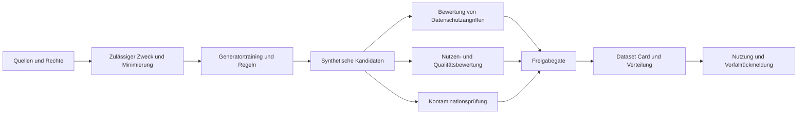



Synthetische Daten sind weder automatisch anonym noch automatisch korrekt. Ein generatives Modell kann Quelldatensätze memorieren, falsche Korrelationen verstärken oder Beispiele erzeugen, die dem Evaluationssatz ähneln.

## 1. Das Problem: „synthetisch“ ist keine Risikoklasse

Synthetische Daten entstehen auf unterschiedliche Weise.

- Daten aus Regeln und Simulatoren
- tabellarische Stichproben statistischer Modelle
- durch Transformation realer Datensätze erzeugte Daten
- Texte, Bilder und Audio generativer Modelle
- Daten zur Ergänzung seltener Ereignisse
- Daten mit angewandtem Datenschutzmechanismus

Das Risiko hängt von Erzeugungsmethode und Quellabhängigkeit ab: Reproduktion personenbezogener Informationen, Membership- und Attributinferenz, memorierte geschützte Inhalte, Verzerrung von Minderheiten, unrealistische Kombinationen, Label-Leakage, Train-Test-Kontamination und Modellkollaps durch wiederholte Resynthese. Allein die Abwesenheit realer Datensätze erlaubt daher keine freie Weitergabe.

## 2. Mentales Modell: Lieferkette abgeleiteter Daten



Auch synthetische Daten sind abgeleitete Artefakte mit Lineage zur Quelle. Es muss feststehen, wie Quellenlöschung, Widerruf einer Einwilligung und Richtlinienänderungen auf abgeleitete Datensätze wirken.

## 3. Zweckvertrag

Beabsichtigte und verbotene Nutzungen werden vor der Erzeugung festgelegt.

```yaml
purpose: "모델 개발 초기 기능 시험"
source_population: "정의된 범위"
allowed_uses:
  - "pipeline test"
  - "알려진 class imbalance 완화 실험"
prohibited_uses:
  - "개인 수준 판단"
  - "원본 population의 공식 통계 추정"
quality_targets:
  utility: "downstream task 기준"
  privacy: "공격 평가와 정책 기준"
retention: "버전·만료·삭제 규칙"
```

Mockdaten für die Entwicklung und synthetische Daten zur öffentlichen Freigabe benötigen unterschiedliche Gates.

## 4. Rechte an Quelldaten und Minimierung

Der Syntheseprozess schafft keine neue Berechtigung zur Nutzung der Quelle. Geprüft werden Vereinbarkeit von Erhebungs- und Erzeugungszweck, Einwilligungen und Verträge, Lizenzen und Urheberrecht, regionale und branchenspezifische Vorschriften, Bedarf sensibler Attribute, Aufbewahrungs- und Löschpflichten sowie die Zulässigkeit einer Übertragung an externe Generator-APIs.

Nur erforderliche Spalten und Populationen werden verwendet. Direkte Identifikatoren werden vor dem Training entfernt, doch das allein ist keine Datenschutzgarantie. Zugriff auf Quellsnapshots wird kontrolliert und für jeden Generatorlauf eine unveränderliche Quellversion erfasst.

## 5. Datenschutz mit Angriffsmodellen bewerten

Die Datenschutzfrage reicht über das Vorhandensein von Namen hinaus.

### Exakte und nahezu identische Duplikate

Geprüft wird, ob synthetische Datensätze mit Quellen identisch oder ihnen übermäßig ähnlich sind.

- exakte Zeilenübereinstimmung
- Übereinstimmung von Schlüsselfeldkombinationen
- Text-n-Gramm-Überlappung
- perzeptuelle Bildähnlichkeit
- Abstand zum nächsten Nachbarn im Embeddingraum

Abstandsgrenzen richten sich nach Datentyp und Populationsdichte.

### Membership-Inferenz

Angriffsexperimente prüfen, ob sich die Teilnahme eines bestimmten Datensatzes am Generatortraining erschließen lässt.

### Attributinferenz

Es wird geprüft, ob nicht sensible Felder zusammen mit dem synthetischen Datensatz sensible Attribute vorhersagbar machen.

### Verknüpfungsangriffe

Die Evaluation untersucht, ob öffentliche externe Informationen einzelne Personen oder kleine Gruppen verknüpfbar machen. Angriffserfolgsraten werden relativ zu realistischem Angreiferwissen und einer Baseline berichtet.

## 6. Differential Privacy richtig verstehen

Differential Privacy begrenzt formal den Unterschied zwischen Ausgabeverteilungen benachbarter Datensätze. Eine intuitive Definition lautet:

$$
\Pr[M(D)\in S]\le e^\epsilon\Pr[M(D')\in S]+\delta
$$

wobei \(D,D'\) benachbarte Datensätze sind, die sich nur durch die Einbeziehung einer Person unterscheiden.

- DP garantiert Eigenschaften des angewandten Mechanismus innerhalb eines Bedrohungsmodells.
- Ein kleineres \(\epsilon\) bedeutet gewöhnlich stärkeren Datenschutz, aber geringeren Nutzen.
- Mehrere Veröffentlichungen setzen ihre Datenschutzbudgets zusammen.
- Nutzen Vorverarbeitung und Hyperparametersuche private Daten, gehören sie in die Abrechnung.
- Ein DP-Generator garantiert weder Fairness noch Richtigkeit der nachgelagerten Nutzung.

Dataset Cards dokumentieren Datenschutzparameter, Accountant, Sampling und Clipping.

## 7. Statistische Fidelity und Nutzen trennen

Ähnlichkeit zur Quellverteilung garantiert keinen Nutzen für reale Aufgaben.

Statistische Vergleiche umfassen Rand-, Paar- und bedingte Verteilungen, Kategorienhäufigkeiten, Fehlwertmuster, Tails und seltene Untergruppen sowie zeitliche Autokorrelation.

Nutzenvergleiche umfassen Train-synthetic/Test-real, Train-real/Test-real als Baseline, Train-real-plus-synthetic/Test-real, Kalibrierung und Untergruppenleistung sowie Kurven der Stichprobeneffizienz. Niedrige TSTR-Leistung zeigt den Verlust aufgabenrelevanter Beziehungen; hohe Leistung beweist keine Datenschutzsicherheit.

## 8. Plausibilität und Randbedingungen

Statistisch plausible Daten können Domänenregeln verletzen: Wertebereiche und Einheiten, Zeitordnung, Teil- und Gesamtsummen, gegenseitig ausschließende Kategorien, physikalische Erhaltung, Fremdschlüssel oder zulässige Zustandsübergänge.

```python
def validate_record(row):
    errors = []
    if row["start_time"] > row["end_time"]:
        errors.append("invalid-time-order")
    if row["amount"] < 0:
        errors.append("negative-amount")
    return errors
```

Die Ablehnungsrate durch Randbedingungen ist selbst eine Qualitätsmetrik. Da nachträgliche Reparaturen die erzeugte Verteilung verändern, wird vor und nach ihnen evaluiert.

## 9. Kontamination und Leakage

Verwendet die Erzeugung Informationen aus dem Evaluationssatz, ist die Evaluation kontaminiert. Verboten sind Generatortraining vor dem Split, Testbeispiele im Erzeugungsprompt, richtige Labels oder Zukunftswerte als Bedingung, paraphrasierte Benchmarkfragen in Trainingsdaten und direkte Übernahme von Modellevaluationen als synthetische Labels.

Sichere Reihenfolge:

1. Quelle nach Entität, Zeit und Herkunft teilen.
2. Generator nur auf dem Trainingssplit fitten.
3. Synthetische Daten ausschließlich der Trainingspartition hinzufügen.
4. Validierungs- und Testdaten als unabhängige reale Daten erhalten.
5. Splitübergreifend auf Near-Duplicates prüfen.

Kontamination öffentlicher Benchmarks lässt sich womöglich nie vollständig widerlegen. Quellen und Erzeugungsprompts werden erhalten und Verdachtsfälle berichtet.

## 10. Praktischer Freigabeablauf

### Schritt 1. Quellenfreigabe

Datenverantwortung, Zweck, Rechtsgrundlage und Aufbewahrungszeit bestätigen.

### Schritt 2. Generatorprotokoll fixieren

- Code- und Modellversion
- Zufallsseed
- Quellsnapshot
- Vorverarbeitung
- Hyperparameter
- Datenschutzmechanismus

### Schritt 3. Isolierte Erzeugung

Zugriffsrechte auf Rohquelle und Ausgabe werden getrennt.

### Schritt 4. Dreiteilige Evaluation

- Suite für Datenschutzangriffe
- Statistik- und Randbedingungssuite
- Suite für nachgelagerten Nutzen

### Schritt 5. Menschliche Prüfung

Stichproben nächster Nachbarn, seltener Untergruppen und unsicherer Inhalte prüfen.

### Schritt 6. Freigabegate

Nur unveränderliche Versionen verteilen, die alle Kriterien erfüllen.

### Schritt 7. Dataset Card und Monitoring

Randbedingungen, bekannte Grenzen, verbotene Nutzungen und Ablaufdatum bereitstellen.

## 11. Qualität synthetischer Labels

Erzeugt ein LLM oder vorhandenes Modell Labels, wird der Bias des Lehrermodells reproduziert. Gegenmaßnahmen sind eine menschlich geprüfte Goldmenge, Uneinigkeit mehrerer Lehrermodelle oder Regeln, Konfidenzkalibrierung, Abstention, menschliche Eskalation schwieriger Fälle und ein Kennzeichen synthetischer Labels.

Selbst wenn das Schülermodell das Lehrermodell scheinbar übertrifft, kann dieselbe Bewertungsinstanz Zirkularität erzeugen. Benötigt werden unabhängige Ground Truth und Evaluierende.

## 12. Evaluationscheckliste

- [ ] Beabsichtigte und verbotene Nutzungen sind definiert.
- [ ] Quellnutzungsrechte und externe Übertragungsbedingungen wurden geprüft.
- [ ] Lineage von Quelle, Generator und Ausgabe ist verbunden.
- [ ] Exakte und nahezu identische Duplikate wurden geprüft.
- [ ] Membership-, Attribut- und Verknüpfungsangriffe wurden betrachtet.
- [ ] Bei DP wurden Budget und Accountant dokumentiert.
- [ ] Neben Randverteilungen wurden bedingte Verteilungen und Tails verglichen.
- [ ] TSTR und weitere Maße wurden an der tatsächlichen Zielaufgabe bewertet.
- [ ] Verletzungsrate von Domänenregeln wurde gemessen.
- [ ] Der Generator wurde nur auf dem Trainingssplit gefittet.
- [ ] Near-Duplicates zu Tests und Benchmarks wurden geprüft.
- [ ] Nutzen und Datenschutz sind je Untergruppe getrennt bewertet.
- [ ] Dataset-Card-, Ablauf- und Löschverfahren existieren.
- [ ] Der synthetische Status wird nachgelagerten Nutzern mitgeteilt.

## 13. Häufige Fehler und Grenzen

### Sicherheit aus ähnlichen Quell- und synthetischen Verteilungen ableiten

Hohe Fidelity kann gemeinsam mit Memorierungsrisiko steigen. Nutzen und Datenschutz werden auf getrennten Achsen bewertet.

### Entfernung direkter Identifikatoren als Anonymisierung bezeichnen

Seltene Kombinationen und externe Informationen können Reidentifikation ermöglichen. Angriffsevaluation und Risikobewertung bleiben erforderlich.

### Synthetische Daten unbegrenzt wiederverwenden

Veraltete Erzeugungsverteilungen und wiederholtes Training können Bias anhäufen. Herkunftsanteile und Validierung mit realen Daten müssen erhalten bleiben.

### Auch den Testsatz durch synthetische Daten ersetzen

Dann fehlen reale Fehler, die der Generator nicht erhalten hat. Die endgültige Evaluation benötigt unabhängige Evidenz aus der Realität.

Keine endliche Evaluation kann jeden Datenschutzangriff und Missbrauch ausschließen. Freigabeumfang und Nutzungsrechte sind risikogerecht zu begrenzen; eine Vorfallreaktion muss vorbereitet sein.

## 14. Offizielle Referenzen

- [NIST Privacy Framework](https://www.nist.gov/privacy-framework)
- [NIST Differential Privacy Guidelines](https://csrc.nist.gov/pubs/sp/800/226/final)
- [NIST AI Risk Management Framework](https://www.nist.gov/itl/ai-risk-management-framework)
- [OECD Synthetic Data report](https://www.oecd.org/en/publications/emerging-privacy-enhancing-technologies_51f6b143-en.html)
- [Original Datasheets for Datasets paper](https://arxiv.org/abs/1803.09010)

## 15. Fazit

Synthetische Daten sind ein nützliches abgeleitetes Artefakt, keine Ausnahme von Datenschutzpflichten. Quellrechte, angriffsbasierter Datenschutz, realer Nutzen, Kontamination und Provenienz müssen als unabhängige Gates behandelt werden, damit ein sicheres und reproduzierbares Datenprodukt entsteht.
