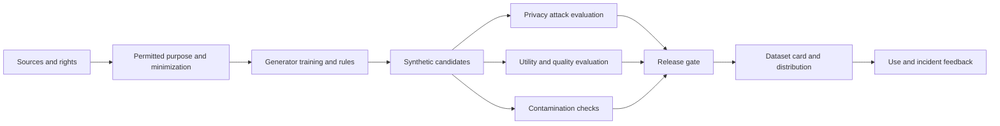



Synthetic data is neither automatically anonymous nor automatically accurate.
A generative model can memorize source records, amplify incorrect correlations, or produce samples that resemble the evaluation set.

## 1. The Problem: “Synthetic” Is Not a Risk Classification

Synthetic data comes in different forms.

- Data generated from rules and simulators
- Tabular data sampled from statistical models
- Data created by transforming actual records
- Text, images, and audio made with generative models
- Data augmenting rare events
- Data to which a privacy mechanism has been applied

Risk varies with the generation method and dependence on source data.

- Reproduction of personal information from the source
- Membership inference
- Sensitive-attribute inference
- Memorization of copyrighted or confidential expression
- Distortion of minority groups
- Unrealistic combinations
- Label leakage
- Train/test contamination
- Model collapse caused by resynthesizing synthetic data

Therefore, avoid concluding that synthetic data can be freely shared merely because it is not real data.

## 2. Mental Model: A Derived-Data Supply Chain



Synthetic data is also a derived artifact with lineage to its source.
Define how source deletion, consent withdrawal, and policy changes affect derived datasets.

## 3. Purpose Contract

Write down the intended and prohibited uses before generation.

```yaml
purpose: "모델 개발 초기 기능 시험"
source_population: "정의된 범위"
allowed_uses:
  - "pipeline test"
  - "알려진 class imbalance 완화 실험"
prohibited_uses:
  - "개인 수준 판단"
  - "원본 population의 공식 통계 추정"
quality_targets:
  utility: "downstream task 기준"
  privacy: "공격 평가와 정책 기준"
retention: "버전·만료·삭제 규칙"
```

Mock data for development and synthetic data for public release should have different gates.

## 4. Source-Data Rights and Minimization

The synthesis process does not create new permission to use the source data.

Review the following.

- Compatibility of the collection purpose and generation purpose
- Consent and contracts
- Licenses and copyright
- Regional and industry regulations
- Need for sensitive attributes
- Retention and deletion obligations
- Whether data may be sent to an external generator API

Use only the required columns and population.
Remove direct identifiers before training, but do not regard removal alone as a privacy guarantee.

Control access to source snapshots and record an immutable source version for each generator run.

## 5. Evaluate Privacy with Attack Models

The privacy question is broader than “Are names present?”

### Exact and near duplicates

Check whether a synthetic record is identical or excessively close to a source record.

- Exact row matches
- Key-field combination matches
- Text n-gram overlap
- Image perceptual similarity
- Embedding nearest-neighbor distance

Set distance thresholds according to the data type and population density.

### Membership inference

Run attack experiments to determine whether an attacker can infer that a particular record was included in generator training.

### Attribute inference

Check whether sensitive attributes can be predicted using nonsensitive fields and the synthetic dataset.

### Linkage attacks

Evaluate whether external public information can be combined with the data to link an individual or small group.

Report attack success rates relative to realistic attacker knowledge and a baseline.

## 6. Understand Differential Privacy Correctly

Differential privacy is a formal framework that limits differences between output distributions for adjacent datasets.

An intuitive definition is

$$
\Pr[M(D)\in S]\le e^\epsilon\Pr[M(D')\in S]+\delta
$$

where (D,D') are adjacent datasets that differ only in whether one individual is included.

Cautions:

- DP is a guarantee about the applied mechanism and threat model.
- A smaller \(\epsilon\) generally means stronger privacy, but it trades off against utility.
- Multiple releases compose their privacy budgets.
- If preprocessing and hyperparameter tuning use private data, they must be included in the accounting.
- Even a DP generator does not guarantee the fairness or accuracy of downstream use.

Record privacy parameters, the accountant, sampling, and clipping settings in the dataset card.

## 7. Separate Statistical Fidelity from Utility

Synthetic data that appears similar to the source distribution is not necessarily useful for a real task.

Statistical comparisons:

- Marginal distributions
- Pairwise correlations
- Conditional distributions
- Category frequencies
- Missingness patterns
- Tails and rare subgroups
- Temporal autocorrelation

Utility comparisons:

- Train-synthetic, test-real
- Train-real, test-real baseline
- Train-real-plus-synthetic, test-real
- Calibration and subgroup performance
- Sample-efficiency curves

Low TSTR performance means the synthetic data failed to preserve task-relevant relationships.
High performance does not prove privacy safety.

## 8. Plausibility and Constraints

Data can violate domain constraints even if it is statistically plausible.

Example constraints:

- Ranges and units
- Time ordering
- Subtotals and totals
- Mutually exclusive categories
- Physical conservation
- Relational foreign keys
- Impossible state transitions

```python
def validate_record(row):
    errors = []
    if row["start_time"] > row["end_time"]:
        errors.append("invalid-time-order")
    if row["amount"] < 0:
        errors.append("negative-amount")
    return errors
```

The constraint rejection rate is itself a generator-quality metric.
Because repairing every violation through postprocessing changes the generated distribution, evaluate it both before and after.

## 9. Contamination and Leakage

If synthetic data is generated using information from the evaluation set, the evaluation is contaminated.

Prohibited patterns:

- Training the generator on the entire dataset before splitting
- Putting test examples into a prompt to generate transformations
- Exposing the correct label or a future value as a generation condition
- Paraphrasing benchmark questions and adding them to training
- Using model-evaluation results directly as synthetic labels

Safe order:

1. Split the source by entity, time, and source.
2. Fit the generator only on the training split.
3. Add synthetic data only to the training partition.
4. Keep validation and test sets as independent real data.
5. Run near-duplicate checks across splits.

Public-benchmark contamination can be difficult to disprove completely.
Preserve sources and generation prompts, and report suspicious cases.

## 10. Practical Release Workflow

### Step 1. Source approval

Confirm the data owner, purpose, legal basis, and retention period.

### Step 2. Fix the generator protocol

- Code and model version
- Random seed
- Source snapshot
- Preprocessing
- Hyperparameters
- Privacy mechanism

### Step 3. Isolated generation

Separate access permissions for the raw source and output.

### Step 4. Three-part evaluation

- Privacy attack suite
- Statistical and constraint suite
- Downstream utility suite

### Step 5. Human review

Review samples of nearest neighbors, rare subgroups, and unsafe content.

### Step 6. Release gate

Distribute only immutable versions that pass every criterion.

### Step 7. Dataset card and monitoring

Provide constraints, known limitations, prohibited uses, and an expiration date.

## 11. Quality of Synthetic Labels

When an LLM or existing model creates labels, teacher bias is replicated.

Management methods:

- A human-reviewed gold subset
- Disagreement among multiple teachers or rules
- Confidence calibration
- An abstention option
- Human escalation for difficult cases
- A flag indicating synthetic labels

Even when the student appears to outperform the teacher, evaluation by the same judge may create circularity.
Use independent ground truth and evaluators.

## 12. Evaluation Checklist

- [ ] Are the intended and prohibited uses of the synthetic data defined?
- [ ] Have source-use rights and external-transfer conditions been checked?
- [ ] Are source, generator, and output version lineage connected?
- [ ] Have exact- and near-duplicate checks been performed?
- [ ] Have membership, attribute, and linkage attacks been considered?
- [ ] If DP was used, were the budget and accountant recorded?
- [ ] Were conditional and tail distributions compared in addition to marginals?
- [ ] Were TSTR and other measures evaluated on the actual downstream task?
- [ ] Was the domain-constraint violation rate measured?
- [ ] Was the generator fit only on the training split?
- [ ] Were test and benchmark near duplicates checked?
- [ ] Are subgroup utility and privacy evaluated separately?
- [ ] Are there dataset-card, expiration, and deletion procedures?
- [ ] Is synthetic status communicated to downstream consumers?

## 13. Common Failures and Limitations

### Assuming safety because the source and synthetic distributions are similar

High fidelity can increase alongside the possibility of memorization.
Evaluate utility and privacy on separate axes.

### Calling direct-identifier removal anonymization

Rare combinations and external information can enable reidentification.
Attack evaluation and risk assessment are required.

### Reusing synthetic data without limit

Stale generation distributions and repeated retraining can accumulate bias.
Maintain provenance ratios and validation on real data.

### Replacing even the test set with synthetic data

The evaluation then misses real-world errors that the generator failed to preserve.
Final evaluation must include independent real-world evidence.

No finite evaluation can rule out every privacy attack and downstream misuse.
Restrict release scope and use permissions according to risk, and prepare incident response.

## 14. Official References

- [NIST Privacy Framework](https://www.nist.gov/privacy-framework)
- [NIST Differential Privacy Guidelines](https://csrc.nist.gov/pubs/sp/800/226/final)
- [NIST AI Risk Management Framework](https://www.nist.gov/itl/ai-risk-management-framework)
- [OECD Synthetic Data report](https://www.oecd.org/en/publications/emerging-privacy-enhancing-technologies_51f6b143-en.html)
- [Original Datasheets for Datasets paper](https://arxiv.org/abs/1803.09010)

## 15. Conclusion

Synthetic data is a convenient derived artifact, not an exemption from privacy obligations.
Treat source rights, attack-based privacy, real utility, contamination, and provenance as independent gates to create a safe and reproducible data asset.
