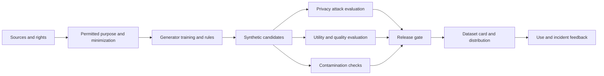



Los datos sintéticos no son automáticamente anónimos ni automáticamente precisos.
Un modelo generativo puede memorizar registros fuente, amplificar correlaciones incorrectas o producir muestras que se asemejen al conjunto de evaluación.

## 1. El problema: “sintético” no es una clasificación de riesgo

Los datos sintéticos se presentan en diferentes formas.

- Datos generados a partir de reglas y simuladores.
- Datos tabulares tomados de modelos estadísticos.
- Datos creados transformando registros reales.
- Texto, imágenes y audio elaborados con modelos generativos.
- Datos que aumentan eventos raros
- Datos a los que se les ha aplicado un mecanismo de privacidad

El riesgo varía según el método de generación y la dependencia de los datos de origen.

- Reproducción de información personal de la fuente
- Inferencia de membresía
- Inferencia de atributos sensibles
- Memorización de expresiones protegidas por derechos de autor o confidenciales.
- Distorsión de los grupos minoritarios
- Combinaciones poco realistas
- Fuga de etiquetas
- Contaminación del tren/prueba
- Colapso del modelo causado por la resintetización de datos sintéticos.

Por lo tanto, evite concluir que los datos sintéticos pueden compartirse libremente simplemente porque no son datos reales.

## 2. Modelo mental: una cadena de suministro de datos derivados



Los datos sintéticos también son un artefacto derivado con linaje hasta su fuente.
Defina cómo la eliminación de la fuente, la retirada del consentimiento y los cambios de políticas afectan a los conjuntos de datos derivados.

## 3. Contrato de Objeto

Anotar los usos previstos y prohibidos antes de la generación.

```yaml
purpose: "모델 개발 초기 기능 시험"
source_population: "정의된 범위"
allowed_uses:
  - "pipeline test"
  - "알려진 class imbalance 완화 실험"
prohibited_uses:
  - "개인 수준 판단"
  - "원본 population의 공식 통계 추정"
quality_targets:
  utility: "downstream task 기준"
  privacy: "공격 평가와 정책 기준"
retention: "버전·만료·삭제 규칙"
```

Los datos simulados para el desarrollo y los datos sintéticos para su divulgación pública deberían tener puertas diferentes.

## 4. Minimización y derechos de datos de origen

El proceso de síntesis no crea nuevos permisos para utilizar los datos de origen.

Revise lo siguiente.

- Compatibilidad de la finalidad de recogida y la finalidad de generación
- Consentimiento y contratos
- Licencias y derechos de autor.
- Regulaciones regionales y de la industria.
- Necesidad de atributos sensibles
- Obligaciones de conservación y supresión
- Si los datos se pueden enviar a un generador externo API

Utilice sólo las columnas y la población requeridas.
Elimine los identificadores directos antes de la capacitación, pero no considere la eliminación por sí sola como una garantía de privacidad.

Controle el acceso a las instantáneas de origen y registre una versión de origen inmutable para cada ejecución del generador.

## 5. Evaluar la privacidad con modelos de ataque

La pregunta sobre privacidad es más amplia que "¿Están presentes los nombres?"

### Duplicados exactos y casi

Compruebe si un registro sintético es idéntico o demasiado cercano a un registro fuente.

- Coincidencias exactas de filas
- Coincidencias de combinación de campos clave
- Superposición de n-gramas de texto
- Similitud perceptiva de la imagen.
- Incrustar la distancia del vecino más cercano

Establezca umbrales de distancia según el tipo de datos y la densidad de población.

### Inferencia de membresía

Ejecute experimentos de ataque para determinar si un atacante puede inferir que un registro en particular se incluyó en el entrenamiento del generador.

### Inferencia de atributos

Compruebe si los atributos confidenciales se pueden predecir utilizando campos no confidenciales y el conjunto de datos sintéticos.

### Ataques de enlace

Evaluar si la información pública externa se puede combinar con los datos para vincular a un individuo o un grupo pequeño.

Informe las tasas de éxito de los ataques en relación con el conocimiento realista del atacante y una línea de base.

## 6. Comprenda correctamente la privacidad diferencial

La privacidad diferencial es un marco formal que limita las diferencias entre distribuciones de salida para conjuntos de datos adyacentes.

Una definición intuitiva es

$$
\Pr[M(D)\in S]\le e^\epsilon\Pr[M(D')\in S]+\delta
$$

donde (D,D') son conjuntos de datos adyacentes que difieren sólo en si se incluye o no un individuo.

Precauciones:

- DP es una garantía sobre el mecanismo aplicado y el modelo de amenaza.
- Un \(\epsilon\) más pequeño generalmente significa mayor privacidad, pero compensa la utilidad.
- Múltiples lanzamientos componen sus presupuestos de privacidad.
- Si el preprocesamiento y el ajuste de hiperparámetros utilizan datos privados, deben incluirse en la contabilidad.
- Incluso un generador DP no garantiza la equidad o precisión del uso posterior.

Registre los parámetros de privacidad, el contador, el muestreo y la configuración de recorte en la tarjeta del conjunto de datos.

## 7. Separar la fidelidad estadística de la utilidad

Los datos sintéticos que parecen similares a la distribución original no son necesariamente útiles para una tarea real.

Comparaciones estadísticas:

- Distribuciones marginales
- Correlaciones por pares
- Distribuciones condicionales
- Frecuencias de categoría
- Patrones de falta
- Colas y subgrupos raros.
- Temporal autocorrelación

Comparaciones de utilidades:

- Tren sintético, prueba real.
- Línea de base real de entrenamiento y prueba real
- Tren-real-más-sintético, prueba-real
- Calibración y rendimiento de subgrupos.
- Curvas de eficiencia de muestra.

El bajo rendimiento de TSTR significa que los datos sintéticos no lograron preservar las relaciones relevantes para las tareas.
El alto rendimiento no demuestra la seguridad de la privacidad.

## 8. Plausibilidad y limitaciones

Los datos pueden violar las restricciones del dominio incluso si son estadísticamente plausibles.

Restricciones de ejemplo:

- Gamas y unidades.
- Orden de tiempo
- Subtotales y totales
- Categorías mutuamente excluyentes
- Conservación física
- Claves foráneas relacionales
- Transiciones de estado imposibles

```python
def validate_record(row):
    errors = []
    if row["start_time"] > row["end_time"]:
        errors.append("invalid-time-order")
    if row["amount"] < 0:
        errors.append("negative-amount")
    return errors
```

La tasa de rechazo de restricciones es en sí misma una métrica de calidad del generador.
Debido a que reparar cada infracción mediante el posprocesamiento cambia la distribución generada, evalúela tanto antes como después.

## 9. Contaminación y fugas

Si se generan datos sintéticos utilizando información del conjunto de evaluación, la evaluación está contaminada.

Patrones prohibidos:

- Entrenar al generador en todo el conjunto de datos antes de dividirlo.
- Poner ejemplos de prueba en un prompt para generar transformaciones
- Exponer la etiqueta correcta o un valor futuro como condición de generación
- Parafrasear preguntas de referencia y agregarlas a la capacitación
- Utilizar los resultados de la evaluación del modelo directamente como etiquetas sintéticas.

Orden segura:

1. Divida la fuente por entidad, hora y fuente.
2. Monte el generador únicamente en el split de entrenamiento.
3. Agregue datos sintéticos solo a la partición de entrenamiento.
4. Mantenga los conjuntos de validación y prueba como datos reales independientes.
5. Realice comprobaciones casi duplicadas en todas las divisiones.

La contaminación de referencia pública puede ser difícil de refutar por completo.
Conserve las fuentes y los mensajes de generación, e informe de casos sospechosos.

## 10. Flujo de trabajo de lanzamiento práctico

### Paso 1. Aprobación de fuente

Confirmar el titular de los datos, finalidad, base legal y plazo de conservación.

### Paso 2. Arreglar el protocolo del generador

- Código y versión del modelo.
- Semilla aleatoria
- Instantánea de origen
- Preprocesamiento
- Hiperparámetros
- Mecanismo de privacidad

### Paso 3. Generación aislada

Permisos de acceso separados para la fuente sin procesar y la salida.

### Paso 4. Evaluación en tres partes

- Conjunto de ataques a la privacidad
- Suite estadística y de restricciones.
- Conjunto de servicios públicos aguas abajo

### Paso 5. Revisión humana

Revise muestras de vecinos más cercanos, subgrupos raros y contenido inseguro.

### Paso 6. Liberar puerta

Distribuya solo versiones inmutables que cumplan todos los criterios.

### Paso 7. Tarjeta de conjunto de datos y seguimiento

Proporcione restricciones, limitaciones conocidas, usos prohibidos y una fecha de vencimiento.

## 11. Calidad de las etiquetas sintéticas

Cuando un LLM o un modelo existente crea etiquetas, el sesgo de los docentes se replica.

Métodos de gestión:

- Un subconjunto de oro revisado por humanos.
- Desacuerdo entre varios profesores o reglas
- Calibración de confianza
- Una opción de abstención
- Escalada humana para casos difíciles.
- Una bandera que indica etiquetas sintéticas.

Incluso cuando el estudiante parece superar al maestro, la evaluación realizada por el mismo juez puede crear circularidad.
Utilice evaluadores y datos reales independientes.

## 12. Lista de verificación de evaluación

- [ ] ¿Están definidos los usos previstos y prohibidos de los datos sintéticos?
- [ ] ¿Se han verificado los derechos de uso de la fuente y las condiciones de transferencia externa?
- [] ¿Están conectados el linaje de la versión de fuente, generador y salida?
- [ ] ¿Se han realizado controles exactos y casi duplicados?
- [] ¿Se han considerado ataques de membresía, atributos y vínculos?
- [ ] Si se utilizó DP, ¿se registró el presupuesto y el contador?
- [ ] ¿Se compararon las distribuciones condicional y de cola además de las marginales?
- [ ] ¿Se evaluaron TSTR y otras medidas en la tarea posterior real?
- [] ¿Se midió la tasa de infracción de restricciones de dominio?
- [ ] ¿Se instaló el generador sólo en el tramo de entrenamiento?
- [] ¿Se verificaron las pruebas y los puntos de referencia casi duplicados?
- [ ] ¿Se evalúan por separado la utilidad y la privacidad del subgrupo?
- [ ] ¿Existen procedimientos de eliminación, caducidad y tarjeta de conjunto de datos?
- [ ] ¿Se comunica el estado sintético a los consumidores intermedios?

## 13. Fallas y limitaciones comunes

### Asumiendo seguridad porque las distribuciones fuente y sintética son similares

La alta fidelidad puede aumentar junto con la posibilidad de memorización.
Evalúe la utilidad y la privacidad en ejes separados.

### Llamar a la anonimización de eliminación de identificador directo

Combinaciones raras e información externa pueden permitir la reidentificación.
Se requiere evaluación de ataques y evaluación de riesgos.

### Reutilización de datos sintéticos sin límite

Las distribuciones de generación obsoletas y el reentrenamiento repetido pueden acumular sesgos.
Mantener ratios de procedencia y validación sobre datos reales.

### Reemplazar incluso el conjunto de prueba con datos sintéticos

Luego, la evaluación omite errores del mundo real que el generador no pudo preservar.
La evaluación final debe incluir evidencia independiente del mundo real.

Ninguna evaluación definitiva puede descartar todos los ataques a la privacidad y el uso indebido posterior.
Restrinja el alcance de la publicación y utilice los permisos según el riesgo, y prepare la respuesta a incidentes.

## 14. Referencias oficiales

- [NIST Marco de privacidad](https://www.nist.gov/privacy-framework)
- [NIST Directrices de privacidad diferenciales](https://csrc.nist.gov/pubs/sp/800/226/final)
- [NIST AI Marco de gestión de riesgos](https://www.nist.gov/itl/ai-risk-management-framework)
- [OECD Informe de datos sintéticos](https://www.oecd.org/en/publications/emerging-privacy-enhancing-technologies_51f6b143-en.html)
- [Hojas de datos originales para el documento de conjuntos de datos](https://arxiv.org/abs/1803.09010)

## 15. Conclusión

Los datos sintéticos son un artefacto derivado conveniente, no una exención de las obligaciones de privacidad.
Trate los derechos de origen, la privacidad basada en ataques, la utilidad real, la contaminación y la procedencia como puertas independientes para crear un activo de datos seguro y reproducible.
