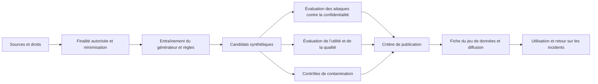



Les données synthétiques ne sont ni automatiquement anonymes ni automatiquement exactes.
Un modèle génératif peut mémoriser des enregistrements sources, amplifier des corrélations erronées ou produire des échantillons qui ressemblent au jeu d’évaluation.

## 1. Le problème : « synthétique » n’est pas une catégorie de risque

Les données synthétiques prennent des formes diverses.

- Données produites par des règles et des simulateurs
- Données tabulaires échantillonnées à partir de modèles statistiques
- Données créées par transformation d’enregistrements réels
- Textes, images et sons produits par des modèles génératifs
- Données qui renforcent la représentation d’événements rares
- Données auxquelles un mécanisme de confidentialité a été appliqué

Le risque varie selon la méthode de génération et la dépendance aux données sources.

- Reproduction d’informations personnelles présentes dans la source
- Inférence d’appartenance
- Inférence d’attributs sensibles
- Mémorisation de contenus protégés par le droit d’auteur ou confidentiels
- Déformation de la représentation des groupes minoritaires
- Combinaisons irréalistes
- Fuite de l’étiquette
- Contamination entre entraînement et test
- Effondrement du modèle causé par la resynthèse de données synthétiques

Il ne faut donc pas conclure que des données synthétiques peuvent être librement partagées au seul motif qu’elles ne sont pas réelles.

## 2. Modèle mental : une chaîne d’approvisionnement de données dérivées



Les données synthétiques sont elles aussi des artefacts dérivés dont la filiation remonte à leur source.
Définissez les conséquences d’une suppression à la source, d’un retrait de consentement et d’une évolution des règles sur les jeux de données dérivés.

## 3. Contrat de finalité

Consignez les usages prévus et interdits avant la génération.

```yaml
purpose: "모델 개발 초기 기능 시험"
source_population: "정의된 범위"
allowed_uses:
  - "pipeline test"
  - "알려진 class imbalance 완화 실험"
prohibited_uses:
  - "개인 수준 판단"
  - "원본 population의 공식 통계 추정"
quality_targets:
  utility: "downstream task 기준"
  privacy: "공격 평가와 정책 기준"
retention: "버전·만료·삭제 규칙"
```

Les fausses données destinées au développement et les données synthétiques destinées à une publication ouverte doivent être soumises à des critères différents.

## 4. Droits sur les données sources et minimisation

Le processus de synthèse ne crée aucune nouvelle autorisation d’utiliser les données sources.

Examinez les éléments suivants.

- Compatibilité entre la finalité de collecte et celle de la génération
- Consentement et contrats
- Licences et droit d’auteur
- Réglementations régionales et sectorielles
- Nécessité des attributs sensibles
- Obligations de conservation et de suppression
- Possibilité d’envoyer les données à une API de génération externe

N’utilisez que les colonnes et la population nécessaires.
Supprimez les identifiants directs avant l’entraînement, sans considérer cette seule suppression comme une garantie de confidentialité.

Contrôlez l’accès aux instantanés des sources et consignez une version immuable de la source pour chaque exécution du générateur.

## 5. Évaluer la confidentialité à l’aide de modèles d’attaque

La question de la confidentialité va bien au-delà de « Les noms sont-ils présents ? »

### Doublons exacts et quasi-doublons

Vérifiez si un enregistrement synthétique est identique ou excessivement proche d’un enregistrement source.

- Correspondances exactes de lignes
- Correspondances de combinaisons de champs clés
- Chevauchement de n-grammes textuels
- Similarité perceptuelle des images
- Distance au plus proche voisin dans l’espace des plongements

Fixez les seuils de distance en fonction du type de données et de la densité de la population.

### Inférence d’appartenance

Menez des expériences d’attaque afin de déterminer si un attaquant peut déduire qu’un enregistrement donné a servi à entraîner le générateur.

### Inférence d’attributs

Vérifiez si des attributs sensibles peuvent être prédits à partir de champs non sensibles et du jeu de données synthétique.

### Attaques par recoupement

Évaluez si des informations publiques externes peuvent être combinées aux données pour relier celles-ci à une personne ou à un petit groupe.

Rapportez les taux de réussite des attaques par rapport à un niveau de référence et aux connaissances réalistes d’un attaquant.

## 6. Comprendre correctement la confidentialité différentielle

La confidentialité différentielle est un cadre formel qui limite les différences entre les distributions de sortie pour des jeux de données adjacents.

Une définition intuitive est

$$
\Pr[M(D)\in S]\le e^\epsilon\Pr[M(D')\in S]+\delta
$$

où (D,D') sont des jeux de données adjacents qui ne diffèrent que par la présence d’une personne.

Points de vigilance :

- La confidentialité différentielle garantit les propriétés du mécanisme appliqué dans le cadre du modèle de menace retenu.
- Une valeur d’\(\epsilon\) plus petite indique généralement une confidentialité plus forte, au prix d’une utilité moindre.
- Les budgets de confidentialité de plusieurs publications se composent.
- Si le prétraitement et le réglage des hyperparamètres utilisent des données privées, ils doivent être inclus dans la comptabilisation.
- Même un générateur à confidentialité différentielle ne garantit ni l’équité ni l’exactitude des usages en aval.

Consignez dans la fiche du jeu de données les paramètres de confidentialité, le comptable, l’échantillonnage et les réglages d’écrêtage.

## 7. Distinguer fidélité statistique et utilité

Des données synthétiques qui paraissent proches de la distribution source ne sont pas nécessairement utiles à une tâche réelle.

Comparaisons statistiques :

- Distributions marginales
- Corrélations par paires
- Distributions conditionnelles
- Fréquences des catégories
- Motifs de valeurs manquantes
- Queues de distribution et sous-groupes rares
- Autocorrélation temporelle

Comparaisons d’utilité :

- Entraînement sur le synthétique, test sur le réel
- Entraînement sur le réel, test sur le réel comme référence
- Entraînement sur le réel et le synthétique, test sur le réel
- Étalonnage et performances par sous-groupe
- Courbes d’efficacité des échantillons

Une faible performance lors d’un entraînement synthétique suivi d’un test réel signifie que les données synthétiques n’ont pas préservé les relations utiles à la tâche.
Une performance élevée ne prouve pas leur innocuité pour la confidentialité.

## 8. Plausibilité et contraintes

Des données peuvent violer les contraintes du domaine même si elles sont statistiquement plausibles.

Exemples de contraintes :

- Plages et unités
- Ordre temporel
- Sous-totaux et totaux
- Catégories mutuellement exclusives
- Conservation physique
- Clés étrangères relationnelles
- Transitions d’état impossibles

```python
def validate_record(row):
    errors = []
    if row["start_time"] > row["end_time"]:
        errors.append("invalid-time-order")
    if row["amount"] < 0:
        errors.append("negative-amount")
    return errors
```

Le taux de rejet dû aux contraintes constitue lui-même une mesure de la qualité du générateur.
Comme la correction de chaque violation par post-traitement modifie la distribution générée, évaluez celle-ci avant et après la correction.

## 9. Contamination et fuites

Si les données synthétiques sont générées à partir d’informations provenant du jeu d’évaluation, l’évaluation est contaminée.

Pratiques interdites :

- Entraîner le générateur sur tout le jeu de données avant de le diviser
- Insérer des exemples de test dans une invite pour produire des transformations
- Exposer l’étiquette correcte ou une valeur future comme condition de génération
- Paraphraser les questions d’un banc d’essai et les ajouter à l’entraînement
- Utiliser directement les résultats d’évaluation d’un modèle comme étiquettes synthétiques

Ordre sûr :

1. Divisez la source par entité, période et origine.
2. Ajustez le générateur uniquement sur la partie d’entraînement.
3. Ajoutez les données synthétiques uniquement à la partition d’entraînement.
4. Conservez comme données réelles indépendantes les jeux de validation et de test.
5. Recherchez les quasi-doublons entre les partitions.

La contamination d’un banc d’essai public peut être difficile à exclure complètement.
Conservez les sources et les invites de génération, et signalez les cas suspects.

## 10. Procédure pratique de publication

### Étape 1. Approbation de la source

Confirmez le propriétaire des données, la finalité, la base juridique et la durée de conservation.

### Étape 2. Figer le protocole du générateur

- Version du code et du modèle
- Graine aléatoire
- Instantané de la source
- Prétraitement
- Hyperparamètres
- Mécanisme de confidentialité

### Étape 3. Génération isolée

Séparez les droits d’accès à la source brute et aux résultats.

### Étape 4. Évaluation en trois volets

- Batterie d’attaques contre la confidentialité
- Batterie de tests statistiques et de contraintes
- Batterie de tests d’utilité en aval

### Étape 5. Revue humaine

Examinez des échantillons de plus proches voisins, de sous-groupes rares et de contenus dangereux.

### Étape 6. Critère de publication

Ne diffusez que des versions immuables qui satisfont tous les critères.

### Étape 7. Fiche du jeu de données et suivi

Indiquez les contraintes, les limites connues, les usages interdits et une date d’expiration.

## 11. Qualité des étiquettes synthétiques

Lorsqu’un grand modèle de langage ou un modèle existant crée des étiquettes, le biais de l’enseignant est reproduit.

Méthodes de gestion :

- Un sous-ensemble de référence examiné par des humains
- Le désaccord entre plusieurs enseignants ou règles
- L’étalonnage de la confiance
- Une option d’abstention
- Une transmission à un humain pour les cas difficiles
- Un indicateur signalant les étiquettes synthétiques

Même si l’élève semble surpasser l’enseignant, une évaluation par le même juge peut créer une circularité.
Utilisez une vérité terrain et des évaluateurs indépendants.

## 12. Liste de contrôle de l’évaluation

- [ ] Les usages prévus et interdits des données synthétiques sont-ils définis ?
- [ ] Les droits d’utilisation de la source et les conditions de transfert externe ont-ils été vérifiés ?
- [ ] La filiation relie-t-elle les versions de la source, du générateur et des résultats ?
- [ ] Les doublons exacts et les quasi-doublons ont-ils été recherchés ?
- [ ] Les attaques par inférence d’appartenance, d’attributs et par recoupement ont-elles été envisagées ?
- [ ] Si la confidentialité différentielle a été utilisée, le budget et le comptable ont-ils été consignés ?
- [ ] Les distributions conditionnelles et les queues ont-elles été comparées en plus des distributions marginales ?
- [ ] L’entraînement synthétique suivi d’un test réel et d’autres mesures ont-ils été évalués sur la véritable tâche en aval ?
- [ ] Le taux de violation des contraintes du domaine a-t-il été mesuré ?
- [ ] Le générateur a-t-il été ajusté uniquement sur la partie d’entraînement ?
- [ ] Les quasi-doublons avec les jeux de test et les bancs d’essai ont-ils été recherchés ?
- [ ] L’utilité et la confidentialité ont-elles été évaluées séparément par sous-groupe ?
- [ ] Existe-t-il des procédures de fiche du jeu de données, d’expiration et de suppression ?
- [ ] Le caractère synthétique est-il signalé aux utilisateurs en aval ?

## 13. Échecs courants et limites

### Présumer l’innocuité parce que les distributions source et synthétique se ressemblent

Une grande fidélité peut aller de pair avec un risque accru de mémorisation.
Évaluez l’utilité et la confidentialité sur des axes distincts.

### Qualifier d’anonymisation la suppression des identifiants directs

Des combinaisons rares et des informations externes peuvent permettre une réidentification.
Une évaluation par attaques et une analyse des risques sont nécessaires.

### Réutiliser sans limite les données synthétiques

Des distributions de génération vieillissantes et des réentraînements répétés peuvent accumuler des biais.
Conservez les proportions de provenance et une validation sur des données réelles.

### Remplacer même le jeu de test par des données synthétiques

L’évaluation ne détecte alors pas les erreurs du monde réel que le générateur n’a pas su préserver.
L’évaluation finale doit inclure des observations réelles indépendantes.

Aucune évaluation finie ne peut exclure toutes les attaques contre la confidentialité ni tous les détournements en aval.
Limitez le périmètre de publication et les autorisations d’utilisation en fonction du risque, et préparez une réponse aux incidents.

## 14. Références officielles

- [Cadre de confidentialité du NIST](https://www.nist.gov/privacy-framework)
- [Recommandations du NIST sur la confidentialité différentielle](https://csrc.nist.gov/pubs/sp/800/226/final)
- [Cadre de gestion des risques liés à l’IA du NIST](https://www.nist.gov/itl/ai-risk-management-framework)
- [Rapport de l’OCDE sur les données synthétiques](https://www.oecd.org/en/publications/emerging-privacy-enhancing-technologies_51f6b143-en.html)
- [Article original « Datasheets for Datasets »](https://arxiv.org/abs/1803.09010)

## 15. Conclusion

Les données synthétiques sont des artefacts dérivés pratiques, et non une exemption aux obligations de confidentialité.
Traitez les droits sur les sources, la confidentialité évaluée par attaques, l’utilité réelle, la contamination et la provenance comme des critères indépendants afin de créer un actif de données sûr et reproductible.
