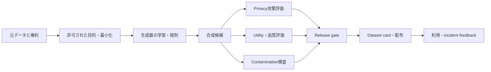



合成データは、自動的に匿名になるわけでも、自動的に正確なデータになるわけでもない。
生成モデルが元のrecordを記憶したり、誤った相関を増幅したり、評価セットに似た標本を作ったりする可能性がある。

## 1. 問題：syntheticというlabelはリスク等級ではない

合成データには異なる種類がある。

- 規則とsimulatorで生成したデータ
- 統計モデルからsamplingしたtabular data
- 実際のrecordを変形したデータ
- 生成モデルで作ったtext、image、audio
- rare eventを補強したデータ
- privacy mechanismを適用したデータ

リスクは生成方法と元データへの依存性によって変わる。

- 元の個人情報の再現
- membership inference
- 機密attribute inference
- 著作物または機密表現のmemorization
- 少数集団の歪曲
- unrealistic combination
- label leakage
- train/test contamination
- 合成データの再合成によるmodel collapse

したがって「実データではないから自由に共有できる」という結論は避ける。

## 2. Mental model：派生データのサプライチェーン



合成データも元データのlineageを持つ派生artifactである。
元データの削除、同意の撤回、ポリシー変更が派生datasetへ与える影響を定義する。

## 3. 目的契約

生成前にintended useとprohibited useを記述する。

```yaml
purpose: "모델 개발 초기 기능 시험"
source_population: "정의된 범위"
allowed_uses:
  - "pipeline test"
  - "알려진 class imbalance 완화 실험"
prohibited_uses:
  - "개인 수준 판단"
  - "원본 population의 공식 통계 추정"
quality_targets:
  utility: "downstream task 기준"
  privacy: "공격 평가와 정책 기준"
retention: "버전·만료·삭제 규칙"
```

開発用mock dataと外部公開用synthetic dataには異なるgateを設ける必要がある。

## 4. 元データの権利と最小化

合成プロセスによって元データの利用権限が新たに生じるわけではない。

検討項目：

- 収集目的と生成目的の互換性
- consentと契約
- licenseと著作権
- 地域・業界の規制
- 機密attributeの必要性
- retentionと削除義務
- 外部generator APIへ送信可能か

必要なcolumnとpopulationだけを使用する。
直接識別子は学習前に削除するが、削除だけでprivacyが保証されるとは考えない。

元のsnapshotはアクセス制御し、generator runにはimmutable source versionを記録する。

## 5. Privacyは攻撃モデルで評価する

privacyに関する問いは「名前があるか？」だけにとどまらない。

### Exactとnear-duplicate

合成recordが元データと同一、または過度に近くないか確認する。

- exact row match
- key fieldの組み合わせmatch
- text n-gram overlap
- image perceptual similarity
- embedding nearest-neighbor distance

距離thresholdはデータの種類とpopulation densityに応じて定める。

### Membership inference

特定のrecordがgenerator trainingに含まれていたか推論できるか、攻撃実験を行う。

### Attribute inference

非機密fieldと合成datasetを使って機密attributeを予測できるか確認する。

### Linkage attack

外部の公開情報と組み合わせ、個人または小さな集団を関連付けられるか評価する。

攻撃成功率は、現実的な攻撃者の知識とbaselineとの比較で報告する。

## 6. Differential privacyを正確に理解する

差分privacyは、隣接datasetに対するoutput distributionの差を制限するformal frameworkである。

直感的な定義：

$$
\Pr[M(D)\in S]\le e^\epsilon\Pr[M(D')\in S]+\delta
$$

ここで(D,D')は、ある1人を含むかどうかだけが異なる隣接datasetである。

注意事項：

- DPは、適用したmechanismとthreat modelに対する保証である。
- 小さい\(\epsilon\)は一般により強いprivacyを意味するが、utilityとのtrade-offがある。
- 複数回releaseするとprivacy budgetがcompositionされる。
- 前処理とhyperparameter tuningでprivate dataを使用する場合、会計に含める必要がある。
- DP generatorであっても、downstream利用の公平性と正確性は保証されない。

privacy parameterとaccountant、sampling、clippingの設定をdataset cardに記録する。

## 7. Statistical fidelityとutilityを分ける

合成データが元の分布に似て見えることと、実際のtaskに有用であることは異なる。

統計的比較：

- marginal distribution
- pairwise correlation
- conditional distribution
- category frequency
- missingness pattern
- tailとrare subgroup
- temporal autocorrelation

utilityの比較：

- train-synthetic test-real
- train-real test-real baseline
- train-real-plus-synthetic test-real
- calibrationとsubgroup performance
- sample efficiency curve

TSTR性能が低ければ、合成データがtask-relevantな関係を保持できていない。
高くてもprivacyの安全性を証明するものではない。

## 8. Plausibilityとconstraint

統計的にもっともらしくても、ドメイン制約に違反する可能性がある。

constraintの例：

- 範囲と単位
- 時間順序
- subtotalとtotal
- mutually exclusive category
- physical conservation
- relational foreign key
- impossible state transition

```python
def validate_record(row):
    errors = []
    if row["start_time"] > row["end_time"]:
        errors.append("invalid-time-order")
    if row["amount"] < 0:
        errors.append("negative-amount")
    return errors
```

constraint rejection rate自体もgeneratorの品質metricである。
後処理ですべて修正すると生成分布が変わるため、前後を評価する。

## 9. Contaminationとleakage

合成データがevaluation setの情報から作られると、評価が汚染される。

禁止パターン：

- dataset全体でgeneratorを学習してからsplitする
- test exampleをpromptへ入れて変形生成する
- 正解labelまたは未来の値をgeneration conditionへ露出する
- benchmark設問をparaphraseしてtrainingへ追加する
- modelの評価結果をそのままsynthetic labelとして使う

安全な手順：

1. 元データをentity・time・source単位でsplitする。
2. generatorはtraining splitだけにfitする。
3. synthetic dataはtraining partitionだけに追加する。
4. validationとtestは独立したreal dataのまま維持する。
5. split間でnear-duplicate検査を行う。

公開benchmarkのcontaminationは完全に立証することが難しい場合がある。
出所と生成promptを保持し、疑わしい事例を報告する。

## 10. 実践的なrelease workflow

### Step 1. Source approval

data owner、目的、法的根拠、保持期間を確認する。

### Step 2. Generator protocolを固定

- codeとmodel version
- random seed
- source snapshot
- preprocessing
- hyperparameter
- privacy mechanism

### Step 3. 隔離環境で生成

raw sourceとoutputのアクセス権限を分離する。

### Step 4. 三重評価

- privacy attack suite
- statistical/constraint suite
- downstream utility suite

### Step 5. 人によるレビュー

nearest-neighbor、rare subgroup、unsafe contentの標本を確認する。

### Step 6. Release gate

すべての基準を通過したimmutable versionだけを配布する。

### Step 7. Dataset cardとmonitoring

制約、既知の限界、禁止用途、有効期限を併せて提供する。

## 11. Synthetic labelの品質

LLMや既存modelがlabelを作ると、teacher biasが複製される。

管理方法：

- 人がレビューしたgold subset
- 複数のteacherまたは規則間のdisagreement
- confidence calibration
- abstention option
- 難しい事例のhuman escalation
- synthetic labelであることを示すflag

studentがteacherのスコアを超えたように見えても、同じjudgeで評価していればcircularityがある可能性がある。
独立したground truthと評価者を使う。

## 12. 評価checklist

- [ ] 合成データのintended useとprohibited useがあるか？
- [ ] 元データの利用権利と外部送信条件を確認したか？
- [ ] source・generator・output versionのlineageがつながっているか？
- [ ] exactとnear-duplicateの検査を行ったか？
- [ ] membership、attribute、linkage攻撃を考慮したか？
- [ ] DPを使った場合、budgetとaccountantを記録したか？
- [ ] marginalだけでなくconditional・tail分布も比較したか？
- [ ] 実際のdownstream taskでTSTRなどを評価したか？
- [ ] ドメインconstraintの違反率を測定したか？
- [ ] generatorがtraining splitだけにfitされたか？
- [ ] testおよびbenchmarkとのnear-duplicateを検査したか？
- [ ] subgroupのutilityとprivacyを個別に確認しているか？
- [ ] dataset card、有効期限、削除手順があるか？
- [ ] 合成データであることがdownstream consumerへ伝わるか？

## 13. よくある失敗と限界

### 元データと分布が似ていれば安全だと考える

高いfidelityはmemorizationの可能性とともに高まる場合がある。
utilityとprivacyを別々の軸で評価する。

### 直接識別子の削除を匿名化と呼ぶ

珍しい組み合わせと外部情報によって再識別される可能性がある。
攻撃評価とrisk assessmentが必要である。

### 合成データを無制限に再利用する

古い生成分布と反復的な再学習がbiasを蓄積させる可能性がある。
provenance比率とreal validationを維持する。

### syntheticでtest setまで置き換える

generatorが保持できなかった現実のエラーを評価で見逃す。
最終評価には独立したreal-world evidenceを含める必要がある。

どのような有限の評価も、すべてのprivacy攻撃とdownstream misuseを排除することはできない。
公開範囲と利用権限をリスクに応じて制限し、incident responseを準備する。

## 14. 公式参考資料

- [NIST Privacy Framework](https://www.nist.gov/privacy-framework)
- [NIST Differential Privacy Guidelines](https://csrc.nist.gov/pubs/sp/800/226/final)
- [NIST AI Risk Management Framework](https://www.nist.gov/itl/ai-risk-management-framework)
- [OECD Synthetic Data report](https://www.oecd.org/en/publications/emerging-privacy-enhancing-technologies_51f6b143-en.html)
- [Datasheets for Datasets原著論文](https://arxiv.org/abs/1803.09010)

## 15. まとめ

合成データは便利な派生artifactであって、privacyの免責手段ではない。
元データの権利、攻撃ベースのprivacy、実際のutility、contamination、provenanceを独立したgateとして管理してこそ、安全で再現可能なデータ資産になる。
