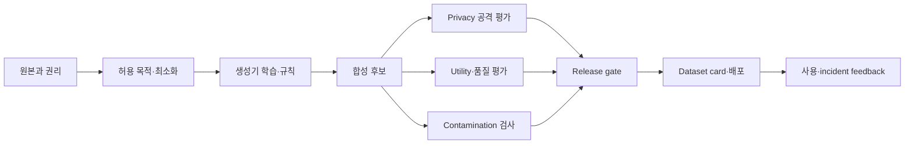



합성 데이터는 자동으로 익명이고 자동으로 정확한 데이터가 아니다.
생성 모델이 원본 record를 기억하거나, 잘못된 상관을 증폭하거나, 평가 세트와 닮은 표본을 만들 수 있다.

## 1. 문제: synthetic이라는 label은 위험 등급이 아니다

합성 데이터에는 서로 다른 유형이 있다.

- 규칙과 simulator로 생성한 데이터
- 통계 모형에서 sampling한 tabular data
- 실제 record를 변형한 데이터
- 생성 모델로 만든 text, image, audio
- rare event를 보강한 데이터
- privacy mechanism을 적용한 데이터

위험은 생성 방식과 원본 의존성에 따라 달라진다.

- 원본 개인정보 재현
- membership inference
- 민감 attribute inference
- 저작물 또는 기밀 표현의 memorization
- 소수 집단 왜곡
- unrealistic combination
- label leakage
- train/test contamination
- 합성 데이터의 재합성으로 인한 model collapse

따라서 “실제 데이터가 아니므로 자유롭게 공유”라는 결론을 피한다.

## 2. Mental model: 파생 데이터 공급망



합성 데이터도 원본의 lineage를 가진 파생 artifact다.
원본 삭제, 동의 철회, 정책 변경이 파생 dataset에 어떤 영향을 주는지 정의한다.

## 3. 목적 계약

생성 전에 intended use와 prohibited use를 작성한다.

```yaml
purpose: "모델 개발 초기 기능 시험"
source_population: "정의된 범위"
allowed_uses:
  - "pipeline test"
  - "알려진 class imbalance 완화 실험"
prohibited_uses:
  - "개인 수준 판단"
  - "원본 population의 공식 통계 추정"
quality_targets:
  utility: "downstream task 기준"
  privacy: "공격 평가와 정책 기준"
retention: "버전·만료·삭제 규칙"
```

개발용 mock data와 외부 공개용 synthetic data는 다른 gate를 가져야 한다.

## 4. 원본 데이터의 권리와 최소화

합성 과정이 원본 사용 권한을 새로 만들어 주지 않는다.

검토 항목:

- 수집 목적과 생성 목적의 호환성
- consent와 계약
- license와 저작권
- 지역·산업 규정
- 민감 attribute 필요성
- retention과 삭제 의무
- 외부 generator API로 전송 가능한지

필요한 column과 population만 사용한다.
직접 식별자는 학습 전에 제거하되, 제거만으로 privacy가 보장된다고 보지 않는다.

원본 snapshot은 접근 통제하고 generator run에는 immutable source version을 기록한다.

## 5. Privacy는 공격 모델로 평가한다

privacy 질문은 “이름이 있는가?”보다 넓다.

### Exact와 near-duplicate

합성 record가 원본과 동일하거나 지나치게 가까운지 본다.

- exact row match
- key field 조합 match
- text n-gram overlap
- image perceptual similarity
- embedding nearest-neighbor distance

거리 threshold는 데이터 유형과 population density에 따라 정한다.

### Membership inference

특정 record가 generator training에 포함됐는지 추론할 수 있는지 공격 실험을 한다.

### Attribute inference

비민감 field와 합성 dataset을 사용해 민감 attribute를 예측할 수 있는지 본다.

### Linkage attack

외부 공개 정보와 결합해 개인 또는 작은 집단을 연결할 수 있는지 평가한다.

공격 성공률은 현실적인 공격자 지식과 baseline 대비로 보고한다.

## 6. Differential privacy를 정확히 이해한다

차등 privacy는 인접 dataset에 대한 output distribution 차이를 제한하는 formal framework다.

직관적 정의:

$$
\Pr[M(D)\in S]\le e^\epsilon\Pr[M(D')\in S]+\delta
$$

여기서 (D,D')는 한 개인의 포함 여부만 다른 인접 dataset이다.

주의:

- DP는 적용한 mechanism과 threat model에 대한 보장이다.
- 작은 \(\epsilon\)이 일반적으로 더 강한 privacy를 뜻하지만 utility와 trade-off가 있다.
- 여러 번 release하면 privacy budget이 composition된다.
- 전처리와 hyperparameter tuning이 private data를 사용하면 회계에 포함해야 한다.
- DP generator라도 downstream 사용의 공정성과 정확성을 보장하지 않는다.

privacy parameter와 accountant, sampling, clipping 설정을 dataset card에 기록한다.

## 7. Statistical fidelity와 utility를 분리한다

합성 데이터가 원본 분포와 비슷해 보이는 것과 실제 task에 유용한 것은 다르다.

통계 비교:

- marginal distribution
- pairwise correlation
- conditional distribution
- category frequency
- missingness pattern
- tail와 rare subgroup
- temporal autocorrelation

utility 비교:

- train-synthetic test-real
- train-real test-real baseline
- train-real-plus-synthetic test-real
- calibration과 subgroup performance
- sample efficiency curve

TSTR 성능이 낮으면 합성 데이터가 task-relevant 관계를 보존하지 못한 것이다.
높아도 privacy 안전성을 증명하지 않는다.

## 8. Plausibility와 constraint

통계적으로 그럴듯해도 도메인 제약을 위반할 수 있다.

constraint 예:

- 범위와 단위
- 시간 순서
- subtotal과 total
- mutually exclusive category
- physical conservation
- relational foreign key
- impossible state transition

```python
def validate_record(row):
    errors = []
    if row["start_time"] > row["end_time"]:
        errors.append("invalid-time-order")
    if row["amount"] < 0:
        errors.append("negative-amount")
    return errors
```

constraint rejection rate 자체도 generator 품질 metric이다.
후처리로 모두 고치면 생성 분포가 바뀌므로 전후를 평가한다.

## 9. Contamination과 leakage

합성 데이터가 evaluation set의 정보로 만들어지면 평가가 오염된다.

금지 패턴:

- 전체 dataset으로 generator를 학습한 뒤 split
- test example을 prompt에 넣어 변형 생성
- 정답 label 또는 미래 값을 generation condition에 노출
- benchmark 문항을 paraphrase해 training에 추가
- model 평가 결과를 그대로 synthetic label로 사용

안전한 순서:

1. 원본을 entity·time·source 단위로 split한다.
2. generator는 training split에만 fit한다.
3. synthetic data는 training partition에만 추가한다.
4. validation과 test는 독립 real data로 유지한다.
5. near-duplicate 검사를 split 사이에 수행한다.

공개 benchmark contamination은 완전히 입증하기 어려울 수 있다.
출처와 생성 prompt를 보존하고 의심 사례를 보고한다.

## 10. 실전 release workflow

### Step 1. Source approval

data owner, 목적, 법적 근거, 보유 기간을 확인한다.

### Step 2. Generator protocol 고정

- code와 model version
- random seed
- source snapshot
- preprocessing
- hyperparameter
- privacy mechanism

### Step 3. 격리 생성

raw source와 output 접근 권한을 분리한다.

### Step 4. 삼중 평가

- privacy attack suite
- statistical/constraint suite
- downstream utility suite

### Step 5. 사람 검토

nearest-neighbor와 rare subgroup, unsafe content 표본을 검토한다.

### Step 6. Release gate

모든 기준을 통과한 immutable version만 배포한다.

### Step 7. Dataset card와 monitoring

제약, 알려진 한계, 금지 용도, 만료 날짜를 함께 제공한다.

## 11. Synthetic label의 품질

LLM이나 기존 model이 label을 만들면 teacher bias가 복제된다.

관리 방법:

- 사람이 검토한 gold subset
- 여러 teacher 또는 규칙 간 disagreement
- confidence calibration
- abstention option
- 어려운 사례의 human escalation
- synthetic label 여부 flag

student가 teacher 점수를 넘어 보이더라도 동일 judge로 평가하면 circularity가 있을 수 있다.
독립 ground truth와 평가자를 사용한다.

## 12. 평가 checklist

- [ ] 합성 데이터의 intended와 prohibited use가 있는가?
- [ ] 원본 사용 권리와 외부 전송 조건을 확인했는가?
- [ ] source·generator·output version lineage가 연결되는가?
- [ ] exact와 near-duplicate 검사를 수행했는가?
- [ ] membership, attribute, linkage 공격을 고려했는가?
- [ ] DP를 사용했다면 budget과 accountant를 기록했는가?
- [ ] marginal뿐 아니라 conditional·tail 분포를 비교했는가?
- [ ] 실제 downstream task에서 TSTR 등을 평가했는가?
- [ ] 도메인 constraint 위반률을 측정했는가?
- [ ] generator가 training split에만 fit됐는가?
- [ ] test와 benchmark near-duplicate를 검사했는가?
- [ ] subgroup utility와 privacy를 별도로 보는가?
- [ ] dataset card, 만료, 삭제 절차가 있는가?
- [ ] 합성 여부가 downstream consumer에게 전달되는가?

## 13. 흔한 실패와 한계

### 원본과 분포가 비슷하면 안전하다고 본다

높은 fidelity는 memorization 가능성과 함께 증가할 수 있다.
utility와 privacy를 별도 축으로 평가한다.

### 직접 식별자 제거를 익명화로 부른다

희귀 조합과 외부 정보로 재식별될 수 있다.
공격 평가와 risk assessment가 필요하다.

### 합성 데이터를 무제한 재사용한다

오래된 생성 분포와 반복 재학습이 편향을 누적할 수 있다.
provenance 비율과 real validation을 유지한다.

### synthetic으로 test set까지 대체한다

generator가 보존하지 못한 현실 오류를 평가에서 놓친다.
최종 평가는 독립 real-world evidence를 포함해야 한다.

어떤 유한 평가도 모든 privacy 공격과 downstream misuse를 배제하지 못한다.
공개 범위와 사용 권한을 위험에 맞게 제한하고 incident response를 준비한다.

## 14. 공식 참고자료

- [NIST Privacy Framework](https://www.nist.gov/privacy-framework)
- [NIST Differential Privacy Guidelines](https://csrc.nist.gov/pubs/sp/800/226/final)
- [NIST AI Risk Management Framework](https://www.nist.gov/itl/ai-risk-management-framework)
- [OECD Synthetic Data report](https://www.oecd.org/en/publications/emerging-privacy-enhancing-technologies_51f6b143-en.html)
- [Datasheets for Datasets 원 논문](https://arxiv.org/abs/1803.09010)

## 15. 마무리

합성 데이터는 편리한 파생 artifact이지 privacy 면책 수단이 아니다.
원본 권리, 공격 기반 privacy, 실제 utility, contamination, provenance를 독립 gate로 관리해야 안전하고 재현 가능한 데이터 자산이 된다.
