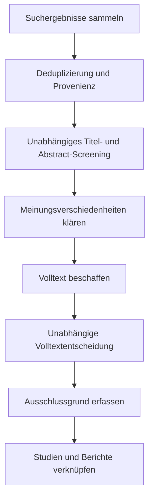



Ein systematischer Review besteht nicht darin, viele Publikationen zu lesen und zusammenzufassen.
Er ist ein Forschungsdesign, das Regeln für Fragen, Suche, Auswahl, Extraktion, Bewertung und Synthese im Voraus definiert, sodass andere denselben Evidenzfluss nachvollziehen können.

Ausgangspunkt ist die Erkenntnis, dass PRISMA in erster Linie eine **Berichtsleitlinie** ist und allein weder alle Methoden zur Durchführung eines Reviews noch jedes Qualitätsbewertungsverfahren ersetzt.

## 1. Die Frage auf Ebene des Estimands definieren

Je nach Fachgebiet kann der Rahmen für die Frage PICO, PECO, PICOS, SPIDER oder eine andere Struktur sein.
Wichtiger als das Format ist die Übersetzung jedes Elements in eine operationale Definition.

- Population oder Zielsystem
- Intervention oder Exposition und Vergleichsgruppe
- Primäre und sekundäre Outcomes
- Studiendesign
- Zeithorizont
- Setting und Geltungsbereich
- Zu schätzendes Effektmaß

Statt „Funktioniert es?“ lautet eine reproduzierbare Frage: „Unter welchen Bedingungen, relativ zu welcher Vergleichsgruppe und für welches Outcome schätzen wir welchen Effekt?“

## 2. Zuerst das Protokoll festlegen

Das Protokoll enthält mindestens:

- Hintergrund und Forschungsfrage
- Einschlusskriterien
- Informationsquellen und Suchumfang
- Screening und Konfliktlösung
- Extraktionselemente und Werkzeuge
- Methode zur Biasbewertung
- Effektmaß und Syntheseplan
- Plan für Heterogenität und Subgruppen
- Bewertung des Publikationsbias
- Bewertung der Evidenzsicherheit
- Verwaltung von Änderungen

Eine prospektive Registrierung reduziert Selektionsbias, der durch nachträgliche Kriterienänderungen nach Kenntnis der Ergebnisse entsteht.
Die Registrierung macht eine Studie nicht automatisch methodisch solide; Unterschiede zwischen tatsächlichem Bericht und Protokoll müssen offengelegt werden.

## 3. Ein- und Ausschlusskriterien vor der Prüfung der Suchergebnisse testen

Formulieren Sie Kriterien als entscheidbare Aussagen statt als vage Adjektive.

Schlechte Beispiele:

- Hochrelevante Studien
- Hochwertige Publikationen
- Studien mit ausreichenden Daten

Bessere Kriterien:

- Explizite Bedingungen für Population, Intervention oder Exposition, Vergleichsgruppe, Outcome und Studiendesign
- Sprach- und Jahresbeschränkungen mit Begründung
- Umgang mit Konferenzabstracts, Preprints und Berichten
- Regeln zur Verknüpfung doppelter Kohorten und Begleitpublikationen

Prüfen Sie mit einem Pilot-Screening, ob Reviewer dieselben Regeln anwenden, und verfeinern Sie die Kriterien.

## 4. Die Suchstrategie ist ein reproduzierbares Programm

Erstellen Sie einen Suchausdruck aus Konzeptblöcken mit Synonymen und kontrolliertem Vokabular.

$$
(A_1\lor A_2\lor\cdots)
\land
(B_1\lor B_2\lor\cdots).
$$

Schlagwörter, Feld-Tags, Phrasen, Trunkierung und Nähesyntax unterscheiden sich je Datenbank; kopieren Sie den Ausdruck daher nicht einfach wörtlich.

Erfassen Sie:

- Datenbank und Plattform
- Vollständigen ursprünglichen Suchausdruck
- Suchdatum und Abdeckungsdatum
- Filter und Einschränkungen
- Anzahl gefundener Datensätze
- Änderungsverlauf des Suchausdrucks
- Verfahren für Zitationssuche und graue Literatur

## 5. Der Kompromiss zwischen Vollständigkeit und Präzision der Suche

Systematische Reviews priorisieren oft die Sensitivität, weil das Übersehen einer wichtigen Studie teuer ist.
Eine übermäßig breite Suche erhöht jedoch Screeningfehler und Kosten.

Prüfen Sie mit Known-item-Tests, ob wichtige Ausgangsartikel gefunden werden.
Ein Peer-Review durch Such- oder Informationsspezialisten hilft, fehlende Begriffe, falsche boolesche Operatoren und ungeeignete Einschränkungen zu erkennen.

## 6. Deduplizierung muss die Provenienz bewahren

Eine Deduplizierung allein anhand der DOI übersieht Datensätze ohne DOI und kann Datensätze mit fehlerhaften DOI zusammenführen.
Vergleichen Sie Titel, Autor, Jahr, Journal, Seite und Identifikator stufenweise.

Bewahren Sie folgende Zustände, statt Datensätze einfach zu löschen.

- Kanonischer Datensatz
- Duplikatkandidat
- Übereinstimmungsnachweis und Konfidenz
- Liste der Quelldatenbanken
- Zusammengeführte Metadaten

Mehrere Berichte derselben Studie unterscheiden sich von vollständig doppelten Datensätzen.
Die Trennung von Entitäten auf Studien- und Berichtsebene verhindert Doppelzählungen.

## 7. Doppeltes Screening und Konfliktlösung

Führen Sie Titel- und Abstract-Screening sowie Volltext-Screening anhand vorab festgelegter Kriterien durch.
Eine unabhängige Prüfung durch mehrere Reviewer ist keine Formalität; sie reduziert Interpretationsunterschiede und individuelle Fehler.

Definieren Sie den Workflow wie folgt.



Ein Übereinstimmungskoeffizient ist hilfreich, beweist aber nicht die Gültigkeit der Kriterien.
Nutzen Sie strittige Fälle, um zu prüfen, ob die Regeln die tatsächliche Frage abbilden.

## 8. Ausschlüsse mit einem primären Grund standardisieren

Klassifizieren Sie Ausschlüsse auf Volltextebene reproduzierbar.

- Ungeeignete Population
- Ungeeignete Intervention oder Exposition
- Ungeeignete Vergleichsgruppe
- Ungeeignetes Outcome
- Ungeeignetes Design
- Ergänzender Bericht statt eigenständiger Studie
- Daten nicht verfügbar

Selbst wenn eine Publikation mehrere Gründe besitzt, hält die Erfassung eines primären Grundes nach einer Prioritätsregel die Flusszählungen konsistent.

## 9. Das Datenextraktionsformular pilotieren

Erweitern Sie die Extraktionstabelle nicht ad hoc beim Lesen von Publikationen.
Legen Sie Variablendefinitionen, Einheiten, zulässige Werte, Codes für fehlende Daten und Transformationsformeln in einem Datenwörterbuch fest.

Zu den Extraktionskategorien gehören:

- Studien- und Berichtsidentifikatoren
- Design und Setting
- Rekrutierungs-, Zuteilungs- und Follow-up-Prozess
- Merkmale der Teilnehmenden
- Definitionen von Intervention, Exposition und Vergleichsgruppe
- Outcome-Definition und Messzeitpunkt
- Effektschätzung und Unsicherheit
- In der Analyse berücksichtigte Variablen
- Finanzierung und Interessenkonflikte
- Evidenz zur Begründung der Biasurteile

Wenn Werte aus einer Grafik digitalisiert wurden, erfassen Sie Werkzeug, Kalibrierung und Fehler wiederholter Extraktionen.

## 10. Effektmaße aufeinander abstimmen

Zu den gebräuchlichen Maßen für binäre Outcomes gehören Risikoverhältnis, Odds Ratio und Risikodifferenz.
Kontinuierliche Outcomes können die Mittelwertdifferenz oder standardisierte Mittelwertdifferenz verwenden.

Jedes Maß beantwortet eine andere Frage.
Ein Odds Ratio als Risikoverhältnis zu interpretieren kann beispielsweise bei häufigen Ereignissen erhebliche Verzerrungen verursachen.

Richten Sie die Effektrichtung einheitlich aus und legen Sie Skalentransformationen und Vorzeichenkonventionen im Datenwörterbuch fest.

## 11. Biasrisiko unterscheidet sich von Berichtsqualität

Wie ausführlich eine Publikation geschrieben ist und ob ihre Effektschätzung verzerrt ist, sind verschiedene Fragen.
Wählen Sie ein zum Studiendesign und Outcome passendes Werkzeug und bewahren Sie die Begründung jedes Urteils auf Domänenebene.

Zu häufigen Biasquellen gehören:

- Selektion und Zuteilung
- Confounding
- Abweichungen von der Intervention
- Fehlende Outcomes
- Outcome-Messung
- Selektive Berichterstattung

Ein einfaches Addieren von Punktwerten kann den Schweregrad verschiedener Domänen verschleiern.

## 12. Grundgleichungen der Metaanalyse

Für die Effektschätzung (hat\theta_i) und Varianz (v_i) jeder Studie ist der gewichtete Mittelwert mit festem Effekt

$$
\hat\theta=
\frac{\sum_i w_i\hat\theta_i}{\sum_iw_i},
\qquad
w_i=\frac{1}{v_i}.
$$

Ein Random-Effects-Modell nimmt an, dass die wahren Effekte der Studien einer Verteilung folgen, und verwendet

$$
w_i=\frac{1}{v_i+\tau^2}
$$

wobei (	au^2) die Heterogenität zwischen Studien bezeichnet.

Random Effects sind kein Schalter, der Heterogenität beseitigt.
Bestimmen Sie zuerst, ob die Studien klinisch und methodisch hinreichend kompatibel sind, um dasselbe Estimand zu teilen.

## 13. Heterogenität interpretieren

(I^2) fasst den Anteil beobachteter Variabilität jenseits des Stichprobenfehlers zusammen, reagiert aber empfindlich auf Zahl und Präzision der Studien.

$$
I^2=\max\left(0,\frac{Q-df}{Q}\right)\times100\%.
$$

Betrachten Sie daneben:

- (	au^2) und seine Einheiten
- Vorhersageintervall
- Richtung der Effekte im Forest Plot
- Unterschiede in Population, Intervention und Messdefinitionen
- Einfluss- und Leave-one-out-Ergebnisse
- Vorab festgelegte Subgruppenanalysen und Metaregression

Eine Metaregression mit wenigen Studien ist anfällig für Overfitting und ökologischen Bias.

## 14. Nicht zu synthetisieren ist ebenfalls eine methodische Entscheidung

Statistisches Pooling kann ungeeignet sein, wenn sich Effektdefinitionen unterscheiden oder die Daten nicht ausreichen.
Die bloße Aussage, Ergebnisse seien „narrativ zusammengefasst“ worden, reicht jedoch nicht.

- Gruppierungsregeln
- Standardisierte Darstellung der Outcomes
- Vermeidung von Vote Counting nach Richtung
- Berücksichtigung von Studiengröße und Präzision
- Integration von Biasrisiko und Evidenzsicherheit
- Strukturierte Untersuchung der Gründe widersprüchlicher Ergebnisse

Legen Sie die Synthesemethode im Protokoll im Voraus fest.

## 15. Berichtsverzerrung und Small-Study-Effekte

Die Asymmetrie eines Funnel Plots ist nicht allein ein Beleg für Publikationsbias.
Heterogenität, Outcome-Selektion und methodische Unterschiede können sie ebenfalls verursachen.

Vergleichen Sie Registrierungen mit Berichten, prüfen Sie auf ausgelassene, im Protokoll festgelegte Outcomes und berichten Sie Methoden zur Suche nach grauer Literatur und unveröffentlichten Studien.
Statistische Tests besitzen bei einer kleinen Studienzahl geringe Power.

## 16. Sicherheit der Evidenz

Unterscheiden Sie das Biasrisiko einer einzelnen Studie von der Sicherheit des gesamten Evidenzkörpers.
Für jedes Outcome können folgende Punkte berücksichtigt werden.

- Biasrisiko
- Inkonsistenz
- Indirektheit
- Unpräzision
- Publikationsbias
- Aufwertungsfaktoren wie großer Effekt oder Dosis-Wirkungs-Beziehung

Berichten Sie nicht nur eine Bewertung, sondern erläutern Sie die Gründe des Urteils und seine Auswirkung auf Entscheidungen.

## 17. Für Aktualisierungen entwerfen

Verwalten Sie Suchergebnisse, Screeningentscheidungen, Extraktion und Analyse als versionierte Artefakte.

Eine empfohlene konzeptionelle Dateistruktur sieht so aus.

```text
protocol/
search/
records_raw/
records_deduplicated/
screening/
extraction/
risk_of_bias/
analysis/
report/
```

Überschreiben Sie Originale nicht; bewahren Sie Transformationsskripte und Prüfsummen.
Legen Sie bei einem Living Review den Aktualisierungsauslöser und das Datum der letzten Suche fest.

## 18. Checkliste zur Verifikation

- [ ] Frage und primäres Outcome wurden im Voraus definiert.
- [ ] Protokoll und Änderungsverlauf sind offengelegt.
- [ ] Vollständige Suchausdrücke werden für jede Datenbank bewahrt.
- [ ] Suchdatum und Anzahl gefundener Datensätze sind reproduzierbar.
- [ ] Die Deduplizierung bewahrt die Quellenprovenienz.
- [ ] Die Screeningkriterien wurden pilotiert.
- [ ] Gründe für Volltextausschlüsse wurden standardisiert.
- [ ] Studien und Berichte wurden als getrennte Entitäten verknüpft.
- [ ] Extraktionsformular und Datenwörterbuch wurden verwendet.
- [ ] Effektrichtung und Einheitentransformationen wurden verifiziert.
- [ ] Biasurteile besitzen Begründungen auf Domänenebene.
- [ ] Die Eignung für Pooling wurde vor der statistischen Analyse bewertet.
- [ ] Heterogenität und Vorhersageintervalle wurden interpretiert.
- [ ] Evidenzsicherheit wurde für jedes Outcome berichtet.
- [ ] Jede Zahl im PRISMA-Fluss stimmt mit dem Quellenregister überein.

## 19. Häufige Fehlermuster und Grenzen

### Die PRISMA-Checkliste als Forschungsmethode selbst behandeln

PRISMA unterstützt transparente Berichterstattung, ersetzt aber keine detaillierten Leitlinien zu Suche, Biaswerkzeugen oder Synthesemethoden.

### Den Suchausdruck erst in der Endphase rekonstruieren

Reproduktion ist schwierig, wenn tatsächliche Abfrage, Datum und Ergebnisanzahl nicht sofort gespeichert werden.

### Mehrere Berichte als mehrere Studien zählen

Stichproben können doppelt gezählt werden, wenn Kohorten- und Studienentitäten nicht verknüpft sind.

### Random Effects als Lösung für hohe Heterogenität behandeln

Wenn sich Estimands und Populationen grundlegend unterscheiden, kann ein einzelner durchschnittlicher Effekt bedeutungslos sein.

### Statistisch signifikante Studien zählen

Vote Counting ohne Berücksichtigung von Stichprobengröße und Präzision verzerrt Effektrichtung und -größe.

## 20. Offizielle und primäre Referenzen

- Page et al., [PRISMA-2020-Erklärung](https://www.bmj.com/content/372/bmj.n71), *BMJ*, 2021.
- Page et al., [Erklärung und Erläuterung zu PRISMA 2020](https://www.bmj.com/content/372/bmj.n160), *BMJ*, 2021.
- PRISMA, [Offizielle Checklisten und Flussdiagramme](https://www.prisma-statement.org/).
- Cochrane, [Handbuch für systematische Reviews von Interventionen](https://training.cochrane.org/handbook/current).
- Campbell Collaboration, [Methodenressourcen](https://www.campbellcollaboration.org/research-resources/).

Das Ergebnis eines guten systematischen Reviews ist kein einzelner Schlusssatz.
Es ist **eine ausführbare Evidenzpipeline, die zeigt, welche Evidenz nach welchen Regeln eingeschlossen, transformiert und bewertet wurde**.
