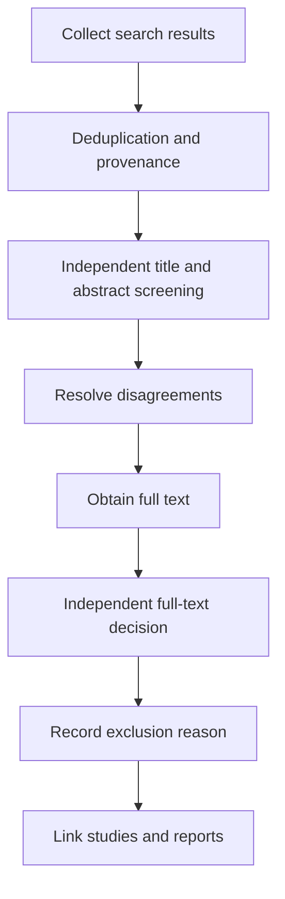



A systematic review is not the task of reading and summarizing many papers.
It is a research design that defines the rules for questions, searches, selection, extraction, assessment, and synthesis in advance, enabling others to trace the same flow of evidence.

The starting point is to recognize that PRISMA is primarily a **reporting guideline** and does not by itself replace every method for conducting a review or every quality-scoring framework.

## 1. Define the question at the estimand level

Depending on the field, the question framework may be PICO, PECO, PICOS, SPIDER, or another structure.
More important than the format is translating each element into an operational definition.

- Population or target system
- Intervention or exposure and comparator
- Primary and secondary outcomes
- Study design
- Time horizon
- Setting and scope of applicability
- Effect measure to be estimated

Rather than “Does it work?”, the reproducible question is “Under which conditions, relative to which comparator, and for which outcome are we estimating which effect?”

## 2. Fix the protocol first

At minimum, the protocol includes the following.

- Background and research question
- Eligibility criteria
- Information sources and search scope
- Screening and conflict resolution
- Extraction items and tools
- Risk-of-bias method
- Effect measure and synthesis plan
- Heterogeneity and subgroup plan
- Publication bias assessment
- Certainty assessment
- Amendment management

Prospective registration reduces selection bias caused by changing criteria after seeing the results.
Registration does not automatically make a study sound, and differences between the actual report and protocol must be disclosed.

## 3. Test inclusion and exclusion criteria before reviewing search results

Write criteria as decidable statements rather than vague adjectives.

Poor examples:

- Highly relevant studies
- High-quality papers
- Studies with sufficient data

Better criteria:

- Explicit conditions for the population, intervention or exposure, comparator, outcome, and study design
- Language and year restrictions, with their rationale
- Handling of conference abstracts, preprints, and reports
- Rules for linking duplicate cohorts and companion papers

Use pilot screening to check whether reviewers apply the same rules and to refine the criteria.

## 4. The search strategy is a reproducible program

Construct a search expression from concept blocks containing synonyms and controlled vocabulary.

$$
(A_1\lor A_2\lor\cdots)
\land
(B_1\lor B_2\lor\cdots).
$$

Subject headings, field tags, phrases, truncation, and proximity syntax differ by database, so do not simply copy the expression verbatim.

Record the following items.

- Database and platform
- Full original search expression
- Search date and coverage date
- Filters and limits
- Number of records returned
- Search-expression revision history
- Citation chasing and grey literature procedures

## 5. The trade-off between search completeness and precision

Systematic reviews often prioritize sensitivity because missing an important study is costly.
However, an excessively broad search increases screening errors and cost.

Use known-item testing to verify that key seed articles are retrieved.
Peer review by a search specialist or information specialist is useful for identifying missing terms, incorrect Boolean operators, and inappropriate limits.

## 6. Deduplication must preserve provenance

Deduplicating solely by DOI misses records without a DOI and can merge records with incorrect DOIs.
Compare title, author, year, journal, page, and identifier in stages.

Preserve the following states instead of merely deleting records.

- Canonical record
- Duplicate candidate
- Match evidence and confidence
- List of source databases
- Merged metadata

Multiple reports from the same study are different from fully duplicate records.
Separating study-level entities from report-level entities prevents double counting.

## 7. Dual screening and conflict resolution

Conduct title and abstract screening and full-text screening using prespecified criteria.
Independent review by multiple reviewers is not a formality; it reduces differences in interpretation and individual mistakes.

Define the workflow as follows.



An agreement coefficient is helpful, but it does not prove the validity of the criteria.
Use disputed cases to review whether the rules reflect the actual question.

## 8. Standardize exclusions using one primary reason

Classify exclusions at the full-text stage reproducibly.

- Ineligible population
- Ineligible intervention or exposure
- Ineligible comparator
- Ineligible outcome
- Ineligible design
- Supplementary report rather than an independent study
- Data unavailable

Even when a paper has multiple reasons, recording one primary reason according to a priority rule keeps flow counts consistent.

## 9. Pilot the data extraction form

Do not expand the extraction table ad hoc while reading papers.
Specify variable definitions, units, allowed values, missing-data codes, and transformation formulas in a data dictionary.

Extraction categories include the following.

- Study and report identifiers
- Design and setting
- Recruitment, allocation, and follow-up process
- Participant characteristics
- Definitions of intervention, exposure, and comparator
- Outcome definition and measurement time
- Effect estimate and uncertainty
- Variables adjusted for in the analysis
- Funding and conflict-of-interest information
- Evidence supporting risk-of-bias judgments

If values were digitized from a graph, record the tool, calibration, and repeated-extraction error.

## 10. Align effect measures

Common measures for binary outcomes include the risk ratio, odds ratio, and risk difference.
Continuous outcomes may use the mean difference or standardized mean difference.

Each measure answers a different question.
For example, interpreting an odds ratio as a risk ratio can cause substantial distortion when events are common.

Align the effect direction and fix scale transformations and sign conventions in the data dictionary.

## 11. Risk of bias differs from reporting quality

How thoroughly a paper is written and whether its effect estimate is biased are different issues.
Select a tool suited to the study design and outcome, and retain the rationale for each domain-level judgment.

Common sources of bias include the following.

- Selection and allocation
- Confounding
- Intervention deviations
- Missing outcomes
- Outcome measurement
- Selective reporting

Simply summing scores can conceal the severity of distinct domains.

## 12. Basic meta-analysis equations

Given each study's effect estimate (hat\theta_i) and variance (v_i), the fixed-effect weighted mean is

$$
\hat\theta=
\frac{\sum_i w_i\hat\theta_i}{\sum_iw_i},
\qquad
w_i=\frac{1}{v_i}.
$$

A random-effects model assumes that the true effects of the studies follow a distribution and uses

$$
w_i=\frac{1}{v_i+\tau^2}
$$

where (	au^2) is between-study heterogeneity.

Random effects are not a button that resolves heterogeneity.
First determine whether the studies are clinically and methodologically compatible enough to share the same estimand.

## 13. Interpreting heterogeneity

(I^2) summarizes the proportion of observed variability beyond sampling error, but it is sensitive to the number and precision of studies.

$$
I^2=\max\left(0,\frac{Q-df}{Q}\right)\times100\%.
$$

Consider the following alongside it.

- (	au^2) and its units
- Prediction interval
- Direction of effects in the forest plot
- Differences in population, intervention, and measurement definitions
- Influence and leave-one-out results
- Prespecified subgroup analyses and meta-regression

Meta-regression with few studies is vulnerable to overfitting and ecological bias.

## 14. Choosing not to synthesize is also a methodological decision

Statistical pooling may be inappropriate when effect definitions differ or data are insufficient.
However, simply stating that results were “summarized narratively” is not enough.

- Grouping rules
- Standardized outcome presentation
- Avoidance of vote counting by direction
- Consideration of study size and precision
- Integration of risk of bias and certainty
- Structured exploration of reasons for inconsistent results

Prespecify the synthesis method in the protocol.

## 15. Reporting bias and small-study effects

Funnel plot asymmetry is not evidence of publication bias alone.
Heterogeneity, outcome selection, and methodological differences can also cause it.

Compare registrations with reports, check for omitted protocol-specified outcomes, and report methods for searching grey literature and unpublished studies.
Statistical tests have low power when the number of studies is small.

## 16. Certainty of evidence

Distinguish risk of bias in an individual study from certainty in the overall body of evidence.
The following can be considered for each outcome.

- Risk of bias
- Inconsistency
- Indirectness
- Imprecision
- Publication bias
- Upgrading factors such as a large effect or dose-response relationship

Do not report only a rating; explain the reasons for the judgment and its impact on decisions.

## 17. Design for updates

Manage search results, screening decisions, extraction, and analysis as versioned artifacts.

A recommended conceptual file structure is as follows.

```text
protocol/
search/
records_raw/
records_deduplicated/
screening/
extraction/
risk_of_bias/
analysis/
report/
```

Do not overwrite originals; preserve transformation scripts and checksums.
For a living review, specify the update trigger and date of the last search.

## 18. Verification checklist

- [ ] The question and primary outcome were defined in advance.
- [ ] The protocol and amendment history are disclosed.
- [ ] Full search expressions are preserved for every database.
- [ ] The search date and number of records returned are reproducible.
- [ ] Deduplication preserves source provenance.
- [ ] The screening criteria were piloted.
- [ ] Reasons for full-text exclusion were standardized.
- [ ] Studies and reports were linked as separate entities.
- [ ] An extraction form and data dictionary were used.
- [ ] Effect direction and unit transformations were verified.
- [ ] Risk-of-bias judgments have domain-level rationales.
- [ ] Poolability was assessed before statistical analysis.
- [ ] Heterogeneity and prediction intervals were interpreted.
- [ ] Certainty was reported for each outcome.
- [ ] Every count in the PRISMA flow matches the source ledger.

## 19. Common failure patterns and limitations

### Treating the PRISMA checklist as the research method itself

PRISMA supports transparent reporting, but does not replace detailed guidance on searching, bias tools, or synthesis methods.

### Reconstructing the search expression at the final stage

Reproduction is difficult unless the actual query, date, and result count are saved immediately.

### Counting multiple reports as multiple studies

Samples may be counted twice unless cohort and trial entities are linked.

### Treating random effects as the solution to high heterogeneity

If estimands and populations differ fundamentally, a single average effect may be meaningless.

### Counting statistically significant studies

Vote counting that ignores sample size and precision distorts effect direction and magnitude.

## 20. Official and primary references

- Page et al., [PRISMA 2020 Statement](https://www.bmj.com/content/372/bmj.n71), *BMJ*, 2021.
- Page et al., [PRISMA 2020 Explanation and Elaboration](https://www.bmj.com/content/372/bmj.n160), *BMJ*, 2021.
- PRISMA, [Official checklists and flow diagrams](https://www.prisma-statement.org/).
- Cochrane, [Handbook for Systematic Reviews of Interventions](https://training.cochrane.org/handbook/current).
- Campbell Collaboration, [Methods resources](https://www.campbellcollaboration.org/research-resources/).

The output of a good systematic review is not a single concluding sentence.
It is **an executable evidence pipeline showing which evidence was included, transformed, and judged under which rules**.
