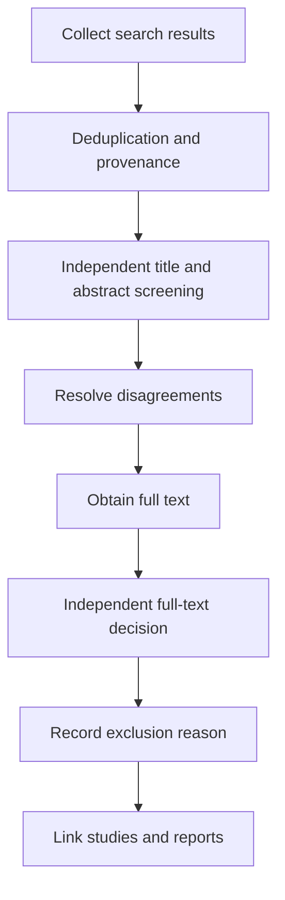



Una revisión sistemática no es la tarea de leer y resumir muchos artículos.
Es un diseño de investigación que define de antemano las reglas para preguntas, búsquedas, selección, extracción, evaluación y síntesis, permitiendo a otros rastrear el mismo flujo de evidencia.

El punto de partida es reconocer que PRISMA es principalmente una **pauta de presentación de informes** y no reemplaza por sí sola todos los métodos para realizar una revisión ni todos los marcos de calificación de calidad.

## 1. Defina la pregunta a nivel de estimación.

Dependiendo del campo, el marco de la pregunta puede ser PICO, PECO, PICOS, SPIDER u otra estructura.
Más importante que el formato es traducir cada elemento en una definición operativa.

- Población o sistema objetivo.
- Intervención o exposición y comparador
- Resultados primarios y secundarios
- Diseño del estudio
- Horizonte temporal
- Marco y ámbito de aplicabilidad
- Medida del efecto a estimar.

En lugar de “¿Funciona?”, la pregunta reproducible es “¿Bajo qué condiciones, en relación con qué comparador y para qué resultado estamos estimando qué efecto?”

## 2. Primero arregle el protocolo

Como mínimo, el protocolo incluye lo siguiente.

- Antecedentes y pregunta de investigación.
- Criterios de elegibilidad
- Fuentes de información y ámbito de búsqueda.
- Cribado y resolución de conflictos.
- Artículos y herramientas de extracción.
- Método de riesgo de sesgo
- Medida de efecto y plan de síntesis.
- Heterogeneidad y plan de subgrupos.
- Evaluación del sesgo de publicación.
- Evaluación de certeza
- Gestión de modificaciones

El registro prospectivo reduce el sesgo de selección causado por el cambio de criterios después de ver los resultados.
El registro no hace que un estudio sea válido automáticamente y se deben revelar las diferencias entre el informe real y el protocolo.

## 3. Pruebe los criterios de inclusión y exclusión antes de revisar los resultados de la búsqueda

Escriba los criterios como declaraciones decidibles en lugar de adjetivos vagos.

Pobres ejemplos:

- Estudios de gran relevancia.
- Papeles de alta calidad
- Estudios con datos suficientes

Mejores criterios:

- Condiciones explícitas para la población, intervención o exposición, comparador, resultado y diseño del estudio.
- Restricciones de idioma y año, con su justificación.
- Manejo de resúmenes de congresos, preprints e informes.
- Reglas para vincular cohortes duplicadas y artículos complementarios.

Utilice una evaluación piloto para comprobar si los revisores aplican las mismas reglas y perfeccionar los criterios.

## 4. La estrategia de búsqueda es un programa reproducible.

Construya una expresión de búsqueda a partir de bloques de conceptos que contengan sinónimos y vocabulario controlado.

$$
(A_1\lor A_2\lor\cdots)
\land
(B_1\lor B_2\lor\cdots).
$$

Los encabezados de materia, las etiquetas de campo, las frases, el truncamiento y la sintaxis de proximidad difieren según la base de datos, por lo que no se limite a copiar la expresión palabra por palabra.

Registre los siguientes elementos.

- Base de datos y plataforma
- Expresión de búsqueda original completa
- Fecha de búsqueda y fecha de cobertura.
- Filtros y límites
- Número de registros devueltos
- Historial de revisión de expresiones de búsqueda
- Búsqueda de citas y procedimientos de literatura gris.

## 5. El equilibrio entre la integridad y la precisión de la búsqueda

Las revisiones sistemáticas a menudo dan prioridad a la sensibilidad porque omitir un estudio importante resulta costoso.
Sin embargo, una búsqueda excesivamente amplia aumenta los errores de detección y el coste.

Utilice pruebas de elementos conocidos para verificar que se recuperen los artículos clave.
La revisión por pares realizada por un especialista en búsquedas o en información es útil para identificar términos faltantes, operadores booleanos incorrectos y límites inapropiados.

## 6. La deduplicación debe preservar la procedencia

La deduplicación únicamente mediante DOI pierde registros sin un DOI y puede fusionar registros con DOI incorrectos.
Compare título, autor, año, revista, página e identificador por etapas.

Conserve los siguientes estados en lugar de simplemente eliminar registros.

- Registro canónico
- Candidato duplicado
- Emparejar evidencia y confianza.
- Lista de bases de datos de origen
- Metadatos fusionados

Múltiples informes del mismo estudio son diferentes de registros completamente duplicados.
Separar las entidades a nivel de estudio de las entidades a nivel de informe evita el doble conteo.

## 7. Doble cribado y resolución de conflictos

Realizar una selección de títulos y resúmenes y de textos completos utilizando criterios preespecificados.
La revisión independiente realizada por varios revisores no es una formalidad; reduce las diferencias de interpretación y los errores individuales.

Defina el flujo de trabajo de la siguiente manera.



Un coeficiente de acuerdo es útil, pero no prueba la validez de los criterios.
Utilice casos en disputa para revisar si las reglas reflejan la pregunta real.

## 8. Estandarizar las exclusiones utilizando un motivo principal

Clasifique las exclusiones en la etapa de texto completo de manera reproducible.

- Población no elegible
- Intervención o exposición no elegible
- Comparador no elegible
- Resultado no elegible
- Diseño no elegible
- Informe complementario en lugar de un estudio independiente
- Datos no disponibles

Incluso cuando un artículo tiene múltiples motivos, registrar un motivo principal de acuerdo con una regla de prioridad mantiene constante el recuento de flujos.

## 9. Pilotar el formulario de extracción de datos

No expanda la tabla de extracción ad hoc mientras lee artículos.
Especifique definiciones de variables, unidades, valores permitidos, códigos de datos faltantes y fórmulas de transformación en un diccionario de datos.

Las categorías de extracción incluyen las siguientes.

- Identificadores de estudios e informes.
- Diseño y ambientación.
- Proceso de reclutamiento, asignación y seguimiento.
- Características de los participantes
- Definiciones de intervención, exposición y comparador.
- Definición de resultados y tiempo de medición.
- Estimación del efecto e incertidumbre.
- Variables ajustadas en el análisis.
- Información sobre financiación y conflictos de intereses.
- Evidencia que respalda los juicios de riesgo de sesgo

Si los valores se digitalizaron a partir de un gráfico, registre la herramienta, la calibración y el error de extracción repetida.

## 10. Alinear medidas de efecto

Las medidas comunes para los resultados binarios incluyen el riesgo relativo, el odds ratio y la diferencia de riesgos.
Los resultados continuos pueden utilizar la diferencia de medias o la diferencia de medias estandarizada.

Cada medida responde a una pregunta diferente.
Por ejemplo, interpretar un odds ratio como un ratio de riesgo puede causar una distorsión sustancial cuando los eventos son comunes.

Alinee la dirección del efecto y corrija transformaciones de escala y convenciones de signos en el diccionario de datos.

## 11. El riesgo de sesgo difiere de la calidad de los informes

Cuán minuciosamente está escrito un artículo y si su estimación del efecto está sesgada son cuestiones diferentes.
Seleccione una herramienta adecuada al diseño y resultado del estudio, y conserve la justificación de cada juicio a nivel de dominio.

Las fuentes comunes de sesgo incluyen las siguientes.

- Selección y asignación
- Confuso
- Desviaciones de intervención
- Resultados faltantes
- Medición de resultados
- Informes selectivos

La simple suma de puntuaciones puede ocultar la gravedad de distintos dominios.

## 12. Ecuaciones básicas de metanálisis

Dada la estimación del efecto de cada estudio (hat\theta_i) y la varianza (v_i), la media ponderada de efectos fijos es

$$
\hat\theta=
\frac{\sum_i w_i\hat\theta_i}{\sum_iw_i},
\qquad
w_i=\frac{1}{v_i}.
$$

Un modelo de efectos aleatorios supone que los verdaderos efectos de los estudios siguen una distribución y utiliza

$$
w_i=\frac{1}{v_i+\tau^2}
$$

donde (au^2) es la heterogeneidad entre estudios.

Los efectos aleatorios no son un botón que resuelva la heterogeneidad.
Primero determine si los estudios son lo suficientemente compatibles clínica y metodológicamente como para compartir el mismo estimado.

## 13. Interpretación de la heterogeneidad

(I^2) resume la proporción de variabilidad observada más allá del error de muestreo, pero es sensible al número y la precisión de los estudios.

$$
I^2=\max\left(0,\frac{Q-df}{Q}\right)\times100\%.
$$

Considere lo siguiente junto con esto.

- (au^2) y sus unidades
- Intervalo de predicción
- Dirección de efectos en la parcela forestal.
- Diferencias en las definiciones de población, intervención y medición.
- Influir y dejar fuera los resultados.
- Análisis de subgrupos preespecificados y metarregresión.

La metarregresión con pocos estudios es vulnerable al sobreajuste y al sesgo ecológico.

## 14. Optar por no sintetizar también es una decisión metodológica

La combinación de estadísticas puede ser inapropiada cuando las definiciones de los efectos difieren o los datos son insuficientes.
Sin embargo, no basta con afirmar simplemente que los resultados se “resumieron narrativamente”.

- Reglas de agrupación
- Presentación estandarizada de resultados.
- Evitar el recuento de votos por dirección.
- Consideración del tamaño y la precisión del estudio.
- Integración del riesgo de sesgo y certeza.
- Exploración estructurada de las razones de los resultados inconsistentes.

Preespecificar el método de síntesis en el protocolo.

## 15. Sesgo de información y efectos de estudios pequeños

La asimetría del gráfico en embudo no es evidencia de sesgo de publicación por sí sola.
La heterogeneidad, la selección de resultados y las diferencias metodológicas también pueden causarlo.

Compare los registros con los informes, verifique los resultados omitidos especificados en el protocolo e informe los métodos para buscar literatura gris y estudios no publicados.
Las pruebas estadísticas tienen bajo poder cuando el número de estudios es pequeño.

## 16. Certeza de la evidencia

Distinguir el riesgo de sesgo en un estudio individual de la certeza en el conjunto general de evidencia.
Para cada resultado se puede considerar lo siguiente.

- Riesgo de sesgo
- Inconsistencia
- direccionalidad
- Imprecisión
- Sesgo de publicación
- Factores de mejora, como un efecto importante o una relación dosis-respuesta

No informe sólo una calificación; Explicar los motivos de la sentencia y su impacto en las decisiones.

## 17. Diseño para actualizaciones

Administre los resultados de búsqueda, las decisiones de selección, la extracción y el análisis como artefactos versionados.

Una estructura de archivos conceptual recomendada es la siguiente.

```text
protocol/
search/
records_raw/
records_deduplicated/
screening/
extraction/
risk_of_bias/
analysis/
report/
```

No sobrescriba los originales; preservar scripts de transformación y sumas de verificación.
Para una revisión en vivo, especifique el activador de actualización y la fecha de la última búsqueda.

## 18. Lista de verificación de verificación

- [ ] La pregunta y el resultado primario se definieron de antemano.
- [ ] Se divulga el protocolo y el historial de modificaciones.
- [] Las expresiones de búsqueda completas se conservan para cada base de datos.
- [ ] La fecha de búsqueda y el número de registros devueltos son reproducibles.
- [ ] La deduplicación preserva la procedencia de la fuente.
- [ ] Se pusieron a prueba los criterios de selección.
- [ ] Se estandarizaron los motivos de exclusión del texto completo.
- [ ] Los estudios e informes se vincularon como entidades separadas.
- [ ] Se utilizó un formulario de extracción y diccionario de datos.
- [ ] Se verificaron la dirección del efecto y las transformaciones de unidades.
- [ ] Los juicios sobre el riesgo de sesgo tienen fundamentos a nivel de dominio.
- [] La agrupabilidad se evaluó antes del análisis estadístico.
- [ ] Se interpretó la heterogeneidad y los intervalos de predicción.
- [] Se informó la certeza para cada resultado.
- [ ] Cada recuento en el flujo PRISMA coincide con el libro mayor de origen.

## 19. Patrones de fallas y limitaciones comunes

### Tratar la lista de verificación PRISMA como el método de investigación en sí

PRISMA admite informes transparentes, pero no reemplaza la guía detallada sobre búsquedas, herramientas de sesgo o métodos de síntesis.

### Reconstrucción de la expresión de búsqueda en la etapa final

La reproducción es difícil a menos que la consulta, la fecha y el recuento de resultados reales se guarden inmediatamente.

### Contando múltiples informes como múltiples estudios

Las muestras se pueden contar dos veces a menos que las entidades de cohorte y de ensayo estén vinculadas.

### Tratar los efectos aleatorios como la solución a la alta heterogeneidad

Si las estimaciones y las poblaciones difieren fundamentalmente, un único efecto promedio puede no tener sentido.

### Contando estudios estadísticamente significativos

El recuento de votos que ignora el tamaño y la precisión de la muestra distorsiona la dirección y magnitud del efecto.

## 20. Referencias oficiales y primarias.

- Page et al., [PRISMA Declaración de 2020](https://www.bmj.com/content/372/bmj.n71), *BMJ*, 2021.
- Page et al., [PRISMA 2020 Explicación y elaboración](https://www.bmj.com/content/372/bmj.n160), *BMJ*, 2021.
- PRISMA, [Listas de verificación oficiales y diagramas de flujo](https://www.prisma-statement.org/).
- Cochrane, [Manual para revisiones sistemáticas de intervenciones](https://training.cochrane.org/handbook/current).
- Colaboración Campbell, [recursos de métodos](https://www.campbellcollaboration.org/research-resources/).

El resultado de una buena revisión sistemática no es una sola frase concluyente.
Es **un canal de evidencia ejecutable que muestra qué evidencia se incluyó, transformó y juzgó bajo qué reglas**.
