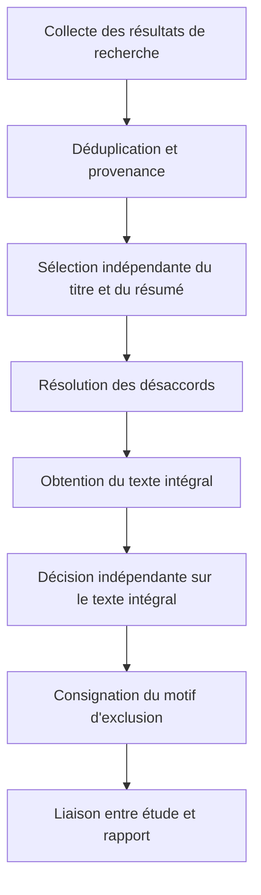



Une revue systématique ne consiste pas à lire et résumer un grand nombre d'articles.
C'est un plan de recherche qui définit à l'avance les règles régissant la question, la recherche, la sélection, l'extraction, l'évaluation et la synthèse, afin que d'autres puissent retracer le même flux de preuves.

Il faut commencer par reconnaître que PRISMA est avant tout une **directive de reporting** et ne remplace pas à lui seul toutes les méthodes de conduite d'une revue ni toutes les grilles d'évaluation de la qualité.

## 1. Définir la question au niveau de l'estimand

Selon le domaine, le cadre de la question peut être PICO, PECO, PICOS, SPIDER ou autre.
Plus que le format, il importe de transformer chaque élément en définition opérationnelle.

- Population ou système cible
- Intervention ou exposition et comparateur
- Outcomes primaires et secondaires
- Plan d'étude
- Horizon temporel
- Cadre et domaine d'application
- Mesure d'effet à estimer

Au lieu de demander « est-ce efficace ? », une question reproductible demande « dans quelles conditions, par rapport à quel comparateur et pour quel outcome estimons-nous quel effet ? ».

## 2. Fixer d'abord le protocole

Le protocole comprend au minimum les éléments suivants.

- Contexte et question de recherche
- Critères d'éligibilité
- Sources d'information et périmètre de recherche
- Sélection et résolution des désaccords
- Éléments et outils d'extraction
- Méthode d'évaluation du risque de biais
- Mesure d'effet et plan de synthèse
- Plan d'hétérogénéité et de sous-groupes
- Évaluation du biais de publication
- Évaluation de la certitude
- Gestion des amendements

L'enregistrement préalable réduit le biais de sélection dû à la modification des critères après observation des résultats.
Il ne garantit pas automatiquement la qualité de l'étude ; les différences entre le rapport effectif et le protocole doivent être rendues publiques.

## 3. Tester les critères d'inclusion et d'exclusion avant d'examiner les résultats

Formuler les critères en phrases permettant une décision, plutôt qu'avec des adjectifs vagues.

Mauvais exemples :

- Études très pertinentes
- Articles de bonne qualité
- Études disposant de données suffisantes

Meilleurs critères :

- Conditions explicites relatives à la population, l'intervention ou l'exposition, au comparateur, à l'outcome et au plan d'étude
- Restrictions de langue et d'année, avec leur justification
- Traitement des résumés de conférences, preprints et rapports
- Règles de rattachement des cohortes en double et des companion papers

Une sélection pilote permet de vérifier que les évaluateurs appliquent les mêmes règles et d'affiner les critères.

## 4. La stratégie de recherche est un programme reproductible

Construire la requête à partir de blocs de concepts composés de synonymes et d'un vocabulaire contrôlé.

$$
(A_1\lor A_2\lor\cdots)
\land
(B_1\lor B_2\lor\cdots).
$$

Les subject headings, field tags, expressions, troncatures et syntaxes de proximité diffèrent selon les bases de données ; il ne faut donc pas effectuer un simple copier-coller.

Consigner les éléments suivants.

- Base de données et plateforme
- Texte intégral de la requête
- Date de recherche et date de couverture
- Filtres et limites
- Nombre d'enregistrements renvoyés
- Historique des modifications de la requête
- Procédure de recherche dans les citations et la littérature grise

## 5. Compromis entre exhaustivité et précision de la recherche

Une revue systématique privilégie souvent la sensibilité, car le coût de l'omission d'une étude importante est élevé.
Une recherche excessivement large augmente néanmoins le coût et les erreurs de sélection.

Vérifier par un known-item testing que les principaux articles de référence sont retrouvés.
La peer review d'un spécialiste de la recherche ou de l'information aide à détecter les termes manquants, les opérateurs booléens incorrects et les limites inappropriées.

## 6. La déduplication doit préserver la provenance

Une déduplication fondée uniquement sur le DOI omet les enregistrements dépourvus de DOI et peut fusionner ceux dont le DOI est erroné.
Comparer progressivement le titre, l'auteur, l'année, la revue, la page et l'identifiant.

Au lieu de simplement supprimer, conserver les états suivants.

- Enregistrement canonique
- Candidat doublon
- Éléments justifiant la correspondance et niveau de confiance
- Liste des bases de données sources
- Métadonnées fusionnées

Plusieurs rapports d'une même étude ne sont pas équivalents à des enregistrements entièrement dupliqués.
La séparation des entités au niveau de l'étude et du rapport évite les doubles comptages.

## 7. Double sélection et résolution des désaccords

La sélection sur titre/résumé puis sur texte intégral est effectuée selon les critères préalables.
La pluralité des évaluations indépendantes n'est pas une simple formalité : elle réduit les erreurs et les différences d'interprétation entre personnes.

Le workflow se définit comme suit.



Un coefficient d'accord est utile, mais ne prouve pas la validité des critères.
Les cas de désaccord servent à vérifier si les règles reflètent réellement la question.

## 8. Standardiser le motif d'exclusion en retenant un motif principal

Les exclusions au stade du texte intégral sont classées de manière reproductible.

- Population inadéquate
- Intervention ou exposition inadéquate
- Comparateur inadéquat
- Outcome inadéquat
- Plan d'étude inadéquat
- Rapport auxiliaire et non étude indépendante
- Données inaccessibles

Même si un article présente plusieurs motifs, l'enregistrement d'un seul motif principal selon une règle de priorité assure la cohérence du décompte dans le diagramme de flux.

## 9. Piloter le formulaire d'extraction des données

Le tableau d'extraction ne doit pas s'allonger de manière improvisée au fil de la lecture.
Le dictionnaire de données précise la définition des variables, les unités, les valeurs autorisées, les codes de données manquantes et les formules de transformation.

Les catégories d'extraction sont les suivantes.

- Identifiants de l'étude et du rapport
- Plan et cadre de l'étude
- Processus de recrutement, d'allocation et de suivi
- Caractéristiques des participants
- Définition de l'intervention, de l'exposition et du comparateur
- Définition de l'outcome et moment de mesure
- Estimation de l'effet et incertitude
- Variables d'ajustement de l'analyse
- Informations sur le financement et les conflits
- Justification du jugement sur le risque de biais

Si des valeurs ont été numérisées depuis un graphique, consigner l'outil, l'étalonnage et l'erreur des extractions répétées.

## 10. Harmoniser les mesures d'effet

Pour un outcome binaire, les mesures représentatives sont le risk ratio, l'odds ratio et la risk difference.
Pour un outcome continu, on peut utiliser la mean difference ou la standardized mean difference.

Chaque mesure répond à une question différente.
Interpréter par exemple un odds ratio comme un risk ratio peut produire une forte distorsion lorsque l'événement est fréquent.

Uniformiser le sens de l'effet et fixer les transformations d'échelle et la convention de signe dans le dictionnaire de données.

## 11. Le risque de biais diffère de la qualité du reporting

Le niveau de détail d'un article et le biais de son estimation d'effet sont deux questions distinctes.
Choisir un outil adapté au plan d'étude et à l'outcome, et conserver la justification de chaque jugement par domaine.

Les principales sources de biais sont les suivantes.

- Sélection et allocation
- Confusion
- Écarts par rapport à l'intervention
- Outcomes manquants
- Mesure de l'outcome
- Reporting sélectif

La simple addition de scores peut masquer la gravité propre à chaque domaine.

## 12. Formules de base de la méta-analyse

Pour une estimation d'effet $\hat\theta_i$ et une variance $v_i$ propres à chaque étude, la moyenne pondérée à effet fixe est

$$
\hat\theta=
\frac{\sum_i w_i\hat\theta_i}{\sum_iw_i},
\qquad
w_i=\frac{1}{v_i}.
$$

Le modèle à effets aléatoires suppose que les effets vrais des études suivent une distribution et utilise

$$
w_i=\frac{1}{v_i+\tau^2}
$$

où $\tau^2$ représente l'hétérogénéité inter-études.

Les effets aléatoires ne sont pas un bouton qui résout l'hétérogénéité.
Il faut d'abord déterminer si les études peuvent être combinées sur le plan clinique et méthodologique, parce qu'elles partagent suffisamment le même estimand.

## 13. Interpréter l'hétérogénéité

$I^2$ résume la proportion de la variabilité observée qui ne provient pas de l'erreur d'échantillonnage, mais dépend du nombre et de la précision des études.

$$
I^2=\max\left(0,\frac{Q-df}{Q}\right)\times100\%.
$$

Examiner également les éléments suivants.

- $\tau^2$ et son unité
- Intervalle de prédiction
- Sens des effets dans le forest plot
- Différences de définition des populations, interventions et mesures
- Résultats d'influence et leave-one-out
- Analyses de sous-groupes ou méta-régressions prévues à l'avance

Une méta-régression portant sur peu d'études est vulnérable au surajustement et au biais écologique.

## 14. Ne pas effectuer de synthèse est aussi un choix méthodologique

Lorsque les définitions des effets diffèrent ou que les données manquent, il peut être préférable de ne pas effectuer de pooling statistique.
La simple phrase « les résultats ont été résumés narrativement » ne suffit cependant pas.

- Règle de regroupement
- Présentation standardisée des outcomes
- Éviter le vote counting fondé sur le sens de l'effet
- Prise en compte de la taille et de la précision des études
- Intégration du risque de biais et de la certitude
- Recherche structurée des causes de résultats contradictoires

Décrire la méthode de synthèse à l'avance dans le protocole.

## 15. Biais de reporting et effet des petites études

L'asymétrie d'un funnel plot ne prouve pas à elle seule un biais de publication.
L'hétérogénéité, la sélection des outcomes et les différences méthodologiques peuvent également en être la cause.

Comparer les enregistrements aux rapports, rechercher les outcomes prévus par le protocole mais omis, et indiquer la méthode de recherche de la littérature grise et des études non publiées.
Les tests statistiques ont une faible puissance lorsque le nombre d'études est réduit.

## 16. Certitude des preuves

Il faut distinguer le risque de biais d'une étude et la certitude de l'ensemble des preuves.
Pour chaque outcome, on peut prendre en compte les éléments suivants.

- Risque de biais
- Incohérence
- Caractère indirect
- Imprécision
- Biais de publication
- Facteurs de rehaussement, tels qu'un effet important ou une relation dose-réponse

Ne pas se limiter à un grade : expliquer la justification du jugement et son incidence sur la décision.

## 17. Concevoir la revue pour qu'elle puisse être mise à jour

Gérer les résultats de recherche, décisions de sélection, extractions et analyses comme des artifacts versionnés.

La structure conceptuelle de fichiers recommandée est la suivante.

```text
protocol/
search/
records_raw/
records_deduplicated/
screening/
extraction/
risk_of_bias/
analysis/
report/
```

Ne pas écraser les originaux ; conserver le script de transformation et la checksum.
Pour une living review, indiquer le déclencheur de mise à jour et la date de la dernière recherche.

## 18. Checklist de vérification

- [ ] La question et l'outcome primaire ont été définis à l'avance.
- [ ] Le protocole et l'historique des amendements sont publics.
- [ ] La requête intégrale de chaque base de données a été conservée.
- [ ] La date de recherche et le nombre d'enregistrements renvoyés sont reproductibles.
- [ ] La déduplication préserve la provenance des sources.
- [ ] Les critères de sélection ont été pilotés.
- [ ] Les motifs d'exclusion sur texte intégral ont été standardisés.
- [ ] Les études et les rapports sont reliés comme des entités distinctes.
- [ ] Un formulaire d'extraction et un dictionnaire de données ont été utilisés.
- [ ] Le sens de l'effet et les conversions d'unités ont été vérifiés.
- [ ] La justification du risque de biais existe pour chaque domaine.
- [ ] La possibilité du pooling a été examinée avant les considérations statistiques.
- [ ] L'hétérogénéité et l'intervalle de prédiction ont été interprétés.
- [ ] La certitude est rapportée pour chaque outcome.
- [ ] Tous les nombres du diagramme de flux PRISMA concordent avec le registre.

## 19. Schémas d'échec fréquents et limites

### Employer la checklist PRISMA comme méthode de recherche elle-même

PRISMA favorise la transparence du reporting, mais ne remplace pas toutes les instructions détaillées sur la recherche, les outils d'évaluation du biais et les méthodes de synthèse.

### Reconstruire la requête lors de l'étape finale

Sans sauvegarde immédiate de la requête réellement exécutée, de sa date et du nombre de résultats, la reproduction devient difficile.

### Compter plusieurs rapports comme plusieurs études

Sans rattachement des entités de cohortes et d'essais, le même échantillon peut être compté deux fois.

### Résoudre une forte hétérogénéité par des effets aléatoires

Si les estimands et les populations sont fondamentalement différents, un effet moyen unique peut être dénué de sens.

### Compter les études significatives

Le vote counting qui ignore la taille d'échantillon et la précision déforme le sens et l'ampleur de l'effet.

## 20. Références officielles et sources primaires

- Page et al., [PRISMA 2020 Statement](https://www.bmj.com/content/372/bmj.n71), *BMJ*, 2021.
- Page et al., [PRISMA 2020 Explanation and Elaboration](https://www.bmj.com/content/372/bmj.n160), *BMJ*, 2021.
- PRISMA, [Official checklists and flow diagrams](https://www.prisma-statement.org/).
- Cochrane, [Handbook for Systematic Reviews of Interventions](https://training.cochrane.org/handbook/current).
- Campbell Collaboration, [Methods resources](https://www.campbellcollaboration.org/research-resources/).

Le produit d'une bonne revue systématique ne se résume pas à une phrase de conclusion.
Il s'agit d'un **pipeline de preuves reproductible qui montre quelles preuves ont été incluses, transformées et jugées selon quelles règles**.
