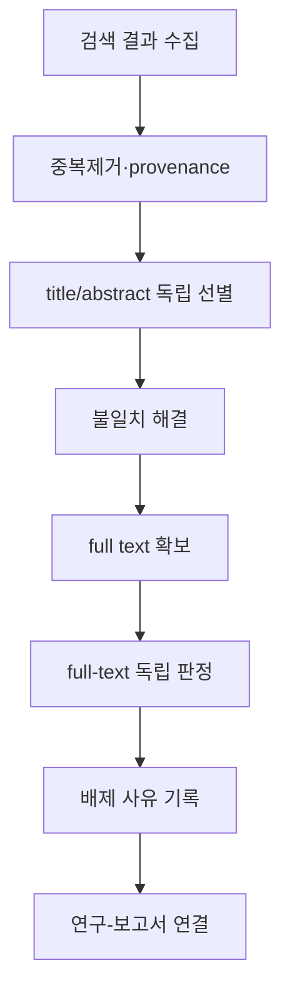



系統的レビューは、多数の論文を読んで要約する作業ではない。
質問、検索、選択、抽出、評価、統合の規則を先に定義し、他者が同じエビデンスの流れを追跡できるようにする研究設計である。

PRISMAは主として**報告ガイドライン**であり、それ自体が実施方法や品質scorecardのすべてを代替するものではない、という点から始める必要がある。

## 1. 質問をestimandレベルで定義する

質問frameworkには分野に応じてPICO、PECO、PICOS、SPIDERなどを使える。
形式より重要なのは、各要素をoperational definitionへ変えることである。

- populationまたは対象system
- intervention/exposureとcomparator
- primary/secondary outcome
- study design
- time horizon
- settingと適用範囲
- 推定対象のeffect measure

「効果があるか」より、「どの条件で、どの対照と比べた、どのoutcomeの、どの効果を推定するか」の方が再現可能である。

## 2. protocolを先に固定する

protocolには少なくとも次を含める。

- 背景と研究質問
- eligibility criteria
- 情報源と検索範囲
- 選別とconflict resolution
- 抽出項目とtool
- risk-of-bias方法
- effect measureと統合計画
- heterogeneityとsubgroup計画
- publication bias評価
- certainty評価
- amendment管理

事前登録は、結果を見た後で基準を変えるselection biasを減らす。
登録だけで良い研究になるわけではなく、実際の報告書とprotocolの差を公開しなければならない。

## 3. 包含・除外基準は検索結果を見る前に試験する

基準は曖昧な形容詞でなく、判定可能な文で書く。

悪い例：

- 関連性が高い研究
- 品質が良い論文
- 十分なデータがある研究

より良い基準：

- 対象、介入・曝露、対照群、outcome、設計別の明示条件
- 言語・年の制限とその根拠
- conference abstract、preprint、reportの扱い
- 重複cohortとcompanion paperの連結規則

pilot screeningでreviewerが同じ規則を適用するか確認し、基準を精緻化する。

## 4. 検索戦略は再現可能なprogramである

検索式はconcept blockを同義語とcontrolled vocabularyで構成する。

$$
(A_1\lor A_2\lor\cdots)
\land
(B_1\lor B_2\lor\cdots).
$$

databaseごとにsubject heading、field tag、phrase、truncation、proximity syntaxが異なるため、単純copyはしない。

記録項目：

- databaseとplatform
- 完全な検索式原文
- 検索日とcoverage date
- filterとlimit
- 返されたrecord数
- 検索式の変更履歴
- citation chasingとgrey literature手順

## 5. 検索completenessとprecisionのtrade-off

系統的レビューでは重要研究の欠落コストが大きいため、sensitivityを優先する場合が多い。
しかし過度に広い検索はscreening errorとコストを増やす。

known-item testingで主要seed articleが検索されるか確認する。
検索専門家または情報専門家のpeer reviewは、欠落語、誤ったBoolean、不適切なlimitの発見に有用である。

## 6. 重複除去ではprovenanceを保持する

DOIだけのdeduplicationでは、DOIのないrecordを逃し、誤DOIを統合し得る。
title、author、year、journal、page、identifierを段階的に比較する。

削除するのでなく、次の状態を保存する。

- canonical record
- duplicate候補
- match根拠とconfidence
- source database一覧
- 統合したmetadata

同じ研究の複数報告と完全重複recordは異なる。
study-level entityとreport-level entityを分けて二重計算を防ぐ。

## 7. 二重選別とconflict resolution

title/abstractとfull-text screeningは事前基準で実施する。
独立した複数reviewは形式ではなく、人ごとの解釈差とミスを減らす仕組みである。

workflowは次のように定義する。



agreement coefficientは役立つが、基準の妥当性を証明しない。
conflict例を通して、規則が実際の質問を反映するか検討する。

## 8. 除外理由は一つの主理由へ標準化する

full-text段階の除外は再現可能に分類する。

- 対象不適合
- intervention/exposure不適合
- comparator不適合
- outcome不適合
- design不適合
- 独立研究ではない補助報告
- データaccess不可

一論文に複数理由があっても、優先順位規則で主理由を一つ記録すればflow集計が一貫する。

## 9. データ抽出formをpilotする

抽出表を論文を読みながら即興で増やさない。
data dictionaryへvariable定義、単位、許容値、missing code、変換式を書く。

抽出カテゴリ：

- 研究・報告書identifier
- designとsetting
- 募集・割付け・追跡過程
- 対象特性
- intervention/exposure/comparator定義
- outcome definitionと測定時点
- effect estimateとuncertainty
- 解析adjustment variable
- fundingとconflict情報
- risk-of-bias判断根拠

graphから数値をdigitizeしたなら、tool、calibration、反復抽出誤差を記録する。

## 10. Effect measureを揃える

binary outcomeの代表measureはrisk ratio、odds ratio、risk differenceである。
continuous outcomeにはmean differenceまたはstandardized mean differenceを使える。

各measureは異なる質問へ答える。
たとえばodds ratioをrisk ratioのように解釈すると、eventが多い場合に歪みが大きくなる。

effect方向を統一し、scale変換とsign conventionをdata dictionaryへ固定する。

## 11. Risk of biasは報告品質と異なる

論文が詳細に書かれているかと、effect estimateが偏っているかは別問題である。
toolはstudy designとoutcomeに合わせ、domain別に判断根拠を残す。

代表的なバイアス原因：

- selectionとallocation
- confounding
- intervention deviation
- missing outcome
- outcome measurement
- selective reporting

scoreの単純合計は、異なるdomainの重大度を隠し得る。

## 12. メタ解析の基本式

研究別effect estimate (hat\theta_i)とvariance (v_i)があるとき、fixed-effect加重平均は

$$
\hat\theta=
\frac{\sum_i w_i\hat\theta_i}{\sum_iw_i},
\qquad
w_i=\frac{1}{v_i}.
$$

random-effects modelでは研究ごとの真の効果が分布すると考え、

$$
w_i=\frac{1}{v_i+\tau^2}
$$

を用いる。
(\tau^2)はbetween-study heterogeneityである。

random effectsは異質性を解決するbuttonではない。
研究が同じestimandを共有するほど臨床的・方法論的に統合可能か、先に判断する。

## 13. 異質性の解釈

(I^2)は観測variabilityのうちsampling error以外の部分を要約するが、研究数とprecisionに敏感である。

$$
I^2=\max\left(0,\frac{Q-df}{Q}\right)\times100\%.
$$

合わせて見る項目：

- (\tau^2)と単位
- prediction interval
- forest plotのeffect方向
- 対象・介入・測定定義の差
- influenceとleave-one-out結果
- 事前計画したsubgroup/meta-regression

少数研究のmeta-regressionはoverfittingとecological biasに弱い。

## 14. 統合しないことも方法論上の選択である

効果定義が異なる、またはデータ不足なら、統計的poolingを行わない場合がある。
ただし「記述的に要約した」という文だけでは不十分である。

- grouping rule
- 標準化したoutcome presentation
- 方向性vote countingの回避
- study sizeとprecisionの反映
- risk of biasとcertaintyの統合
- 結果不一致理由の構造的探索

統合方法をprotocolへ事前記載する。

## 15. Reporting biasとsmall-study effect

funnel plotの非対称はpublication biasだけの証拠ではない。
heterogeneity、outcome selection、methodological differenceも原因になり得る。

登録資料と報告書を比較し、protocol-specified outcomeの欠落を確認し、grey literatureと未出版研究の検索方法を報告する。
統計testは研究数が少ないとpowerが低い。

## 16. エビデンスの確実性

個別研究のrisk of biasと、エビデンス全体のcertaintyを区別する。
outcomeごとに次を考慮できる。

- risk of bias
- inconsistency
- indirectness
- imprecision
- publication bias
- 大きな効果やdose-responseなどgrade-up要因

gradeだけを記さず、判断理由と意思決定への影響を説明する。

## 17. 更新可能に設計する

検索結果、screening decision、extraction、解析をversioned artifactとして管理する。

推奨ファイル構造の概念例：

```text
protocol/
search/
records_raw/
records_deduplicated/
screening/
extraction/
risk_of_bias/
analysis/
report/
```

原本を上書きせずtransformation scriptとchecksumを残す。
living reviewならupdate triggerと最終検索日を明示する。

## 18. 検証チェックリスト

- [ ] 質問とprimary outcomeを事前定義した。
- [ ] protocolとamendment historyを公開する。
- [ ] database別の完全な検索式を保存した。
- [ ] 検索日と返却record数を再現できる。
- [ ] 重複除去がsource provenanceを維持する。
- [ ] screening基準をpilotした。
- [ ] full-text除外理由を標準化した。
- [ ] studyとreportを別entityとして関連付けた。
- [ ] 抽出formとdata dictionaryを使った。
- [ ] effect方向と単位変換を検証した。
- [ ] risk-of-bias判断根拠がdomain別にある。
- [ ] pooling可能性を統計前に判断した。
- [ ] heterogeneityとprediction intervalを解釈した。
- [ ] certaintyをoutcome別に報告した。
- [ ] PRISMA flowの全数値が台帳と一致する。

## 19. よく失敗するpatternと限界

### PRISMA checklistを研究方法そのものとして使う

PRISMAは透明な報告を助けるが、検索、バイアスtool、統合法の詳細実施指針すべてを代替しない。

### 検索式を最終段階で再構成する

実行したquery、日付、結果数を直ちに保存しないと再現しにくい。

### 複数報告を複数研究として数える

cohortとtrial entityをつながないと標本を二重計算し得る。

### 異質性が大きければrandom-effectsで解決する

estimandと対象が本質的に異なれば、一つの平均効果には意味がない場合がある。

### 有意な研究数を数える

sample sizeとprecisionを無視したvote countingは、effect方向と大きさを歪める。

## 20. 公式・原典参考資料

- Page et al., [PRISMA 2020 Statement](https://www.bmj.com/content/372/bmj.n71), *BMJ*, 2021.
- Page et al., [PRISMA 2020 Explanation and Elaboration](https://www.bmj.com/content/372/bmj.n160), *BMJ*, 2021.
- PRISMA, [Official checklists and flow diagrams](https://www.prisma-statement.org/).
- Cochrane, [Handbook for Systematic Reviews of Interventions](https://training.cochrane.org/handbook/current).
- Campbell Collaboration, [Methods resources](https://www.campbellcollaboration.org/research-resources/).

良い系統的レビューの成果物は結論の一文ではない。
**どのエビデンスが、どの規則を経て包含・変換・判断されたかを再実行できるevidence pipeline**である。
