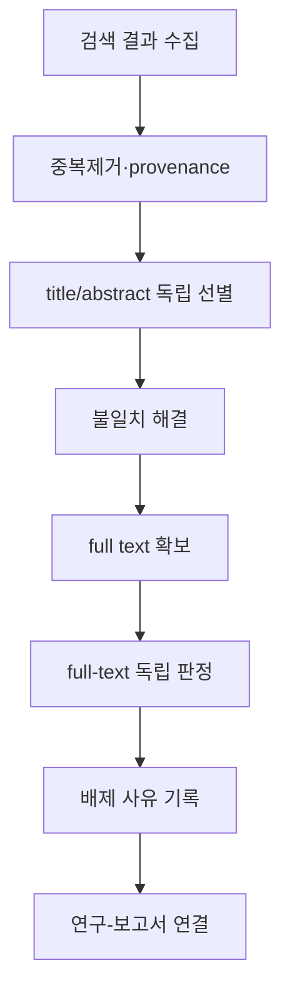



체계적 문헌고찰은 논문을 많이 읽고 요약하는 작업이 아니다.
질문, 검색, 선택, 추출, 평가, 합성의 규칙을 먼저 정의하고, 다른 사람이 같은 근거 흐름을 추적할 수 있게 만드는 연구 설계다.

PRISMA는 주로 **보고 지침**이며 그 자체가 수행 방법이나 품질점수표를 모두 대신하지 않는다는 점에서 시작해야 한다.

## 1. 질문을 estimand 수준으로 정의한다

질문 framework는 분야에 따라 PICO, PECO, PICOS, SPIDER 등을 사용할 수 있다.
형식보다 중요한 것은 각 요소를 operational definition으로 바꾸는 일이다.

- population 또는 대상 시스템
- intervention/exposure와 comparator
- primary/secondary outcome
- study design
- time horizon
- setting과 적용범위
- 추정하려는 effect measure

“효과가 있는가?”보다 “어떤 조건에서 어떤 대조와 비교한 어떤 outcome의 어떤 효과를 추정하는가?”가 재현 가능하다.

## 2. 프로토콜을 먼저 고정한다

프로토콜에는 최소한 다음을 포함한다.

- 배경과 연구질문
- eligibility criteria
- 정보원과 검색 범위
- 선별과 conflict resolution
- 추출 항목과 도구
- risk-of-bias 방법
- effect measure와 합성 계획
- heterogeneity와 subgroup 계획
- publication bias 평가
- certainty 평가
- amendment 관리

사전 등록은 결과를 본 뒤 기준을 바꾸는 선택편향을 줄인다.
등록했다고 자동으로 좋은 연구가 되는 것은 아니며, 실제 보고서와 protocol 차이를 공개해야 한다.

## 3. 포함·배제 기준은 검색 결과 전에 시험한다

기준은 모호한 형용사보다 판정 가능한 문장으로 쓴다.

나쁜 예:

- 관련성이 높은 연구
- 품질이 좋은 논문
- 충분한 데이터가 있는 연구

더 나은 기준:

- 대상, 개입·노출, 비교군, outcome, 설계별 명시적 조건
- 언어·연도 제한과 그 근거
- conference abstract, preprint, report의 처리
- 중복 cohort와 companion paper 연결 규칙

pilot screening으로 검토자들이 같은 규칙을 적용하는지 확인하고 기준을 정교화한다.

## 4. 검색전략은 재현 가능한 프로그램이다

검색식은 개념 block을 동의어와 controlled vocabulary로 구성한다.

$$
(A_1\lor A_2\lor\cdots)
\land
(B_1\lor B_2\lor\cdots).
$$

각 데이터베이스의 subject heading, field tag, phrase, truncation, proximity syntax가 다르므로 단순 복사하지 않는다.

기록할 항목은 다음과 같다.

- 데이터베이스와 platform
- 전체 검색식 원문
- 검색일과 coverage date
- filter와 limit
- 반환 record 수
- 검색식 수정 이력
- citation chasing와 grey literature 절차

## 5. 검색 completeness와 precision의 절충

체계적 검토에서는 중요한 연구 누락 비용이 크므로 sensitivity를 우선하는 경우가 많다.
그러나 지나치게 넓은 검색은 screening error와 비용을 키운다.

known-item testing으로 핵심 seed article이 검색되는지 확인한다.
검색전문가 또는 정보전문가 peer review는 누락된 용어, 잘못된 Boolean, 부적절한 limit을 찾는 데 유용하다.

## 6. 중복제거는 provenance를 보존해야 한다

DOI만으로 deduplication하면 DOI가 없는 record를 놓치고 잘못된 DOI를 합칠 수 있다.
title, author, year, journal, page, identifier를 단계적으로 비교한다.

삭제보다는 다음 상태를 보존한다.

- canonical record
- duplicate 후보
- match 근거와 confidence
- source database 목록
- 병합된 metadata

같은 연구의 여러 보고서와 완전 중복 record는 다르다.
study-level entity와 report-level entity를 분리해야 이중계산을 막을 수 있다.

## 7. 이중 선별과 conflict resolution

title/abstract와 full-text screening은 사전 기준으로 수행한다.
독립된 복수 검토는 단순 형식이 아니라 사람별 해석 차이와 실수를 줄이는 장치다.

workflow는 다음처럼 정의한다.



agreement coefficient는 도움이 되지만 기준의 타당성을 증명하지 않는다.
갈등 사례를 통해 규칙이 실제 질문을 반영하는지 검토한다.

## 8. 배제 사유는 한 가지 주된 이유로 표준화한다

full-text 단계의 배제는 재현 가능하게 분류한다.

- 대상 부적합
- intervention/exposure 부적합
- comparator 부적합
- outcome 부적합
- 설계 부적합
- 독립 연구가 아닌 보조 보고
- 데이터 접근 불가

한 논문에 여러 이유가 있어도 우선순위 규칙에 따라 주된 이유 하나를 기록하면 flow 집계가 일관된다.

## 9. 자료추출 form을 pilot한다

추출표는 논문을 읽으며 즉흥적으로 늘리지 않는다.
data dictionary에 variable 정의, 단위, 허용값, missing code, 변환식을 적는다.

추출 범주는 다음과 같다.

- 연구·보고서 식별자
- 설계와 setting
- 모집·배정·추적 과정
- 대상 특성
- intervention/exposure/comparator 정의
- outcome definition과 측정시점
- effect estimate와 uncertainty
- 분석 조정 변수
- funding과 conflict 정보
- risk-of-bias 판단 근거

그래프에서 수치를 digitize했다면 도구, calibration, 반복 추출 오차를 기록한다.

## 10. Effect measure를 맞춘다

binary outcome의 대표 measure는 risk ratio, odds ratio, risk difference다.
continuous outcome은 mean difference 또는 standardized mean difference를 사용할 수 있다.

각 measure는 다른 질문에 답한다.
예를 들어 odds ratio를 risk ratio처럼 해석하면 event가 흔할 때 왜곡이 커질 수 있다.

effect 방향을 통일하고, scale 변환과 sign convention을 데이터 사전에 고정한다.

## 11. Risk of bias는 보고 품질과 다르다

논문이 상세하게 쓰였는지와 effect estimate가 편향되었는지는 다른 문제다.
도구는 연구설계와 outcome에 맞게 선택하고 domain별 판단 근거를 남긴다.

대표 비뚤림 원인은 다음과 같다.

- selection과 allocation
- confounding
- intervention deviation
- missing outcome
- outcome measurement
- selective reporting

점수를 단순 합산하면 서로 다른 domain의 심각도를 가릴 수 있다.

## 12. 메타분석의 기본식

연구별 effect estimate (hat\theta_i)와 variance (v_i)가 있을 때 fixed-effect 가중평균은

$$
\hat\theta=
\frac{\sum_i w_i\hat\theta_i}{\sum_iw_i},
\qquad
w_i=\frac{1}{v_i}.
$$

random-effects model은 연구별 참효과가 분포한다고 보고

$$
w_i=\frac{1}{v_i+\tau^2}
$$

를 사용한다.
(	au^2)는 between-study heterogeneity다.

random effects는 이질성을 해결하는 버튼이 아니다.
연구가 같은 estimand를 공유할 만큼 임상적·방법론적으로 결합 가능한지 먼저 판단한다.

## 13. 이질성 해석

(I^2)는 관측 variability 중 sampling error 이외 부분의 비율을 요약하지만 연구 수와 precision에 민감하다.

$$
I^2=\max\left(0,\frac{Q-df}{Q}\right)\times100\%.
$$

함께 볼 항목은 다음과 같다.

- (	au^2)와 단위
- prediction interval
- forest plot의 effect 방향
- 대상·개입·측정 정의 차이
- influence와 leave-one-out 결과
- 사전에 계획한 subgroup/meta-regression

소수 연구의 meta-regression은 과적합과 ecological bias에 취약하다.

## 14. 합성하지 않는 것도 방법론적 선택이다

효과 정의가 다르거나 데이터가 부족하면 통계적 pooling을 하지 않을 수 있다.
그러나 “서술적으로 요약했다”는 문장만으로는 부족하다.

- grouping rule
- 표준화된 outcome presentation
- 방향성 vote counting 회피
- study size와 precision 반영
- risk of bias와 certainty 통합
- 결과가 불일치하는 이유의 구조적 탐색

합성 방법을 protocol에 미리 적는다.

## 15. Reporting bias와 small-study effect

funnel plot 비대칭은 publication bias만의 증거가 아니다.
heterogeneity, outcome selection, methodological difference도 원인이 될 수 있다.

등록자료와 보고서를 비교하고, protocol-specified outcome 누락을 확인하며, 회색문헌과 미출판 연구 검색 방법을 보고한다.
통계적 test는 연구 수가 적을 때 power가 낮다.

## 16. 근거 확실성

개별 연구 risk of bias와 전체 근거의 certainty는 구분한다.
outcome별로 다음을 고려할 수 있다.

- risk of bias
- inconsistency
- indirectness
- imprecision
- publication bias
- 큰 효과나 dose-response 같은 상향 요인

등급만 쓰지 말고 판단 이유와 의사결정에 미치는 영향을 설명한다.

## 17. 업데이트 가능하게 설계한다

검색 결과, screening decision, extraction, 분석을 versioned artifact로 관리한다.

권장 파일 구조는 개념적으로 다음과 같다.

```text
protocol/
search/
records_raw/
records_deduplicated/
screening/
extraction/
risk_of_bias/
analysis/
report/
```

원본을 덮어쓰지 말고 transformation script와 checksum을 남긴다.
living review라면 update trigger와 마지막 검색일을 명시한다.

## 18. 검증 체크리스트

- [ ] 질문과 primary outcome이 사전에 정의되었다.
- [ ] protocol과 amendment history를 공개한다.
- [ ] 데이터베이스별 전체 검색식을 보존했다.
- [ ] 검색일과 반환 record 수가 재현 가능하다.
- [ ] 중복제거가 source provenance를 유지한다.
- [ ] screening 기준을 pilot했다.
- [ ] full-text 배제 사유가 표준화되었다.
- [ ] study와 report를 별도 entity로 연결했다.
- [ ] 추출 form과 data dictionary를 사용했다.
- [ ] effect direction과 단위 변환을 검증했다.
- [ ] risk-of-bias 판단 근거가 domain별로 있다.
- [ ] pooling 가능성을 통계 이전에 판단했다.
- [ ] heterogeneity와 prediction interval을 해석했다.
- [ ] certainty를 outcome별로 보고했다.
- [ ] PRISMA flow의 모든 수가 원장과 일치한다.

## 19. 자주 실패하는 패턴과 한계

### PRISMA checklist를 연구방법 자체로 사용

PRISMA는 투명한 보고를 돕지만 검색, 비뚤림 도구, 합성법의 세부 수행 지침을 모두 대신하지 않는다.

### 검색식을 최종 단계에 재구성

실제 실행한 query, 날짜, 결과 수를 즉시 저장하지 않으면 재현하기 어렵다.

### 여러 보고서를 여러 연구로 계산

cohort와 trial entity를 연결하지 않으면 표본을 이중계산할 수 있다.

### 이질성이 크면 random-effects로 해결

estimand와 대상이 본질적으로 다르면 하나의 평균효과가 의미 없을 수 있다.

### 유의한 연구 수를 세기

표본크기와 precision을 무시한 vote counting은 effect 방향과 크기를 왜곡한다.

## 20. 공식·원전 참고자료

- Page et al., [PRISMA 2020 Statement](https://www.bmj.com/content/372/bmj.n71), *BMJ*, 2021.
- Page et al., [PRISMA 2020 Explanation and Elaboration](https://www.bmj.com/content/372/bmj.n160), *BMJ*, 2021.
- PRISMA, [Official checklists and flow diagrams](https://www.prisma-statement.org/).
- Cochrane, [Handbook for Systematic Reviews of Interventions](https://training.cochrane.org/handbook/current).
- Campbell Collaboration, [Methods resources](https://www.campbellcollaboration.org/research-resources/).

좋은 체계적 문헌고찰의 산출물은 결론 한 문장이 아니다.
**어떤 근거가 어떤 규칙을 거쳐 포함되고 변환되고 판단되었는지를 재실행할 수 있는 evidence pipeline**이다.
