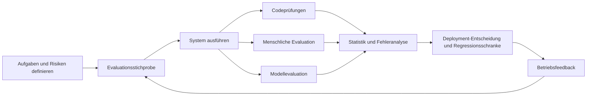



Zweck der LLM-Evaluation ist nicht, den höchsten Gesamtwert zu verkünden, sondern zu entscheiden, welches System für eine bestimmte Aufgabe und Risikostufe bereitgestellt werden soll.
Vergleichen Sie nicht nur Modellnamen, sondern Systemversionen einschließlich Prompts, Werkzeugen, Retrieval, Decoding und Guardrails.

## 1. Das Problem: Öffentliche Benchmarks und reale Qualität sind nicht dieselbe Variable

Öffentliche Benchmarks liefern einen gemeinsamen Standard, doch reale Arbeit unterscheidet sich wie folgt.

- Tatsächliche Eingaben sind länger und mehrdeutiger.
- Organisationen besitzen eigene Formate und Terminologie.
- Viele Aufgaben haben nicht genau eine richtige Antwort.
- Werkzeugnutzung und externe Evidenz bestimmen die Qualität.
- Kosten und Latenz sind beschränkt.
- Manche Fehler sind wesentlich gefährlicher als andere.
- Der Benchmark kann in den Trainingsdaten enthalten gewesen sein.

Nutzen Sie öffentliche Werte daher als Signal zur Eingrenzung von Kandidaten und treffen Sie die endgültige Wahl durch eine aufgabenspezifische Evaluation.

## 2. Denkmodell: Evaluation ist selbst ein Messsystem



Evaluationsergebnisse sind eine Funktion folgender Elemente.

$$
y = f(\text{Aufgabenstichprobe},\text{Systemversion},\text{Bewerter},\text{Protokoll},\text{Zufälligkeit})
$$

Auch Bewerter und Protokolle haben Fehler.
Bestimmen Sie, ob der Unterschied zwischen Modellen kleiner als die Variabilität der Bewerter ist.

## 3. Zuerst den Evaluationsvertrag formulieren

Erstellen Sie vor der Codeausführung eine Entscheidungskarte.

```yaml
decision: "후보 시스템 중 제한 배포할 버전 선택"
population: "예상 운영 요청 분포"
unit: "사용자 요청 하나와 전체 응답 trace"
primary_metrics: [task_success, critical_error_rate]
constraints: [latency, cost, privacy]
subgroups: [language, input_length, task_type, risk_level]
acceptance:
  quality: "baseline보다 비열등 또는 개선"
  safety: "중대 오류 상한 충족"
  operations: "지연·비용 예산 충족"
```

Akzeptanzregeln vor der Evaluation festzulegen verringert die Versuchung, Kriterien nach Kenntnis der Ergebnisse zu ändern.

## 4. Die Stichprobe entwerfen

Produktionslogs unverändert zu sammeln reicht nicht aus.

Stichprobenschichten:

- Normalerweise häufige Aufgaben
- Seltene, aber kritische Fehleraufgaben
- Grenzfälle für Länge, Sprache und Format
- Mehrdeutige Fälle, in denen das System nachfragen sollte
- Fälle, die abgelehnt werden sollten
- Werkzeugfehler- und Timeout-Fälle
- Böswillige oder anomale Eingaben

Der Evaluationsdatensatz kann in drei Teile aufgeteilt werden.

- Entwicklung: Zur Verbesserung von Prompts und Pipeline
- Validierung: Zur begrenzten Modellauswahl
- Holdout: Nur für endgültige Entscheidung oder Release-Schranke

Leakage entsteht, wenn aus demselben Dokument oder Template abgeleitete Fälle über verschiedene Splits verteilt werden.
Verwenden Sie einen Group Split anhand der Quelleinheit.

Erfassen Sie für jedes Evaluationselement Quelle, Erstellungsverfahren, Reviewer, Version und Ablaufbedingungen.

## 5. Antworten und Rubriken entwerfen

Priorisieren Sie codebasierte Evaluation bei Aufgaben mit exakt bestimmten Antworten.

- Gültigkeit des JSON-Schemas
- Vorhandensein erforderlicher Felder
- Numerische Toleranz
- Erfolgreiche Unit-Tests
- Zitations-IDs aus der erlaubten Liste
- Grenzen für Argumente von Werkzeugaufrufen

Verwenden Sie für offene Antworten eine Rubrik mit beobachtbaren Verhaltenskriterien.

Eine schlechte Rubrik:

```text
1점: 나쁨
5점: 매우 좋음
```

Eine bessere Rubrik:

```text
0: 핵심 요구를 수행하지 못했거나 중대한 허위 주장이 있음
1: 일부 요구를 수행했으나 수정 없이는 사용할 수 없음
2: 핵심 요구를 충족하고 사소한 수정 후 사용 가능
3: 모든 요구를 충족하며 근거·제약·형식이 명확함
```

Trennen Sie die Dimensionen.

- Korrektheit der Aufgabe
- Vollständigkeit
- Evidenzbindung
- Befolgung von Anweisungen
- Umgang mit Risiken
- Stil und Klarheit

Bei einem einzelnen Gesamtwert kann ein gefährlicher Fehler durch eine Stilwertung ausgeglichen werden.

## 6. Bewerter kombinieren

### Codebasierte Bewerter

Sie bieten die höchste Reproduzierbarkeit und Geschwindigkeit.
Prüfen Sie maschinell verifizierbare Punkte stets zuerst mit Code.

### Menschliche Bewerter

Sie beurteilen Geschäftskontext und tatsächliche Nutzbarkeit am besten.
Sie verursachen jedoch Kosten, Ermüdung und uneinheitliche Maßstäbe.

Gegenmaßnahmen:

- Eine Kalibrierungsrunde durchführen.
- Eine Rubrik mit Beispielen und Grenzfällen bereitstellen.
- Modellnamen und Reihenfolge verblinden.
- Einige Elemente von mehreren Bewertern beurteilen lassen und Übereinstimmung messen.
- Meinungsverschiedenheiten nicht bloß mitteln, sondern ihre Ursachen untersuchen.

### Modellbasierte Bewerter

Sie eignen sich für groß angelegte Vergleiche und die Erzeugung von Erklärungen, sind aber nicht die endgültige Wahrheitsquelle.

Bekannte Risiken:

- Positionsbias
- Verbosity Bias
- Bevorzugung verwandter Modellfamilien
- Empfindlichkeit gegenüber Prompt-Formulierungen
- Verstärkung von Fehlern der Referenzantwort

Vergleichen Sie bei paarweiser Evaluation zwei Urteile mit umgekehrter A/B-Reihenfolge.
Speichern Sie Bewerterprompt und Revision des Bewertermodells zusammen mit den Ergebnissen.

## 7. Praxisbeispiel: Verblindeter paarweiser Vergleich

```python
def make_pair(example, output_a, output_b, swap):
    left, right = (output_b, output_a) if swap else (output_a, output_b)
    return {
        "task": example.prompt,
        "rubric": example.rubric,
        "left": left,
        "right": right,
        "required_result": ["left", "right", "tie", "invalid"],
    }
```

Workflow:

1. Beide Systeme auf derselben Eingabe und demselben Werkzeug-Snapshot ausführen.
2. Systemnamen und Metadaten in den Ausgaben verblinden.
3. Reihenfolge randomisieren.
4. Zuerst Codeprüfungen ausführen.
5. Einen Modellbewerter die erste Bewertung des gesamten Satzes durchführen lassen.
6. Hochrisikofälle und eine Zufallsstichprobe von Menschen erneut bewerten lassen.
7. Gruppe der Abweichungen zwischen Modell und Mensch nach Fehlertyp analysieren.

Ein Unentschieden ist kein Fehler.
Es kann bedeuten, dass der Unterschied kleiner als die Messauflösung ist.

## 8. Statistik und Unsicherheit

Berichten Sie Konfidenzintervalle statt eines einzelnen Stichprobenmittelwerts.

Eine einfache Schätzung der Erfolgsquote lautet:

$$
\hat{p}=\frac{1}{n}\sum_{i=1}^{n} y_i
$$

Erwägen Sie bei kleinen Stichproben oder seltenen Fehlern Bootstrap-Verfahren oder ein geeignetes Binomialintervall statt einer Normalapproximation.

Wenn beide Modelle anhand derselben Fälle evaluiert wurden, verwenden Sie einen gepaarten Vergleich.
Damit lassen sich Unterschiede im Schwierigkeitsgrad der Fälle ausgleichen.

Wer viele Metriken und Subgruppen gleichzeitig untersucht, findet leicht eine zufällige Verbesserung.
Unterscheiden Sie vorab festgelegte Primärmetriken von explorativer Analyse.

Verdünnen Sie kritische Fehler nicht in einem Durchschnittswert.
Verwenden Sie eine separate Obergrenze und eine absolute Schranke.

## 9. Die Kosten-Latenz-Qualitäts-Grenzlinie

Modellauswahl ist kein eindimensionales Ranking.

Erfassen Sie für jeden Kandidaten:

- Aufgabenerfolg
- Kritische Fehlerrate
- Verteilung der Eingabe-/Ausgabetokens
- Wall-Clock-Latenz
- Timeout-Rate
- Werkzeugaufrufe
- Kosten pro Anfrage
- Kosten für Wiederholungen und Fallbacks

Ein Kandidat außerhalb der Pareto-Front besitzt sowohl geringere Qualität als auch höhere Kosten als ein anderer Kandidat.
Innerhalb der Front wählen Sie anhand von Geschäftswert und SLOs.

Evaluieren Sie auch die tatsächliche Routing-Richtlinie einschließlich Fallbacks.
Die Kombination einzelner Modellwerte ergibt nicht den Wert des Gesamtsystems.

## 10. Regressionsevaluation und Betriebsfeedback

Führen Sie dieselbe Suite für jedes Release aus und schützen Sie gleichzeitig vor dem Auswendiglernen der Tests.

Stufen der Suite:

- Smoke: Erkennt API-Ausfälle und schwere Regressionen innerhalb von Minuten
- Core: Repräsentative Aufgaben und wichtige Subgruppen
- Extended: Long Tail, Red-Team-Fälle und teure Evaluationen
- Shadow: De-identifizierte Wiederholungen realen Traffics

In Produktion zu erfassende Signale:

- Umfang der Benutzerbearbeitung
- Folgefragen und Abbrüche
- Menschliche Eskalation
- Werkzeug-Rollback
- Fehler der Zitationsvalidierung
- Fehleränderungen nach Zeit, Sprache und Länge

Implizites Feedback ist nicht dasselbe wie Qualität.
Da nicht bekannt ist, warum ein Benutzer nicht geklickt hat, kombinieren Sie es mit menschlicher Prüfung ausgewählter Fälle.

## 11. Checkliste zur Evaluation

- [ ] Ist die durch die Evaluation unterstützte Deployment-Entscheidung klar formuliert?
- [ ] Ist die gesamte Systemversion statt nur des Modells fixiert?
- [ ] Sind reale Aufgabenverteilung und Hochrisiko-Tail beide enthalten?
- [ ] Wird Leakage durch einen Group Split nach Quelleinheit verhindert?
- [ ] Werden maschinell verifizierbare Punkte mit Code evaluiert?
- [ ] Enthält die Rubrik beobachtbare Verhaltenskriterien?
- [ ] Sind Systemnamen vor Bewertern verborgen?
- [ ] Wurde der Effekt der paarweisen Reihenfolge getestet?
- [ ] Wurden Kalibrierung und Übereinstimmung menschlicher Bewerter geprüft?
- [ ] Werden Konfidenzintervalle zusammen mit Durchschnittswerten dargestellt?
- [ ] Werden kritische Fehler durch eine separate Schranke behandelt?
- [ ] Werden Kosten, Latenz und Qualität auf derselben Workload gemessen?
- [ ] Werden Revisionen von Bewerter und Prompt bewahrt?
- [ ] Ist der Holdout vor Kontamination durch wiederholtes Tuning geschützt?

## 12. Häufige Fehler und Grenzen

### Nur die Gewinnquote und nicht die Ursachen betrachten

Selbst bei derselben Gesamtgewinnquote kann ein Kandidat bei kurzen Aufgaben und der andere bei Hochrisikoaufgaben stärker sein.
Untersuchen Sie Subgruppen und Fehlertaxonomie gemeinsam.

### Erklärungen des Bewerters mit Evidenz verwechseln

Ein Modellbewerter kann selbstsicher eine nachträgliche Erklärung erzeugen.
Validieren Sie sie anhand der Urteilskonsistenz und Übereinstimmung mit menschlichen Standards.

### Prompts anpassen und dabei wiederholt den Evaluationsdatensatz betrachten

Das ist Overfitting an den Testsatz.
Trennen Sie den Entwicklungssatz vom endgültigen Holdout.

### Kleine Unterschiede als definitive Rangfolge verkünden

Wenn sich Unsicherheitsbereiche überlappen, sind die Kandidaten faktisch möglicherweise gleichauf.
Betriebskosten oder Einfachheit können dann als Entscheidungskriterium dienen.

Kein endlicher Evaluationsdatensatz kann jede zukünftige Anfrage abdecken.
Evaluation ist Evidenz vor dem Deployment und muss mit Beobachtung, Incident Reviews und kontinuierlichen Aktualisierungen verbunden werden.

## 13. Offizielle Referenzen

- [NIST AI RMF](https://www.nist.gov/itl/ai-risk-management-framework)
- [NIST-Profil für generative KI](https://doi.org/10.6028/NIST.AI.600-1)
- [Ursprüngliche Stanford-HELM-Publikation](https://arxiv.org/abs/2211.09110)
- [Offizielle HELM-Website](https://crfm.stanford.edu/helm/)
- [Offizielles OpenAI-Evals-Repository](https://github.com/openai/evals)

## 14. Fazit

Gute LLM-Evaluation ist ein Messsystem und keine Rangliste.
Nur wenn Aufgabenverteilung, Risiken, Bewerterfehler und Kosten festgelegt und zusätzlich Unsicherheit berichtet werden, können Ergebnisse eine reale Deployment-Entscheidung stützen.
